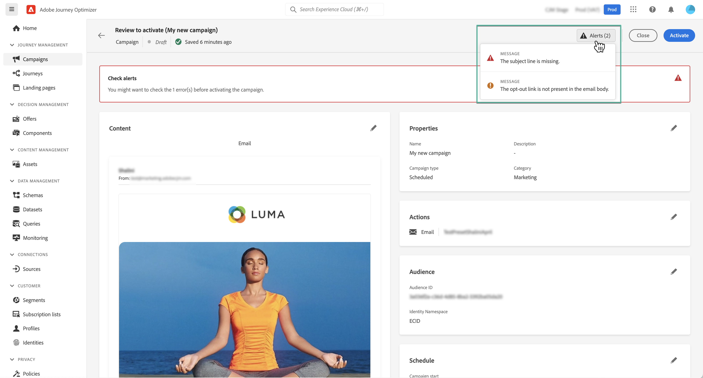

# 檢閱並啟動動作行銷活動 {#action-campaign-review}

>[!BEGINSHADEBOX]

**在此頁面上：**&#x200B;檢閱您的動作行銷活動的設定和內容，以在啟用行銷活動之前擷取任何錯誤，這樣您就可以放心地立即或於排程日期傳送訊息。

>[!ENDSHADEBOX]

設定您的Action行銷活動後，您必須先檢閱其引數和內容，才能加以啟用。 請依照下列步驟以執行此操作。

>[!IMPORTANT]
>
> 如果您的行銷活動受核准政策的約束，您需要請求核准才能傳送您的行銷活動。 [了解更多](../test-approve/gs-approval.md)

1. 在行銷活動設定畫面中，按一下&#x200B;**[!UICONTROL 檢閱以啟動]**&#x200B;以顯示行銷活動的摘要。

   

1. 行銷活動設定摘要隨即顯示，供您檢查是否有任何引數不正確或遺失，並視需要修改行銷活動。

   如果發生錯誤，便無法啟用行銷活動。 請先解決錯誤，然後再繼續。

   

1. 當行銷活動在其內容中使用[決定原則](../experience-decisioning/create-decision.md)時，您可以檢閱每個原則的結構，並直接從行銷活動摘要複製技術詳細資訊。 [了解做法](../experience-decisioning/use-decision-policy.md#decision-policy-summary)

1. 檢查您的行銷活動是否已正確設定，然後按一下[啟動]。****

1. 行銷活動已啟動。 其狀態為&#x200B;**[!UICONTROL 即時]**，或者&#x200B;**[!UICONTROL 已排程]** （如果您已輸入開始日期）。 行銷活動中設定的訊息會立即傳送或在指定日期傳送。

   **[!UICONTROL 已完成]**&#x200B;狀態會在行銷活動啟動3天後自動指派給行銷活動，如果行銷活動有週期性執行，則會在行銷活動的結束日期自動指派。 [進一步瞭解行銷活動狀態](manage-campaigns.md#statuses)。

   如果未指定結束日期，則行銷活動會保留&#x200B;**[!UICONTROL 即時]**&#x200B;狀態。 若要變更，您必須手動停止行銷活動。 [瞭解如何停止行銷活動](manage-campaigns.md)

1. 行銷活動啟動後，您可以隨時透過開啟行銷活動來檢查其資訊。 摘要可讓您取得目標設定檔與傳送和失敗動作數的統計資料。

   您也可以按一下&#x200B;**[!UICONTROL 報表]**&#x200B;按鈕，在專用報表中取得其他統計資料。 [了解更多](../reports/campaign-global-report-cja.md)

   