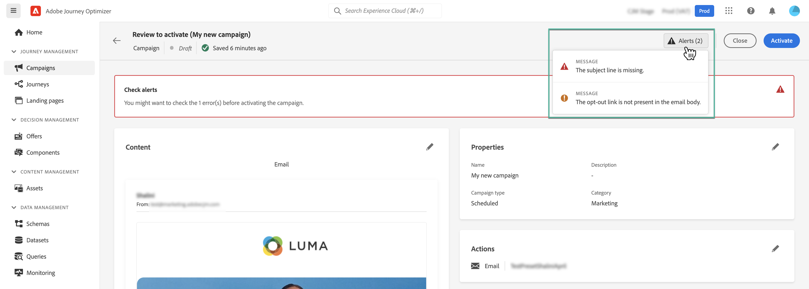

# 檢閱及啟動行銷活動 {#review-activate}

配置市場活動後，您需要先查看其參數和內容，然後再激活它。 要執行此操作，請依照下列步驟執行：

1. 在市場活動配置螢幕中，按一下 **[!UICONTROL 複查以激活]** 顯示市場活動的摘要。

   匯總允許您在必要時修改市場活動，並檢查是否有任何參數不正確或缺失。

   >[!IMPORTANT]
   >
   >如果出錯，則無法激活市場活動。 在繼續之前解決錯誤。

   

1. 檢查市場活動配置是否正確，然後按一下 **[!UICONTROL 激活]**。

1. 活動現在已激活。 其狀態為 **[!UICONTROL 實況]**&#x200B;或 **[!UICONTROL 計畫]** 的子菜單。 [瞭解有關市場活動狀態的詳細資訊](get-started-with-campaigns.md#statuses)。

   市場活動中配置的消息會立即或在指定日期發送。

   >[!NOTE]
   >
   >的 **[!UICONTROL 已完成]** 狀態在市場活動激活3天後自動分配給市場活動，如果市場活動有定期執行，則在市場活動的結束日期自動分配。
   >
   >如果尚未指定結束日期，市場活動將保留 **[!UICONTROL 實況]** 狀態。 要更改市場活動，您需要手動停止市場活動。 [瞭解如何停止活動](modify-stop-campaign.md)

1. 激活市場活動後，您可以隨時通過開啟市場活動資訊來檢查其資訊。 該摘要允許您獲取有關目標配置檔案數量以及交付和失敗操作的統計資訊。

   您還可以通過按一下 **[!UICONTROL 報告]** 按鈕 [了解更多](../reports/campaign-global-report.md)

   
