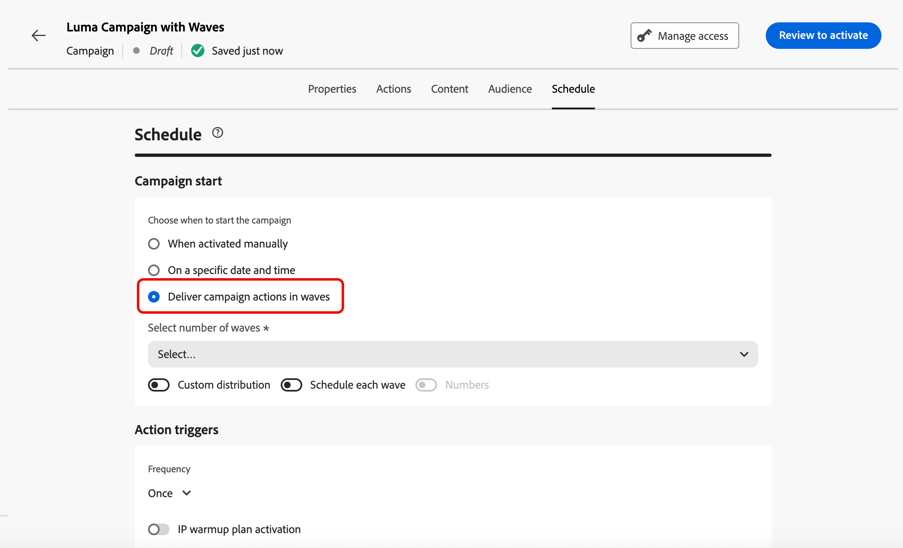
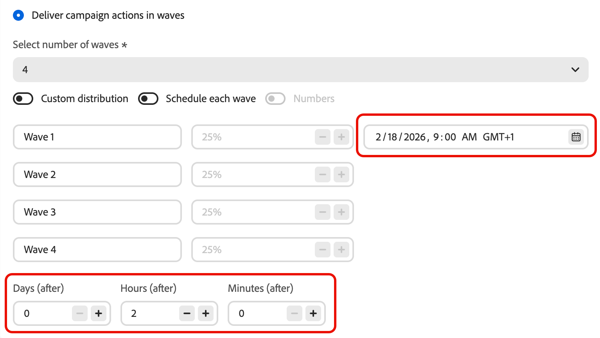
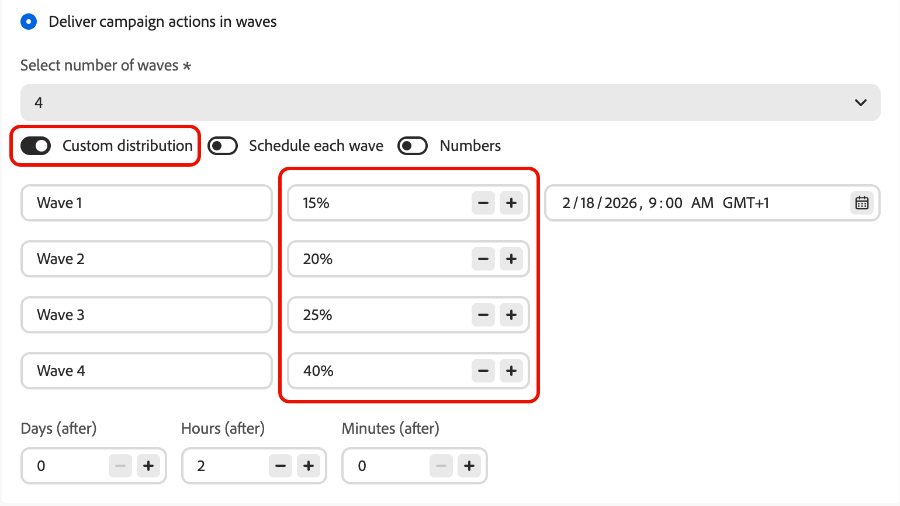
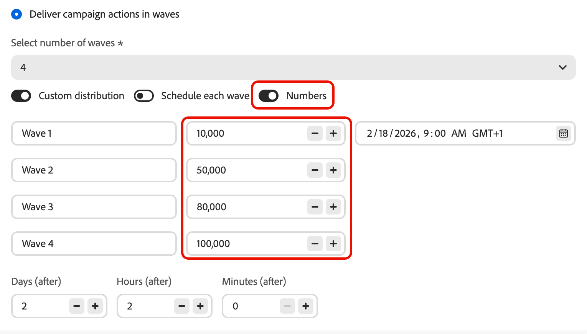
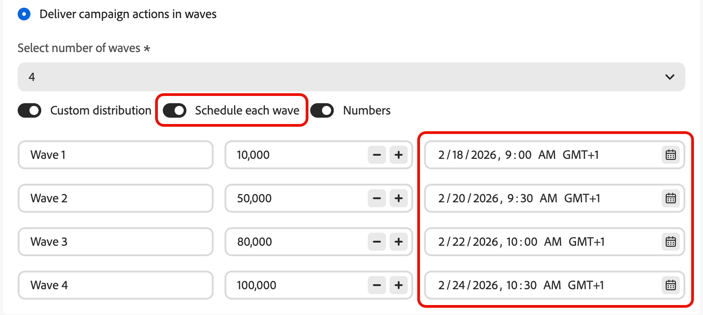
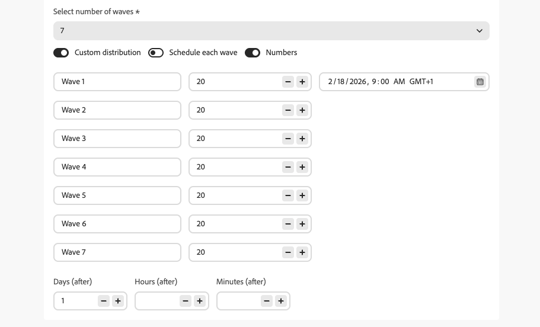
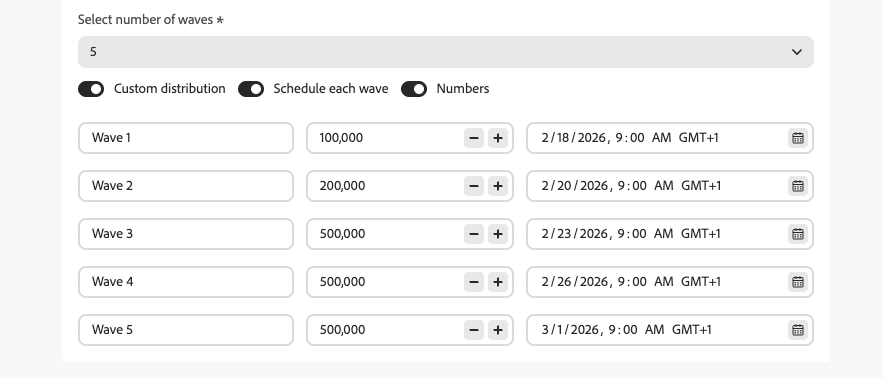
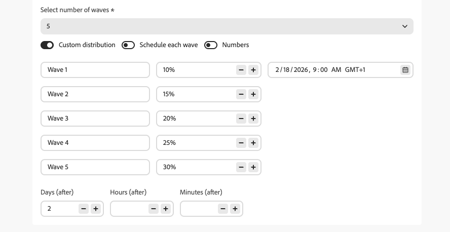

# 在行銷活動中使用波段傳送 {#send-using-waves}

您可以將傳出行銷活動訊息的傳送劃分為幾個批次（波段），並排程它們在一段時間內的傳送情況。 Wave傳送有助於平衡負載、避免壓倒性的下游系統（例如呼叫中心或登陸頁面），並支援傳遞能力與傳送者信譽，尤其是對於大量傳送而言。

<!--
>[!CAUTION]
>
>Wave sending applies to **outbound** actions only (Email, SMS, Push, Direct mail).-->

Journey Optimizer可讓您定義波段數、波段大小（以對象百分比或絕對數字表示），以及每個波段執行的時機。

## 限制和護欄 {#limitations-guardrails}

* 波動傳送僅適用於&#x200B;**傳出**&#x200B;動作（電子郵件、簡訊、推播、直接郵件）。
* 您必須定義至少&#x200B;**2個波段**，最多可新增&#x200B;**10個波段**。
* 兩個波段開始的最小間隔為&#x200B;**30分鐘**。
* 波動開始時間不能早於行銷活動開始時間或過去。

## 設定波段傳送 {#configure-wave-sending}

若要設定在行銷活動中傳送波段的方法和時機，請遵循下列步驟。

1. 建立或開啟包含傳出動作（例如電子郵件、簡訊、推播）的[動作行銷活動](create-campaign.md)。

1. 在行銷活動的&#x200B;**[!UICONTROL 排程]**&#x200B;索引標籤中，選取&#x200B;**[!UICONTROL 以波段傳送行銷活動動作]**。

   {width="100%"}

   >[!NOTE]
   >
   >只有在行銷活動的&#x200B;**[!UICONTROL 動作]**&#x200B;索引標籤中選取傳出動作時，才會顯示&#x200B;**[!UICONTROL 以波段傳送行銷活動動作]**&#x200B;選項。 [了解更多](campaign-action.md)

1. 設定您要傳送的波段數（例如4）。

   >[!NOTE]
   >
   >您至少必須定義2個波段，最多可新增10個波段。

1. 選擇如何定義波段大小和時間，如下所述。

### 等波 {#equal-waves}

依預設，對象會分割成大小相等的波段。 排定第一個波段的時間，並設定每個波段開始之間的固定間隔（例如2小時）。

{width="80%"}

>[!NOTE]
>
>兩個波段開始的最小間隔為&#x200B;**30分鐘**。

系統接著會自動排程後續波段（例如，第一個波段在早上9:00，第二個波段在晚上11:00，第三個波段在晚上1:00，第四個波段在晚上3:00）。

### 自訂分佈 {#custom-distribution}

選取&#x200B;**[!UICONTROL 自訂分佈]**&#x200B;選項，將每個波段的大小定義為總受眾的百分比（例如15%、20%、25%、40%）。

{width="80%"}

>[!NOTE]
>
>所有波段的總和必須等於100%。 如果不是這種情況，則會顯示警告訊息。<!--are the waves actually sent or does the system prevent user from saving the campaign?-->

選取&#x200B;**[!UICONTROL 數字]**&#x200B;將每個波段的大小定義為設定檔的絕對數（例如10,000； 50,000）。

{width="80%"}

>[!NOTE]
>
>使用數字時，系統不會驗證總和是否涵蓋整個對象，您必須確保您的波段大小涵蓋您打算傳送的對象。 進一步瞭解[常見問題](#faq)。

### 自訂排程 {#custom-schedule}

選取&#x200B;**[!UICONTROL 排程每個波段]**&#x200B;以定義每個波段的特定開始日期和時間。 波段不需要平均間距（例如，上午9:00、上午11:00、下午5:00、下午8:30）。

{width="80%"}

>[!NOTE]
>
>兩個波段開始的最小間隔為&#x200B;**30分鐘**。

## 使用案例 {#use-cases}

Wave傳送可協助您控制傳送訊息的時間和數量，以改善傳遞能力、保護寄件者信譽，並使傳送訊息符合您的營運容量。 考慮在以下情況下使用波段：

* **客服中心或回應管理：**&#x200B;限制每天或每小時傳出的訊息數目，以便下游團隊（例如客戶服務）可以處理回應。 例如，每天傳送20則訊息以符合客服中心容量。

  {width="75%"}

* **高音量和傳遞能力：**&#x200B;請避免一次傳送非常大的行銷活動。 隨時間分散傳遞，以協助維持寄件者的信譽並降低被標籤為垃圾郵件的風險。

  {width="75%"}

* **提升：**&#x200B;使用新平台或IP時，逐步增加音量（例如，第一波增加10%，然後增加15%、20%等）以逐步建立聲譽。

  {width="75%"}

## 常見問題 {#faq}

+++ 如果波段大小的總和不等於您的總受眾，會發生什麼情況？

* 如果您的波段大小總和&#x200B;**超過**&#x200B;個對象（例如，您排程在第一個波段中為100,000個對象設定100,000），則第一個波段將傳送給整個對象，而其餘波段將沒有剩餘的人員可傳送，這些波段將不會執行。
* 如果&#x200B;**的總和小於受眾**（例如，您為總共100,000個受眾定義了四個波段，總共40,000個設定檔），則只有這些波段中包含的設定檔會收到訊息。 其餘對象將不會收到通訊，且不會在後續批次中重試。

+++

+++ 我可以指派不同的區段或條件給個別波段嗎？

您只能定義波段的大小和時間。 整個行銷活動的收件者選取範圍相同；您無法將不同的區段或條件指派給個別波段。

+++

## 後續步驟 {#next}

* [排程動作行銷活動](campaign-schedule.md) — 設定開始日期、結束日期、頻率和速率控制。
* [檢閱並啟動行銷活動](review-activate-campaign.md) — 檢查行銷活動並上線。
