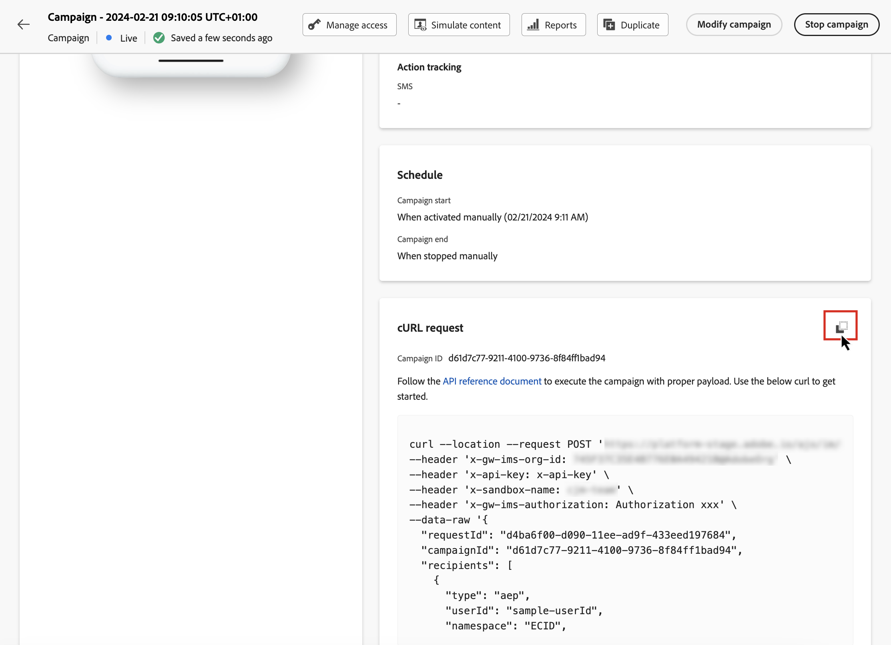

# 執行API觸發的行銷活動 {#execute}

啟動行銷活動後，您需要擷取產生的範例cURL請求，並將其用於API中以建置您的裝載並觸發行銷活動。

## 必讀 {#must-read}

* **行銷活動開始/結束日期** — 如果您在建立行銷活動時已設定特定的開始和/或結束日期，則不會在這些日期之外執行，且API呼叫將會失敗。

* **呼叫逾時** — 對互動式訊息執行REST API的呼叫逾時60秒。 不過，萬一發生未預期的逾時情況，內部會重試以保證傳遞。

## 觸發行銷活動 {#trigger}

1. 開啟行銷活動，然後從&#x200B;**[!UICONTROL cURL請求]**&#x200B;區段複製並貼上裝載請求。 此裝載包含訊息中使用的所有個人化（設定檔和內容）變數。 行銷活動上線後，即可使用此功能。

   

1. 將此cURL請求用於API以建置您的裝載並觸發行銷活動。 如需詳細資訊，請參閱[互動式訊息執行API檔案](https://developer.adobe.com/journey-optimizer-apis/references/messaging/#tag/execution)。

   [此頁面](https://developer.adobe.com/journey-optimizer-apis/references/messaging-samples/)上也提供API呼叫範例。
