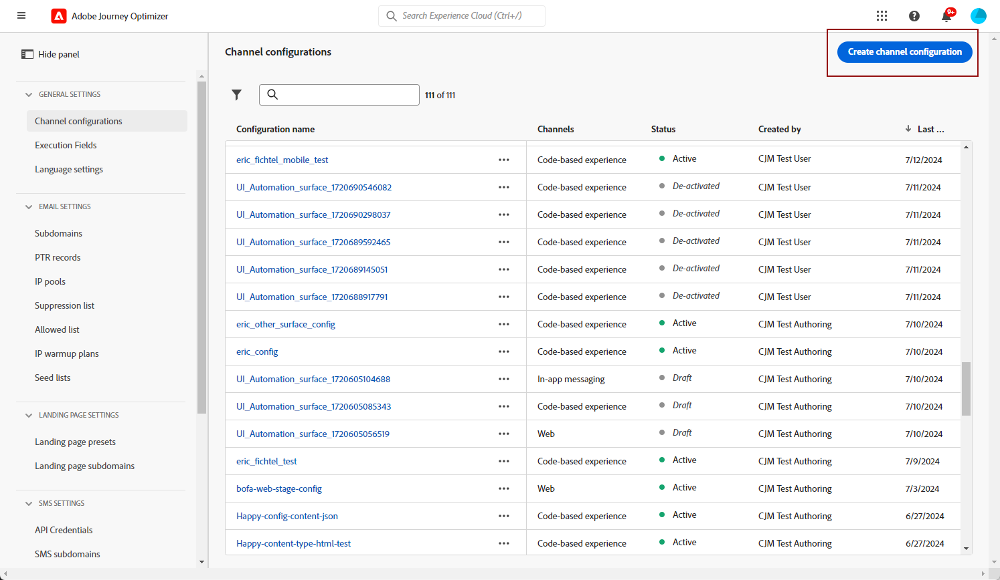
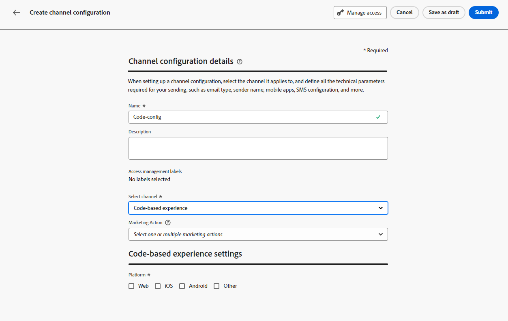
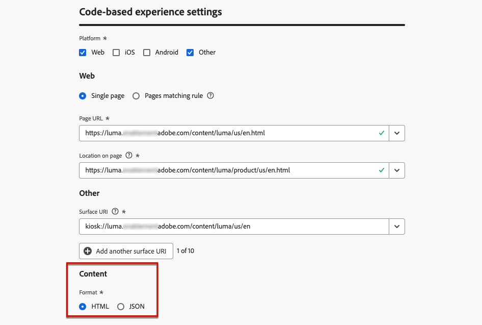
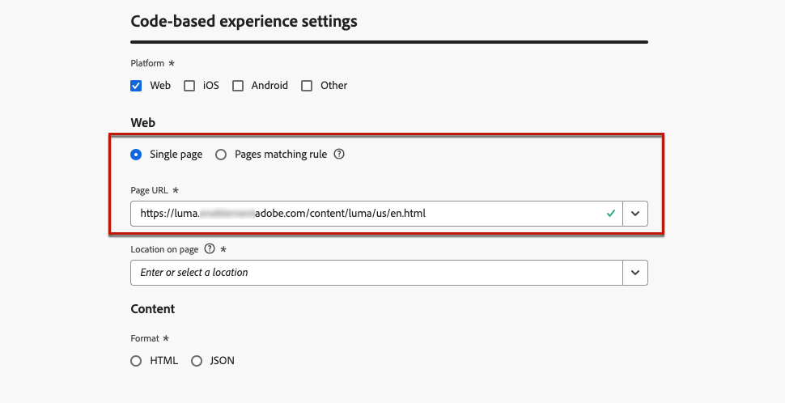
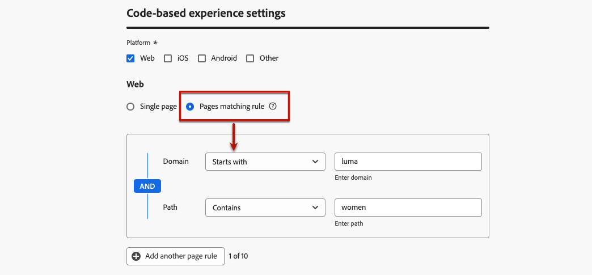
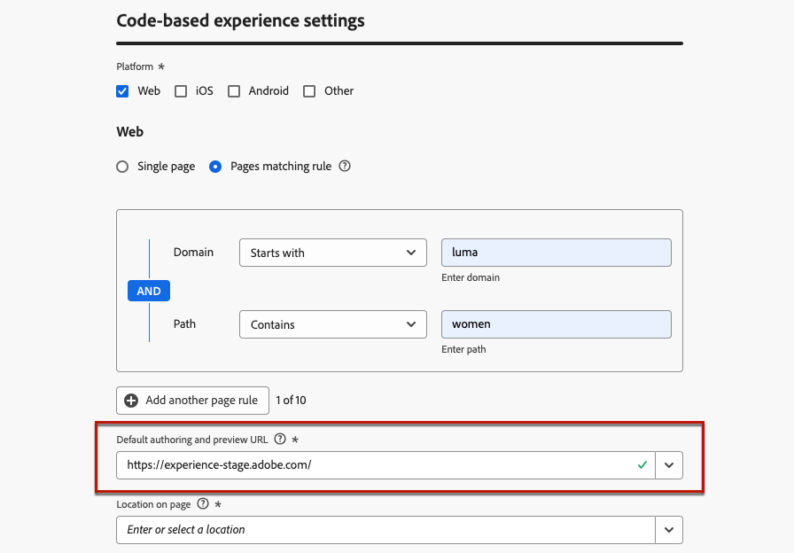
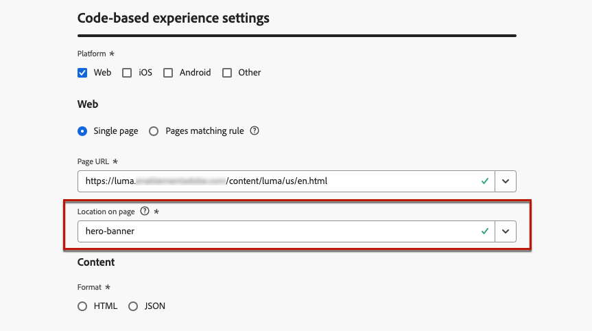
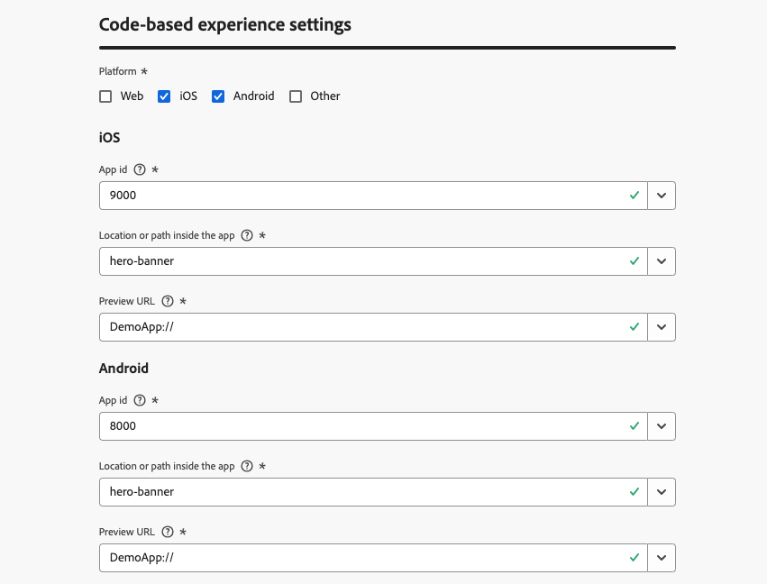
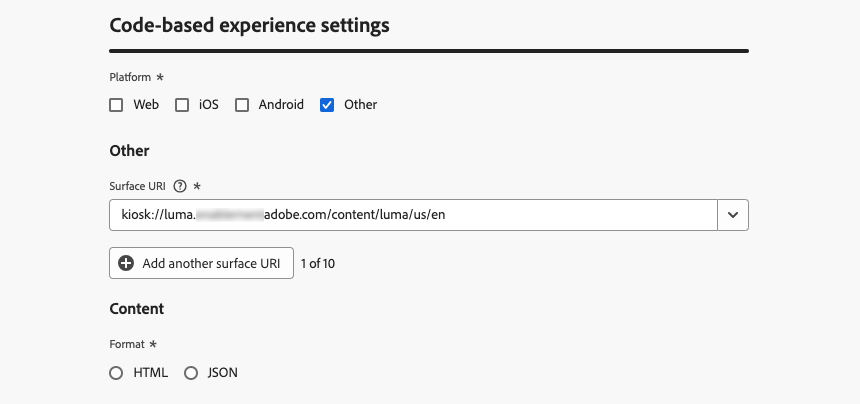

# 設定您基於程式碼的體驗 {#code-based-configuration}

>[!CONTEXTUALHELP]
>id="ajo_code_based_surface"
>title="定義基於程式碼的體驗設定"
>abstract="基於程式碼的設定會定義您應用程式中的路徑和位置，由應用程式實作中的 URI 唯一識別，且內容將在其中傳遞和使用。"

在[建置您的體驗](create-code-based.md)之前，您需要建立程式碼型體驗設定，在其中定義內容將在您的應用程式內傳遞和使用的位置。

程式碼型體驗設定必須參考曲面，這基本上是您要呈現變更的位置。 根據所選的平台，您需要輸入位置/路徑，或完整表面URI。 [了解更多](code-based-surface.md)

>[!NOTE]
>
>當您有多個使用相同管道設定的程式碼型體驗動作（因此在相同表面上執行）時，如果使用者符合多個動作的資格，促銷活動或歷程的&#x200B;**[!UICONTROL 優先順序分數]**&#x200B;會決定要傳遞給他們的專案。 [進一步瞭解優先順序分數](../conflict-prioritization/priority-scores.md)

## 建立基於程式碼的體驗設定 {#create-code-based-configuration}

>[!CONTEXTUALHELP]
>id="ajo_admin_location"
>title="表示頁面或應用程式內的特定位置"
>abstract="此欄位會指定您希望使用者存取之頁面或應用程式內的確切目標。它可以是網頁內的特定區段，也可以是應用程式導覽結構深處的頁面。"

>[!CONTEXTUALHELP]
>id="ajo_admin_default_mobile_url"
>title="定義內容建立和預覽 URL"
>abstract="此欄位可確保根據規則產生或符合的頁面具有指定的 URL，這對於有效建立和預覽內容至關重要。"

若要建立程式碼型體驗通道設定，請遵循下列步驟：

1. 存取&#x200B;**[!UICONTROL 頻道]** > **[!UICONTROL 一般設定]** > **[!UICONTROL 頻道設定]**&#x200B;功能表，然後按一下&#x200B;**[!UICONTROL 建立頻道設定]**。

   

1. 輸入設定的名稱和說明（選擇性）。

   >[!NOTE]
   >
   > 名稱必須以字母(A-Z)開頭。 它只能包含英數字元。 您也可以使用底線 `_`、點 `.` 和連字號 `-` 字元。

1. 若要將自訂或核心資料使用標籤指派給組態，您可以選取&#x200B;**[!UICONTROL 管理存取權]**。 [進一步瞭解物件層級存取控制(OLAC)](../administration/object-based-access.md)

1. 選取&#x200B;**[!UICONTROL 行銷動作]**，以使用此設定將同意原則與訊息相關聯。 系統會運用與行銷動作相關的所有同意政策，以尊重客戶的偏好設定。 [了解更多](../action/consent.md#surface-marketing-actions)

1. 選取&#x200B;**程式碼型體驗**&#x200B;管道。

   

1. 選取將套用程式碼庫體驗的平台：

   * [網頁](#web)
   * [iOS和/或Android](#mobile)
   * [其他](#other)

   >[!NOTE]
   >
   >您可以選取數個平台。 選擇多個平台時，內容會傳遞至所有選取的頁面或應用程式。

1. 為此特定位置選擇應用程式預期的格式。 這將用於編寫行銷活動和歷程中的程式碼型體驗。

   

1. 按一下&#x200B;**[!UICONTROL 提交]**&#x200B;以儲存變更。

現在當您在行銷活動和歷程中[建立程式碼型體驗](create-code-based.md)時，可以選取此設定。

>[!NOTE]
>
>您的應用程式實作團隊負責發出明確API或SDK呼叫，以便為選取的程式碼型體驗設定中定義的表面擷取內容。 在[本節](code-based-implementation-samples.md)中進一步瞭解不同的客戶實作。

### Web 平台 {#web}

>[!CONTEXTUALHELP]
>id="ajo_admin_default_web_url"
>title="定義內容製作和預覽 URL"
>abstract="此欄位可確保根據規則產生或符合的頁面具有指定的 URL，這對於有效建立和預覽內容至關重要。"

若要定義Web平台的程式碼型體驗組態設定，請遵循下列步驟。

1. 選取下列其中一個選項：

   * **[!UICONTROL 單頁]** — 如果您只想將變更套用至單頁，請輸入&#x200B;**[!UICONTROL 頁URL]**。

     

   * **[!UICONTROL 頁面符合規則]** — 若要鎖定多個符合相同規則的URL，請建置一或多個規則。 [了解更多](../web/web-configuration.md#web-page-matching-rule)

     <!--This could be used to apply changes universally across a website, such as updating a hero banner across all pages or adding a top image to display on every product page.-->

     例如，如果您想要編輯顯示在Luma網站所有女性產品頁面上的元素，請選取&#x200B;**[!UICONTROL 網域]** > **[!UICONTROL 開頭為]** > `luma`和&#x200B;**[!UICONTROL 頁面]** > **[!UICONTROL 包含]** > `women`。

     

1. 下列專案適用於預覽URL：

   * 如果輸入單一頁面URL，該URL將用於預覽 — 不需要輸入其他URL。
   * 如果選取了符合規則[的](../web/web-configuration.md#web-page-matching-rule)頁面，您必須輸入預設的撰寫和預覽URL **[!UICONTROL ，以便在瀏覽器中預覽體驗。]**&#x200B;[了解更多](test-code-based.md#preview-on-device)

     

1. **[!UICONTROL 頁面]**&#x200B;上的位置欄位會指定您要使用者存取之頁面內的確切目的地。 它可以是網站導覽結構內頁面上的特定區段，例如「hero-banner」或「product-rail」。

   >[!CAUTION]
   >
   >在此欄位中輸入的字串或路徑必須符合應用程式或頁面實作中宣告的字串或路徑。 這可確保內容會傳送至指定應用程式或頁面內的所需位置。 [了解更多](code-based-surface.md#uri-composition)

   

### 行動平台 (iOS 和 Android) {#mobile}

>[!CONTEXTUALHELP]
>id="ajo_admin_app_id"
>title="提供您的應用程式 ID"
>abstract="輸入應用程式 ID，以便在應用程式的操作環境中進行準確的識別和設定，確保緊密整合和功能。"

>[!CONTEXTUALHELP]
>id="ajo_admin_mobile_url_preview"
>title="輸入內容預覽 URL"
>abstract="此欄位對於直接在裝置的應用程式中模擬和預覽內容至關重要。"

若要定義行動平台的程式碼型體驗組態設定，請遵循下列步驟。

1. 輸入您的&#x200B;**[!UICONTROL 應用程式識別碼]**。 這可在應用程式的作業環境中進行準確的識別和設定，並確保順暢的整合和功能。

1. 提供應用程式&#x200B;**[!UICONTROL 內的]**&#x200B;位置或路徑。 此欄位會指定您想讓使用者存取的應用程式內的確切目的地。 它可以是應用程式導覽結構中的特定區段或頁面，例如「hero-banner」或「product-rail」。

   

1. 填寫&#x200B;**[!UICONTROL 預覽URL]**&#x200B;欄位以啟用裝置上預覽。 此URL會通知預覽服務在裝置上觸發預覽時要使用的特定URL。 [了解更多](test-code-based.md#preview-on-device)

   預覽URL是應用程式開發人員在您應用程式內設定的深層連結。 這可確保任何符合深層連結配置的URL都會在應用程式中開啟，而不是在行動網站瀏覽器中開啟。 請聯絡您的應用程式開發人員，取得為您的應用程式設定的深層連結配置。

   +++  下列資源可協助您為應用程式實作設定深層連結

   * 若為Android：

      * [建立應用程式內容的深度連結](https://developer.android.com/training/app-links/deep-linking)

   * 若為iOS：

      * [定義您的應用程式的自訂 URL 綱要](https://developer.apple.com/documentation/xcode/defining-a-custom-url-scheme-for-your-app)

      * [支援您的應用程式中的通用連結](https://developer.apple.com/documentation/xcode/supporting-universal-links-in-your-app)

   +++

   >[!NOTE]
   >
   >如果您在預覽體驗時遇到問題，請參閱[本檔案](https://experienceleague.adobe.com/zh-hant/docs/experience-platform/assurance/troubleshooting#app-does-not-open-link)。

### 其他平台 {#other}

若要定義其他平台（例如視訊主控台、電視連線裝置、智慧型電視、資訊站、ATM、語音助理、物聯網裝置等）的程式碼型體驗組態設定，請遵循下列步驟。

1. 如果您的實作不適用於Web、iOS或Android，或需要鎖定特定的URI，請選取&#x200B;**[!UICONTROL 其他]**&#x200B;作為平台。

1. 輸入&#x200B;**[!UICONTROL 表面URI]**。 表面URI是與您要傳送體驗的實體對應的唯一識別碼。 [了解更多](code-based-surface.md#surface-uri)

   

   >[!CAUTION]
   >
   >請務必輸入與您自己的實施中所使用之URI相符的表面URI。 否則，將無法傳送變更。 [了解更多](code-based-surface.md#uri-composition)

1. **[!UICONTROL 視需要新增另一個表面URI]**。 您可以新增最多10個URI。

   >[!NOTE]
   >
   >新增多個URI時，內容會傳遞至所有列出的元件。
