# 在程式碼型體驗中使用可編輯的表單欄位 {#code-based-form-fields}

為了更靈活地控制程式碼型體驗，[!DNL Journey Optimizer]可讓您的開發團隊建立包含特定預先定義可編輯欄位的JSON或HTML內容範本。

建立程式碼型體驗時，非技術行銷人員可直接在介面中編輯這些欄位，而不需要開啟個人化編輯器，或觸控其歷程或行銷活動中的任何其他程式碼元素。

此功能為行銷使用者提供簡化的體驗，同時讓開發人員更能掌控程式碼內容，減少錯誤的空間。

## 瞭解表單欄位語法 {#form-field-syntax}

若要讓HTML或JSON程式碼裝載的部分可編輯，您必須在運算式編輯器中使用特定語法。 這涉及宣告具有預設值的&#x200B;**變數**，使用者在將內容範本套用至其程式碼型體驗後，可覆寫該預設值。

例如，假設您要建立內容範本，以將其套用至程式碼型體驗，並允許使用者自訂用於不同位置的特定顏色，例如框架或按鈕的背景顏色。

建立內容範本時，您必須宣告具有&#x200B;**唯一識別碼**&#x200B;的變數（例如&quot;*color*&quot;），並在內容中想要套用此顏色的位置呼叫它。

將內容範本套用至其內容時，使用者將可自訂在任何參考變數的位置所使用的顏色。

## 將可編輯的欄位新增到 HTML 或 JSON 內容範本 {#add-editable-fields}

>[!CONTEXTUALHELP]
>id="ajo_cbe_preview_form_fields"
>title="檢查表單欄位的轉譯"
>abstract="您可以在 JSON 或 HTML 內容範本中定義特定的可編輯欄位，讓非技術使用者無須操作程式碼，就可以輕鬆地在程式碼型的體驗中編輯內容。請使用專用語法建立那些欄位，並使用此按鈕預覽。"

若要讓您的一些JSON或HTML程式碼可編輯，請先建立程式碼型體驗[內容範本](../content-management/content-templates.md)，您可以在其中定義特定表單欄位。

>[!NOTE]
>
>此步驟通常由開發人員角色執行。

➡️ [在此影片中瞭解如何新增可編輯的欄位到程式碼型體驗範本](#video)

1. 建立內容範本並選取&#x200B;**[!UICONTROL 程式碼型體驗]**&#x200B;管道。 [瞭解如何建立範本](../content-management/create-content-templates.md)

1. 選取編寫模式：HTML或JSON。

   >[!CAUTION]
   >
   >變更編寫模式將會遺失您目前的所有程式碼。 以此範本為基礎的程式碼型體驗需要使用相同的編寫模式。

1. 開啟[個人化編輯器](../personalization/personalization-build-expressions.md)以編輯您的程式碼內容。

1. 若要定義可編輯的表單欄位<!--To declare the variable you want users to edit-->，請導覽至左側導覽窗格中的&#x200B;**[!UICONTROL 協助程式功能]**&#x200B;功能表，然後新增&#x200B;**內嵌**&#x200B;屬性。 宣告及呼叫變數的語法會自動新增至內容中。

   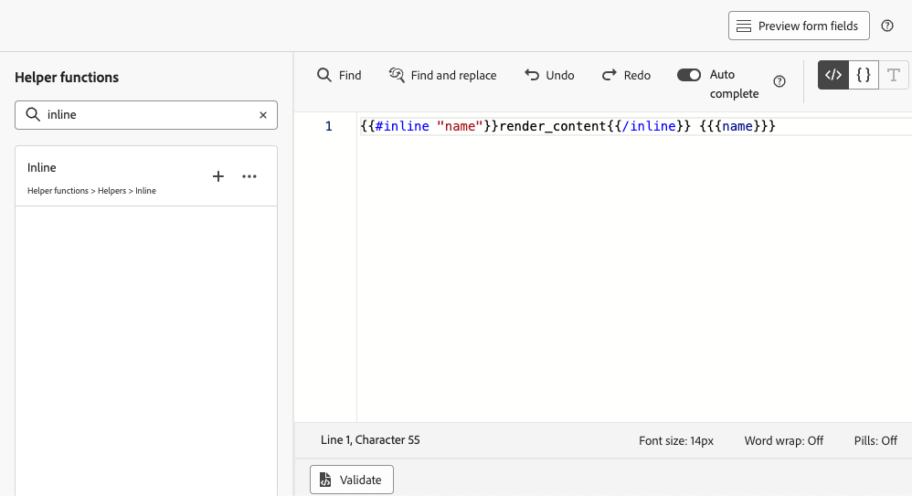{width="85%"}

1. 以唯一ID取代`"name"`以識別可編輯的欄位。 例如，輸入「imgURL」。

   >[!NOTE]
   >
   >欄位ID必須是唯一的，並且不能包含空格。 此ID應在您的內容中要顯示變數值的任何位置使用。

1. 新增下表詳述的引數，調整語法以符合您的需求：

   | 動作 | 參數 | 範例 |
   | ------- | ------- | ------- |
   | 宣告具有&#x200B;**預設值**&#x200B;的可編輯欄位。 將範本新增至您的內容時，如果您未自訂範本，將會使用此預設值。 | 在內嵌標籤之間新增預設值。 | `{{#inline "editableFieldID"}}default_value{{/inline}}` |
   | 為可編輯欄位定義&#x200B;**標籤**。 編輯範本的欄位時，此標籤會顯示在程式碼編輯器中。 | `name="title"` | `{{#inline "editableFieldID" name="title"}}default_value{{/inline}}` |

   <!--
    | Action | Parameter| Example |
    | ------- | ------- | ------- |
    |Declare an editable field containing an **image source** that needs to be published.|`assetType="image"`|`{{#inline "editableFieldID" assetType="image"}}default_value{{/inline}}`|
    |Declare an editable field containing an **URL** that needs to be tracked.br/>Note that out-of-the-box "Mirror page URL" and "Unsubscribe link" predefined blocks cannot become editable fields.>|`assetType="url"`|`{{#inline "editableFieldID" assetType="url"}}default_value{{/inline}}`|
    -->

1. 按一下&#x200B;**[!UICONTROL 預覽表單欄位]**&#x200B;以檢查可編輯的表單欄位在套用此範本的程式碼式體驗中會如何顯示。

   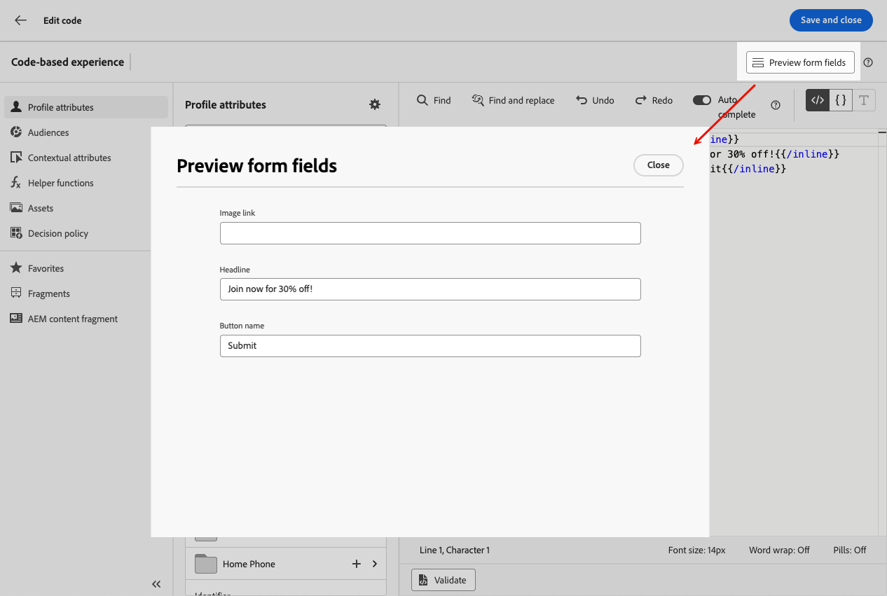{width="85%"}

1. 在您要顯示可編輯欄位值的每個位置，使用程式碼中的`{{{name}}}`語法。 將`name`取代為先前定義之欄位的唯一識別碼。

   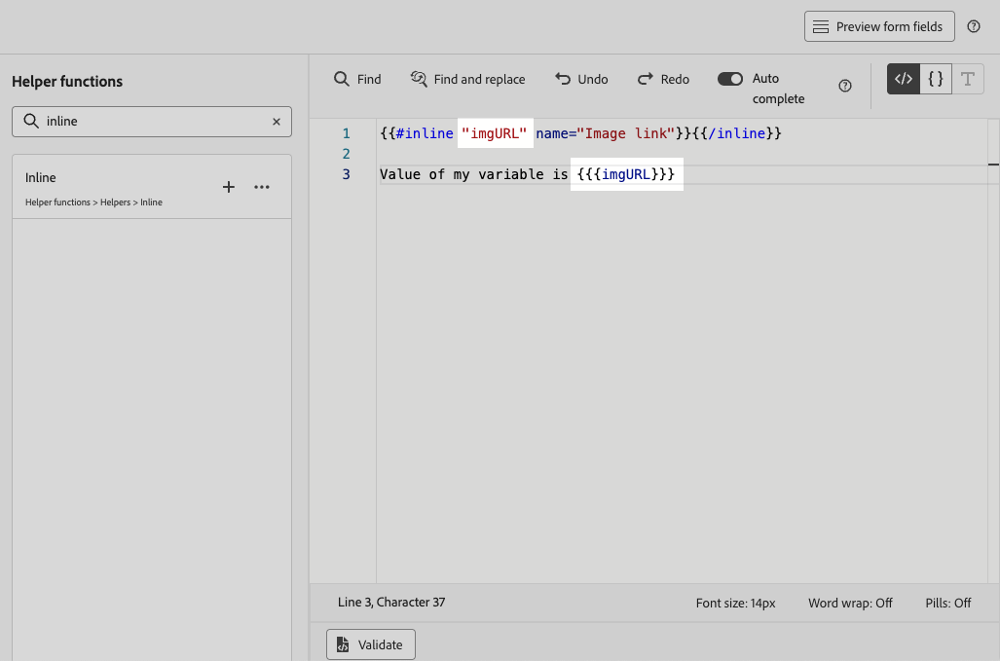{width="85%"}

1. 以類似方式繼續新增其他可編輯的欄位，每個欄位都以`{{#inline}}`和`{{/inline}}`標籤包住。

1. 視需要編輯其餘的程式碼，包括與您定義的可編輯欄位相對應的ID。 [了解作法](create-code-based.md#edit-code)

   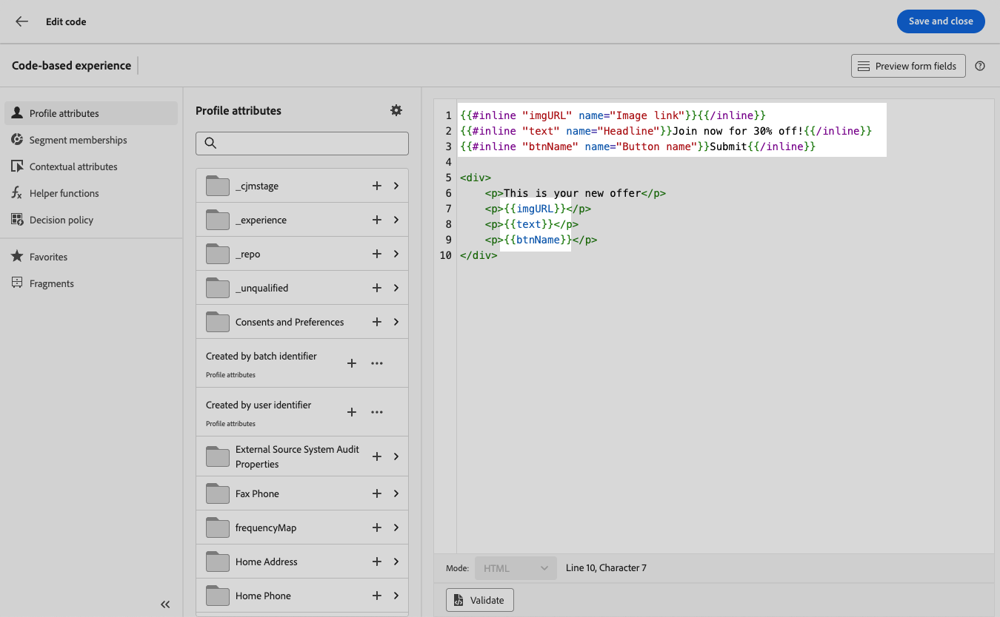

1. 儲存您的範本。

### 在可編輯的欄位表單中使用決定原則 {#decision-policy-in-form-fields}

建立程式碼型體驗內容範本時，您可以使用決定原則在可編輯表單欄位中運用優惠方案。

1. 建立程式碼型體驗範本，如上述[所述](#add-editable-fields)。

1. 使用版本畫面右側邊欄的&#x200B;**[!UICONTROL 顯示決策]**&#x200B;圖示，或在左側功能表的&#x200B;**[!UICONTROL 決策原則]**&#x200B;區段的運算式編輯器中，按一下&#x200B;**[!UICONTROL 新增決策原則]**。

   瞭解如何在[本節](../experience-decisioning/create-decision.md#add-decision)中建立決定原則。

1. 按一下&#x200B;**[!UICONTROL 插入原則]**&#x200B;按鈕。 已新增與決定原則對應的程式碼。

   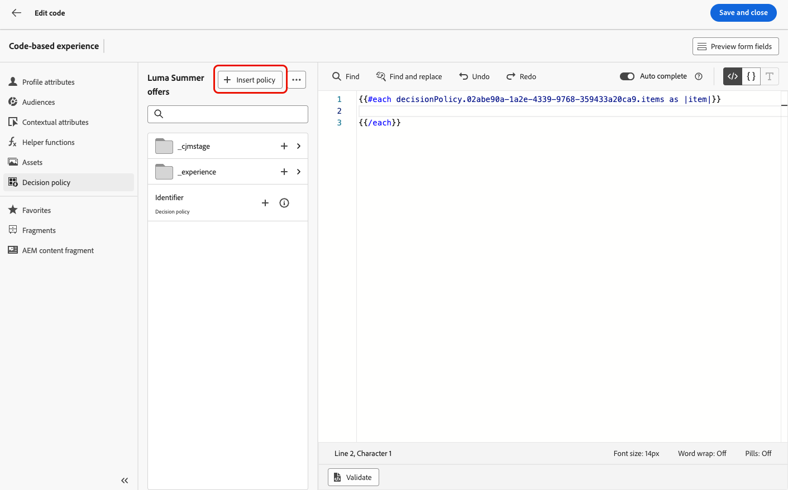

1. 在`{{#each}}`標籤之後，使用上述&#x200B;**的**&#x200B;說明[內嵌](#add-editable-fields)語法，插入對應至您要新增之可編輯表單欄位的代碼。 以唯一ID取代`"name"`以識別可編輯的欄位。 在此範例中，請使用「title」。

   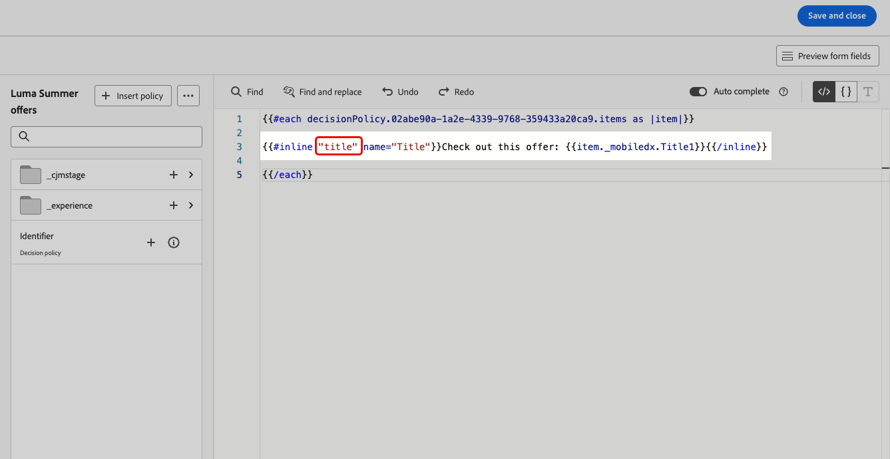{width="90%"}

1. 按一下&#x200B;**[!UICONTROL 預覽表單欄位]**&#x200B;以檢查可編輯的表單欄位在套用此範本的程式碼式體驗中會如何顯示。

   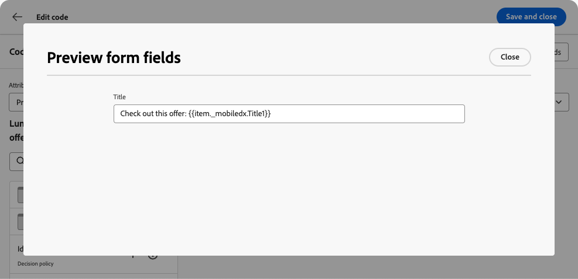{width="70%"}

1. 將剩餘的程式碼插入到`{{/each}}`標籤上方。 在您想要顯示可編輯欄位值的每個位置，在程式碼中使用`{{{name}}}`語法。 在此範例中，將`name`取代為「title」。

   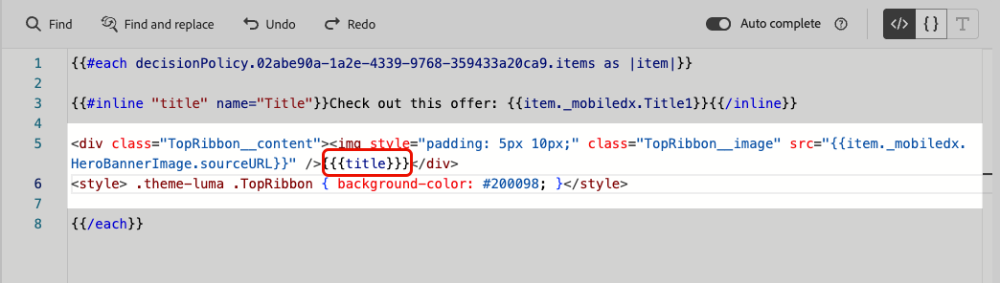{width="85%"}

1. 儲存您的範本。

### 程式碼範例 {#code-examples}

以下是一些JSON和HTML範本的範例，其中包括決定原則。

**JSON範本：**

```
{{#inline "title" name="Title"}}Best gear for winter is here for you!{{/inline}} 
{{#inline "description" name="Description"}}Add description{{/inline}} 
{{#inline "imgURL" name="Image Link"}}Add link{{/inline}} 
{{#inline "number_of_items" name="Number of items"}}23{{/inline}}

{
  "title": "{{{title}}}",
  "description": "{{{description}}}",
  "imageUrl": "{{{imgURL}}}",
  "number_of_items": {{{number_of_items}}}, 
  "code": "DEFAULT"
}
```

>[!NOTE]
>
>參考JSON裝載中的內嵌欄位時：
>
>* 字串型別欄位必須括在雙引號中。
>* 整數或布林值不可使用雙引號括住。 （請參閱上述範例中的`number_of_items`欄位。）

具有決策的&#x200B;**JSON範本：**

```
{ 
"offer": [ 
{{#each decisionPolicy.fff709b7-7fef-4e4e-83d7-594fbcf196c1.items as |item|}} 
{{#inline "title" name="Title"}}{{item._mobiledx.Title1}}{{/inline}} {{#inline "description" name="Description"}}{{item._mobiledx.Title2}}{{/inline}} {{#inline "imgURL" name="Image Link"}}https://luma.enablementadobe.com/content/luma/us/en/experience/warming-up/_jcr_content/root/hero_image.coreimg.jpeg{{/inline}} 

{ 
"title": "{{{title}}}", 
"description": "{{{description}}}", 
"imageUrl": "{{{imgURL}}}", 
"link": "https://lumaenablement.adobe.com/web/luma/home", "code": "DEFAULT" 
}, 
{{/each}}
] 
}
```

>[!NOTE]
>
>您要使用決策專案的內嵌欄位必須放在決策原則區塊中 — 介於`{{#each}}`和`{{/each}}`標籤之間。

**HTML範本：**

```
{{#inline "title" name="Title"}}Please enter title here{{/inline}} 
{{#inline "imgSrc" name="Image link"}}{{/inline}} 

<div class="TopRibbon__content">{{{title}}}</div> 
<style> .theme-luma .TopRibbon { background-color: #200098; }</style>
```

**含決策的HTML範本：**

```
{{#each decisionPolicy.f112884a-5654-43ad-9d6d-dbd32ae23ee6.items as |item|}} 
{{#inline "title" name="Title"}}Title is: {{item._mobiledx.Title1}}{{/inline}} 

<div class="TopRibbon__content">{{{title}}}</div> 
<style> .theme-luma .TopRibbon { background-color: #200098; }</style> 

{{/each}}
```

## 在程式碼型的體驗中編輯表單欄位 {#edit-form-fields}

>[!CONTEXTUALHELP]
>id="ajo_code_based_form_fields"
>title="什麼是表單欄位?"
>abstract="這種程式碼型的體驗包含您可以輕鬆編輯的表單欄位，無需在個人化編輯器中操作程式碼。"

現在已建立包含預先定義的可編輯表單欄位的內容範本，您可以使用此內容範本建立程式碼型體驗。

您無需開啟個人化編輯器，即可從程式碼式體驗歷程或行銷活動輕鬆編輯表單欄位。

>[!NOTE]
>
>此步驟通常由行銷人員角色執行。

1. 從歷程活動或行銷活動版本畫面，選取包含可編輯表單欄位的內容範本。 [瞭解如何使用內容範本](../content-management/use-content-templates.md)

   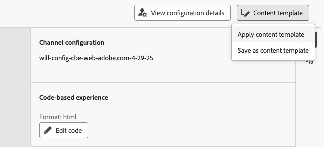{width="60%"}

   >[!CAUTION]
   >
   >根據預先選取的管道設定，可供選擇的範本範圍限定為HTML或JSON。 只會顯示相容的範本。

1. 在選取的內容範本中預先定義的欄位可在右窗格中使用。<!--The code preview is displayed with the rest of the code.-->

   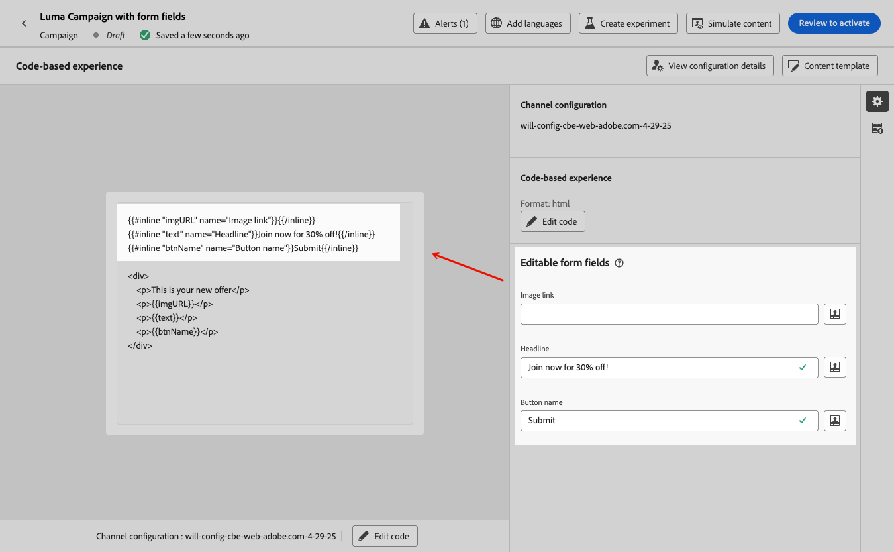

1. 從&#x200B;**[!UICONTROL 可編輯的表單欄位]**&#x200B;區段，您可以：

   * 直接在可編輯欄位中編輯每個值，無需開啟程式碼編輯器。

   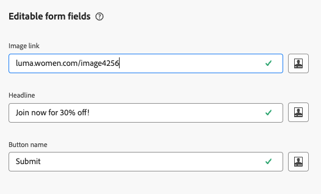{width="60%"}

   * 按一下個人化圖示以使用[程式碼編輯器](../personalization/personalization-build-expressions.md)編輯每個欄位。

   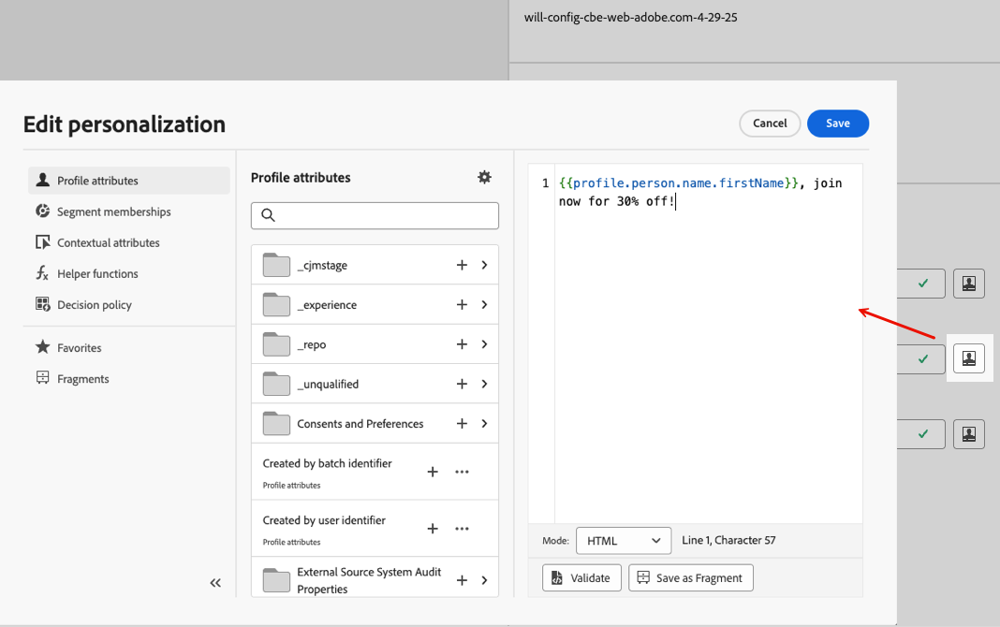{width="70%"}

   >[!NOTE]
   >
   >在這兩種情況下，您一次只能編輯一個欄位，並且無法編輯其餘的程式碼型體驗內容。

1. 如果[決定原則已新增](#decision-policy-in-form-fields)至內容範本，則它隨附[優惠方案目錄結構描述](../experience-decisioning/catalogs.md)中可用的所有屬性。 您可以內嵌或使用運算式編輯器來編輯決定專案。

1. 若要編輯其餘的程式碼，請按一下&#x200B;**[!UICONTROL 編輯程式碼]**&#x200B;按鈕，並更新完整的程式碼型體驗內容，包括可編輯的表單欄位。 [了解更多](create-code-based.md#edit-code)

## 操作說明影片 {#video}

瞭解如何將可編輯的欄位新增至程式碼型體驗管道內容範本。

>[!VIDEO](https://video.tv.adobe.com/v/3463990/?learn=on&#x26;enablevpops)
