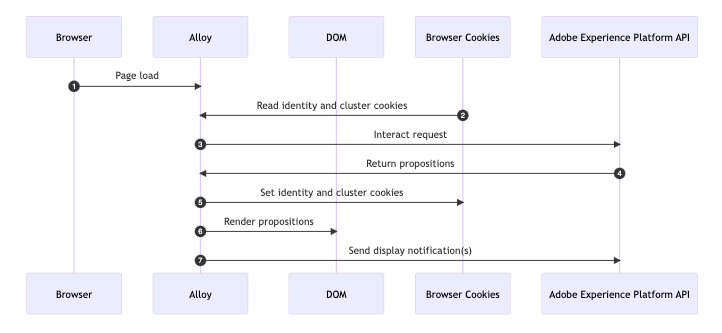

# 程式碼型實作方法範例 {#implementation-samples}

程式碼型體驗支援任何型別的客戶實施。 您可以在此頁面找到每種實作方法的範例：

* [用戶端](#client-side-implementation)
* [伺服器端](#server-side-implementation)
* [混合式](#hybrid-implementation)

>[!IMPORTANT]
>
>依照[此連結](https://github.com/adobe/alloy-samples/tree/main/ajo){target="_blank"}尋找不同個人化和實驗使用案例的實施範例。 請檢視並執行這些報表，以更加瞭解所需的實作步驟，以及端對端個人化流程的運作方式。

➡️進一步瞭解如何在[這些教學課程](code-based-decisioning-implementations.md#tutorials)中設定Web SDK以進行程式碼式體驗和決策

## 使用者端實施 {#client-side-implementation}

如果您是使用者端實施，則可以使用其中一個AEP使用者端SDK： AEP Web SDK或AEP Mobile SDK。

* 步驟[如下](#client-side-how)說明在範例&#x200B;**網頁SDK**&#x200B;實作中，由程式碼型體驗歷程和行銷活動擷取在Edge上發佈的內容並顯示個人化內容的程式。

* 在&#x200B;**本教學課程**&#x200B;中說明使用[行動SDK](https://developer.adobe.com/client-sdks/edge/adobe-journey-optimizer/code-based/tutorial/){target="_blank"}實作程式碼式頻道的步驟。

  >[!NOTE]
  >
  >[iOS應用程式](https://github.com/adobe/aepsdk-messaging-ios/tree/main/TestApps/MessagingDemoAppSwiftUI){target="_blank"}和[Android應用程式](https://github.com/adobe/aepsdk-messaging-android/tree/main/code/testapp){target="_blank"}提供行動使用案例的範例實作。

### 運作方式 — 網頁SDK {#client-side-how}

1. [網頁版SDK](https://experienceleague.adobe.com/docs/experience-platform/edge/home.html){target="_blank"}已包含在此頁面上。

1. 您必須使用`sendEvent`命令並指定[表面URI](code-based-surface.md)<!--( or location/path)-->來擷取個人化內容。

   ```javascript
   alloy("sendEvent", {
   renderDecisions: true,
   personalization: {
       surfaces: ["#sample-json-content"],
   },
   }).then(applyPersonalization("#sample-json-content"));
   ```

1. 實作程式碼應手動套用程式碼型體驗專案（使用[`applyPersonalization`](https://github.com/adobe/alloy-samples/blob/ac83b6927d007dc456caad2c6ce0b324c99c26c9/ajo/personalization-client-side/public/script.js){target="_blank"}方法），以根據決定更新DOM。

1. 對於程式碼型體驗歷程和行銷活動，必須手動傳送顯示事件以指出內容已顯示的時機。 這是透過`sendEvent`命令完成的。

   ```javascript
   function sendDisplayEvent(decision) {
     const { id, scope, scopeDetails = {} } = decision;
   
     alloy("sendEvent", {
   
       xdm: {
         eventType: "decisioning.propositionDisplay",
         _experience: {
           decisioning: {
             propositions: [
               {
                 id: id,
                 scope: scope,
                 scopeDetails: scopeDetails,
               },
             ],
           },
         },
       },
     });
   }
   ```

1. 對於程式碼型體驗歷程和行銷活動，必須手動傳送互動事件，以指出使用者何時已與內容互動。 這是透過`sendEvent`命令完成的。

   ```javascript
   function sendInteractEvent(label, proposition) {
     const { id, scope, scopeDetails = {} } = proposition;
   
     alloy("sendEvent", {
   
       xdm: {
         eventType: "decisioning.propositionInteract",
         _experience: {
           decisioning: {
             propositions: [
               {
                 id: id,
                 scope: scope,
                 scopeDetails: scopeDetails,
               },
             ],
             propositionEventType: {
               interact: 1
             },
             propositionAction: {
               id: label,
               label: label,
               tokens: proposition.items?.[0]?.characteristics?.tokens || []
             },
           },
         },
       },
     });
   }
   ```

   >[!IMPORTANT]
   >
   >`tokens`中的`propositionAction`欄位對於Adobe Journey Optimizer Decisioning (AJO-D)中的準確追蹤和歸因至關重要。 這些權杖會啟用：
   >- 決策活動的正確點按歸因
   >- 準確報告使用者與已決策內容的互動
   >- 根據使用者參與最佳化優惠方案效能
   >
   >Token通常可在`proposition.items[0].characteristics.tokens`中找到，且一律應在追蹤使用者與已決策內容的互動時納入。

### 重要觀察

**Cookie**

Cookie可用來儲存使用者身分和叢集資訊。 使用使用者端實作時，Web SDK會在請求生命週期中自動處理這些Cookie的儲存和傳送。

| Cookie | 目的 | 儲存者 | 傳送者 |
| ------------------------ | -------------------------------------------------------------------------- | --------- | ------- |
| kndctr_AdobeOrg_identity | 包含使用者身分詳細資訊 | Web SDK | Web SDK |
| kndctr_AdobeOrg_cluster | 指出應使用哪個體驗邊緣叢集來履行請求 | Web SDK | Web SDK |

**要求位置**

需要向Adobe Experience Platform API提出請求才能取得主張並傳送顯示通知。 使用使用者端實作時，Web SDK會在使用`sendEvent`命令時提出這些要求。

| 請求 | 製作者 |
| ---------------------------------------------- | ----------------------------------- |
| 互動要求以取得主張 | 使用sendEvent命令的Web SDK |
| interact傳送顯示通知的請求 | 使用sendEvent命令的Web SDK |

**流量圖**



## 伺服器端實作 {#server-side-implementation}

如果您有伺服器端實作，則可以使用其中一個AEP Edge Network API。

以下步驟說明在網頁的範例Edge Network API實作中，擷取程式碼型體驗歷程和行銷活動在Edge上發佈的內容並顯示個人化內容的程式。

### 運作方式

1. 已要求網頁，而且已包含先前由瀏覽器儲存且前置詞為`kndctr_`的任何Cookie。
1. 從應用程式伺服器要求頁面時，會傳送事件至[互動式資料收集端點](https://experienceleague.adobe.com/docs/experience-platform/edge-network-server-api/data-collection/interactive-data-collection.html?lang=zh-Hant)，以擷取個人化內容。 此範例應用程式使用一些協助程式方法來簡化建立及傳送要求至API的程式（請參閱[aepEdgeClient.js](https://github.com/adobe/alloy-samples/blob/ac83b6927d007dc456caad2c6ce0b324c99c26c9/common/aepEdgeClient.js){target="_blank"}）。 但要求只是`POST`，其裝載包含事件和查詢。 先前步驟的Cookie （如果可用）包含在`meta>state>entries`陣列中的請求中。

   ```javascript
   fetch(
     "https://edge.adobedc.net/ee/v2/interact?dataStreamId=abc&requestId=123",
     {
       headers: {
         accept: "*/*",
         "accept-language": "en-US,en;q=0.9",
         "cache-control": "no-cache",
         "content-type": "text/plain; charset=UTF-8",
         pragma: "no-cache",
         "sec-fetch-dest": "empty",
         "sec-fetch-mode": "cors",
         "sec-fetch-site": "cross-site",
         "sec-gpc": "1",
         "Referrer-Policy": "strict-origin-when-cross-origin",
         Referer: "https://localhost/",
       },
       body: JSON.stringify({
         event: {
           xdm: {
             eventType: "decisioning.propositionFetch",
             web: {
               webPageDetails: {
                 URL: "https://localhost/",
               },
               webReferrer: {
                 URL: "",
               },
             },
             identityMap: {
               FPID: [
                 {
                   id: "xyz",
                   authenticatedState: "ambiguous",
                   primary: true,
                 },
               ],
             },
             timestamp: "2022-06-23T22:21:00.878Z",
           },
           data: {},
         },
         query: {
           identity: {
             fetch: ["ECID"],
           },
           personalization: {
             schemas: [
               "https://ns.adobe.com/personalization/default-content-item",
               "https://ns.adobe.com/personalization/html-content-item",
               "https://ns.adobe.com/personalization/json-content-item",
               "https://ns.adobe.com/personalization/redirect-item",
               "https://ns.adobe.com/personalization/dom-action",
             ],
             surfaces: ["web://localhost/","web://localhost/#sample-json-content"],
           },
         },
         meta: {
           state: {
             domain: "localhost",
             cookiesEnabled: true,
             entries: [
               {
                 key: "kndctr_XXX_AdobeOrg_identity",
                 value: "abc123",
               },
               {
                 key: "kndctr_XXX_AdobeOrg_cluster",
                 value: "or2",
               },
             ],
           },
         },
       }),
       method: "POST",
     }
   ).then((res) => res.json());
   ```

1. 程式碼型體驗歷程和促銷活動中的JSON體驗會從回應中讀取，並在產生HTML回應時使用。

1. 對於程式碼型體驗歷程和行銷活動，必須在實施中手動傳送顯示事件，以指出顯示歷程或行銷活動內容的時間。 在此範例中，通知會在請求生命週期期間在伺服器端傳送。

   ```javascript
   function sendDisplayEvent(aepEdgeClient, req, propositions, cookieEntries) {
     const address = getAddress(req);
   
     aepEdgeClient.interact(
       {
         event: {
           xdm: {
             web: {
               webPageDetails: { URL: address },
               webReferrer: { URL: "" },
             },
             timestamp: new Date().toISOString(),
             eventType: "decisioning.propositionDisplay",
             _experience: {
               decisioning: {
                 propositions: propositions.map((proposition) => {
                   const { id, scope, scopeDetails } = proposition;
   
                   return {
                     id,
                     scope,
                     scopeDetails,
                   };
                 }),
               },
             },
           },
         },
         query: { identity: { fetch: ["ECID"] } },
         meta: {
           state: {
             domain: "",
             cookiesEnabled: true,
             entries: [...cookieEntries],
           },
         },
       },
       {
         Referer: address,
       }
     );
   }
   ```

1. 傳回HTML回應時，應用程式伺服器會在回應上設定身分和叢集Cookie。

### 重要觀察

**Cookie**

Cookie可用來儲存使用者身分和叢集資訊。 使用伺服器端實作時，應用程式伺服器必須在請求生命週期期間處理這些Cookie的儲存和傳送。

| Cookie | 目的 | 儲存者 | 傳送者 |
| ------------------------ | -------------------------------------------------------------------------- | ------------------ | ------------------ |
| kndctr_AdobeOrg_identity | 包含使用者身分詳細資訊 | 應用程式伺服器 | 應用程式伺服器 |
| kndctr_AdobeOrg_cluster | 指出應使用哪個體驗邊緣叢集來履行請求 | 應用程式伺服器 | 應用程式伺服器 |

**要求位置**

需要向Adobe Experience Platform API提出請求才能取得主張並傳送顯示通知。 使用使用者端實作時，Web SDK會在使用`sendEvent`命令時提出這些要求。

| 請求 | 製作者 |
| ---------------------------------------------- | ------------------------------------------------------------ |
| 互動要求以取得主張 | 應用程式伺服器呼叫Adobe Experience Platform API |
| interact傳送顯示通知的請求 | 應用程式伺服器呼叫Adobe Experience Platform API |

**流量圖**


## 混合實施 {#hybrid-implementation}

如果您採用混合式實作，請參閱下列連結。

* Adobe技術部落格： [Adobe Experience Platform Web SDK中的Hybrid Personalization](https://blog.developer.adobe.com/hybrid-personalization-in-the-adobe-experience-platform-web-sdk-6a1bb674bf41){target="_blank"}
* SDK檔案： [使用網頁SDK和Edge Network伺服器API的混合個人化](https://experienceleague.adobe.com/docs/experience-platform/edge/personalization/hybrid-personalization.html){target="_blank"}

## 使用Adobe Experience Platform Assurance偵錯Edge網路API呼叫 {#debugging-edge-api-assurance}

直接將Edge Network API用於程式碼型體驗時(不使用Web SDK或Mobile SDK)，您可以將Assurance工作階段ID加入為驗證Token標頭，藉此使用Adobe Experience Platform Assurance除錯API呼叫。

1. 從作用中的Assurance工作階段取得您的Adobe Experience Platform Assurance工作階段ID，或使用Assurance API建立工作階段ID。

1. 新增具有Assurance工作階段ID的`x-adobe-aep-validation-token`標頭，以透過Assurance工作階段路由您的Edge Network API請求。

   **範例：**

   ```bash
   curl -v 'https://edge.adobedc.net/ee/v1/interact?configId={DATASTREAM_ID}&requestId={REQUEST_ID}' \
   --header 'Content-Type: application/json' \
   --header 'x-adobe-aep-validation-token: {ASSURANCE_SESSION_ID}' \
   --data-raw '{
       "xdm": {
         "identityMap": {
               "ECID": [
                   {
                       "id": "{ECID_VALUE}"
                   }
               ]
           }
       },
       "events": [
           {
               "xdm": {
                   "eventType": "test",
                   "timestamp": "{TIMESTAMP}"
               }
           }
       ]
   }'
   ```

1. 設定之後，請開啟您的Assurance工作階段並選取&#x200B;**[!UICONTROL Edge Delivery]**&#x200B;檢視來即時檢視Edge Network API要求和回應，包括要求承載、回應內容、個人化主張和錯誤訊息。


<!--
## Implementation guides and tutorials {#implementation-guides}

To help you get started with implementing code-based experiences, refer to the comprehensive step-by-step tutorials below:

* **Mobile SDK implementation**: Follow [this tutorial](https://developer.adobe.com/client-sdks/edge/adobe-journey-optimizer/code-based/tutorial/){target="_blank"} to learn how to set up code-based experiences on mobile apps using the Adobe Experience Platform Mobile SDK.

* **Web SDK implementation**: Learn how to configure the Web SDK for decisioning and code-based experiences in [these tutorials](code-based-decisioning-implementations.md#tutorials).

* **Decisioning implementation**: To learn how to implement decisioning capabilities on a code-based campaign, follow [this use case tutorial](https://experienceleague.adobe.com/en/docs/journey-optimizer/using/decisioning/experience-decisioning/experience-decisioning-uc){target="_blank"}.-->
