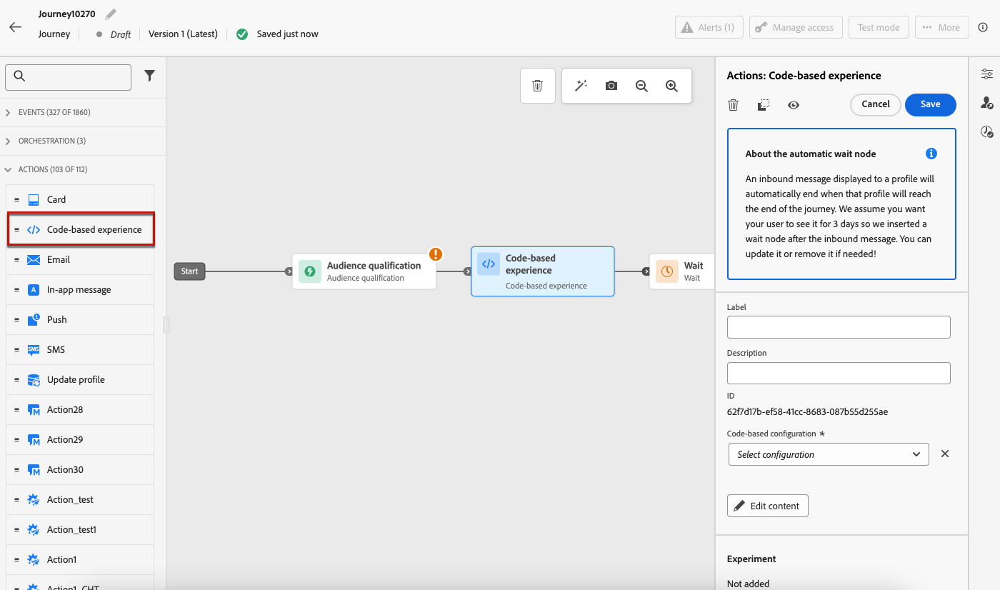
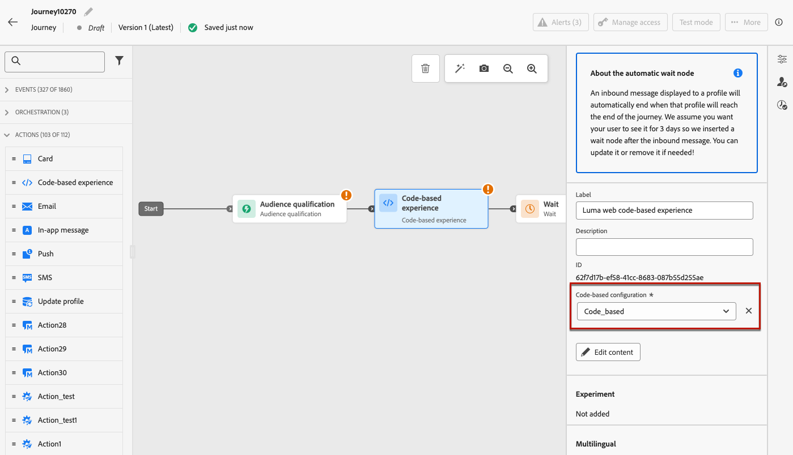
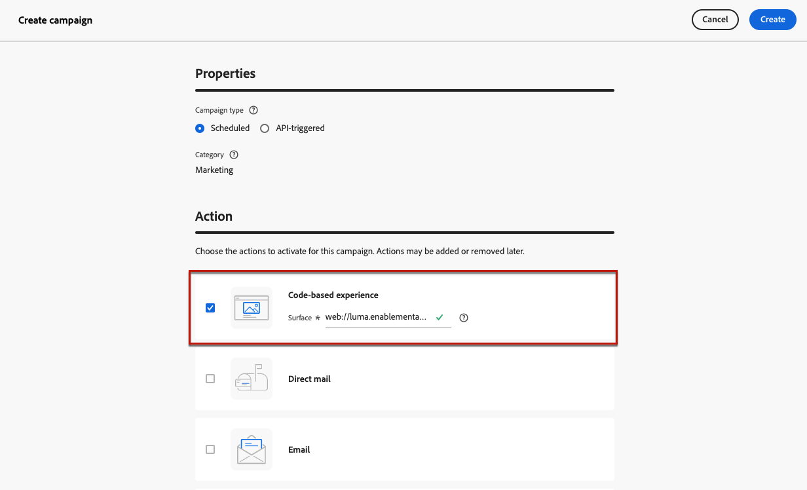
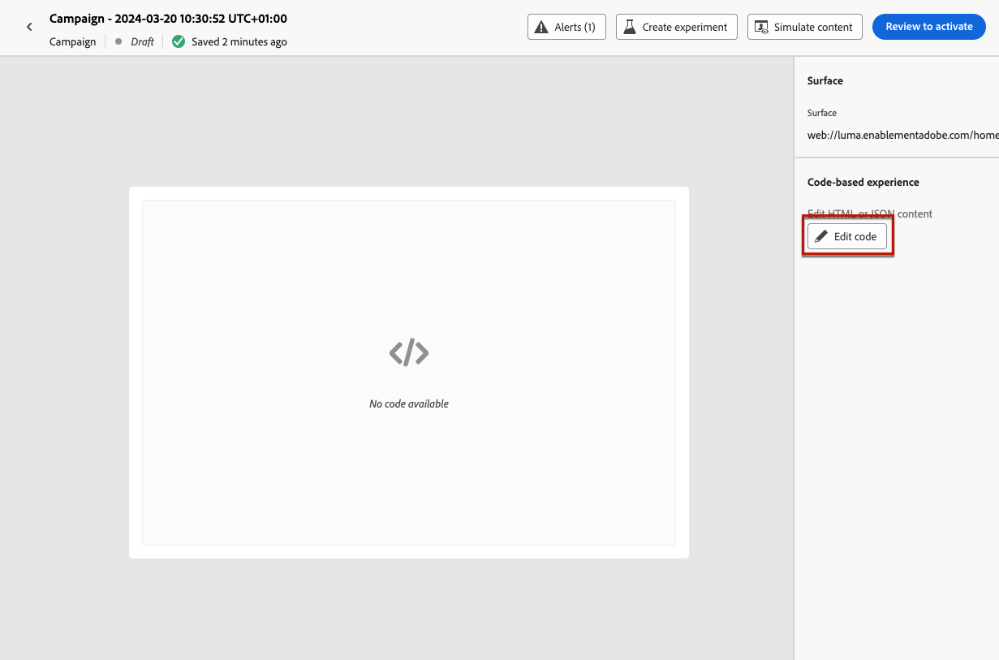
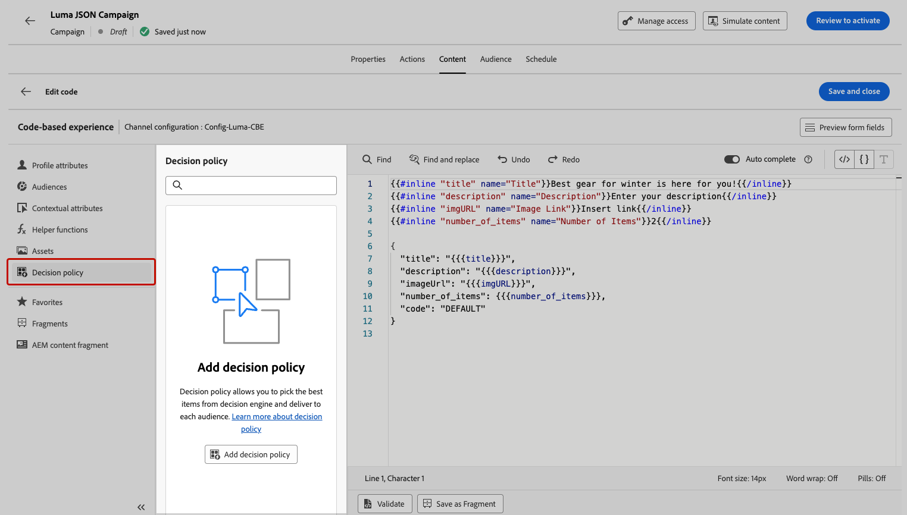

# 建立程式碼型體驗 {#create-code-based}

在[!DNL Journey Optimizer]中，您可以在歷程或行銷活動中建立程式碼型體驗。

有關程式碼型體驗的特定護欄和建議，請參閱[此頁面](code-based-prerequisites.md)。

## 透過歷程或行銷活動新增程式碼型體驗 {#create-code-based-experience}

若要透過歷程或行銷活動開始建立程式碼型體驗，請遵循下列步驟。

>[!BEGINTABS]

>[!TAB 將程式碼型體驗新增至歷程]

若要將&#x200B;**程式碼型體驗**&#x200B;活動新增至歷程，請遵循下列步驟：

1. [建立歷程](../building-journeys/journey-gs.md)。

1. 以[事件](../building-journeys/general-events.md)或[讀取對象](../building-journeys/read-audience.md)活動來開始您的歷程。

1. 從浮動視窗的&#x200B;**[!UICONTROL 動作]**&#x200B;區段，拖放&#x200B;**[!UICONTROL 程式碼型體驗]**&#x200B;活動。

   

   >[!NOTE]
   >
   >由於&#x200B;**程式碼型體驗**&#x200B;是傳入訊息活動，因此會附帶3天&#x200B;**等待**&#x200B;活動。 [了解更多](../building-journeys/wait-activity.md#auto-wait-node)

1. 為您的訊息輸入&#x200B;**[!UICONTROL 標籤]**&#x200B;和&#x200B;**[!UICONTROL 描述]**。

1. 選取或建立要使用的[程式碼型體驗組態](code-based-configuration.md)。

   

1. 選取&#x200B;**[!UICONTROL 編輯內容]**&#x200B;按鈕，並使用個人化編輯器視需要編輯您的內容。 [了解更多](#edit-code)

   您也可以使用現有的內容範本作為程式碼內容的基礎。 請注意，可供選擇的範本會根據預先選擇的管道設定，限定為HTML或JSON的範圍。 [瞭解如何使用內容範本](../content-management/use-content-templates.md)

1. 如有必要，請拖放其他動作或事件以完成您的歷程流程。 [了解更多](../building-journeys/about-journey-activities.md)

1. 一旦您的程式碼庫體驗準備就緒，請完成設定並發佈您的歷程以將其啟用。 [了解更多](../building-journeys/publishing-the-journey.md)

如需如何設定歷程的詳細資訊，請參閱[此頁面](../building-journeys/journey-gs.md)。

>[!TAB 建立以程式碼為主的體驗活動]

若要透過行銷活動開始建置您的&#x200B;**程式碼型體驗**，請遵循下列步驟。

1. 建立行銷活動。 [了解更多](../campaigns/create-campaign.md)

1. 選取您要執行的行銷活動型別

   * **[!UICONTROL 已排程 — 行銷]**：立即或在指定日期執行行銷活動。 已排程的行銷活動旨在傳送&#x200B;**行銷**&#x200B;訊息。 可從使用者介面設定及執行。

   * **[!UICONTROL API觸發 — 行銷/異動]**：使用API呼叫執行行銷活動。 API觸發的行銷活動旨在傳送&#x200B;**行銷**&#x200B;或&#x200B;**異動**&#x200B;訊息，即在個人執行動作後傳送的訊息：密碼重設、購物車購買等。 [瞭解如何使用API觸發行銷活動](../campaigns/api-triggered-campaigns.md)

1. 完成步驟以建立行銷活動，例如行銷活動屬性、[對象](../audience/about-audiences.md)和[排程](../campaigns/create-campaign.md#schedule)。 如需如何設定行銷活動的詳細資訊，請參閱[此頁面](../campaigns/get-started-with-campaigns.md)。

1. 選取&#x200B;**[!UICONTROL 程式碼型體驗]**&#x200B;動作。

1. 選取或建立程式碼型體驗設定。 [了解更多](code-based-configuration.md)

   

1. 使用個人化編輯器，視需要編輯您的內容。 [了解更多](#edit-code)

   您也可以使用現有的內容範本作為程式碼內容的基礎。 請注意，可供選擇的範本會根據預先選擇的管道設定，限定為HTML或JSON的範圍。 [瞭解如何使用內容範本](../content-management/use-content-templates.md)

   <!---->

如需如何設定行銷活動的詳細資訊，請參閱[此頁面](../campaigns/get-started-with-campaigns.md)。

➡️[在此影片中瞭解如何建立程式碼型體驗行銷活動](#video)

>[!ENDTABS]

## 編輯程式碼內容 {#edit-code}

>[!CONTEXTUALHELP]
>id="ajo_code_based_experience"
>title="使用個人化編輯器"
>abstract="插入並編輯您想要作為此基於程式碼之體驗動作的一部分的程式碼。"
>additional-url="https://experienceleague.adobe.com/docs/journey-optimizer/using/content-management/personalization/expression-editor/personalization-build-expressions.html" text="開始使用個人化編輯器"

1. 在歷程活動或行銷活動版本畫面中，選取&#x200B;**[!UICONTROL 編輯代碼]**。

   

1. [個人化編輯器](../personalization/personalization-build-expressions.md)開啟。 這是非視覺化體驗建立介面，可讓您編寫程式碼。

1. 您可以將編寫模式從HTML切換為JSON，反之亦然。

   

   >[!CAUTION]
   >
   >變更編寫模式將會遺失您目前的所有程式碼，因此在開始編寫之前，請務必切換模式。

1. 視需要輸入您的程式碼。 您可以善用[!DNL Journey Optimizer]個人化編輯器及其所有個人化和編寫功能。 [了解更多](../personalization/personalization-build-expressions.md)

1. 您可以視需要新增HTML或JSON運算式片段。 [了解作法](../personalization/use-expression-fragments.md)

   您也可以將部分程式碼內容儲存為片段。 [了解作法](../content-management/fragments.md#save-as-expression-fragment)

1. 使用程式碼型體驗時，您可以使用決策功能。 從左側列選取&#x200B;**[!UICONTROL 決定原則]**&#x200B;圖示，然後按一下&#x200B;**[!UICONTROL 新增決定原則]**。 [了解更多](../experience-decisioning/create-decision.md)

   

1. 按一下&#x200B;**[!UICONTROL 儲存並關閉]**&#x200B;以確認您的變更。

現在，當您的開發人員執行API或SDK呼叫，擷取您頻道設定中定義之表面的內容時，變更就會套用至您的網頁或應用程式。

## 作法影片{#video}

以下影片說明如何建立程式碼型體驗行銷活動、設定其屬性、測試並發佈。

>[!VIDEO](https://video.tv.adobe.com/v/3428868/?quality=12&learn=on)
