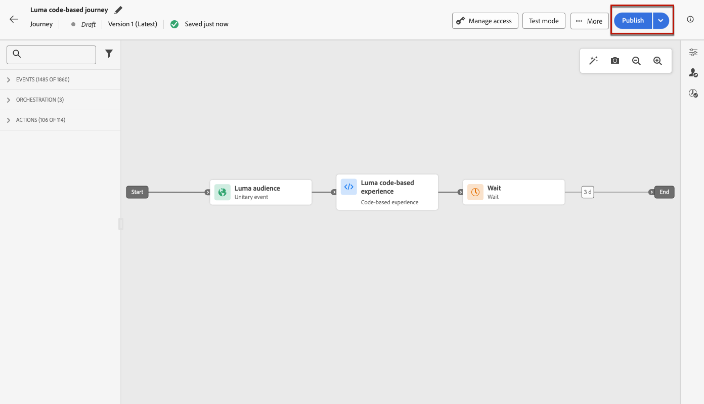

# 建立程式碼型體驗 {#create-code-based}

在[!DNL Journey Optimizer]中，您可以在歷程或行銷活動中建立程式碼型體驗。

有關程式碼型體驗的特定護欄和建議，請參閱[此頁面](code-based-prerequisites.md)。

## Add a code-based experience through a journey or a campaign {#create-code-based-experience}

To start building your code-based experience through a journey or a campaign, follow the steps below.

>[!BEGINTABS]

>[!TAB ]

若要將&#x200B;**程式碼型體驗**&#x200B;活動新增至歷程，請遵循下列步驟：

1. [建立歷程](../building-journeys/journey-gs.md)。

1. 以[事件](../building-journeys/general-events.md)或[讀取對象](../building-journeys/read-audience.md)活動來開始您的歷程。

1. 從浮動視窗的&#x200B;**[!UICONTROL 動作]**&#x200B;區段，拖放&#x200B;**[!UICONTROL 程式碼型體驗]**&#x200B;活動。

   

   >[!NOTE]
   >
   >由於&#x200B;**程式碼型體驗**&#x200B;是傳入訊息活動，因此會附帶3天&#x200B;**等待**&#x200B;活動。 [了解更多](../building-journeys/wait-activity.md#auto-wait-node)

1. ********

1. 

   

1. ****[了解更多](#edit-code)

   您也可以使用現有的內容範本作為程式碼內容的基礎。 請注意，可供選擇的範本會根據預先選擇的管道設定，限定為HTML或JSON的範圍。 [瞭解如何使用內容範本](../content-management/use-content-templates.md)

1. If necessary, complete your journey flow by dragging and dropping additional actions or events. [了解更多](../building-journeys/about-journey-activities.md)

1. Once your code-base experience is ready, finalize the configuration and publish your journey to activate it. [了解更多](../building-journeys/publishing-the-journey.md)

如需如何設定歷程的詳細資訊，請參閱[此頁面](../building-journeys/journey-gs.md)。

>[!TAB 建立以程式碼為主的體驗活動]

若要透過行銷活動開始建置您的&#x200B;**程式碼型體驗**，請遵循下列步驟。

1. Create a campaign. [了解更多](../campaigns/create-campaign.md)

1. Select the type of campaign that you want to execute

   * ******** They are configured and executed from the user interface.

   * **** API觸發的行銷活動旨在傳送&#x200B;**行銷**&#x200B;或&#x200B;**異動**&#x200B;訊息，即在個人執行動作後傳送的訊息：密碼重設、購物車購買等。 [瞭解如何使用API觸發行銷活動](../campaigns/api-triggered-campaigns.md)

1. 完成步驟以建立行銷活動，例如行銷活動屬性、[對象](../audience/about-audiences.md)和[排程](../campaigns/create-campaign.md#schedule)。 如需如何設定行銷活動的詳細資訊，請參閱[此頁面](../campaigns/get-started-with-campaigns.md)。

1. 選取&#x200B;**[!UICONTROL 程式碼型體驗]**&#x200B;動作。

1. 選取或建立程式碼型體驗設定。 [了解更多](code-based-configuration.md)

   

1. 使用個人化編輯器，視需要編輯您的內容。 [了解更多](#edit-code)

   您也可以使用現有的內容範本作為程式碼內容的基礎。 請注意，可供選擇的範本會根據預先選擇的管道設定，限定為HTML或JSON的範圍。 [瞭解如何使用內容範本](../content-management/use-content-templates.md)

   <!---->

如需如何設定行銷活動的詳細資訊，請參閱[此頁面](../campaigns/get-started-with-campaigns.md)。

>[!ENDTABS]

## 編輯程式碼內容 {#edit-code}

>[!CONTEXTUALHELP]
>id="ajo_code_based_experience"
>title="使用個人化編輯器"
>abstract="插入並編輯您想要作為此基於程式碼之體驗動作的一部分的程式碼。"
>additional-url="https://experienceleague.adobe.com/docs/journey-optimizer/using/content-management/personalization/expression-editor/personalization-build-expressions.html" text="開始使用個人化編輯器"

1. ****

   

1. 這是非視覺化體驗建立介面，可讓您編寫程式碼。

1. 您可以將編寫模式從HTML切換為JSON，反之亦然。

   

   >[!CAUTION]
   >
   >變更編寫模式將會遺失您目前的所有程式碼，因此在開始編寫之前，請務必切換模式。

1. 視需要輸入您的程式碼。 您可以善用[!DNL Journey Optimizer]個人化編輯器及其所有個人化和編寫功能。 [了解更多](../personalization/personalization-build-expressions.md)

1. 您可以視需要新增HTML或JSON運算式片段。 [了解作法](../personalization/use-expression-fragments.md)

   您也可以將部分程式碼內容儲存為片段。 [了解作法](../content-management/fragments.md#save-as-expression-fragment)

1. 使用程式碼型體驗時，您可以使用決策功能。 從左側列選取&#x200B;**[!UICONTROL 決定原則]**&#x200B;圖示，然後按一下&#x200B;**[!UICONTROL 新增決定原則]**。 [了解更多](../experience-decisioning/create-decision.md)

   

   >[!NOTE]
   >
   >決策目前僅適用於一組組織（可用性限制）。 若要取得存取權，請和您的 Adobe 代表聯絡。

1. ****

Now as soon as your developer makes an API or SDK call to fetch content for the surface defined in your channel configuration, the changes will be applied to your web page or app.

## 測試基於程式碼的體驗 {#test-code-based-experience}

>[!CONTEXTUALHELP]
>id="ajo_code_based_preview"
>title="預覽您的基於程式碼的體驗"
>abstract="模擬基於程式碼的體驗。"

若要顯示已修改程式碼型體驗的預覽，請遵循下列步驟。

>[!CAUTION]
>
>You must have test profiles available to simulate which offers will be delivered to them. 瞭解如何[建立測試設定檔](../audience/creating-test-profiles.md)。

1. ****

   

1. ****

1. A preview of your modified code-based experience is displayed.

有關如何選取測試設定檔及預覽內容的詳細資訊，請參閱[本節](../content-management/preview.md)。

### 在裝置上預覽 {#preview-on-device}

>[!CONTEXTUALHELP]
>id="ajo_code_based_preview_device"
>title="在真實裝置上預覽基於程式碼的體驗"
>abstract="直接在瀏覽器或行動裝置上預覽您的個人化體驗，看看它們在真實裝置上的外觀。"

>[!CONTEXTUALHELP]
>id="ajo_code_based_preview_device_web"
>title="在裝置上預覽基於程式碼的網頁體驗"
>abstract="掃描 QR 碼或複製在裝置上預覽的連結。"

>[!CONTEXTUALHELP]
>id="ajo_code_based_preview_device_mobile"
>title="在裝置上預覽基於程式碼的行動體驗"
>abstract="掃描 QR 碼或複製在裝置上預覽的連結。連接後，在裝置上輸入 PIN 碼。每次更新預覽連結時，您可能需要重新啟動應用程式才能看到變更。"

>[!CONTEXTUALHELP]
>id="ajo_code_based_preview_device_refresh"
>title="重新整理預覽連結以反映目前檢視"
>abstract="在裝置上預覽將顯示您建立或重新整理預覽連結時的內容。如果您修改了內容或選取不同的測試設定檔或處理，請重新整理預覽使其反映目前檢視。"

When building code-based experiences for web pages or mobile apps, you can preview your personalized experiences right on your browser or on your mobile devices, in order to see how these experiences look on real devices.

>[!WARNING]
>
>

1. 在&#x200B;**[!UICONTROL 模擬]**&#x200B;畫面中，按一下&#x200B;**[!UICONTROL 開啟預覽選項]**&#x200B;按鈕。 預覽選項視您在[程式碼型組態](code-based-configuration.md#create-code-based-configuration)中選取的平台而定。

1. 如果您在程式碼型組態中使用[Web平台](code-based-configuration.md#web)，**[!UICONTROL 裝置預覽URL]**&#x200B;唯讀欄位會預先填入為目前頻道組態輸入的URL。

   

   您可以：

   * **** You can also share the link with your team and stakeholders, who can preview the new experience in any browser before the changes go live.

   * ****

   * Scan the QR code with your mobile device to open the preview link on a mobile browser.

1. ********

   ******[!DNL Android]**

   

   您可以：

   * 選取&#x200B;**[!UICONTROL 複製連結]**&#x200B;按鈕，並與您的團隊和利害關係人共用連結，他們可以在變更上線之前，在任何行動瀏覽器中預覽新體驗。

   * 使用行動裝置掃描二維碼，以直接在行動應用程式中開啟預覽連結。 您必須在裝置上輸入PIN，才能建立[Assurance](https://experienceleague.adobe.com/en/docs/experience-platform/assurance/tutorials/implement-assurance){target="_blank"}工作階段。

     >[!NOTE]
     >
     >**Adobe Experience Platform Assurance**&#x200B;是Adobe Experience Cloud的產品，可協助您檢查、校樣、模擬及驗證如何在行動應用程式中收集資料或提供體驗。 [了解更多](https://experienceleague.adobe.com/zh-hant/docs/experience-platform/assurance/home){target="_blank"}

1. 已針對選取的測試設定檔產生預覽連結，如果您在歷程或行銷活動中使用[內容實驗](../content-management/content-experiment.md)，則會針對選取的處理方式產生預覽連結。

   <!--If you have modified the content or selected a different treatment or test profile, scroll down to the bottom of the **[!UICONTROL Preview on device]** pop-up and click **[!UICONTROL Refresh preview link]** to reflect the current state.

   -->

   <!--When creating a content experiment, you need to select a given treatment and click the **[!UICONTROL Simulate content]** button to obtain the link corresponding to that treatment, then select another treatment, click the **[!UICONTROL Simulate content]** button to obtain a new preview link, and so on.-->

   When updating the content, or selecting a different test profile or treatment, the preview link is automatically refreshed. You can copy the link into different browser tabs, and compare the experiences.

## Make your code-based experience live {#code-based-experience-live}

>[!IMPORTANT]
>
> If your campaign is subject to an approval policy, you will need to request approval in order to be able to activate your code-based experiences. [了解更多](../test-approve/gs-approval.md)

定義程式碼型體驗並使用[程式碼型編輯器](#edit-code)視需要編輯內容後，您就可以啟用歷程或行銷活動，讓您的變更對對象可見。

You can also preview your code-based experience content before making it live. [了解更多](#test-code-based-experience)

>[!NOTE]
>
>If you activate a code-based journey/campaign impacting the same pages as another journey or campaign which is already live, all the changes will be applied to your content.
>
>If multiple code-based journeys or campaigns update the same element(s) of your content, the highest priority journey/campaign takes precedence.

### Publish程式碼型歷程 {#publish-code-based-journey}

若要讓您的程式碼型體驗在歷程中上線，請遵循下列步驟。

1. 確認您的歷程有效且沒有錯誤。 [了解更多](../building-journeys/troubleshooting.md#checking-for-errors-before-testing)

1. 在歷程中，選取位於右上角下拉式功能表中的&#x200B;**[!UICONTROL Publish]**&#x200B;選項。

   

   >[!NOTE]
   >
   >在[本節](../building-journeys/publishing-the-journey.md)中進一步瞭解發佈歷程。

您的程式碼型歷程會採用&#x200B;**[!UICONTROL 即時]**&#x200B;狀態，現在選定對象可看見。 您歷程的每個收件者都能看到您的修改。

>[!NOTE]
>
>按一下&#x200B;**[!UICONTROL Publish]**&#x200B;後，最多可能需要15分鐘才能讓變更上線。

### 啟用程式碼型行銷活動 {#activate-code-based-campaign}

1. 從您的程式碼型行銷活動中，選取&#x200B;**[!UICONTROL 檢閱以啟動]**。

   

1. 視需要檢查並編輯內容、屬性、設定、對象和排程。

1. ****

   

   >[!NOTE]
   >
   >

**** Each recipient of your campaign can see the modifications you added to your content.

>[!NOTE]
>
>****
>
>****

## 停止程式碼型歷程或行銷活動 {#stop-code-based-experience}

When a code-based experience is live, you can stop it to prevent your audience from seeing your modifications. 請遵循下列步驟。

1. Select a live journey or campaign from the respective list.

1. Perform the relevant action according to your case:

   * ****

     

   * 從歷程頂端功能表，按一下&#x200B;**[!UICONTROL 更多]**&#x200B;按鈕，然後選取&#x200B;**[!UICONTROL 停止]**。

     

1. 您所定義的對象將看不到您所新增的修改。

>[!NOTE]
>
>一旦程式碼型歷程或行銷活動停止，您就無法再次編輯或啟動它。 您只能複製它並啟動複製的歷程/行銷活動。

<!--Reporting TBC

## Check the code-based experience reports {#check-code-based-reports}

Once your code-based experience is live, you can check the **[!UICONTROL Code-based]** tab of the  [Journey report](../reports/journey-global-report-cja.md#web-cja) and [Campaign report](../reports/campaign-global-report-cja.md#web) to compare elements such as the number of experiences delivered to your audience, and the number of engagements with your content.-->

<!--## Code-based reports

You can access code-based journey or campaign reports from the summary screen.

Global reports display events that occurred at least two hours ago and cover events over a selected time period. In comparison, Live reports focus on events that took place within the past 24 hours, with a minimum time interval of two minutes from the event occurrence.

### Code-based live report {#live-report-code-based}

From your campaign **[!UICONTROL Live report]**, the **[!UICONTROL Code-based experience]** tab details the main information relative to your apps or web pages. [Learn more on live report](../reports/campaign-live-report.md)

+++Learn more on the different metrics and widgets available for the Code-based experience report.

The **[!UICONTROL Code-based experience performance]** KPIs detail the main information relative to your visitors' engagement with your code-based experiences, such as:

* **[!UICONTROL Impressions]**: total number of experiences delivered to all users.

* **[!UICONTROL Interactions]**:  total number of engagements with your app/page. This includes any actions taken by the users, such as clicks or any other interactions.

The **[!UICONTROL Code-based experience summary]** graph shows the evolution of your experiences (impressions, unique impressions and interactions) for the last 24 hours.

TBC: The **[!UICONTROL Interactions by element]** table details the main information relative to your visitors' engagement with the various elements on your app/pages.
+++

### Code-based global report {#global-report-code-based}

Code-based campaign global report can be accessed directly from your journey or campaign with the **[!UICONTROL View report]** button. [Learn more on global report](../reports/campaign-global-report-cja.md)

From your Campaign **[!UICONTROL Global report]**, the **[!UICONTROL Code-based experience]** tab details the main information relative to your apps or web pages.

Add image TBC

+++Learn more on the different metrics and widgets available for the Code-based experience report.

The **[!UICONTROL Code-based experience performance]** KPIs detail the main information relative to your visitors' engagement with your experiences, such as:

* **[!UICONTROL Unique impressions]**: number of unique users to whom the experience was delivered.

* **[!UICONTROL Impressions]**: total number of experiences delivered to all users.

* **[!UICONTROL Interactions]**: percentage of engagements with your app/page. This includes any actions taken by the users, such as clicks or any other interactions.

The **[!UICONTROL Code-based experience summary]** graph shows the evolution of your experiences (unique impressions, impressions and interactions) for the concerned period.

TBC: The **[!UICONTROL Interactions by element]** table details the main information relative to your visitors' engagement with the various elements on your apps/pages.
+++

TBC video if existing

## How-to video{#video}

The video below shows how to create a code-based campaign, configure its properties, review, and publish it.

>[!VIDEO]()

-->
