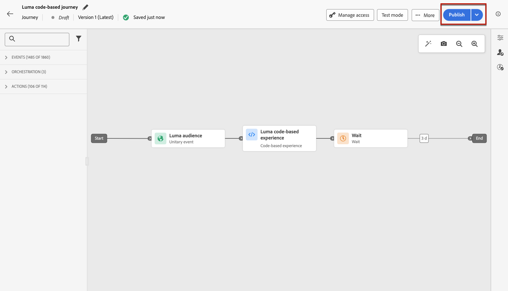
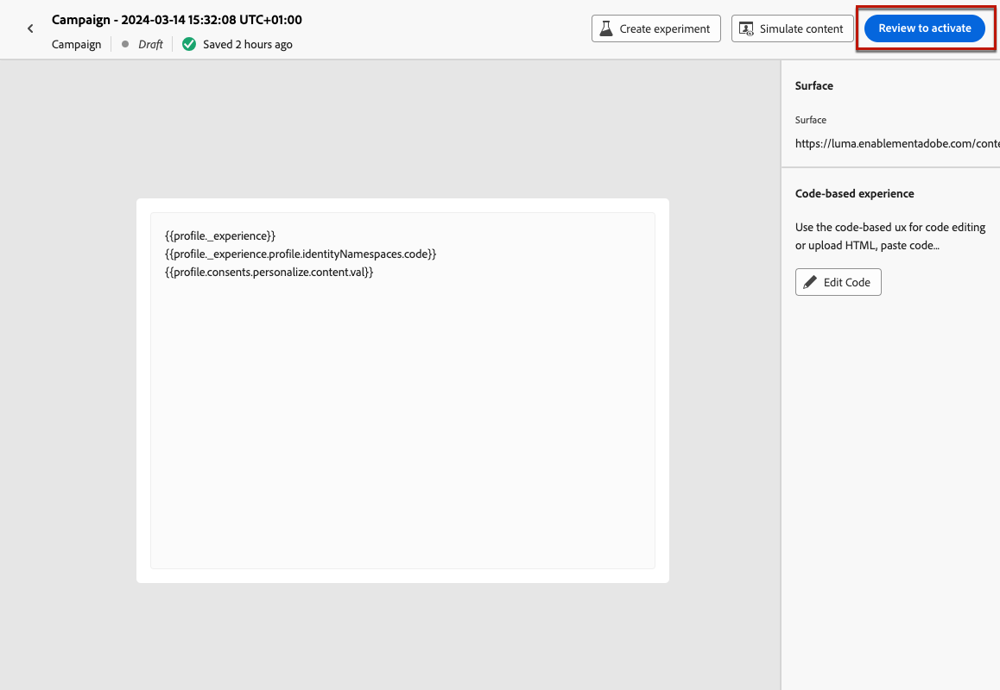
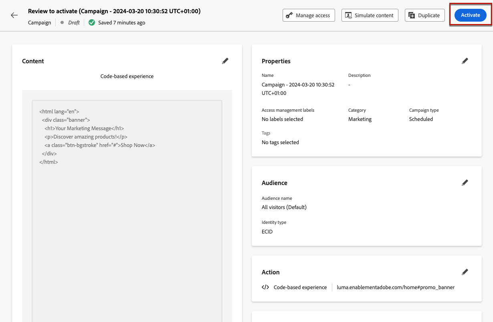
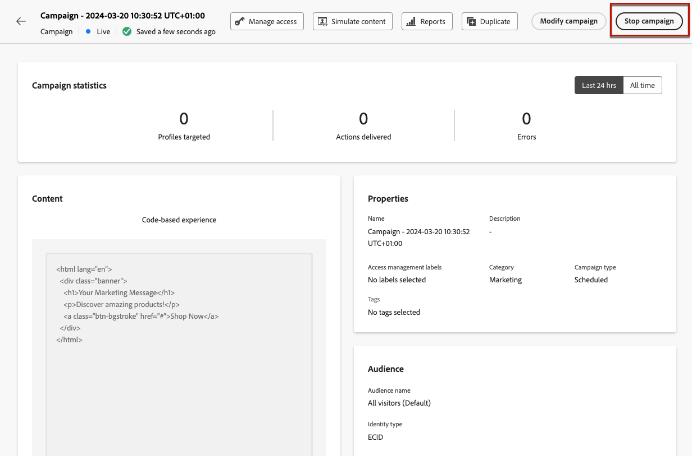
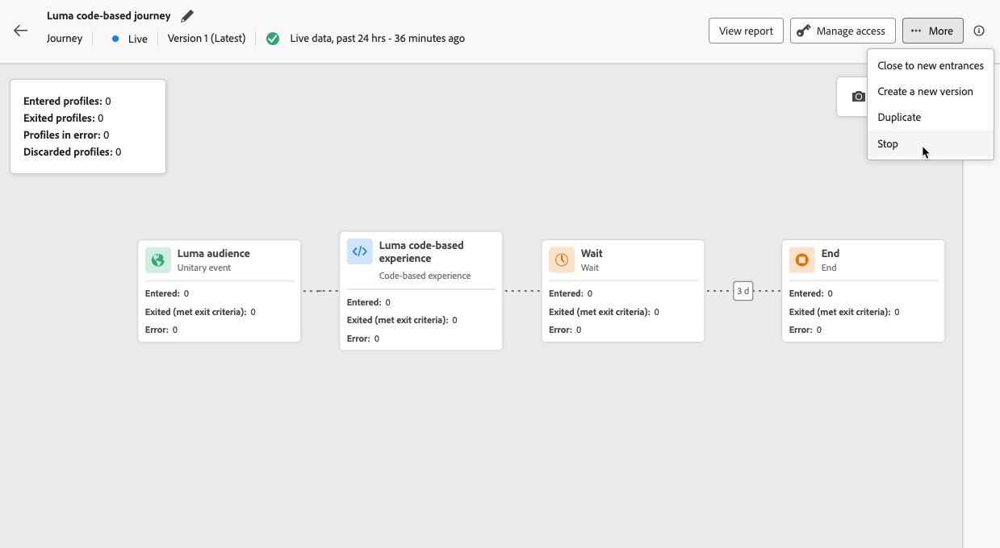

# 管理程式碼型體驗 {#publish-code-based}

## 讓您的程式碼型體驗上線 {#code-based-experience-live}

>[!IMPORTANT]
>
> 如果您的行銷活動受核准原則的約束，您將需要請求核准，才能啟用您的程式碼型體驗。 [了解更多](../test-approve/gs-approval.md)

定義程式碼型體驗並使用[程式碼型編輯器](create-code-based.md#edit-code)視需要編輯內容後，您就可以啟用歷程或行銷活動，讓您的變更對對象可見。

您也可以在讓程式碼型體驗內容上線之前，先預覽該內容。 [了解更多](test-code-based.md)

>[!NOTE]
>
>如果您啟用程式碼型歷程/行銷活動，將影響與另一個已上線的歷程或行銷活動相同的頁面，則所有變更將會套用至您的內容。
>
>如果有多個程式碼型歷程或行銷活動更新內容的相同元素，則會以最高優先順序的歷程/行銷活動優先。 [進一步瞭解優先順序分數](../conflict-prioritization/priority-scores.md)

您的程式碼型歷程或行銷活動上線後，應用程式實作團隊將負責發出明確API或SDK呼叫，以擷取所選[程式碼型體驗設定](code-based-configuration.md)中定義之表面的內容。 在[本節](code-based-implementation-samples.md)中進一步瞭解不同的客戶實作。

### 發佈程式碼型歷程 {#publish-code-based-journey}

若要讓您的程式碼型體驗在歷程中上線，請遵循下列步驟。

1. 確認您的歷程有效且沒有錯誤。 [了解更多](../building-journeys/troubleshooting.md#activity-errors)

1. 在歷程中，選取位於右上角下拉式功能表中的&#x200B;**[!UICONTROL 發佈]**&#x200B;選項。

   

   >[!NOTE]
   >
   >在[本節](../building-journeys/publish-journey.md)中進一步瞭解發佈歷程。

您的程式碼型歷程會採用&#x200B;**[!UICONTROL 即時]**&#x200B;狀態，現在選定對象可看見。 您歷程的每個收件者都能看到您的修改。

>[!NOTE]
>
>按一下&#x200B;**[!UICONTROL 發佈]**&#x200B;之後，最多可能需要15分鐘才能讓變更上線。

### 啟用程式碼型行銷活動 {#activate-code-based-campaign}

1. 從您的程式碼型行銷活動中，選取&#x200B;**[!UICONTROL 檢閱以啟動]**。

   

1. 視需要檢查並編輯內容、屬性、設定、對象和排程。

1. 選取&#x200B;**[!UICONTROL 啟動]**。

   

   >[!NOTE]
   >
   >在[本節](../campaigns/review-activate-campaign.md)中進一步瞭解啟用行銷活動。

您的程式碼型行銷活動會採用&#x200B;**[!UICONTROL 即時]**&#x200B;狀態，且現在對選取的對象可見。 行銷活動的每位收件者都能看到您新增至內容的修改。

>[!NOTE]
>
>按一下[啟動&#x200B;**&#x200B;**]後，最多可能需要15分鐘才能讓您的變更上線。
>
>如果您為程式碼型行銷活動定義排程，在到達開始日期和時間之前，其狀態為&#x200B;**[!UICONTROL 已排程]**。

## 停止程式碼型歷程或行銷活動 {#stop-code-based-experience}

程式碼式體驗上線時，您可以停止該體驗，以防止對象看到您的修改。 請遵循下列步驟。

1. 從個別清單中選取即時歷程或行銷活動。

1. 根據您的情況執行相關動作：

   * 從行銷活動頂端功能表，選取&#x200B;**[!UICONTROL 停止行銷活動]**。

     

   * 從歷程頂端功能表，按一下&#x200B;**[!UICONTROL 更多]**&#x200B;按鈕，然後選取&#x200B;**[!UICONTROL 停止]**。

     

1. 您所定義的對象將看不到您所新增的修改。

>[!NOTE]
>
>一旦程式碼型歷程或行銷活動停止，您就無法再次編輯或啟動它。 您只能複製它並啟動複製的歷程/行銷活動。

<!--Reporting TBC

## Check the code-based experience reports {#check-code-based-reports}

Once your code-based experience is live, you can check the **[!UICONTROL Code-based]** tab of the  [Journey report](../reports/journey-global-report-cja.md#web-cja) and [Campaign report](../reports/campaign-global-report-cja.md#web) to compare elements such as the number of experiences delivered to your audience, and the number of engagements with your content.-->

<!--## Code-based reports

You can access code-based journey or campaign reports from the summary screen.

Global reports display events that occurred at least two hours ago and cover events over a selected time period. In comparison, Live reports focus on events that took place within the past 24 hours, with a minimum time interval of two minutes from the event occurrence.

### Code-based live report {#live-report-code-based}

From your campaign **[!UICONTROL Live report]**, the **[!UICONTROL Code-based experience]** tab details the main information relative to your apps or web pages. [Learn more about live report](../reports/campaign-live-report.md)

+++Learn more about the different metrics and widgets available for the Code-based experience report.

The **[!UICONTROL Code-based experience performance]** KPIs detail the main information relative to your visitors' engagement with your code-based experiences, such as:

* **[!UICONTROL Impressions]**: total number of experiences delivered to all users.

* **[!UICONTROL Interactions]**:  total number of engagements with your app/page. This includes any actions taken by the users, such as clicks or any other interactions.

The **[!UICONTROL Code-based experience summary]** graph shows the evolution of your experiences (impressions, unique impressions and interactions) for the last 24 hours.

TBC: The **[!UICONTROL Interactions by element]** table details the main information relative to your visitors' engagement with the various elements on your app/pages.
+++

### Code-based global report {#global-report-code-based}

Code-based campaign global report can be accessed directly from your journey or campaign with the **[!UICONTROL View report]** button. [Learn more about global report](../reports/campaign-global-report-cja.md)

From your Campaign **[!UICONTROL Global report]**, the **[!UICONTROL Code-based experience]** tab details the main information relative to your apps or web pages.

Add image TBC

+++Learn more about the different metrics and widgets available for the Code-based experience report.

The **[!UICONTROL Code-based experience performance]** KPIs detail the main information relative to your visitors' engagement with your experiences, such as:

* **[!UICONTROL Unique impressions]**: number of unique users to whom the experience was delivered.

* **[!UICONTROL Impressions]**: total number of experiences delivered to all users.

* **[!UICONTROL Interactions]**: percentage of engagements with your app/page. This includes any actions taken by the users, such as clicks or any other interactions.

The **[!UICONTROL Code-based experience summary]** graph shows the evolution of your experiences (unique impressions, impressions and interactions) for the concerned period.

TBC: The **[!UICONTROL Interactions by element]** table details the main information relative to your visitors' engagement with the various elements on your apps/pages.
+++

-->
