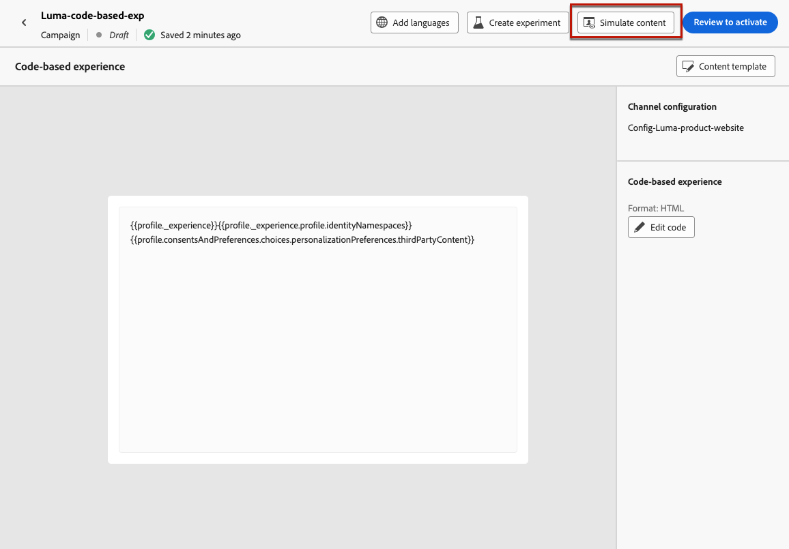
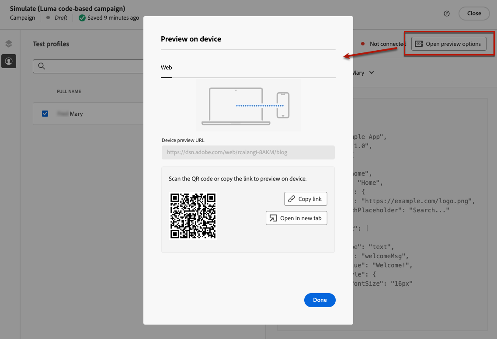
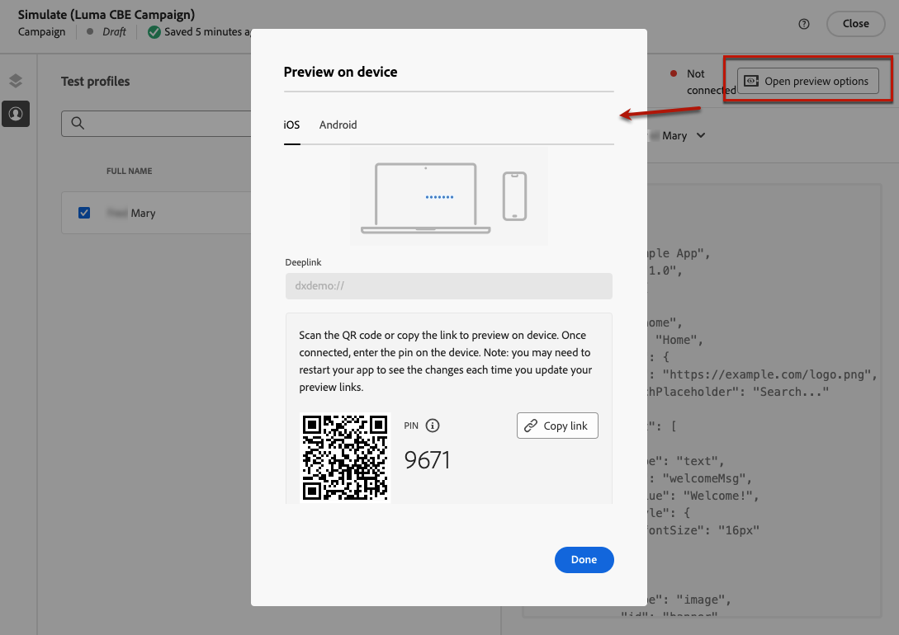
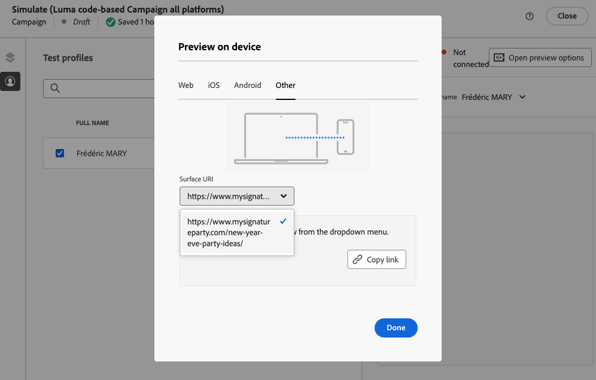
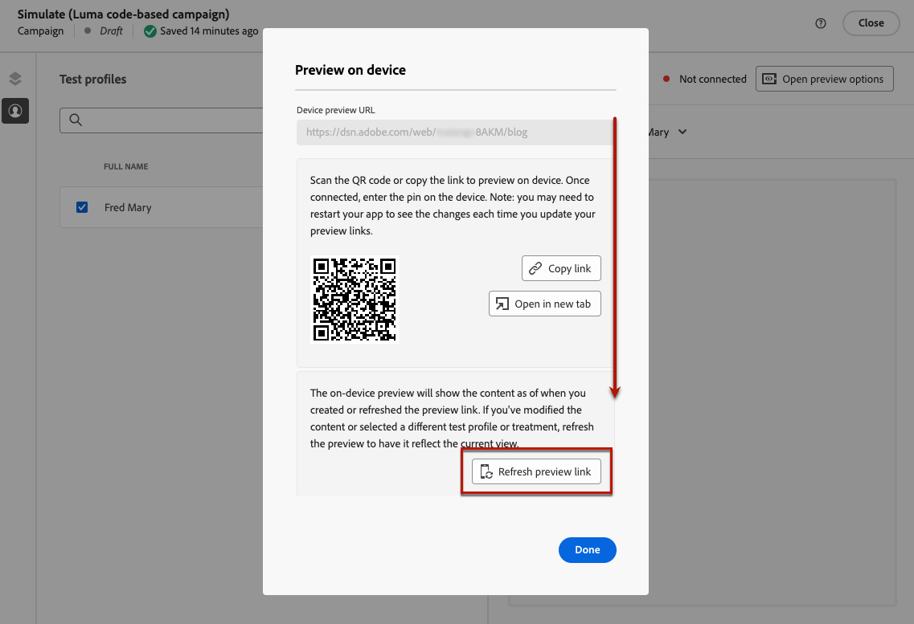

# 測試程式碼型體驗 {#test-code-based}

## 預覽您的基於程式碼的體驗 {#preview-code-based}

>[!CONTEXTUALHELP]
>id="ajo_code_based_preview"
>title="預覽您的基於程式碼的體驗"
>abstract="模擬基於程式碼的體驗。"

若要顯示已修改程式碼型體驗的預覽，請遵循下列步驟。

>[!CAUTION]
>
>您必須有可用的測試設定檔，以模擬將傳送給他們的優惠。 瞭解如何[建立測試設定檔](../audience/creating-test-profiles.md)。

1. 在歷程或行銷活動中，從個人化編輯器或編輯內容畫面選取&#x200B;**[!UICONTROL 模擬內容]**。

   

1. 按一下&#x200B;**[!UICONTROL 管理測試設定檔]**&#x200B;以選取一或多個測試設定檔。

1. 畫面上會顯示已修改程式碼式體驗的預覽。

有關如何選取測試設定檔及預覽內容的詳細資訊，請參閱[本節](../content-management/preview.md)。

>[!NOTE]
>
>目前無法使用[決策](../experience-decisioning/gs-experience-decisioning.md)，從程式碼式體驗行銷活動或歷程的使用者介面模擬內容。 [此區段](../experience-decisioning/create-decision.md#test-and-publish)中有因應措施。

## 在裝置上預覽 {#preview-on-device}

>[!CONTEXTUALHELP]
>id="ajo_code_based_preview_device"
>title="在真實裝置上預覽基於程式碼的體驗"
>abstract="直接在瀏覽器或行動裝置上預覽您的個人化體驗，看看它們在真實裝置上的外觀。"

>[!CONTEXTUALHELP]
>id="ajo_code_based_preview_device_web"
>title="在裝置上預覽基於程式碼的網頁體驗"
>abstract="請掃描 QR 碼或複製連結，在裝置上預覽。"

>[!CONTEXTUALHELP]
>id="ajo_code_based_preview_device_mobile"
>title="在裝置上預覽基於程式碼的行動體驗"
>abstract="請掃描 QR 碼或複製連結，在裝置上預覽。連接後，在裝置上輸入 PIN 碼。每次更新預覽連結時，您可能需要重新啟動應用程式才能看到變更。"

>[!CONTEXTUALHELP]
>id="ajo_code_based_preview_device_refresh"
>title="重新整理預覽連結以反映目前檢視"
>abstract="在裝置上預覽將顯示您建立或重新整理預覽連結時的內容。如果您修改了內容或選取不同的測試設定檔或處理，請重新整理預覽使其反映目前檢視。"

為網頁或行動應用程式建立程式碼型體驗時，您可以直接在瀏覽器或行動裝置上預覽您的個人化體驗，以瞭解這些體驗在真實裝置上的外觀。

>[!WARNING]
>
>使用[決定原則](../experience-decisioning/create-decision.md)或[個人化](../personalization/personalization-build-expressions.md)內容屬性時，裝置上的預覽無法使用。

1. 在&#x200B;**[!UICONTROL 模擬]**&#x200B;畫面中，按一下&#x200B;**[!UICONTROL 開啟預覽選項]**&#x200B;按鈕。 預覽選項視您在[程式碼型組態](code-based-configuration.md#create-code-based-configuration)中選取的平台而定。

1. 如果您在程式碼型組態中使用[Web平台](code-based-configuration.md#web)，**[!UICONTROL 裝置預覽URL]**&#x200B;唯讀欄位會預先填入為目前頻道組態輸入的URL。

   

   您可以：

   * 選取&#x200B;**[!UICONTROL 複製連結]**&#x200B;按鈕，然後將連結貼到瀏覽器索引標籤中。 您也可以與您的團隊和利害關係人共用連結，這些利害關係人可以在變更上線之前，在任何瀏覽器中預覽新體驗。

   * 按一下&#x200B;**[!UICONTROL 在新標籤中開啟]**，以在您目前的瀏覽器中開啟連結。

   * 使用行動裝置掃描二維碼，在行動瀏覽器上開啟預覽連結。

1. 如果您在程式碼型組態中使用[行動平台](code-based-configuration.md#mobile) (iOS / Android)，**[!UICONTROL Deeplink]**&#x200B;唯讀欄位會預先填入在所選平台的頻道組態中輸入的&#x200B;**[!UICONTROL 預覽URL]**&#x200B;值。

   在&#x200B;**[!UICONTROL iOS]**&#x200B;和&#x200B;**[!DNL Android]**&#x200B;標籤之間切換，以預覽您所選平台的體驗。

   

   您可以：

   * 選取&#x200B;**[!UICONTROL 複製連結]**&#x200B;按鈕，並與您的團隊和利害關係人共用連結，他們可以在變更上線之前，在任何行動瀏覽器中預覽新體驗。

   * 使用行動裝置掃描二維碼，以直接在行動應用程式中開啟預覽連結。 您必須在裝置上輸入PIN，才能建立[Assurance](https://experienceleague.adobe.com/en/docs/experience-platform/assurance/tutorials/implement-assurance){target="_blank"}工作階段。

     >[!NOTE]
     >
     >**Adobe Experience Platform Assurance**&#x200B;是Adobe Experience Cloud的產品，可協助您檢查、校樣、模擬及驗證如何在行動應用程式中收集資料或提供體驗。 [了解更多](https://experienceleague.adobe.com/zh-hant/docs/experience-platform/assurance/home){target="_blank"}

1. 如果您在程式碼型組態中使用任何[其他平台](code-based-configuration.md#other)，請從下拉式清單中選擇您要預覽的[表面URI](code-based-surface.md#surface-uri)。

   

   * 選取&#x200B;**[!UICONTROL 複製連結]**&#x200B;按鈕，將連結貼到瀏覽器標籤中，或與您的團隊和利害關係人共用連結。

   * 如果您在設定中新增了數個URI （最多10個），您可以選取其中任何一個URI來預覽。

1. 已針對選取的測試設定檔產生預覽連結，如果您在歷程或行銷活動中使用[內容實驗](../content-management/content-experiment.md)，則會針對選取的處理方式產生預覽連結。

   <!--If you have modified the content or selected a different treatment or test profile, scroll down to the bottom of the **[!UICONTROL Preview on device]** pop-up and click **[!UICONTROL Refresh preview link]** to reflect the current state.

   -->

   <!--When creating a content experiment, you need to select a given treatment and click the **[!UICONTROL Simulate content]** button to obtain the link corresponding to that treatment, then select another treatment, click the **[!UICONTROL Simulate content]** button to obtain a new preview link, and so on.-->

   當更新內容或選取不同的測試設定檔或處理方式時，預覽連結會自動重新整理。 您可以將連結複製到不同的瀏覽器標籤中，並比較體驗。
