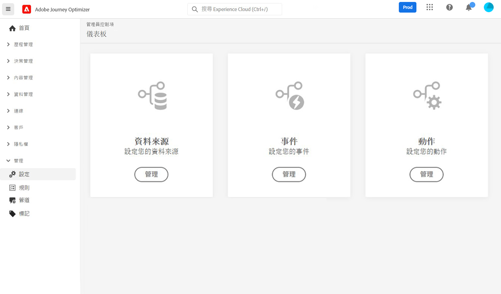

# 開始使用歷程設定 {#configure-journeys}

>[!CONTEXTUALHELP]
>id="ajo_journey_configuration_dashboard"
>title="關於歷程設定"
>abstract="若要傳送包含歷程的訊息，必須設定資料來源、事件和動作。透過資料來源，您可以與系統建立連線並擷取將在歷程中使用 (例如在條件中使用) 的其他資訊。事件在收到事件時會觸發您的歷程。自訂動作協助您連線到第三方系統以傳送訊息。若使用 Journey Optimizer 內建的訊息功能，則無需設定動作。"

若要傳送包含歷程的訊息，必須設定&#x200B;**[!UICONTROL 資料來源]**、**[!UICONTROL 事件]**&#x200B;和&#x200B;**[!UICONTROL 動作]**。 透過資料來源，您可以與系統建立連線並擷取將在歷程中使用 (例如在條件中使用) 的其他資訊。事件在收到事件時會觸發您的歷程。自訂動作協助您連線到第三方系統以傳送訊息。若使用 Journey Optimizer 內建的訊息功能，則無需設定動作。

您也可以透過自訂資料來源和自訂動作來設定與外部系統的連線。 舉例來說，這可讓您利用來自外部訂房系統的資料，豐富您的歷程，或是使用Epsilon或Facebook等協力廠商系統傳送訊息。 瞭解如何[將Journey Optimizer與外部系統整合](external-systems.md)。

## 資料來源 {#data-sources}

資料Source設定可讓您定義系統連線，以擷取將用於歷程的其他資訊。 [了解更多](../../using/datasource/about-data-sources.md)

## 活動 {#events}

事件可讓您一直觸發歷程，以即時傳送訊息給流入歷程的個人。

在事件設定中，您會設定歷程中預期的事件。 會依照Adobe Experience Data Model (XDM)，對傳入事件的資料進行標準化。 事件來自串流擷取 API，適用於驗證和未驗證的事件 (例如 Adobe Mobile SDK 事件)。[了解更多](../../using/event/about-events.md)

## 動作 {#actions}

Journey Optimizer訊息功能內建：您只需要將頻道動作活動新增到歷程中。 如果您使用協力廠商系統來傳送訊息，則可建立自訂動作。 [了解更多](../../using/action/action.md)

## 瀏覽Adobe Experience Platform欄位 {#friendly-names-display}

定義[事件有效負載](../event/about-creating.md#define-the-payload-fields)、[欄位群組有效負載](../datasource/configure-data-sources.md#define-field-groups)，以及在[運算式編輯器](../building-journeys/expression/expressionadvanced.md)中選取欄位時，除了欄位名稱外，還會顯示顯示名稱。此資訊會從「Experience 資料模型」的結構定義中擷取。

如果在設定結構時提供了&quot;xdm:alternateDisplayInfo&quot;之類的描述元，則好記的名稱會取代顯示名稱。 它在使用「eVars」和一般欄位時特別有用。 您可以透過 API 呼叫來設定好記名稱描述因子。 如需詳細資訊，請參閱 [Schema Registry 開發人員指南](https://experienceleague.adobe.com/docs/experience-platform/xdm/api/getting-started.html?lang=zh-Hant){target="_blank"}。

如果有好記的名稱，欄位便會顯示為`<friendly-name>(<name>)`。如果沒有好記的名稱，則會顯示顯示名稱`<display-name>(<name>)`。如果未定義這些欄位，則只會顯示欄位的技術名稱 `<name>`。

>[!NOTE]
>
>從結合結構選取欄位時並不會擷取好記名稱。
