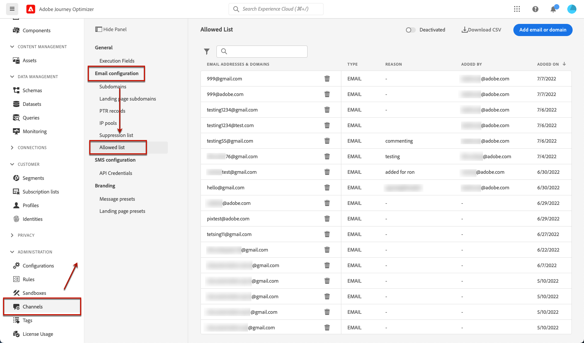
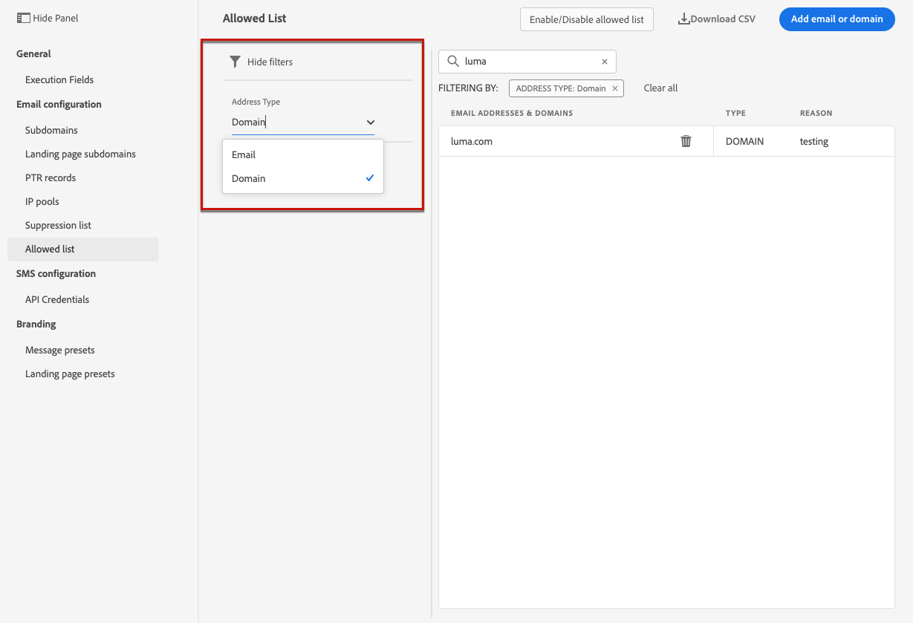

# 設定允許清單 {#allow-list}

允許清單是可在[沙箱](../administration/sandboxes.md)層級定義的傳送安全清單。 它會限制傳送至特定地址或網域的電子郵件，以確保只有明確列出的收件者才能接收來自指定沙箱的訊息。

>[!CAUTION]
>
>此功能僅適用於電子郵件頻道。 它可用於生產和非生產沙箱。

在非生產沙箱上，如果可能會發生意外傳送，允許清單會防止不需要的訊息送達真實的客戶地址，提供用於測試用途的安全環境。

當允許清單為作用中但空白時，不會傳送電子郵件。 這使其成為有用的緊急制動：如果發生嚴重問題，您可以啟動空白的允許清單以停止來自[!DNL Journey Optimizer]的所有傳出通訊，直到問題解決為止。 深入瞭解[允許清單邏輯](#logic)。

您也可以使用Journey Optimizer **隱藏REST API**，透過隱藏和允許清單以程式設計方式管理外寄訊息。 [了解如何使用 Suppression REST API](https://developer.adobe.com/journey-optimizer-apis/references/suppression){target="_blank"}

## 存取允許清單 {#access-allowed-list}

若要存取允許的電子郵件地址和網域的詳細清單，請移至&#x200B;**[!UICONTROL 管理]** > **[!UICONTROL 管道]** > **[!UICONTROL 電子郵件設定]**，然後選取&#x200B;**[!UICONTROL 允許清單]**。



>[!CAUTION]
>
>檢視、匯出及管理允許清單的許可權限製為[歷程管理員](../administration/ootb-product-profiles.md#journey-administrator)。 在[本節](../administration/permissions-overview.md)中進一步瞭解如何管理[!DNL Journey Optimizer]使用者的存取權。

若要將允許清單匯出為CSV檔案，請選取&#x200B;**[!UICONTROL 下載CSV]**&#x200B;按鈕。

使用&#x200B;**[!UICONTROL 刪除]**&#x200B;按鈕永久移除專案。

您可以搜尋電子郵件地址或網域，並篩選&#x200B;**[!UICONTROL 位址型別]**。 選取後，您可以清除顯示在清單頂端的篩選器。



## 啟用允許清單 {#enable-allow-list}

若要啟用允許清單，請遵循下列步驟。

1. 存取&#x200B;**[!UICONTROL 管道]** > **[!UICONTROL 電子郵件設定]** > **[!UICONTROL 允許清單]**&#x200B;功能表。

1. 選取切換按鈕。

   

1. 選取&#x200B;**[!UICONTROL 啟用允許清單]**。 允許清單現在已啟用。

   

   >[!NOTE]
   >
   >* 啟用後，允許清單在歷程和行銷活動中生效之前會延遲10分鐘。 允許清單和隱藏清單的更新最多可能需要10分鐘的時間才會反映。
   >* 啟用時，允許清單不僅會在即時歷程中強制執行，也會在測試訊息時強制執行，其中包含[校樣](../content-management/proofs.md)以及在[測試模式](../building-journeys/testing-the-journey.md)中的歷程。

當功能作用中時，會套用允許清單邏輯。 請參閱[此章節](#logic)深入瞭解。

## 停用允許清單 {#deactivate-allow-list}

若要停用允許清單，請遵循下列步驟。

1. 存取&#x200B;**[!UICONTROL 管道]** > **[!UICONTROL 電子郵件設定]** > **[!UICONTROL 允許清單]**&#x200B;功能表。

1. 選取切換按鈕。

   

1. 選取&#x200B;**[!UICONTROL 停用允許清單]**。 允許清單不再有效。

   

   >[!NOTE]
   >
   >停用允許清單後，有10分鐘的延遲，才會在您的歷程和行銷活動中生效。 同樣地，允許清單和隱藏清單的更新最多可能需要10分鐘的時間才會反映。

停用功能時，不會套用允許清單邏輯。 請參閱[此章節](#logic)深入瞭解。

## Add entities to the allowed list {#add-entities}

To add new email addresses or domains to the allowed list for a specific sandbox, you can either [manually populate the list](#manually-populate-list), or use an [API call](#api-call-allowed-list).

>[!NOTE]
>
>The allowed list can contain up to 1,000 entries.

### 手動填入允許清單 {#manually-populate-list}

>[!CONTEXTUALHELP]
>id="ajo_admin_allowed_list_add_header"
>title="將地址或網域新增到允許清單"
>abstract="您可以透過逐一選取來手動將新的電子郵件地址或網域新增到允許清單中。"

>[!CONTEXTUALHELP]
>id="ajo_admin_allowed_list_add"
>title="將地址或網域新增到允許清單"
>abstract="您可以透過逐一選取來手動將新的電子郵件地址或網域新增到允許清單中。"

You can manually populate the [!DNL Journey Optimizer] allowed list by adding an email address or a domain through the user interface.

>[!NOTE]
>
>You can only add one email address or domain at a time.

請依照下列步驟以執行此操作。

1. Select the **[!UICONTROL Add email or domain]** button.

   

1. 選擇地址類型：**[!UICONTROL 電子郵件地址]**&#x200B;或&#x200B;**[!UICONTROL 網域地址]**。

1. Enter the email address or domain you want to send emails to.

   >[!NOTE]
   >
   >確定輸入有效的電子郵件地址 (例如 abc@company.com) 或網域 (例如 abc.company.com)。

1. 如果需要，請指定原因。

   

   >[!NOTE]
   >
   >All ASCII characters in the range 32 to 126 are allowed in the **[!UICONTROL Reason]** field. 例如，完整清單可在[此頁面](https://en.wikipedia.org/wiki/ASCII#Printable_characters){target="_blank"}中找到。

1. 按一下&#x200B;**[!UICONTROL 提交]**。

### Add entities using an API call {#api-call-allowed-list}

To populate the allowed list, you can also call the suppression API with the `ALLOWED` value for the `listType` attribute. 例如：


You can perform the **Add**, **Delete** and **Get** operations.

Learn more about making API calls in the [Adobe Experience Platform APIs](https://experienceleague.adobe.com/docs/experience-platform/landing/platform-apis/api-guide.html){target="_blank"} reference documentation.

## Download the allowed list {#download-allowed-list}

To export the allowed list as a CSV file, follow the steps below:

1. Select the **[!UICONTROL Download CSV]** button.

   

1. Wait until the file is generated.

   

   >[!NOTE]
   >
   >Download time depends on the file size, meaning the number of addresses that are on the allowed list.
   >
   >One download request can be processed at a time for a given sandbox.

1. Once the file is generated, you receive a notification. Click the bell icon on top right of the screen to display it.

1. 按一下通知本身以下載檔案。

   

   >[!NOTE]
   >
   >連結的有效期限為24小時。

## 允許清單邏輯 {#logic}

>[!CONTEXTUALHELP]
>id="ajo_admin_allowed_list_logic"
>title="管理允許清單"
>abstract="啟動允許清單後，只有包含在允許清單中的收件者才能接收來自此沙箱的電子郵件訊息。 停用時，所有收件者都會收到電子郵件。"

當允許清單為[作用中](#enable-allow-list)時，將套用下列邏輯：

* 如果允許清單為&#x200B;**empty**，將不會傳送任何電子郵件。

* 如果實體是允許清單&#x200B;**上的**，而不是隱藏清單上的，則會傳送電子郵件給對應的收件者。 但是，如果實體也在[隱藏清單](../reports/suppression-list.md)上，則對應的收件者將不會收到電子郵件，原因為&#x200B;**[!UICONTROL 隱藏]**。

* 如果實體不在允許清單&#x200B;**上（不在隱藏清單上），則對應的收件者將不會收到電子郵件，原因為**[!UICONTROL &#x200B;不允許&#x200B;]**。**

>[!NOTE]
>
>訊息傳送程式會排除狀態為&#x200B;**[!UICONTROL 不允許]**&#x200B;的設定檔。 因此，雖然&#x200B;**歷程報告**&#x200B;會顯示這些設定檔已移動歷程（[讀取對象](../building-journeys/read-audience.md)和[訊息活動](../building-journeys/journey-action.md)），但&#x200B;**電子郵件報告**&#x200B;不會將它們納入&#x200B;**[!UICONTROL 已傳送]**&#x200B;量度中，因為這些設定檔在電子郵件傳送前已篩選掉。
>
>深入瞭解[即時報告](../reports/live-report.md)和[Customer Journey Analytics報告](../reports/report-gs-cja.md)。

當允許清單為[已停用](#deactivate-allow-list)時，您從目前沙箱傳送的所有電子郵件都會傳送給所有收件者（前提是這些電子郵件不在隱藏清單中），包括真實的客戶地址。

## 排除報告 {#reporting}

當允許清單作用中時，您可以擷取由於不在允許清單中而未從傳送中的電子郵件地址或網域。 若要這麼做，您可以使用[Adobe Experience Platform查詢服務](https://experienceleague.adobe.com/docs/experience-platform/query/api/getting-started.html){target="_blank"}進行下列API呼叫。

若要取得由於收件者不在允許清單中而未傳送的&#x200B;**封電子郵件數目**，請使用下列查詢：

```sql
SELECT count(distinct _id) from cjm_message_feedback_event_dataset WHERE
_experience.customerJourneyManagement.messageExecution.messageExecutionID = '<MESSAGE_EXECUTION_ID>' AND
_experience.customerJourneyManagement.messageDeliveryfeedback.feedbackStatus = 'exclude' AND
_experience.customerJourneyManagement.messageDeliveryfeedback.messageExclusion.reason = 'EmailNotAllowed'
```

若要取得因收件者不在允許清單中而未傳送的&#x200B;**電子郵件地址**&#x200B;清單，請使用下列查詢：

```sql
SELECT distinct(_experience.customerJourneyManagement.emailChannelContext.address) from cjm_message_feedback_event_dataset WHERE
_experience.customerJourneyManagement.messageExecution.messageExecutionID IS NOT NULL AND
_experience.customerJourneyManagement.messageDeliveryfeedback.feedbackStatus = 'exclude' AND
_experience.customerJourneyManagement.messageDeliveryfeedback.messageExclusion.reason = 'EmailNotAllowed'
```
