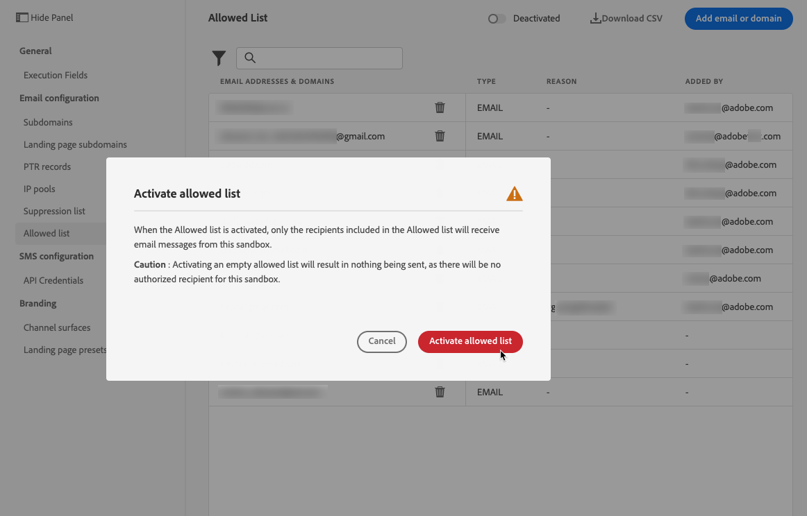

# 允許清單 {#allow-list}

可以在 [沙坑](../administration/sandboxes.md) 級別，以便有安全的環境用於測試。

例如，在非生產實例中，如果出現錯誤，則允許清單可確保您沒有向客戶發送不需要的消息的風險。

>[!NOTE]
>
>此功能可用於生產和非生產砂箱。

允許的清單允許您指定單個電子郵件地址或域，這些地址或域將是唯一有權接收您從特定沙箱發送的電子郵件的收件人或域。 這可以防止您在測試環境中意外地將電子郵件發送到真實的客戶地址。

>[!CAUTION]
>
>此功能僅適用於電子郵件通道。

## 訪問允許的清單 {#access-allowed-list}

要訪問允許的電子郵件地址和域的詳細清單，請轉到 **[!UICONTROL Administration]** > **[!UICONTROL Channels]** > **[!UICONTROL Email configuration]**，然後選擇 **[!UICONTROL Allowed list]**。


>[!CAUTION]
>
>查看、導出和管理允許清單的權限限制為 [旅程管理員](../administration/ootb-product-profiles.md#journey-administrator)。 瞭解有關管理的更多資訊 [!DNL Journey Optimizer] 用戶在 [此部分](../administration/permissions-overview.md)。

要將允許的清單導出為CSV檔案，請選擇 **[!UICONTROL Download CSV]** 按鈕

使用 **[!UICONTROL Delete]** 按鈕，將選定控制項在Tab鍵次序中下移一個位置。

您可以搜索電子郵件地址或域，並在 **[!UICONTROL Address type]**。 選中後，可清除清單頂部顯示的過濾器。


## 啟用允許的清單 {#enable-allow-list}

要啟用允許的清單，請執行以下步驟。

1. 存取 **[!UICONTROL Channels]** > **[!UICONTROL Email configuration]** > **[!UICONTROL Allow list]** 功能表。

1. 按一下「**[!UICONTROL Enable/Disable allowed list]**」。

   

1. 選擇「**[!UICONTROL Enable allowed list]**」。

   

1. 按一下「**[!UICONTROL Save]**」。已啟用允許的清單。

啟用功能時，將應用允許的清單邏輯。 請參閱[此章節](#logic)深入瞭解。

>[!NOTE]
>
>啟用後，在執行行程時，以及在使用測試消息時，都會遵守允許的清單功能 [證明](../design/preview.md#send-proofs) 並測試旅程 [test模式](../building-journeys/testing-the-journey.md)。

## 將實體添加到允許的清單 {#add-entities}

要將新電子郵件地址或域添加到特定沙盒的允許清單中，您可以 [手動填充清單](#manually-populate-list)，或使用 [API調用](#api-call-allowed-list)。

>[!NOTE]
>
>允許的清單最多可包含1,000個條目。

### 手動填充允許的清單 {#manually-populate-list}

>[!CONTEXTUALHELP]
>id="ajo_admin_allowed_list_add"
>title="將地址或域添加到允許的清單"
>abstract="您可以通過逐個選擇新電子郵件地址或域，將其手動添加到允許清單中。"

您可以手動填充 [!DNL Journey Optimizer] 通過用戶介面添加電子郵件地址或域允許的清單。

>[!NOTE]
>
>一次只能添加一個電子郵件地址或域。

請依照下列步驟以執行此操作。

1. 選取 **[!UICONTROL Add email or domain]** 按鈕。

   

1. 選擇地址類型： **[!UICONTROL Email address]** 或 **[!UICONTROL Domain address]**。

1. 輸入要向其發送電子郵件的電子郵件地址或域。

   >[!NOTE]
   >
   >請確保輸入有效的電子郵件地址(如abc@company.com)或域（如abc.company.com）。

1. 根據需要指定原因。

   

   >[!NOTE]
   >
   >中允許包含32到126之間的所有ASCII字元 **[!UICONTROL Reason]** 的子菜單。 完整清單可在 [此頁](https://en.wikipedia.org/wiki/Wikipedia:ASCII#ASCII_printable_characters)例如{target=&quot;_blank&quot;}。

1. 按一下「**[!UICONTROL Submit]**」。

### 使用API調用添加實體 {#api-call-allowed-list}

要填充允許的清單，還可以使用 `ALLOWED` 值 `listType` 屬性。 例如：


您可以執行 **添加**。 **刪除** 和 **獲取** 操作。

瞭解有關在中進行API調用的詳細資訊 [Adobe Experience PlatformAPI](https://experienceleague.adobe.com/docs/experience-platform/landing/platform-apis/api-guide.html){target=&quot;_blank&quot;}參考文檔。

## 允許的清單邏輯 {#logic}

當允許清單為 [啟用](#enable-allow-list)，應用以下邏輯：

* 如果允許的清單為 **空**，不會發送電子郵件。

* 如果實體為 **在允許的清單上**，而不是在取消清單中，可以將電子郵件發送給相應的收件人。 但是，如果實體 [隱藏清單](../reports/suppression-list.md)，相應的收件人將不會收到電子郵件，原因是 **[!UICONTROL Suppressed]**。

* 如果實體為 **不在允許的清單中** （且不在禁止清單上），相應收件人將不會接收電子郵件，原因是 **[!UICONTROL Not allowed]**。

>[!NOTE]
>
>配置檔案 **[!UICONTROL Not allowed]** 在消息發送過程中，狀態被排除。 因此，當 **行程報告** 將顯示這些配置檔案在旅途中移動([讀取段](../building-journeys/read-segment.md) 和 [消息活動](../building-journeys/journeys-message.md)) **電子郵件報告** 不會把它們包括在 **[!UICONTROL Sent]** 在發送電子郵件之前過濾掉度量。
>
>瞭解 [即時報告](../reports/live-report.md) 和 [全局報告](../reports/global-report.md)。

## 排除報告 {#reporting}

在非生產沙箱上啟用此功能後，可以檢索從發送中排除的電子郵件地址或域，因為這些地址或域不在允許的清單中。 要執行此操作，可使用 [Adobe Experience Platform查詢服務](https://experienceleague.adobe.com/docs/experience-platform/query/api/getting-started.html){target=&quot;_blank&quot;}，以在下面調用API。

獲取 **電子郵件數** 由於收件人不在允許清單中而未發送的，請使用以下查詢：

```sql
SELECT count(distinct _id) from cjm_message_feedback_event_dataset WHERE
_experience.customerJourneyManagement.messageExecution.messageExecutionID = '<MESSAGE_EXECUTION_ID>' AND
_experience.customerJourneyManagement.messageDeliveryfeedback.feedbackStatus = 'exclude' AND
_experience.customerJourneyManagement.messageDeliveryfeedback.messageExclusion.reason = 'EmailNotAllowed'
```

獲取 **電子郵件地址清單** 由於收件人不在允許清單中而未發送的，請使用以下查詢：

```sql
SELECT distinct(_experience.customerJourneyManagement.emailChannelContext.address) from cjm_message_feedback_event_dataset WHERE
_experience.customerJourneyManagement.messageExecution.messageExecutionID IS NOT NULL AND
_experience.customerJourneyManagement.messageDeliveryfeedback.feedbackStatus = 'exclude' AND
_experience.customerJourneyManagement.messageDeliveryfeedback.messageExclusion.reason = 'EmailNotAllowed'
```
