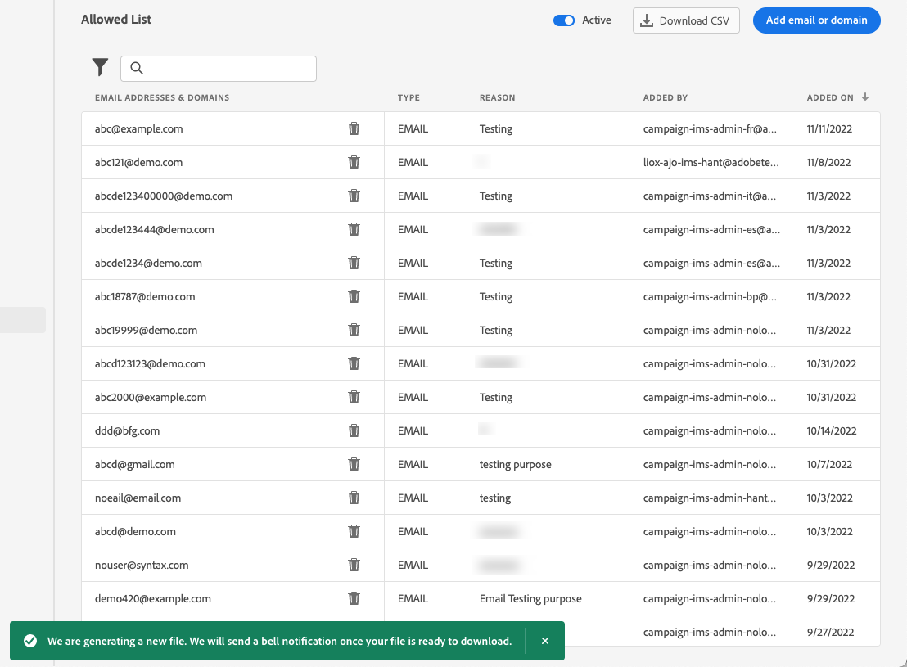

# 設定允許清單 {#allow-list}

可以在[沙箱](../administration/sandboxes.md)層級定義特定的安全傳送清單。

此允許清單可讓您指定個別電子郵件地址或網域，這些地址或網域將是唯一獲授權接收您從特定沙箱傳送之電子郵件的收件者或網域。

>[!CAUTION]
>
>此功能僅適用於電子郵件頻道。 它可用於生產和非生產沙箱。

例如，在可能發生錯誤的非生產執行個體上，允許清單可確保避免您將不需要的訊息傳送至真實客戶地址的風險，因此會提供安全的環境用於測試。

此外，當允許清單為作用中但空白時，將不會傳出任何郵件。 因此，如果您遇到一些重大問題，可以使用此功能停止來自[!DNL Journey Optimizer]的所有傳出通訊，直到您修正問題為止。 深入瞭解[允許清單邏輯](#logic)。

此外，您也可以利用 Journey Optimizer **Suppression REST API**，使用禁止名單與允許清單控制外寄郵件。 [了解如何使用 Suppression REST API](https://developer.adobe.com/journey-optimizer-apis/references/suppression/){target="_blank"}

## 存取允許清單 {#access-allowed-list}

若要存取允許的電子郵件地址和網域的詳細清單，請移至&#x200B;**[!UICONTROL 管理]** > **[!UICONTROL 管道]** > **[!UICONTROL 電子郵件設定]**，然後選取&#x200B;**[!UICONTROL 允許清單]**。


>[!CAUTION]
>
>檢視、匯出及管理允許清單的許可權限製為[歷程管理員](../administration/ootb-product-profiles.md#journey-administrator)。 在[!DNL Journey Optimizer]本節[中進一步瞭解如何管理](../administration/permissions-overview.md)使用者的存取權。

若要將允許清單匯出為CSV檔案，請選取&#x200B;**[!UICONTROL 下載CSV]**&#x200B;按鈕。

使用&#x200B;**[!UICONTROL 刪除]**&#x200B;按鈕永久移除專案。

您可以搜尋電子郵件地址或網域，並篩選&#x200B;**[!UICONTROL 位址型別]**。 選取後，您可以清除顯示在清單頂端的篩選器。


## 啟用允許清單 {#enable-allow-list}

若要啟用允許清單，請遵循下列步驟。

1. 存取&#x200B;**[!UICONTROL 管道]** > **[!UICONTROL 電子郵件設定]** > **[!UICONTROL 允許清單]**&#x200B;功能表。

1. 選取切換按鈕。

   

1. 選取&#x200B;**[!UICONTROL 啟用允許清單]**。 允許清單現在已啟用。

   

   >[!NOTE]
   >
   >啟用允許清單後，有10分鐘的延遲，才會在您的歷程和行銷活動中生效。 同樣地，允許清單和隱藏清單的更新最多可能需要10分鐘的時間才會反映。

當功能作用中時，會套用允許清單邏輯。 請參閱[此章節](#logic)深入瞭解。

>[!NOTE]
>
>啟用時，允許清單功能在執行歷程時執行，但也會在測試包含[校訂](../content-management/proofs.md)的訊息以及使用[測試模式](../building-journeys/testing-the-journey.md)測試歷程時執行。

## 停用允許清單 {#deactivate-allow-list}

若要停用允許清單，請遵循下列步驟。

1. 存取&#x200B;**[!UICONTROL 管道]** > **[!UICONTROL 電子郵件設定]** > **[!UICONTROL 允許清單]**&#x200B;功能表。

1. 選取切換按鈕。

   

1. 選取&#x200B;**[!UICONTROL 停用允許清單]**。 允許清單不再有效。

   

   >[!NOTE]
   >
   >停用允許清單後，有10分鐘的延遲，才會在您的歷程和行銷活動中生效。 同樣地，允許清單和隱藏清單的更新最多可能需要10分鐘的時間才會反映。

停用功能時，不會套用允許清單邏輯。 請參閱[此章節](#logic)深入瞭解。

## 將實體新增至允許清單 {#add-entities}

若要新增電子郵件地址或網域至特定沙箱的允許清單，您可以[手動填入清單](#manually-populate-list)，或使用[API呼叫](#api-call-allowed-list)。

>[!NOTE]
>
>允許清單最多可包含1,000個專案。

### 手動填入允許清單 {#manually-populate-list}

>[!CONTEXTUALHELP]
>id="ajo_admin_allowed_list_add_header"
>title="將地址或網域新增到允許清單"
>abstract="您可以透過逐一選取來手動將新的電子郵件地址或網域新增到允許清單中。"

>[!CONTEXTUALHELP]
>id="ajo_admin_allowed_list_add"
>title="將地址或網域新增到允許清單"
>abstract="您可以透過逐一選取來手動將新的電子郵件地址或網域新增到允許清單中。"

您可以透過使用者介面新增電子郵件地址或網域，以手動填入[!DNL Journey Optimizer]允許清單。

>[!NOTE]
>
>您一次只能新增一個電子郵件地址或網域。

請依照下列步驟以執行此操作。

1. 選取&#x200B;**[!UICONTROL 新增電子郵件或網域]**&#x200B;按鈕。

   

1. 選擇地址類型：**[!UICONTROL 電子郵件地址]**&#x200B;或&#x200B;**[!UICONTROL 網域地址]**。

1. 輸入您要傳送電子郵件的電子郵件地址或網域。

   >[!NOTE]
   >
   >確定輸入有效的電子郵件地址 (例如 abc@company.com) 或網域 (例如 abc.company.com)。

1. 如果需要，請指定原因。

   

   >[!NOTE]
   >
   >在&#x200B;**[!UICONTROL 原因]**&#x200B;欄位中允許包含32到126之間的所有ASCII字元。 例如，完整清單可在[此頁面](https://en.wikipedia.org/wiki/ASCII#Printable_characters){target="_blank"}中找到。

1. 按一下&#x200B;**[!UICONTROL 提交]**。

### 使用API呼叫新增實體 {#api-call-allowed-list}

若要填入允許清單，您也可以使用`ALLOWED`屬性的`listType`值呼叫隱藏API。 例如：


您可以執行&#x200B;**新增**、**刪除**&#x200B;和&#x200B;**取得**&#x200B;作業。

在[Adobe Experience Platform API](https://experienceleague.adobe.com/docs/experience-platform/landing/platform-apis/api-guide.html?lang=zh-Hant){target="_blank"}參考檔案中進一步瞭解如何進行API呼叫。

## 下載允許清單 {#download-allowed-list}

若要將允許清單匯出為CSV檔案，請執行以下步驟：

1. 選取&#x200B;**[!UICONTROL 下載CSV]**&#x200B;按鈕。

   

1. 等候檔案產生。

   

   >[!NOTE]
   >
   >下載時間取決於檔案大小，亦即允許清單中的位址數量。
   >
   >對於指定的沙箱，一次可處理一個下載請求。

1. 檔案產生後，您會收到通知。 按一下畫面右上方的鈴鐺圖示即可顯示。

1. 按一下通知本身以下載檔案。

   

   >[!NOTE]
   >
   >連結的有效期限為24小時。

## 允許清單邏輯 {#logic}

>[!CONTEXTUALHELP]
>id="ajo_admin_allowed_list_logic"
>title="管理允許清單"
>abstract="啟動允許清單後，只有包含在允許清單中的收件者才能接收來自此沙箱的電子郵件訊息。停用時，所有收件者都會收到電子郵件。"

當允許清單為[作用中](#enable-allow-list)時，將套用下列邏輯：

* 如果允許清單為&#x200B;**empty**，將不會傳送任何電子郵件。

* 如果實體是允許清單&#x200B;**上的**，而不是隱藏清單上的，則會傳送電子郵件給對應的收件者。 但是，如果實體也在[隱藏清單](../reports/suppression-list.md)上，則對應的收件者將不會收到電子郵件，原因為&#x200B;**[!UICONTROL 隱藏]**。

* 如果實體不在允許清單&#x200B;**上（不在隱藏清單上），則對應的收件者將不會收到電子郵件，原因為**&#x200B;不允許&#x200B;**[!UICONTROL 。]**

>[!NOTE]
>
>訊息傳送程式會排除狀態為&#x200B;**[!UICONTROL 不允許]**&#x200B;的設定檔。 因此，雖然&#x200B;**歷程報告**&#x200B;會顯示這些設定檔已移動歷程（[讀取對象](../building-journeys/read-audience.md)和[訊息活動](../building-journeys/journeys-message.md)），但&#x200B;**電子郵件報告**&#x200B;不會將它們納入&#x200B;**[!UICONTROL 已傳送]**&#x200B;量度中，因為這些設定檔在電子郵件傳送前已篩選掉。
>
>深入瞭解[即時報告](../reports/live-report.md)和[Customer Journey Analytics報告](../reports/report-gs-cja.md)。

當允許清單為[已停用](#deactivate-allow-list)時，您從目前沙箱傳送的所有電子郵件都會傳送給所有收件者（前提是這些電子郵件不在隱藏清單中），包括真實的客戶地址。

## 排除報告 {#reporting}

當允許清單作用中時，您可以擷取由於不在允許清單中而未從傳送中的電子郵件地址或網域。 若要這麼做，您可以使用[Adobe Experience Platform查詢服務](https://experienceleague.adobe.com/docs/experience-platform/query/api/getting-started.html?lang=zh-Hant){target="_blank"}進行下列API呼叫。

若要取得由於收件者不在允許清單中而未傳送的&#x200B;**封電子郵件數目**，請使用下列查詢：

```sql
SELECT count(distinct _id) from cjm_message_feedback_event_dataset WHERE
_experience.customerJourneyManagement.messageExecution.messageExecutionID = '<MESSAGE_EXECUTION_ID>' AND
_experience.customerJourneyManagement.messageDeliveryfeedback.feedbackStatus = 'exclude' AND
_experience.customerJourneyManagement.messageDeliveryfeedback.messageExclusion.reason = 'EmailNotAllowed'
```

若要取得因收件者不在允許清單中而未傳送的&#x200B;**電子郵件地址**&#x200B;清單，請使用下列查詢：

```sql
SELECT distinct(_experience.customerJourneyManagement.emailChannelContext.address) from cjm_message_feedback_event_dataset WHERE
_experience.customerJourneyManagement.messageExecution.messageExecutionID IS NOT NULL AND
_experience.customerJourneyManagement.messageDeliveryfeedback.feedbackStatus = 'exclude' AND
_experience.customerJourneyManagement.messageDeliveryfeedback.messageExclusion.reason = 'EmailNotAllowed'
```
