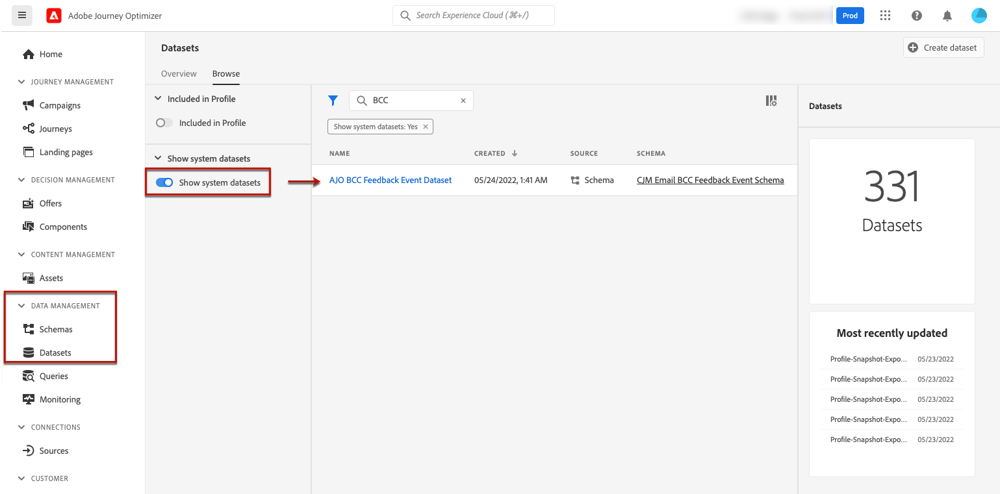

# 支援封存 {#archiving-support}

## 如何封存訊息 {#about-archiving}

HIPAA等法規要求 [!DNL Journey Optimizer] 應提供封存傳送給個人之訊息的方式。 事實上，如果您的客戶提出索賠，他們應該能夠獲得發送的郵件的副本以用於驗證目的。

* 對於電子郵件通道， [!DNL Journey Optimizer] 提供內建的密件副本電子郵件功能。 [了解更多](#bcc-email)

* 此外，對於所有管道，您可以在 **實體資料集**，包含非個人化訊息範本的詳細資訊。 使用此欄位匯出資料集以儲存中繼資料，例如：誰發送了資訊，誰和何時發送。 請注意，不會匯出個人化資料 — 只會考慮範本（訊息的格式和結構）。 [了解更多](../start/datasets-query-examples.md#entity-dataset)

>[!NOTE]
>
>[!DNL Journey Optimizer] 不支援SMS存檔要求。 要獲得專門的存檔支援，請與您的SMS供應商（Synch或Twilio）合作。

## 如何對電子郵件使用密件副本 {#bcc-email}

>[!CONTEXTUALHELP]
>id="ajo_admin_preset_bcc"
>title="定義密件副本電子郵件地址"
>abstract="您可以將已傳送的電子郵件傳送至密件副本收件匣，以保留其副本。 輸入您選擇的電子郵件地址，以便將發送的每封電子郵件盲複製到此密件副本地址。 請注意，BCC位址網域不應與委派給Adobe的任何子網域相同。 此功能是選取性的。"

您可以傳送由 [!DNL Journey Optimizer] 到密件副本收件匣。 此可選功能允許您保留發送給用戶的電子郵件通信副本，以實現合規性和/或存檔目的。 傳遞收件者將看不到此資訊。

### 啟用密件副本電子郵件 {#enable-bcc}

若要啟用 **[!UICONTROL 密件副本電子郵件]** 選項，請在的專用欄位中輸入您選擇的電子郵件地址 [通道表面](channel-surfaces.md) （即訊息預設集）。 您可以以正確格式指定任何外部地址，但委派給Adobe的子網域上所定義的電子郵件地址除外。 例如，若您委派 *marketing.luma.com* 子網域到Adobe，任何地址如 *abc@marketing.luma.com* 禁止。

>[!CAUTION]
>
>您只能定義一個密件副本電子郵件地址。 請確定BCC位址有足夠的接收容量，以儲存使用目前通道表面傳送的所有電子郵件。
>
>更多建議列於 [本節](#bcc-recommendations-limitations).

>[!NOTE]
>
>如果您已購買Healthcare Shield附加產品，則必須確保BCC地址的ISP支援TLS 1.2協定。


使用此表面的所有電子郵件都將盲目複製到您輸入的BCC電子郵件地址。 從那裡，您可以使用外部系統來處理和封存這些檔案。

>[!CAUTION]
>
>您的密件副本功能使用量將根據您授權的郵件數量計算。 因此，僅在用於要存檔的關鍵通信的曲面中啟用它。 檢查您的合同中是否有許可的卷。

系統會立即儲存BCC電子郵件地址設定，並在表面層級進行處理。 當您 [建立新訊息](../messages/get-started-content.md) 使用此表面，會自動顯示密件副本電子郵件地址。


不過，系統會依照下列邏輯擷取BCC位址，以傳送通訊：

* 對於批次和突發歷程，它不適用於在進行BCC設定之前已啟動的批次或突發執行。 下次重複或新執行時，將擷取變更。

* 對於交易式訊息，會立即擷取變更以進行下次通訊（最多1分鐘延遲）。

>[!NOTE]
>
>您不需要重新發佈歷程，便可擷取BCC設定。

### Recommendations和限制 {#bcc-recommendations-limitations}

* 為確保您符合隱私權規範，必須由能夠安全地儲存個人識別資訊(PII)的封存系統處理BCC電子郵件。

* 由於訊息可包含敏感或私人資料，例如個人識別資訊(PII)，因此請確定BCC位址正確，並保護訊息的存取安全。

* 對於空間和傳送，應正確管理用於BCC的收件匣。 如果收件匣傳回退件，則可能不會收到某些電子郵件，因此將無法封存。

* 郵件可在目標收件者之前傳遞至密件副本電子郵件地址。 即使原始訊息可能已 [跳出](../reports/suppression-list.md#delivery-failures).

   <!--OR: Only successfully sent emails are taken in account. [Bounces](../reports/suppression-list.md#delivery-failures) are not. TO CHECK -->

* 請勿開啟或點進傳送至BCC位址的電子郵件，因為開啟總次數和來自傳送分析的點按次數皆已納入考量，這可能會造成 [報告](../reports/global-report.md).

* 請勿在BCC收件匣中將郵件標示為垃圾訊息，因為這會影響傳送至此位址的所有其他電子郵件。


>[!CAUTION]
>
>請勿在傳送至密件副本地址的電子郵件中按一下取消訂閱連結，因為您會立即取消訂閱對應的收件者。

### GDPR法規遵循 {#gdpr-compliance}

GDPR等法規規定資料主體應可隨時修改其同意。 因為您隨Journey Optimizer傳送的密件副本電子郵件包含安全的個人識別資訊(PII)，您必須編輯 **[!UICONTROL CJM電子郵件BCC意見事件結構]** 以符合GDPR和類似法規的規範來管理這些PII。

請依照下列步驟以執行此操作。

1. 前往 **[!UICONTROL 資料管理]** > **[!UICONTROL 結構]** > **[!UICONTROL 瀏覽]** 選取 **[!UICONTROL CJM電子郵件BCC意見事件結構]**.

   

1. 按一下以展開 **[!UICONTROL _體驗]**, **[!UICONTROL customerJourneyManagement]** then **[!UICONTROL secondaryRecipientDetail]**.

1. 選擇 **[!UICONTROL originalRecipientAddress]**.

1. 在 **[!UICONTROL 欄位屬性]** 在右側，向下捲動至 **[!UICONTROL 身分]** 核取方塊。

1. 選取它，也選取 **[!UICONTROL 主要身分]**.

1. 從下拉式清單中選取命名空間。

   

1. 按一下&#x200B;**[!UICONTROL 套用]**。

>[!NOTE]
>
>在 [Experience Platform 文件](https://experienceleague.adobe.com/docs/experience-platform/privacy/home.html?lang=zh-Hant){target=&quot;_blank&quot;} 中進一步瞭解隱私權管理和相關法規。

### BCC報告資料 {#bcc-reporting}

歷程和訊息報表中無法使用BCC的相關報表。 不過，資訊會儲存在名為 **[!UICONTROL AJO BCC意見事件資料集]**. 您可以對此資料集執行查詢，以尋找偵錯用途的實用資訊。

您可以透過使用者介面存取此資料集。 選擇 **[!UICONTROL 資料管理]** > **[!UICONTROL 資料集]** > **[!UICONTROL 瀏覽]** 並啟用 **[!UICONTROL 顯示系統資料集]** 從篩選器切換，以顯示系統產生的資料集。 進一步了解如何在 [本節](../start/get-started-datasets.md#access-datasets).



若要對此資料集執行查詢，您可以使用 [Adobe Experience Platform查詢服務](https://experienceleague.adobe.com/docs/experience-platform/query/api/getting-started.html){target=&quot;_blank&quot;}。 若要存取，請選取 **[!UICONTROL 資料管理]** > **[!UICONTROL 查詢]** 按一下 **[!UICONTROL 建立查詢]**. [了解更多](../start/get-started-queries.md)


您可以根據所查找的資訊運行以下查詢。

1. 對於下列所有其他查詢，您將需要歷程動作ID。 執行此查詢可擷取過去2天內，與特定歷程版本ID相關聯的所有動作ID:

       &quot;
       選擇
       不重複
       將（時間戳記轉換為日期）轉換為EventTime,
       _experience.journeyOrchestration.stepEvents.journeyVersionID,
       _experience.journeyOrchestration.stepEvents.actionName,
       _experience.journeyOrchestration.stepEvents.actionID
       FROM journey_step_events
       其中
       _experience.journeyOrchestration.stepEvents.journeyVersionID = &#39;&lt;journey version=&quot;&quot; id=&quot;&quot;>&#39;和
       _experience.journeyOrchestration.stepEvents.actionID非NULL AND
       時間戳記> NOW() — 時間間隔&#39;2&#39;日
       按EventTime DESC排序；
       &quot;
   
   >[!NOTE]
   >
   >若要取得 `<journey version id>`參數，選擇相應的 [歷程版本](../building-journeys/journey-versions.md) 從 **[!UICONTROL 歷程管理]** > **[!UICONTROL 歷程]** 功能表。 歷程版本ID會顯示在網頁瀏覽器中顯示之URL的結尾。
   >
   >

1. 執行此查詢可擷取過去2天內針對特定使用者的特定訊息產生的所有訊息意見事件（尤其是意見狀態）:

       &quot;
       選擇
       _experience.customerJourneyManagement.messageExecution.journeyVersionID作為JourneyVersionID,
       _experience.customerJourneyManagement.messageExecution.journeyActionID，作為JourneyActionID,
       timestamp AS EventTime,
       _experience.customerJourneyManagement.emailChannelContext.address作為收件者地址，
       _experience.customerjourneymanagement.messagedeliveryfeedback.feedbackStatus AS FeedbackStatus,
       CASE _experience.customerjourneymanagement.messagedeliveryfeedback.feedbackStatus
       WHEN &#39;sent&#39; THN &#39;Sent&#39;
       當「delay」然後「重試」時
       WHEN &#39;out_of_band&#39; THEN &#39;Bounce&#39;
       「彈回」然後「彈回」時
       END AS FeedbackStatusCategory
       來自cjm_message_feedback_event_dataset
       其中
       timestamp > now() — 間隔&#39;2&#39;天和
       _experience.customerJourneyManagement.messageExecution.journeyVersionID = &#39;&lt;journey version=&quot;&quot; id=&quot;&quot;>&#39;和
       _experience.customerJourneyManagement.messageExecution.journeyActionID = &#39;&lt;journey action=&quot;&quot; id=&quot;&quot;>&#39;和
       _experience.customerJourneyManagement.emailChannelContext.address = &#39;&lt;recipient email=&quot;&quot; address=&quot;&quot;>&#39;
       按EventTime DESC排序；
       &quot;
   
   >[!NOTE]
   >
   >若要取得 `<journey action id>` 參數，使用歷程版本id執行上述的第一個查詢。 此 `<recipient email address>` 參數是目標或實際收件者的電子郵件地址。

1. 執行此查詢可擷取為過去2天內特定使用者鎖定目標之特定訊息產生的所有BCC訊息意見事件：

   ```
   SELECT   
   _experience.customerJourneyManagement.messageExecution.journeyVersionID AS JourneyVersionID, 
   _experience.customerJourneyManagement.messageExecution.journeyActionID AS JourneyActionID, 
   _experience.customerJourneyManagement.emailChannelContext.address AS BccEmailAddress,
   timestamp AS EventTime, 
   _experience.customerJourneyManagement.secondaryRecipientDetail.originalRecipientAddress AS RecipientAddress, 
   _experience.customerjourneymanagement.messagedeliveryfeedback.feedbackStatus AS FeedbackStatus,
   CASE _experience.customerjourneymanagement.messagedeliveryfeedback.feedbackStatus
               WHEN 'sent' THEN 'Sent'
               WHEN 'delay' THEN 'Retry'
               WHEN 'out_of_band' THEN 'Bounce' 
               WHEN 'bounce' THEN 'Bounce'
           END AS FeedbackStatusCategory 
   FROM ajo_bcc_feedback_event_dataset  
   WHERE  
   timestamp > now() - INTERVAL '2' day  AND
   _experience.customerJourneyManagement.messageExecution.journeyVersionID = '<journey version id>' AND 
   _experience.customerJourneyManagement.messageExecution.journeyActionID = '<journeyaction id>' AND 
   _experience.customerJourneyManagement.secondaryRecipientDetail.originalRecipientAddress = '<recipient email address>'
   ORDER BY EventTime DESC;
   ```

1. 執行此查詢可擷取所有未收到訊息且其BCC項目在過去30天記憶體在的收件者位址：

   ```
   SELECT
       DISTINCT 
   bcc._experience.customerJourneyManagement.secondaryRecipientDetail.originalRecipientAddress AS RecipientAddressesNotRecievedMessage
   FROM ajo_bcc_feedback_event_dataset bcc
   LEFT JOIN cjm_message_feedback_event_dataset mfe
   ON 
   bcc._experience.customerJourneyManagement.messageExecution.journeyVersionID =
           mfe._experience.customerJourneyManagement.messageExecution.journeyVersionID AND    bcc._experience.customerJourneyManagement.messageExecution.journeyActionID = mfe._experience.customerJourneyManagement.messageExecution.journeyActionID AND 
   bcc._experience.customerJourneyManagement.secondaryRecipientDetail.originalRecipientAddress = mfe._experience.customerJourneyManagement.emailChannelContext.address AND
   mfe._experience.customerJourneyManagement.messageExecution.journeyVersionID = '<journey version id>' AND 
   mfe._experience.customerJourneyManagement.messageExecution.journeyActionID = '<journey action id>' AND
   mfe.timestamp > now() - INTERVAL '30' DAY AND
   mfe._experience.customerjourneymanagement.messagedeliveryfeedback.feedbackstatus IN ('bounce', 'out_of_band') 
   WHERE bcc.timestamp > now() - INTERVAL '30' DAY;
   ```
