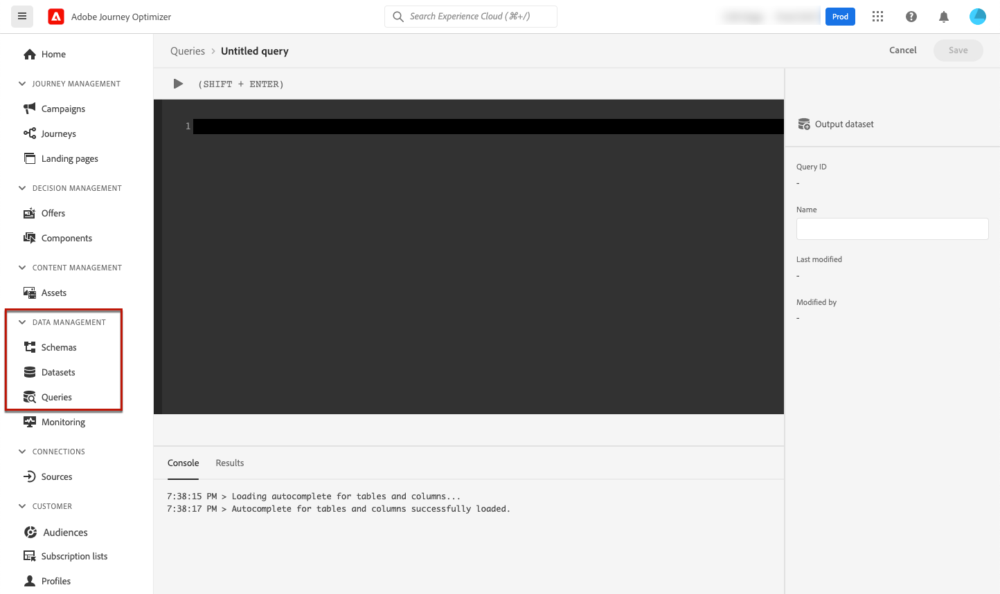

# 支援封存 {#archiving-support}

## 如何封存訊息 {#about-archiving}

HIPAA等法規要求[!DNL Journey Optimizer]應提供一種封存傳送給個人的訊息的方法。 事實上，如果您的客戶提出索賠，他們應該能夠取得已傳送訊息的副本以進行驗證。

* 針對電子郵件頻道，[!DNL Journey Optimizer]提供內建密件副本電子郵件功能。 [了解更多](#bcc-email)

* 此外，對於所有管道，您可以使用&#x200B;**實體資料集**&#x200B;中的「範本」欄位，其中包含非個人化訊息範本的詳細資料。 使用此欄位匯出資料集，以儲存中繼資料，例如：傳送訊息的對象、對象和時間。 請注意，不會匯出個人化資料，而只會考慮範本（訊息的格式和結構）。 [了解更多](../data/datasets-query-examples.md#entity-dataset)

>[!NOTE]
>
>[!DNL Journey Optimizer]不支援SMS封存需求。 如需專屬的封存支援，請與您的SMS供應商（Sinch、Infobip或Twilio）合作。

## 如何使用密件副本寄送電子郵件 {#bcc-email}

>[!CONTEXTUALHELP]
>id="ajo_admin_preset_bcc"
>title="定義密件副本電子郵件地址"
>abstract="您可以透過將電子郵件傳送到密件副本收件匣來保留已傳送之電子郵件的副本。輸入您選擇的電子郵件地址，以便每封電子郵件都會以密件方式傳送至此密件副本地址。請注意，密件副本地址網域必須不同於委派給 Adobe 的任何子網域。此功能為選用。"

您可以將[!DNL Journey Optimizer]所傳送之電子郵件的密件副本(BCC)傳送至專用的密件副本地址。 此選擇性功能可讓您保留您傳送給使用者的電子郵件通訊復本，以供合規性和/或封存之用。 訊息的其他收件者看不到密件副本地址。

### 啟用密件副本電子郵件 {#enable-bcc}

若要啟用&#x200B;**[!UICONTROL 密件副本電子郵件]**&#x200B;選項，請在[頻道設定](channel-surfaces.md)的專用欄位中輸入您選擇的電子郵件地址（即訊息預設集）。 您可以指定正確格式的任何外部地址，但委派給Adobe的子網域上定義的電子郵件地址除外。 例如，如果您將&#x200B;*marketing.luma.com*&#x200B;子網域委派給Adobe，則禁止任何類似&#x200B;*abc@marketing.luma.com*&#x200B;的位址。

>[!CAUTION]
>
>您只能定義一個密件副本電子郵件地址。 請確定密件副本位址有足夠的接收容量，可儲存使用目前通道設定所傳送的所有電子郵件。
>
>[此區段](#bcc-recommendations-limitations)中列出更多建議。

>[!NOTE]
>
>如果您已購買Healthcare Shield附加產品，您必須確定密件副本位址的ISP支援TLS 1.2通訊協定。


完成設定後，所有根據此設定的電子郵件訊息都會以密件副本方式寄至您輸入的密件副本電子郵件地址。 在那裡，可以使用外部系統處理和封存訊息。

>[!CAUTION]
>
>密件副本功能的使用量會根據您獲授權的訊息數量計算。 因此，只能在用於要封存的關鍵通訊的配置中啟用它。 檢查您的合約中是否有授權磁碟區。

密件副本電子郵件地址設定會立即儲存並在設定層級進行處理。 使用此設定建立新郵件時，會自動顯示密件副本電子郵件地址。


但是，會擷取密件副本位址，以便按照[這裡](../email/email-settings.md)描述的邏輯傳送通訊。

### 建議和限制 {#bcc-recommendations-limitations}

* 為確保您的隱私權合規性，密件副本電子郵件必須由能夠安全儲存個人識別資訊(PII)的封存系統處理。

* 由於訊息可能包含敏感或私人資料，例如個人識別資訊(PII)，請確定BCC位址正確，並保護對訊息的存取權。

* 您用於密件副本的收件匣應該可正確管理空間和傳遞。 如果收件匣傳回跳出，則可能無法接收某些電子郵件，因此無法封存。

* 訊息可在目標收件者之前傳遞至密件副本電子郵件地址。 即使原始郵件可能有[退回](../reports/suppression-list.md#delivery-failures)，也可以傳送密件副本郵件。

  <!--OR: Only successfully sent emails are taken in account. [Bounces](../reports/suppression-list.md#delivery-failures) are not. TO CHECK -->

* 請勿開啟或點選傳送至密件副本位址的電子郵件，因為傳送分析的總開啟次數與點選次數已將其列入考量，這可能會導致[報告](../reports/report-gs-cja.md)的某些計算錯誤。

* 請勿在密件副本收件匣中將郵件標示為垃圾郵件，因為這會影響傳送至此地址的所有其他電子郵件。

>[!CAUTION]
>
>請勿在傳送到密件副本地址的電子郵件中按一下取消訂閱連結，因為您將立即取消訂閱對應的收件者。

### GDPR法規遵循 {#gdpr-compliance}

GDPR等法規規定，資料主體應能隨時修改其同意書。 由於您透過Journey Optimizer傳送的密件副本電子郵件包含安全識別的個人資訊(PII)，因此您必須編輯&#x200B;**[!UICONTROL CJM電子郵件BCC回饋事件結構]**，才能管理這些PII，以符合GDPR和類似法規。

請依照下列步驟以執行此操作。

1. 移至&#x200B;**[!UICONTROL 資料管理]** > **[!UICONTROL 結構描述]** > **[!UICONTROL 瀏覽]**&#x200B;並選取&#x200B;**[!UICONTROL CJM電子郵件BCC回饋事件結構描述]**。

   

1. 按一下以展開&#x200B;**[!UICONTROL _experience]**、**[!UICONTROL customerJourneyManagment]**&#x200B;然後&#x200B;**[!UICONTROL secondaryRecipientDetail]**。

1. 選取&#x200B;**[!UICONTROL originalRecipientAddress]**

1. 在右側的&#x200B;**[!UICONTROL 欄位屬性]**&#x200B;中，向下捲動至&#x200B;**[!UICONTROL 身分]**&#x200B;核取方塊。

1. 請選取它，同時選取&#x200B;**[!UICONTROL 主要身分]**。

1. 從下拉式清單中選取名稱空間。

   

1. 按一下&#x200B;**[!UICONTROL 套用]**。

>[!NOTE]
>
>在[Experience Platform檔案](https://experienceleague.adobe.com/docs/experience-platform/privacy/home.html?lang=zh-Hant){target="_blank"}中進一步瞭解隱私權管理和相關法規。

### 密件副本報表資料 {#bcc-reporting}

歷程和訊息報表中沒有密件副本的相關報表。 不過，資訊會儲存在名為&#x200B;**[!UICONTROL AJO密件副本意見事件資料集]**&#x200B;的系統資料集上。 您可以針對此資料集執行查詢，以尋找有用的偵錯資訊。

若要透過使用者介面存取此資料集，請選取&#x200B;**[!UICONTROL 資料管理]** > **[!UICONTROL 資料集]** > **[!UICONTROL 瀏覽]**。 在[本節](../data/get-started-datasets.md#access-datasets)中進一步瞭解如何存取資料集。

<!---->

若要針對此資料集執行查詢，您可以使用[Adobe Experience Platform查詢服務](https://experienceleague.adobe.com/docs/experience-platform/query/api/getting-started.html?lang=zh-Hant){target="_blank"}提供的查詢編輯器。 若要存取它，請選取&#x200B;**[!UICONTROL 資料管理]** > **[!UICONTROL 查詢]**，然後按一下&#x200B;**[!UICONTROL 建立查詢]**。 [了解更多](../data/get-started-queries.md)



根據您要尋找的資訊，您可以執行下列查詢。

1. 對於以下所有其他查詢，您將需要歷程動作ID。 執行此查詢來擷取過去2天內與特定歷程版本ID相關聯的所有動作ID：

   ```
   SELECT
   DISTINCT
   CAST(TIMESTAMP AS DATE) AS EventTime,
   _experience.journeyOrchestration.stepEvents.journeyVersionID,
   _experience.journeyOrchestration.stepEvents.actionName, 
   _experience.journeyOrchestration.stepEvents.actionID 
   FROM journey_step_events 
   WHERE 
   _experience.journeyOrchestration.stepEvents.journeyVersionID = '<journey version id>' AND 
   _experience.journeyOrchestration.stepEvents.actionID is not NULL AND 
   TIMESTAMP > NOW() - INTERVAL '2' DAY 
   ORDER BY EventTime DESC;
   ```

   >[!NOTE]
   >
   >若要取得`<journey version id>`引數，請從[歷程管理](../building-journeys/journey.md#journey-versions) > **[!UICONTROL 歷程]**&#x200B;功能表選取對應的&#x200B;**[!UICONTROL 歷程版本]**。 歷程版本ID會顯示在網頁瀏覽器中顯示的URL結尾。
   >
   >

1. 執行此查詢以擷取針對特定使用者在過去2天內產生的所有訊息回饋事件（尤其是回饋狀態）：

   ```
   SELECT  
   _experience.customerJourneyManagement.messageExecution.journeyVersionID AS JourneyVersionID, 
   _experience.customerJourneyManagement.messageExecution.journeyActionID AS JourneyActionID, 
   timestamp AS EventTime, 
   _experience.customerJourneyManagement.emailChannelContext.address AS RecipientAddress, 
   _experience.customerjourneymanagement.messagedeliveryfeedback.feedbackStatus AS FeedbackStatus,
   CASE _experience.customerjourneymanagement.messagedeliveryfeedback.feedbackStatus
       WHEN 'sent' THEN 'Sent'
       WHEN 'delay' THEN 'Retry'
       WHEN 'out_of_band' THEN 'Bounce' 
       WHEN 'bounce' THEN 'Bounce'
   END AS FeedbackStatusCategory
   FROM cjm_message_feedback_event_dataset 
   WHERE  
       timestamp > now() - INTERVAL '2' day  AND
       _experience.customerJourneyManagement.messageExecution.journeyVersionID = '<journey version id>' AND 
       _experience.customerJourneyManagement.messageExecution.journeyActionID = '<journey action id>' AND  
       _experience.customerJourneyManagement.emailChannelContext.address = '<recipient email address>'
       ORDER BY EventTime DESC;
   ```

   >[!NOTE]
   >
   >若要取得`<journey action id>`引數，請使用歷程版本ID執行上述第一個查詢。 `<recipient email address>`引數為目標或實際收件者的電子郵件地址。

1. 執行此查詢以擷取針對過去2天內特定使用者為目標之特定訊息產生的所有密件副本訊息回饋事件：

   ```
   SELECT   
   _experience.customerJourneyManagement.messageExecution.journeyVersionID AS JourneyVersionID, 
   _experience.customerJourneyManagement.messageExecution.journeyActionID AS JourneyActionID, 
   _experience.customerJourneyManagement.emailChannelContext.address AS BccEmailAddress,
   timestamp AS EventTime, 
   _experience.customerJourneyManagement.secondaryRecipientDetail.originalRecipientAddress AS RecipientAddress, 
   _experience.customerjourneymanagement.messagedeliveryfeedback.feedbackStatus AS FeedbackStatus,
   CASE _experience.customerjourneymanagement.messagedeliveryfeedback.feedbackStatus
               WHEN 'sent' THEN 'Sent'
               WHEN 'delay' THEN 'Retry'
               WHEN 'out_of_band' THEN 'Bounce' 
               WHEN 'bounce' THEN 'Bounce'
           END AS FeedbackStatusCategory 
   FROM ajo_bcc_feedback_event_dataset  
   WHERE  
   timestamp > now() - INTERVAL '2' day  AND
   _experience.customerJourneyManagement.messageExecution.journeyVersionID = '<journey version id>' AND 
   _experience.customerJourneyManagement.messageExecution.journeyActionID = '<journeyaction id>' AND 
   _experience.customerJourneyManagement.secondaryRecipientDetail.originalRecipientAddress = '<recipient email address>'
   ORDER BY EventTime DESC;
   ```

1. 執行此查詢以擷取所有未收到訊息的收件者地址，但其密件副本專案在過去30天內存在：

   ```
    SELECT
        DISTINCT 
    bcc._experience.customerJourneyManagement.secondaryRecipientDetail.originalRecipientAddress AS RecipientAddressesNotRecievedMessage
    FROM ajo_bcc_feedback_event_dataset bcc
    LEFT JOIN cjm_message_feedback_event_dataset mfe
    ON 
   bcc._experience.customerJourneyManagement.messageExecution.journeyVersionID =
            mfe._experience.customerJourneyManagement.messageExecution.journeyVersionID AND    bcc._experience.customerJourneyManagement.messageExecution.journeyActionID = mfe._experience.customerJourneyManagement.messageExecution.journeyActionID AND 
   bcc._experience.customerJourneyManagement.secondaryRecipientDetail.originalRecipientAddress = mfe._experience.customerJourneyManagement.emailChannelContext.address AND
   mfe._experience.customerJourneyManagement.messageExecution.journeyVersionID = '<journey version id>' AND 
   mfe._experience.customerJourneyManagement.messageExecution.journeyActionID = '<journey action id>' AND
   mfe.timestamp > now() - INTERVAL '30' DAY AND
   mfe._experience.customerjourneymanagement.messagedeliveryfeedback.feedbackstatus IN ('bounce', 'out_of_band') 
    WHERE bcc.timestamp > now() - INTERVAL '30' DAY;
   ```

### 使用郵件標頭調解密件副本和已傳送的電子郵件資訊 {#bcc-header}

例如，當您的電子郵件密件副本封存於外部系統時，您可以使用郵件中包含的標頭來擷取對應已傳送電子郵件的資訊。

每封電子郵件現在都包含一個名為`x-message-profile-id`的標題。 每個設定檔的此標題值不同：對於每個已傳送的電子郵件及其對應的密件副本而言，都是唯一值。

`x-message-profile-id`標頭也儲存在下列系統資料集中： [AJO訊息回饋事件資料集](../data/datasets-query-examples.md#message-feedback-event-dataset) （已傳送電子郵件）和[AJO密件副本回饋事件資料集](#bcc-reporting) （密件副本副本）。 您可以查詢這些資料集，以協調密件副本和對應的實際電子郵件。

* 若要透過使用者介面存取這些資料集，請選取&#x200B;**[!UICONTROL 資料管理]** > **[!UICONTROL 資料集]** > **[!UICONTROL 瀏覽]**。 在[本節](../data/get-started-datasets.md#access-datasets)中進一步瞭解如何存取資料集。

* 使用[Adobe Experience Platform查詢服務](https://experienceleague.adobe.com/docs/experience-platform/query/api/getting-started.html?lang=zh-Hant){target="_blank"}提供的查詢編輯器。 若要存取它，請選取&#x200B;**[!UICONTROL 資料管理]** > **[!UICONTROL 查詢]**，然後按一下&#x200B;**[!UICONTROL 建立查詢]**。 [了解更多](../data/get-started-queries.md)

以下是一些您可執行的範例查詢，以擷取和密件副本相對應的資訊。

**查詢1**

若要讓密件副本事件與實際電子郵件的對應意見事件與行銷活動動作詳細資料拼接：

```
SELECT
  mfe.timestamp AS OriginalRecipientFeedbackEventTime,
  mfe._experience.customerJourneyManagement.emailChannelContext.address AS OriginalRecipientEmailAddress,
  bcc._experience.customerJourneyManagement.emailChannelContext.address AS BCCEmailAddress,
  mfe._experience.customerjourneymanagement.messagedeliveryfeedback.feedbackstatus AS OriginalRecipientMessageFeedbackStatus,
  mfe._experience.customerJourneyManagement.messageExecution.campaignID AS CampaignID,
  mfe._experience.customerJourneyManagement.messageExecution.campaignActionID AS CampaignActionID,
  mfe._experience.customerJourneyManagement.messageExecution.batchInstanceID AS BatchInstanceID,
  mfe._experience.customerJourneyManagement.messageExecution.messageID AS MessageID
FROM ajo_bcc_feedback_event_dataset bcc
LEFT JOIN ajo_message_feedback_event_dataset mfe
ON bcc._experience.customerJourneyManagement.messageProfile.messageProfileID =
    mfe._experience.customerJourneyManagement.messageProfile.messageProfileID AND 
    mfe.timestamp > now() - INTERVAL '30' day
WHERE 
  bcc.timestamp > now() - INTERVAL '30' DAY AND 
  bcc._experience.customerJourneyManagement.messageProfile.messageProfileID = '<x-message-profile-id>'
ORDER BY mfe.timestamp DESC;
```

**查詢2**

若要針對包含歷程動作詳細資料的實際電子郵件，取得密件副本事件與對應回饋事件之拼接：

```
SELECT
  mfe.timestamp AS OriginalRecipientFeedbackEventTime,
  mfe._experience.customerJourneyManagement.emailChannelContext.address AS OriginalRecipientEmailAddress,
  bcc._experience.customerJourneyManagement.emailChannelContext.address AS BCCEmailAddress,
  mfe._experience.customerjourneymanagement.messagedeliveryfeedback.feedbackstatus AS OriginalRecipientMessageFeedbackStatus,
  mfe._experience.customerJourneyManagement.messageExecution.journeyActionID AS journeyActionID,
  mfe._experience.customerJourneyManagement.messageExecution.journeyVersionID AS JourneyVersionID,
  mfe._experience.customerJourneyManagement.messageExecution.journeyVersionInstanceID AS JourneyVersionInstanceID,
  mfe._experience.customerJourneyManagement.messageExecution.batchInstanceID AS BatchInstanceID,
  mfe._experience.customerJourneyManagement.messageExecution.messageID AS MessageID
FROM ajo_bcc_feedback_event_dataset bcc
LEFT JOIN ajo_message_feedback_event_dataset mfe
ON bcc._experience.customerJourneyManagement.messageProfile.messageProfileID =
    mfe._experience.customerJourneyManagement.messageProfile.messageProfileID AND 
    mfe.timestamp > now() - INTERVAL '30' day
WHERE 
  bcc.timestamp > now() - INTERVAL '30' DAY AND 
  bcc._experience.customerJourneyManagement.messageProfile.messageProfileID = '<x-message-profile-id>'
ORDER BY mfe.timestamp DESC;
```
