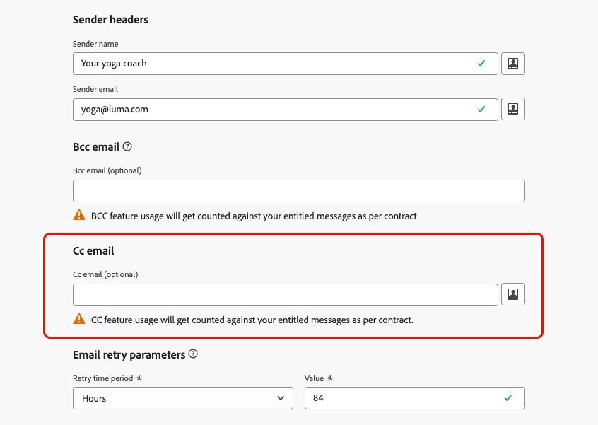

# 將副本欄位新增至電子郵件 {#cc-email-field}

>[!CONTEXTUALHELP]
>id="ajo_admin_config_cc"
>title="定義副本電子郵件地址"
>abstract="您可以對使用此管道設定傳送的電子郵件新增可見的副本 (CC) 欄位。輸入固定的電子郵件地址或使用個人化設定 (輪廓屬性或內容變數)。請注意，副本的使用量會計入您的授權訊息用量中。"

>[!AVAILABILITY]
>
>此功能以有限可用性提供給所有客戶。 請聯絡您的 Adobe 代表以取得存取權。

您可以透過您的歷程與行銷活動，將可見CC （副本）欄位新增至[!DNL Journey Optimizer]傳送的電子郵件。 此選擇性功能是在[通道組態](channel-surfaces.md)層級設定，以及電子郵件標頭引數和密件副本電子郵件選項。

>[!CAUTION]
>
>CC功能使用量會根據您獲授權的訊息數量計算。 只在您需要顯示副本收件者的位置啟用它。 檢查您的合約中是否有授權磁碟區。

與[密件副本](archiving-support.md#bcc-email)類似，「副本」欄位是用來將電子郵件復本傳送至其他地址。 不過，它與「密件副本」有以下不同之處：

* 主要收件者可看到「副本抄送」電子郵件地址，因此主要收件者可看見已複製的人員，並知道後續聯絡對象。
* 不同於密件副本，「副本」電子郵件欄位支援個人化，這可讓您針對許多案例使用單一通道設定，並將副本傳送給每個收件者的合適人員（例如其關係經理）。 對於API觸發的行銷活動，這可讓您cc與特定事件或交易相關的地址。

>[!NOTE]
>
>如果您需要保留收件者不可看見地址的復本，以進行封存或法規遵循，請使用[密件副本](archiving-support.md#bcc-email)，而不要使用「副本」。

## 啟用「副本抄送電子郵件」 {#enable-cc}

若要啟用&#x200B;**[!UICONTROL 副本抄送電子郵件]**&#x200B;選項，請設定[電子郵件通道設定](../email/email-settings.md)中的副本抄送欄位。

您可以指定正確格式的任何外部地址，但委派給Adobe的子網域上定義的電子郵件地址除外。 例如，如果您將&#x200B;*marketing.luma.com*&#x200B;子網域委派給Adobe，則禁止任何類似&#x200B;*abc@marketing.luma.com*&#x200B;的位址。

>[!CAUTION]
>
>您只能定義一個電子郵件地址。 請確認副本地址有足夠的接收容量，可以儲存使用目前頻道設定所傳送的所有電子郵件。
>
>[此區段](#cc-recommendations-limitations)中列出更多建議。

**[!UICONTROL 副本電子郵件]**&#x200B;欄位接受三種型別的值：

* **硬式編碼值**，可以是固定的電子郵件地址。

* **設定檔屬性**，例如設定檔中可用的關係管理員電子郵件地址。

* **內容屬性** — 此值&#x200B;**只能用於API觸發的行銷活動**。 它是從API承載擷取的，API承載必須包含具有CC位址值的內容變數`context.channel.email.ccvalues`。

  >[!WARNING]
  >
  >使用&#x200B;**內容變數**&#x200B;設定CC時，只有&#x200B;**API觸發的行銷活動**&#x200B;才支援它。 如果您在歷程或動作行銷活動中使用該頻道設定，則只會傳送電子郵件給主要收件者，不會傳送副本至「副本抄送地址」。

郵件中包含的任何[附件](../email/pdf-attachments.md)都會同時傳送給主要收件者和副本地址。

如果CC值在傳送時無效或遺失（例如空白的內容變數），則會略過CC副本；主要收件者仍會收到電子郵件。

如果「副本」欄位有多個值（例如，使用可解析成多個地址的設定檔屬性或運算式時），則只有第一個值會用於傳送電子郵件。

## 在現有頻道設定中編輯副本電子郵件 {#cc-edit}

如果您[編輯電子郵件組態](channel-surfaces.md#edit-channel-surface)並新增或變更[副本]欄位，您只能使用：

* **硬式編碼** CC電子郵件地址，或
* **內容變數** （用於API觸發的使用）。

>[!CAUTION]
>
>編輯現有電子郵件通道設定時，您無法新增新的[設定檔屬性](../personalization/personalization-build-expressions.md#sources)至&#x200B;**[!UICONTROL 副本電子郵件]**&#x200B;欄位。 您必須建立[新頻道設定](channel-surfaces.md#create-channel-surface)。

## 建議和限制 {#cc-recommendations-limitations}

* **權益：**&#x200B;副本使用量計入您的授權郵件數量。 僅在您需要可見副本收件者的情況下使用副本。 檢查您的合約中是否有授權磁碟區。

* **隱私權與合規性：**&#x200B;為確保您的隱私權合規性，CC電子郵件必須由能夠安全儲存個人識別資訊(PII) （如適用）的系統處理。 由於郵件可能包含敏感或私密資料（例如PII），請確定CC位址正確無誤，並保護對郵件的存取權。

* **收件匣管理：**&#x200B;您用於CC的收件匣應該適當地管理空間和傳遞。 如果收件匣傳回跳出數，則可能無法接收部分電子郵件。

* **傳遞時間：**&#x200B;訊息可能會先傳遞至[副本]電子郵件地址，再傳遞至目標收件者。 即使原始郵件可能有[退回](../reports/suppression-list.md#delivery-failures)，也可以傳送CC郵件。

* **報告：**&#x200B;電子郵件報告量度中包含來自CC收件者的開啟、點按及其他參與。 因此，來自副本收件者的任何開啟或點按都會導致[報告](../reports/report-gs-cja.md)計算錯誤。

* **垃圾訊息：**&#x200B;請勿在[副本抄送收件匣]中將郵件標示為垃圾訊息，因為這會影響傳送至此地址的所有其他電子郵件。

* **傳遞能力：**&#x200B;使用符合傳送實務和收件者期望的副本。 過度使用CC可能會影響傳遞能力；請遵循[傳遞能力最佳實務](../reports/deliverability.md)和您的合約條款。

>[!CAUTION]
>
>請勿在傳送至副本地址的電子郵件中按一下取消訂閱連結，因為您將立即取消訂閱電子郵件的&#x200B;**收件者**。
