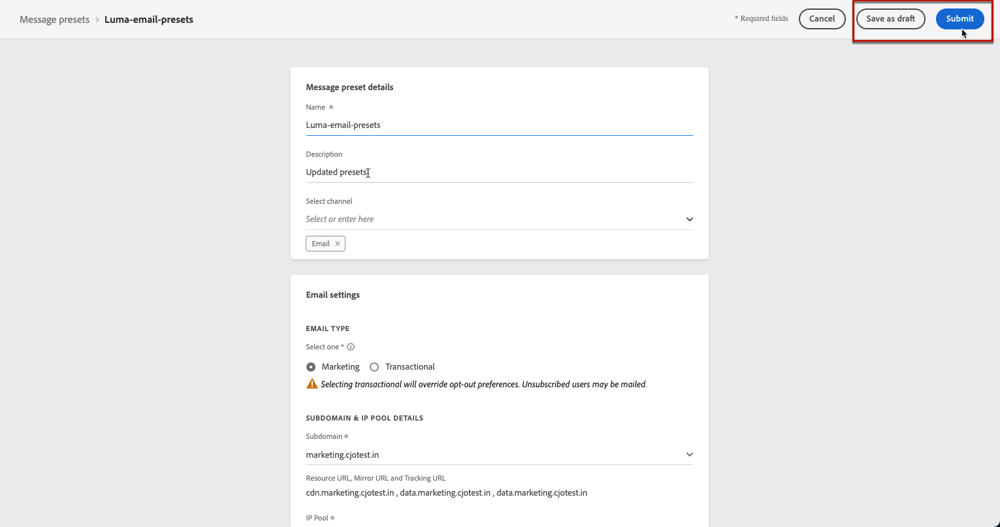

# 設定頻道介面 {#set-up-channel-surfaces}

與 [!DNL Journey Optimizer]，可以設定通道曲面（即消息預設），以定義消息所需的所有技術參數：電子郵件類型、發件人電子郵件和姓名、移動應用等。

>[!CAUTION]
>
> * 要建立、編輯和刪除通道曲面，必須 [管理通道表面](../administration/high-low-permissions.md#manage-channel-surface) 權限。
>
> * 必須執行 [電子郵件配置](#configure-email-settings)。 [推送配置](../configuration/push-configuration.md) 和 [SMS配置](../configuration/sms-configuration.md) 建立通道曲面之前的步驟。

一旦配置了通道曲面，您就可以在建立行程消息時選擇它們。

<!--
➡️ [Learn how to create and use email surfaces in this video](#video-presets)
-->

## 建立通道曲面 {#create-channel-surface}

>[!CONTEXTUALHELP]
>id="ajo_admin_message_presets"
>title="通道曲面設定"
>abstract="設定通道表面時，選擇它應用的通道，並定義消息所需的所有技術參數，如消息類型、子域、發件人名稱、移動應用等。"

要建立通道曲面，請執行以下步驟：

1. 訪問 **[!UICONTROL Channels]** > **[!UICONTROL Branding]** > **[!UICONTROL Channel surfaces]** 菜單，然後按一下 **[!UICONTROL Create channel surface]**。

   

1. 輸入曲面的名稱和說明（可選），然後選擇要配置的通道。

   

   >[!NOTE]
   >
   > 名稱必須以字母(A-Z)開頭。 它只能包含字母數字字元。 您還可以使用下划線 `_`，點`.` 連字元 `-` 字元。

1. 如果選擇了 **[!UICONTROL Email]** 頻道，配置設定，如中所述 [此部分](email-settings.md)。

   

1. 對於 **[!UICONTROL Push Notification]** 通道，選擇至少一個平台 —   **iOS** 和/或 **安卓**  — 和用於每個平台的移動應用程式。

   

   >[!NOTE]
   >
   >有關如何配置環境以發送推送通知的詳細資訊，請參閱 [此部分](push-gs.md)。

1. 對於 **[!UICONTROL SMS]** 通道，定義設定，詳見 [此部分](sms-configuration.md#message-preset-sms)。

   

   >[!NOTE]
   >
   >有關如何配置環境以發送SMS消息的詳細資訊，請參閱 [此部分](sms-configuration.md)。

1. 配置完所有參數後，按一下 **[!UICONTROL Submit]** 確認。 也可將通道曲面另存為拔模，並稍後恢復其配置。

   

   >[!NOTE]
   >
   >當所選IP池位於以下位置時，無法繼續建立曲面 [版本](ip-pools.md#edit-ip-pool) (**[!UICONTROL Processing]** 狀態)，且從未與所選子域關聯。 [了解更多](#subdomains-and-ip-pools)
   >
   >將曲面另存為草稿並等待IP池 **[!UICONTROL Success]** 狀態以恢復曲面建立。

1. 建立通道曲面後，它將顯示在清單中 **[!UICONTROL Processing]** 狀態。

   在此步驟中，將執行多項檢查，以驗證是否已正確配置了該步驟。 處理時間在 **48小時–72小時**，並且 **7-10個工作日**。

   這些檢查包括由Adobe團隊執行的配置和技術test:

   * SPF驗證
   * DKIM驗證
   * MX記錄驗證
   * 檢查IP密碼清單
   * Helo主機檢查
   * IP池驗證
   * A/PTR記錄， t/m/res子域驗證

   >[!NOTE]
   >
   >如果檢查不成功，請詳細瞭解中可能的失敗原因 [此部分](#monitor-channel-surfaces)。

1. 檢查成功後，通道曲面將 **[!UICONTROL Active]** 狀態。 它已準備好用於傳遞消息。

   

## 監視通道曲面 {#monitor-channel-surfaces}

所有通道曲面都顯示在 **[!UICONTROL Channels]** > **[!UICONTROL Channel surfaces]** 的子菜單。 篩選器可幫助您瀏覽清單（通道、用戶、狀態）。

建立後，通道曲面可以具有以下狀態：

* **[!UICONTROL Draft]**:通道曲面已保存為拔模，但尚未提交。 開啟它以恢復配置。
* **[!UICONTROL Processing]**:通道表面已提交，並正在執行幾個驗證步驟。
* **[!UICONTROL Active]**:已驗證通道曲面，並且可以選擇該曲面以建立消息。
* **[!UICONTROL Failed]**:在通道曲面驗證期間，一個或多個檢查失敗。
* **[!UICONTROL Deactivated]**:該溝道表面被停用。 不能用於建立新郵件。

如果通道曲面建立失敗，則下面將詳細說明每種可能的失敗原因。

如果出現其中一個錯誤，請與 [Adobe客戶關懷](https://helpx.adobe.com/tw/enterprise/admin-guide.html/enterprise/using/support-for-experience-cloud.ug.html){target=&quot;_blank&quot;}以獲取幫助。

* **SPF驗證失敗**:SPF（發件人策略框架）是一種電子郵件身份驗證協定，它允許指定可從給定子域發送電子郵件的授權IP。 SPF驗證失敗意味著SPF記錄中的IP地址與用於向郵箱提供程式發送電子郵件的IP地址不匹配。

* **DKIM驗證失敗**:DKIM(DomainKeys Indifed Mail)允許收件人伺服器驗證所接收的郵件是否由關聯域的正版發件人發送，並且原始郵件的內容在發送過程中未被更改。 DKIM驗證失敗意味著接收郵件伺服器無法驗證郵件內容的真實性及其與發送域的關聯：

* **MX記錄驗證失敗**:MX(Mail eXchange)記錄驗證失敗意味著負責代表給定子域接受入站電子郵件的郵件伺服器配置不正確。

* **可交付性配置失敗**:可交付性配置可能會因以下原因而失敗：
   * 已分配IP的阻止清單
   * 無效 `helo` 名稱
   * 從IP發送的電子郵件，而不是在相應表面的IP池中指定的電子郵件
   * 無法將電子郵件發送到Gmail和Yahoo等主要ISP的收件箱

## 編輯通道曲面 {#edit-channel-surface}

要編輯通道曲面，請執行以下步驟。

>[!NOTE]
>
>無法編輯 **[!UICONTROL Push notification settings]**。 如果僅為「推送」通知通道配置通道曲面，則該曲面不可編輯。

1. 在清單中，按一下通道曲面名稱以將其開啟。

   

1. 根據需要編輯其屬性。

   >[!NOTE]
   >
   >如果通道曲面具有 **[!UICONTROL Active]** 狀態， **[!UICONTROL Name]**。 **[!UICONTROL Select channel]** 和 **[!UICONTROL Subdomain]** 欄位呈灰色，無法編輯。

1. 按一下 **[!UICONTROL Submit]** 確認更改。

   

   >[!NOTE]
   >
   >也可將通道曲面另存為拔模，並稍後繼續更新。

一旦提交更改，通道曲面將經歷與當時的驗證週期類似的驗證週期 [建立通道曲面](#create-channel-surface)。 編輯處理時間可能 **3小時**。

>[!NOTE]
>
>如果僅編輯 **[!UICONTROL Description]**。 **[!UICONTROL Email type]** 和/或 **[!UICONTROL Email retry parameters]** 欄位，更新是即時的。

### 更新詳細資訊 {#update-details}

對於具有 **[!UICONTROL Active]** 狀態，您可以檢查更新的詳細資訊。 若要這麼做：

按一下 **[!UICONTROL Recent update]** 表徵圖。

<!--You can also access the update details from an active channel surface while update is in progress.-->

在 **[!UICONTROL Recent update]** 螢幕中，您可以查看更新狀態和請求的更改清單等資訊。

### 更新狀態 {#update-statuses}

通道曲面更新可以具有以下狀態：

* **[!UICONTROL Processing]**:已提交通道表面更新，並正在執行幾個驗證步驟。
* **[!UICONTROL Success]**:已驗證更新的通道表面，並且可以選擇該表面以建立消息。
* **[!UICONTROL Failed]**:在通道曲面更新驗證期間，一個或多個檢查失敗。

每種狀態詳見下文。

#### 正在處理 {#surface-processing}

將執行多次傳送性檢查，以驗證曲面是否已正確更新。

>[!NOTE]
>
>如果僅編輯 **[!UICONTROL Description]**。 **[!UICONTROL Email type]** 和/或 **[!UICONTROL Email retry parameters]** 欄位，更新是即時的。

處理時間可能需要 **3小時**。 瞭解有關在驗證週期中執行的檢查的詳細資訊，請參閱 [此部分](#create-channel-surface)。

如果編輯已處於活動狀態的曲面：

* 其地位仍然 **[!UICONTROL Active]** 正在驗證進程。

* 的 **[!UICONTROL Recent update]** 表徵圖顯示在通道曲面清單中曲面名稱的旁邊。

* 在驗證過程中，使用此曲面配置的消息仍在使用該曲面的較舊版本。

>[!NOTE]
>
>更新正在進行時，不能修改通道曲面。 您仍然可以按一下其名稱，但所有欄位都呈灰色顯示。 在更新成功之前，不會反映更改。

#### 成功 {#success}

驗證過程成功後，使用此曲面的所有消息中將自動使用新版本的曲面。 但是，您可能必須等待：
* 在被統一消息消耗前幾分鐘，
* 直到該曲面在批處理消息中生效的下一批。

#### 已失敗 {#failed}

如果驗證過程失敗，仍將使用曲面的舊版本。

瞭解有關中可能的失敗原因的詳細資訊 [此部分](#monitor-channel-surfaces)。

更新失敗後，曲面將再次變為可編輯的。 您可以按一下其名稱並更新需要修復的設定。

## 停用通道表面 {#deactivate-a-surface}

要生成 **[!UICONTROL Active]** 頻道表面無法建立新消息，您可以停用它。 但是，目前使用此曲面的旅程資訊將不受影響，並將繼續工作。

>[!NOTE]
>
>在處理更新時無法停用通道曲面。 必須等待更新成功或失敗。 瞭解更多 [編輯通道曲面](#edit-channel-surface) 在 [更新狀態](#update-statuses)。

1. 訪問通道曲面清單。

1. 對於所選的活動曲面，按一下 **[!UICONTROL More actions]** 按鈕

1. 選擇「**[!UICONTROL Deactivate]**」。

   

>[!NOTE]
>
>無法刪除已停用的通道曲面以避免使用這些曲面發送消息的行程中出現任何問題。

不能直接編輯已停用的通道曲面。 但是，您可以複製該副本並編輯該副本，以建立將用於建立新郵件的新版本。 您也可以再次激活它，並等待更新成功編輯它。

<!--
## How-to video{#video-presets}

Learn how to create channel surfaces, how to use them and how to delegate a subdomain and create an IP pool.

>[!VIDEO](https://video.tv.adobe.com/v/334343?quality=12)
-->
