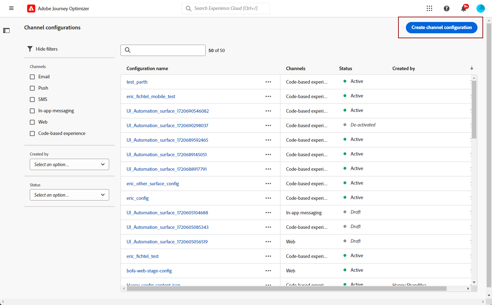
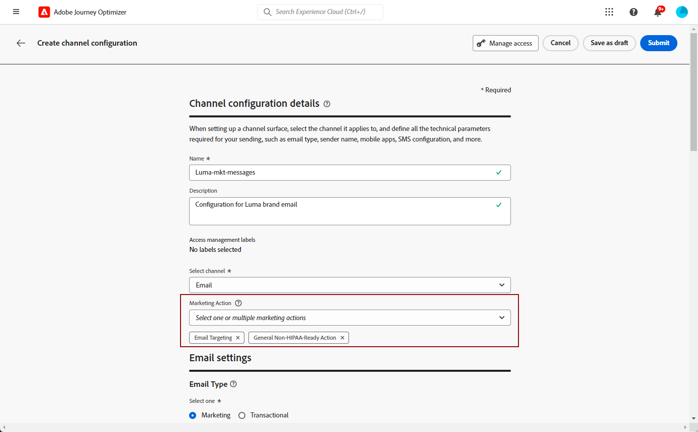
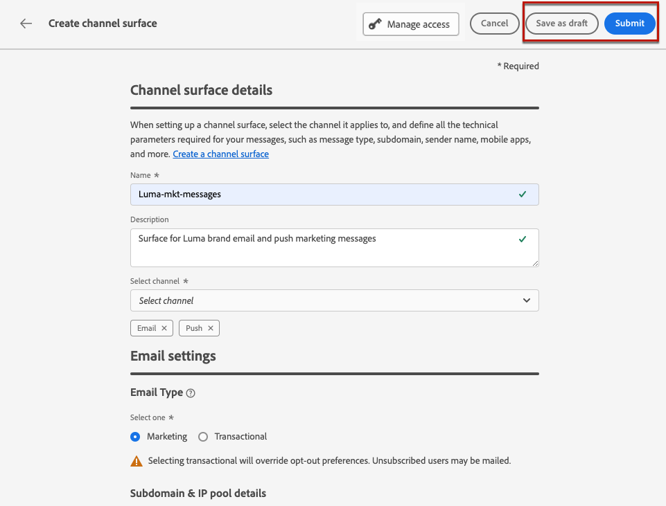
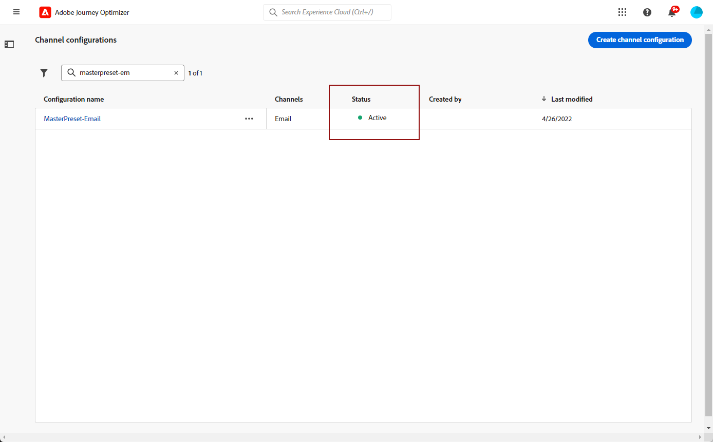
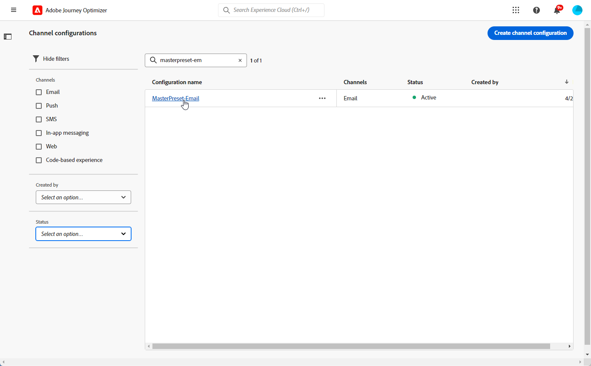
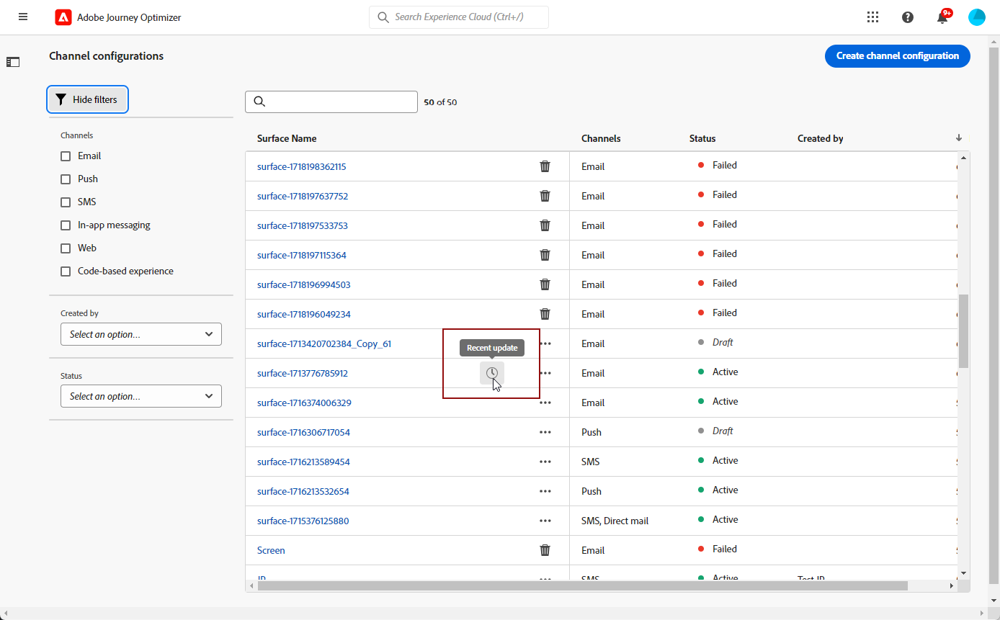
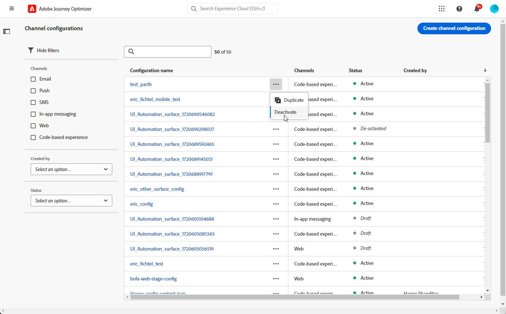
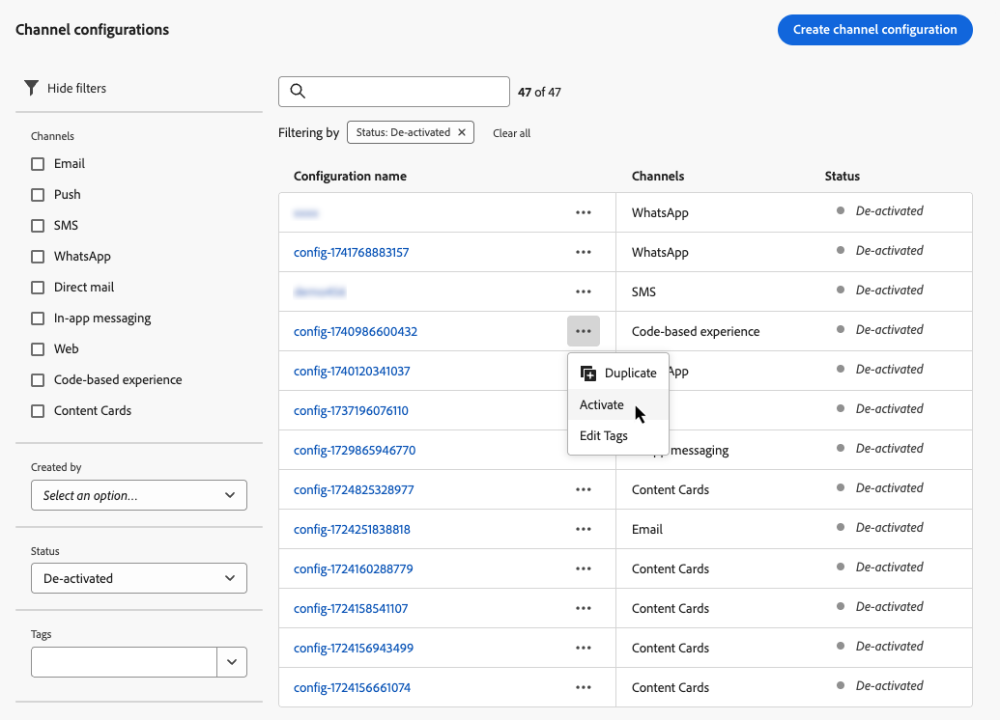
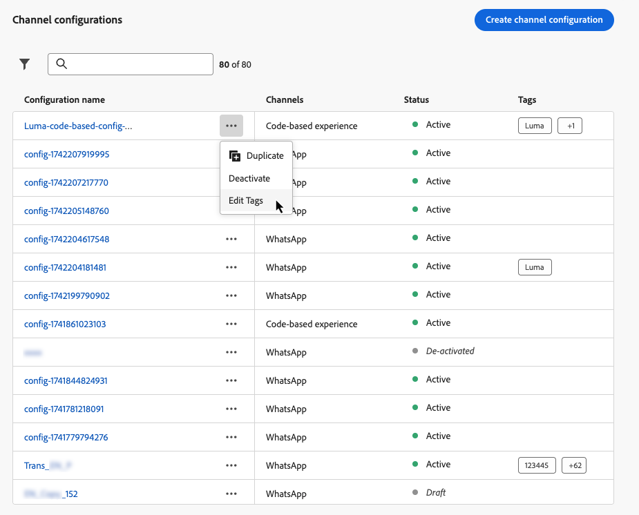

# 設定管道設定 {#set-up-channel-surfaces}

>[!CONTEXTUALHELP]
>id="ajo_admin_channel_surfaces"
>title="管道設定"
>abstract="管道設定是由系統管理員定義的設定。它包含所有用於傳送訊息的技術參數，如標頭參數、子網域、行動應用程式等。"

>[!CONTEXTUALHELP]
>id="ajo_admin_marketing_action"
>title="行銷動作"
>abstract="選擇行銷動作即可將同意原則連結至使用此設定的訊息。所有與此行銷動作連結的同意原則都將用於遵循您的客戶的偏好設定。"

透過[!DNL Journey Optimizer]，您可以設定頻道設定（即訊息預設集），以定義訊息所需的所有技術引數：電子郵件型別、寄件者電子郵件和名稱、行動應用程式、簡訊設定等等。

>[!CAUTION]
>
> * 若要建立、編輯和刪除通道設定，您必須擁有[管理訊息預設集](../administration/high-low-permissions.md#administration-permissions)許可權。
>
> * 在建立頻道設定之前，您必須執行[電子郵件設定](../email/get-started-email-config.md)、[推播設定](../push/push-configuration.md)、[簡訊設定](../sms/sms-configuration.md)、[應用程式內設定](../in-app/inapp-configuration.md)、[程式碼型設定](../code-based/code-based-configuration.md)、[網頁設定](../web/web-configuration.md)和[直接郵件設定](../direct-mail/direct-mail-configuration.md)步驟。

設定好管道設定後，您就可以在從歷程或行銷活動建立訊息時選取它們。

您也可以使用引導式管道設定，在統一體驗中自動化及驗證管道設定，加速開始使用Journey Optimizer的流程。 [了解更多](set-mobile-config.md)

<!--
➡️ [Learn how to create and use email configurations in this video](#video-presets)
-->

## 建立管道設定 {#create-channel-surface}

>[!CONTEXTUALHELP]
>id="ajo_admin_message_presets_header"
>title="管道設定"
>abstract="設定管道設定時，請選取它適用的管道，並定義您的傳送所需的所有技術參數，例如電子郵件類型、寄件者姓名、行動應用程式、簡訊設定等。"

>[!CONTEXTUALHELP]
>id="ajo_admin_message_presets"
>title="管道設定"
>abstract="為了能夠建立來自歷程或行銷活動的電子郵件之類的動作，您必須先建立一個管道設定來定義訊息所需的所有技術設定。您必須具有管理訊息預設集權限，才能建立、編輯和刪除管道設定。"

>[!CONTEXTUALHELP]
>id="ajo_surface_marketing_action"
>title="選取行銷動作"
>abstract="在設定中選擇行銷動作，以便將內容原則與訊息建立關聯。"

若要建立通道設定，請遵循下列步驟：

1. 存取&#x200B;**[!UICONTROL 頻道]** > **[!UICONTROL 一般設定]** > **[!UICONTROL 頻道設定]**&#x200B;功能表，然後按一下&#x200B;**[!UICONTROL 建立頻道設定]**。

   

1. 輸入設定的名稱和說明（選擇性），然後選取要設定的通道。

   

   >[!NOTE]
   >
   > 名稱必須以字母(A-Z)開頭。 它只能包含英數字元。 您也可以使用底線 `_`、點 `.` 和連字號 `-` 字元。

1. 若要將自訂或核心資料使用標籤指派給組態，您可以選取&#x200B;**[!UICONTROL 管理存取權]**。 [進一步瞭解物件層級存取控制(OLAC)](../administration/object-based-access.md)。

1. 選取您的頻道。

1. 選取&#x200B;**[!UICONTROL 行銷動作]**，以使用此設定將同意原則與訊息相關聯。 系統會運用與行銷動作相關的所有同意政策，以尊重客戶的偏好設定。 [了解更多](../action/consent.md#surface-marketing-actions)

   >[!NOTE]
   >
   >同意原則目前僅適用於已購買&#x200B;**Healthcare Shield**&#x200B;和&#x200B;**Privacy and Security Shield**&#x200B;附加產品的組織。

   

1. 設定完所有引數後，按一下&#x200B;**[!UICONTROL 提交]**&#x200B;確認。 您也可以將頻道設定儲存為草稿，並稍後繼續其設定。

   

   >[!NOTE]
   >
   >當選取的IP集區在[版本](ip-pools.md#edit-ip-pool)之下（**[!UICONTROL 正在處理]**&#x200B;狀態）且從未與選取的子網域建立關聯時，您無法繼續建立電子郵件設定。 [了解更多](#subdomains-and-ip-pools)
   >
   >將設定儲存為草稿，並等到IP集區具有&#x200B;**[!UICONTROL 成功]**&#x200B;狀態再繼續建立設定。

1. 建立管道設定後，它就會顯示在狀態為&#x200B;**[!UICONTROL 處理中]**&#x200B;的清單中。

   在此步驟中，將執行數個檢查以確認其已正確設定。<!--The processing time is around **48h-72h**, and can take up to **7-10 business days**.-->

   >[!NOTE]
   > 為子網域建立電子郵件設定時，處理時間會有所不同，詳見如下：
   >
   > * 針對&#x200B;**新子網域**，建立第一個管道設定的程式可能需要&#x200B;**10分鐘到10天**。
   > * 對於&#x200B;**非生產沙箱**，或如果選取的子網域已在另一個核准的管道設定中&#x200B;**使用**，則程式最多只需&#x200B;**3小時**。

   這些檢查包括Adobe團隊執行的設定和技術測試：

   * SPF驗證
   * DKIM驗證
   * MX記錄驗證
   * 檢查IP封鎖清單
   * Helo主機檢查
   * IP集區驗證
   * A/PTR記錄，t/m/res子網域驗證
   * FBL註冊（此檢查只會在第一次為特定子網域建立電子郵件設定時執行）

   >[!NOTE]
   >
   >如果檢查不成功，請在[本節](#monitor-channel-surfaces)中進一步瞭解可能的失敗原因。

1. 檢查成功後，通道設定會取得&#x200B;**[!UICONTROL 作用中]**&#x200B;狀態。 已準備好用於傳遞訊息。

   

## 監視通道設定 {#monitor-channel-surfaces}

您的所有頻道設定會顯示在&#x200B;**[!UICONTROL 頻道]** > **[!UICONTROL 頻道設定]**&#x200B;功能表中。 篩選器可協助您瀏覽清單（頻道、使用者、狀態）。

建立之後，管道設定可以有下列狀態：

* **[!UICONTROL 草稿]**：頻道設定已儲存為草稿，尚未提交。 開啟以繼續設定。
* **[!UICONTROL 正在處理]**：頻道設定已提交，且正在執行數個驗證步驟。
* **[!UICONTROL 作用中]**：通道設定已經過驗證，可以選取它來建立訊息。
* **[!UICONTROL 失敗]**：通道組態驗證期間有一或數個檢查失敗。
* **[!UICONTROL 已停用]**：頻道設定已停用。 無法用來建立新訊息。

### 管道設定失敗原因 {#channel-config-failure}

如果通道設定建立失敗，每個可能的失敗原因的詳細資訊如下所述。

如果發生其中一項錯誤，請連絡[Adobe客戶服務](https://helpx.adobe.com/tw/enterprise/admin-guide.html/enterprise/using/support-for-experience-cloud.ug.html){target="_blank"}以取得協助。

* **SPF驗證失敗**： SPF (Sender Policy Framework)是電子郵件驗證通訊協定，允許指定可從指定子網域傳送電子郵件的授權IP。 SPF驗證失敗表示SPF記錄中的IP位址與用來傳送電子郵件給信箱提供者的IP位址不符。

* **DKIM驗證失敗**： DKIM (DomainKeys Identified Mail)可讓收件者伺服器確認所收到的郵件是由相關網域的正版寄件者傳送，且原始郵件的內容並未在途中變更。 DKIM驗證失敗表示接收郵件伺服器無法驗證郵件內容的真實性，以及其與傳送網域的關聯：

* **MX記錄驗證失敗**： MX (Mail eXchange)記錄驗證失敗表示負責代表指定子網域接收傳入電子郵件的郵件伺服器未正確設定。

* **傳遞能力設定失敗**：傳遞能力設定失敗可能是由下列任一原因所造成：
   * 已配置IP的封鎖清單
   * 無效的`helo`名稱
   * 從對應設定之IP集區中指定之其他IP傳送的電子郵件
   * 無法將電子郵件傳遞至主要ISP的收件匣

## 編輯頻道設定 {#edit-channel-surface}

若要編輯通道設定，請遵循以下步驟。

>[!NOTE]
>
>您無法編輯&#x200B;**[!UICONTROL 推播通知設定]**。 如果僅為推播通知頻道設定頻道設定，則無法編輯。

1. 從清單中，按一下頻道設定名稱以開啟。

   

1. 視需要編輯其屬性。

   >[!NOTE]
   >
   >如果頻道設定具有&#x200B;**[!UICONTROL 作用中]**&#x200B;狀態，**[!UICONTROL 名稱]**、**[!UICONTROL 選取頻道]**&#x200B;和&#x200B;**[!UICONTROL 子網域]**&#x200B;欄位會變灰且無法編輯。

1. 按一下&#x200B;**[!UICONTROL 提交]**&#x200B;以確認您的變更。

   >[!NOTE]
   >
   >您也可以將頻道設定儲存為草稿，並稍後繼續更新。

一旦提交變更，通道設定將經歷驗證週期，類似於[建立通道設定](#create-channel-surface)時所處的週期。 編輯處理時間最多可能需要&#x200B;**3小時**。

>[!NOTE]
>
>如果您只編輯&#x200B;**[!UICONTROL 描述]**、**[!UICONTROL 電子郵件型別]**&#x200B;和/或&#x200B;**[!UICONTROL 電子郵件重試引數]**&#x200B;欄位，則更新是即時的。

### 更新詳細資料 {#update-details}

對於具有&#x200B;**[!UICONTROL 作用中]**&#x200B;狀態的通道設定，您可以檢查更新的詳細資料。 若要這麼做：

按一下作用中組態名稱旁邊顯示的&#x200B;**[!UICONTROL 最近更新]**&#x200B;圖示。

<!--You can also access the update details from an active channel configuration while update is in progress.-->

在&#x200B;**[!UICONTROL 最近更新]**&#x200B;畫面上，您可以看到更新狀態等資訊，以及要求的變更清單。

<!---->

### 更新狀態 {#update-statuses}

管道設定更新可以具有以下狀態：

* **[!UICONTROL 正在處理]**：頻道設定更新已提交，且正在執行數個驗證步驟。
* **[!UICONTROL 成功]**：已驗證更新的頻道設定，可以選取它來建立訊息。
* **[!UICONTROL 失敗]**：在通道設定更新驗證期間，一或多個檢查失敗。

每個狀態都詳見下文。

#### 正在處理 {#surface-processing}

將會執行數個傳遞能力檢查，以確認設定已正確更新。

>[!NOTE]
>
>如果您只編輯&#x200B;**[!UICONTROL 描述]**、**[!UICONTROL 電子郵件型別]**&#x200B;和/或&#x200B;**[!UICONTROL 電子郵件重試引數]**&#x200B;欄位，則更新是即時的。

處理時間最多可能需要&#x200B;**3小時**。 在[本節](#create-channel-surface)中進一步瞭解驗證週期期間執行的檢查。

如果您編輯已啟動的設定：

* 驗證程式正在進行時，其狀態仍為&#x200B;**[!UICONTROL 作用中]**。

* **[!UICONTROL 最近更新]**&#x200B;圖示會顯示在頻道設定清單中的設定名稱旁。

* 在驗證程式期間，使用此設定設定的訊息仍使用舊版設定。

>[!NOTE]
>
>在更新過程中，您無法修改通道設定。 您仍然可以按一下其名稱，但所有欄位都顯示為灰色。 更新成功後才會反映變更。

#### 成功 {#success}

一旦驗證程式成功，新版本的設定就會自動用於使用此設定的所有訊息。 不過，您可能必須等待：

* 幾分鐘後，單一訊息便會使用，
* 直到下一次批次設定在批次訊息中生效為止。

#### 失敗 {#failed}

如果驗證程式失敗，仍會使用舊版設定。

在[本節](#monitor-channel-surfaces)中進一步瞭解可能的失敗原因。

更新失敗時，設定將再次變為可編輯。 您可以按一下其名稱並更新需要修正的設定。

## 停用管道設定 {#deactivate-a-surface}

若要使&#x200B;**[!UICONTROL 作用中]**&#x200B;頻道設定無法用來建立新訊息，您可以停用它。<!--However, journeys' messages currently using this configuration will not be affected and will continue working.-->

在下列情況下，您無法停用管道設定：

* 如果任何即時歷程參考它。 嘗試停用即時歷程仍在使用的設定將會導致錯誤。

  若要停用管道設定，請確保使用此設定的所有即時歷程都已關閉或停止。 [瞭解如何結束歷程](../building-journeys/end-journey.md)

* 正在處理通道設定的更新時。 您必須等待更新成功或失敗。 深入瞭解[編輯頻道設定](#edit-channel-surface)以及[更新狀態](#update-statuses)。

若要停用通道設定，請遵循下列步驟。

1. 存取通道設定清單。

1. 針對您選擇的使用中組態，按一下&#x200B;**[!UICONTROL 其他動作]**&#x200B;按鈕。

1. 選取&#x200B;**[!UICONTROL 停用]**。

   

>[!NOTE]
>
>無法刪除已停用的管道設定，以避免使用這些設定來傳送訊息的歷程中出現任何問題。

您無法直接編輯已停用的管道設定。 但是，您可以複製它並編輯副本，以建立將用於建立新訊息的新版本。 您也可以再次啟動它，然後等到更新成功再進行編輯。

## 將標籤新增至管道設定 {#channel-config-tags}

1. 存取通道設定清單。

1. 針對您選擇的使用中組態，按一下&#x200B;**[!UICONTROL 其他動作]**&#x200B;按鈕。

1. 按一下&#x200B;**[!UICONTROL 編輯標籤]**。

1. 從清單中選取Adobe Experience Platform標籤，將您的頻道設定分類以改善搜尋。 [瞭解如何使用統一標籤](../start/search-filter-categorize.md#tags)

   

1. 將標籤指派給您的管道設定後，您可以[在標籤上篩選](../start/search-filter-categorize.md#filter-on-tags)。

## 作法影片{#video-presets}

了解什麼是管道設定，以及如何在 Adobe Journey Optimizer 加以使用。

>[!VIDEO](https://video.tv.adobe.com/v/3433124/?learn=on)
