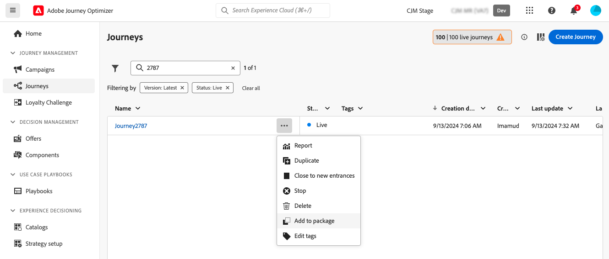
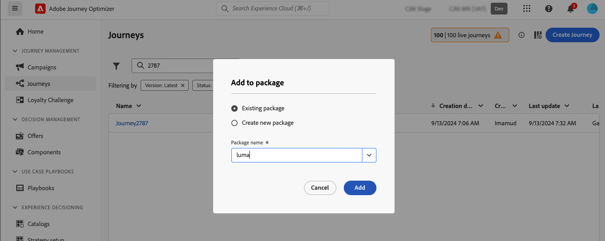
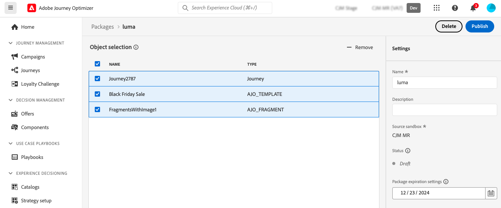
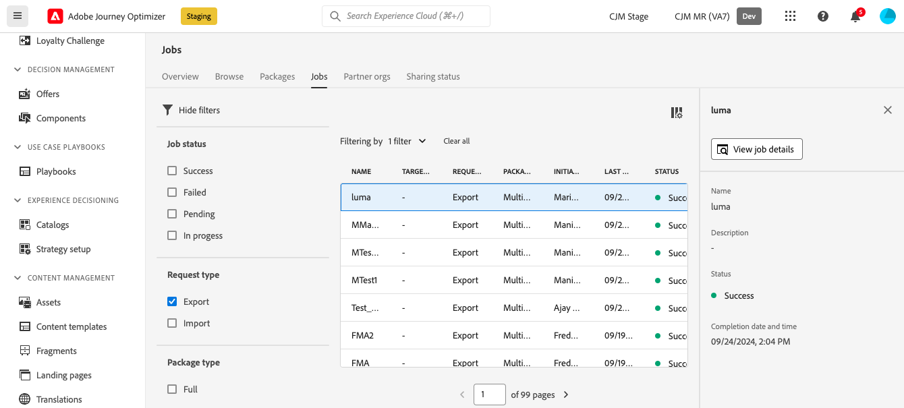
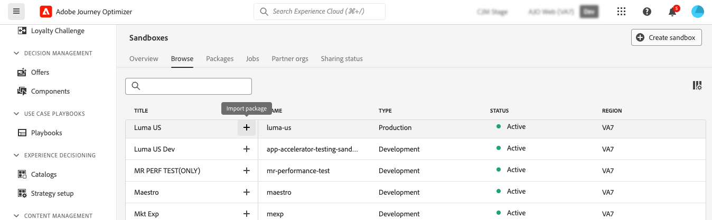
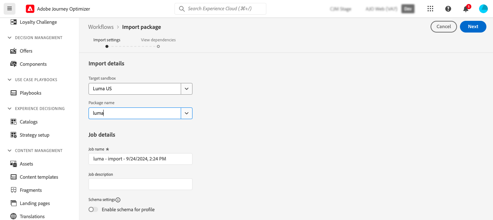
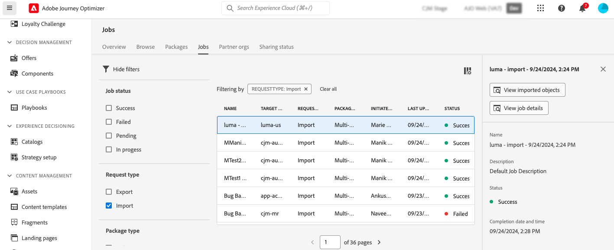

# 將物件匯出至另一個沙箱 {#copy-to-sandbox}

您可以使用套件匯出和匯入功能，跨多個沙箱複製物件，例如歷程、自訂動作、內容範本或片段。 套件可以包含單一物件或多個物件。 套件中包含的任何物件都必須來自相同沙箱。

本頁說明Journey Optimizer內容中的沙箱工具使用案例。 如需功能本身的詳細資訊，請參閱Adobe Experience Platform [沙箱工具指南](https://experienceleague.adobe.com/docs/experience-platform/sandbox/ui/sandbox-tooling.html#abobe-journey-optimizer-objects){target="_blank"}。

>[!NOTE]
>
>此功能需要&#x200B;**沙箱管理**&#x200B;功能的下列許可權：管理沙箱（或檢視沙箱）和管理套件。 [了解更多](../administration/ootb-permissions.md)

復製程式會透過來源沙箱和目標沙箱之間的套件匯出和匯入進行。 以下是從一個沙箱複製歷程到另一個沙箱的一般步驟：

1. [在來源沙箱中新增要匯出為封裝的物件](#export)
1. [發佈套件](#publish)
1. [將套件匯入目標沙箱中](#import)

## 匯出的物件與最佳實務 {#objects}

Journey Optimizer可將歷程、自訂動作、內容範本、片段和其他物件匯出至另一個沙箱。 以下各節提供每種物件型別的資訊和最佳實務。

### 一般最佳實務 {#global}

* 複製物件時，父物件中的任何相依性（例如巢狀片段、歷程對象或動作）都會正確更新，以確保目標沙箱中的對應正確。

* 如果匯出的物件包含設定檔個人化，請確定目標沙箱中存在適當的結構描述，以避免任何個人化問題。

* 登陸頁面目前不支援在沙箱之間移轉。 將歷程複製到另一個沙箱時，歷程中任何對登陸頁面的參考或電子郵件內容仍會指向原始（來源）沙箱登陸頁面ID。 移轉後，您必須手動更新歷程和電子郵件內容中的所有登陸頁面參考，以使用來自目標（目的地）沙箱的正確登陸頁面ID。 請參閱[建立和發佈登入頁面](../landing-pages/create-lp.md)。

+++ 歷程

* **複製的相依性** — 在匯出歷程時，除了歷程本身，Journey Optimizer也會複製歷程所依賴的大部分物件：受眾、自訂動作、結構描述、事件和動作。 如需所複製物件的詳細資訊，請參閱Adobe Experience Platform [沙箱工具指南](https://experienceleague.adobe.com/docs/experience-platform/sandbox/ui/sandbox-tooling.html#abobe-journey-optimizer-objects){target="_blank"}。

* **建議手動驗證** — 我們不保證所有連結的元素都會複製到目的地沙箱。 我們強烈建議您執行徹底檢查，例如在發佈歷程之前。 這可讓您識別任何可能遺失的物件。

* **草稿模式與唯一性** — 目標沙箱中複製的物件是唯一的，並且沒有覆寫現有元素的風險。 歷程及歷程內的任何訊息都會以草稿模式帶入。 這可讓您在目標沙箱上發佈之前執行徹底驗證。

* **中繼資料** — 復製程式只會複製歷程的相關中繼資料以及該歷程中的物件。 此程式不會複製任何設定檔或資料集資料。

* **自訂動作**

   * 匯出自訂動作時，會複製URL設定和裝載引數。 然而，基於安全考量，驗證引數不會複製，而是以「在此處插入密碼」取代。 常數請求標題和查詢引數值也由「在此插入密碼」取代。

     這包括特殊用途的自訂動作([!DNL Adobe Campaign Standard]、[!DNL Campaign Classic]、[!DNL Marketo Engage])。

   * 將歷程複製到另一個沙箱時，如果您在匯入程式期間為自訂動作選取「使用現有」，則您選取的現有自訂動作必須與來源自訂動作相同（即相同的設定、引數等）。 否則，新的歷程副本將有無法在畫布中解決的錯誤。

* **資料來源、欄位群組和事件** — 複製使用事件、資料來源或欄位群組的歷程時，匯入程式會自動檢查目標沙箱中是否已有相同名稱和型別的元件。 例如，單一事件將由目標沙箱中具有相同名稱的單一事件取代。 這同樣適用於業務事件、自訂資料來源，以及歷程中使用的API型與結構描述型欄位群組。 如果來源沙箱的單一事件與業務事件目的地沙箱具有相同的名稱，則不會複製或建立該事件 — 這也會套用至所有其他元件。

+++

+++ 行銷活動

行銷活動會連同與輪廓、對象、結構描述、內嵌訊息以及從屬物件相關的所有項目一起複製。 但是，下列專案&#x200B;**不是**&#x200B;已複製：

* 多語言變體和語言設定，
* 商業規則，
* 標籤，
* 資料使用標籤和實行(DULE)標籤。

複製行銷活動時，請確保下方列出的物件已在目標沙箱中驗證，以避免錯誤設定：

* **管道設定**：管道設定會與行銷活動一起複製。 複製行銷活動後，必須在目標沙箱中手動選取管道設定。
* **實驗變體和設定**：實驗變體和設定包含在行銷活動復製程式中。 匯入後，在目標沙箱中驗證這些設定。
* **整合式決策**：決策原則與決策專案支援匯出與匯入。 確保決策相關的相依性在目標沙箱中正確對應。

+++

+++ 決策

* 在複製決定物件之前，以下物件必須存在於目的地沙箱中：

   * 用於決策物件的設定檔屬性，
   * 自訂選件屬性的欄位群組，
   * 用於跨規則、排名或上限之內容屬性的資料串流結構。

* 目前不支援使用AI模型排名公式的沙箱複製。

* 複製行銷活動時，不會自動複製決定專案（優惠專案）。 請務必使用「新增至封裝」選項來個別複製它們。

* 如果決定原則具有選擇策略，則必須單獨新增決定專案。 如果有手動/備援決策專案，就會自動新增為直接相依性。

* 複製決定實體時，請務必在&#x200B;**任何其他物件之前複製決定專案**。 例如，如果您先複製集合，而新沙箱中沒有選件，則該新集合將保持空白。

* 複製具有相依性的實體時（例如，架構、區段），按一下實體的「新建」以取消選取它，並顯示相依人工因素的「使用現有」選項。 其他相依性可能需要在階層中更進一步重複此步驟。

  範例：匯入促銷活動時，若要在規則中重複使用資料流綱要，請按一下DECISIONING_STRATEGY的「新建」，然後在DECISIONING_RULES上按一下，以顯示資料流綱要的「使用現有」選項。

* 對於相依於資料流內容結構描述的實體，請確保資料流已預先建立，並為該資料流選取現有結構描述。

* 如果您在匯入時直接按一下「完成」，則會重新建立所有相依性。

+++

+++ 內容範本

* 匯出內容範本時，所有巢狀片段也會一併複製。

* 匯出內容範本有時會導致片段重複。 例如，如果兩個範本共用相同的片段並且在不同的套件中複製，則兩個範本都需要在目標沙箱中重複使用相同的片段。 若要避免重複，請在匯入過程中選取「使用現有」選項。 [瞭解如何匯入套件](#import)

* 若要進一步避免重複，建議匯出單一套件中的內容範本。 這可確保系統有效率地管理重複資料刪除。

+++

+++ 片段

* 片段可以有多個狀態，例如即時、草稿和即時草稿。 匯出片段時，其最新的草稿狀態會複製到目標沙箱。

* 匯出片段時，也會一併複製所有巢狀片段。

+++

## 將物件新增為封裝 {#export}

若要將物件複製到另一個沙箱，您首先需要將其新增為來源沙箱中的套件。 請依照下列步驟操作：

1. 導覽至儲存第一個要複製之物件的詳細目錄，例如歷程清單。 按一下&#x200B;**更多動作**&#x200B;圖示（物件名稱旁邊的三個點），然後按一下&#x200B;**新增到封裝**。

   

1. 在&#x200B;**新增至封裝**&#x200B;視窗中，選擇您要將物件新增至現有的封裝，還是要建立新的封裝：

   

   * **現有的封裝**：從下拉式功能表中選取封裝。
   * **建立新封裝**：輸入封裝名稱。 您也可以新增說明。

1. 重複這些步驟，以新增所有要與封裝一起匯出的物件。

## 發佈要匯出的套件 {#publish}

準備好要匯出套件後，請依照下列步驟進行發佈：

1. 瀏覽至&#x200B;**[!UICONTROL 管理]** > **[!UICONTROL 沙箱]**&#x200B;功能表，選取&#x200B;**套件**&#x200B;標籤。

1. 開啟您要匯出的封裝，選取您要匯出的物件，然後按一下&#x200B;**發佈**。

   在此範例中，我們要匯出歷程、內容範本和片段。

   

1. 若要從&#x200B;**[!UICONTROL 工作]**&#x200B;索引標籤追蹤封裝發行集的狀態。 如需工作的詳細資訊，請從清單中選取該工作，然後按一下&#x200B;**[!UICONTROL 檢視匯入詳細資料]**&#x200B;按鈕。

   

## 將套件匯入目標沙箱中 {#import}

發佈套件後，您需要將它匯入目標沙箱。 請依照下列步驟操作：

1. 瀏覽至&#x200B;**[!UICONTROL 沙箱]**&#x200B;功能表，並選取&#x200B;**[!UICONTROL 瀏覽]**&#x200B;標籤。

1. 搜尋您要匯入封裝的沙箱，然後按一下其名稱旁的+圖示。

   

   >[!NOTE]
   >
   >只能使用您的組織內的沙箱。

1. 在&#x200B;**目標沙箱**&#x200B;欄位中，檢查是否已選取正確的目標沙箱，並從&#x200B;**[!UICONTROL 封裝名稱]**&#x200B;下拉式清單中選取要匯入的封裝。 按一下&#x200B;**下一步**。

   

1. 檢閱套裝程式物件與相依性。 這是已新增至封裝的物件清單，以及其他物件歷程，視受眾、結構描述、事件或動作而定。

   對於每個物件，您可以選擇建立新物件或使用目標沙箱中的現有物件。 舉例來說，這可讓您避免使用通用片段匯入內容範本時可能會發生的片段重複。

   

1. 按一下右上角的&#x200B;**完成**&#x200B;按鈕，開始將封裝複製到目標沙箱。 復製程式會因物件的複雜性以及需要複製多少物件而有所不同。

1. 按一下匯入工作以複查複製結果：

   * 按一下&#x200B;**檢視匯入的物件**&#x200B;按鈕，以顯示每個已複製的個別物件。
   * 按一下&#x200B;**檢視匯入詳細資料**&#x200B;按鈕，檢查每個物件的匯入結果。

   

1. 存取您的目標沙箱，並對所有複製的物件執行徹底檢查。
