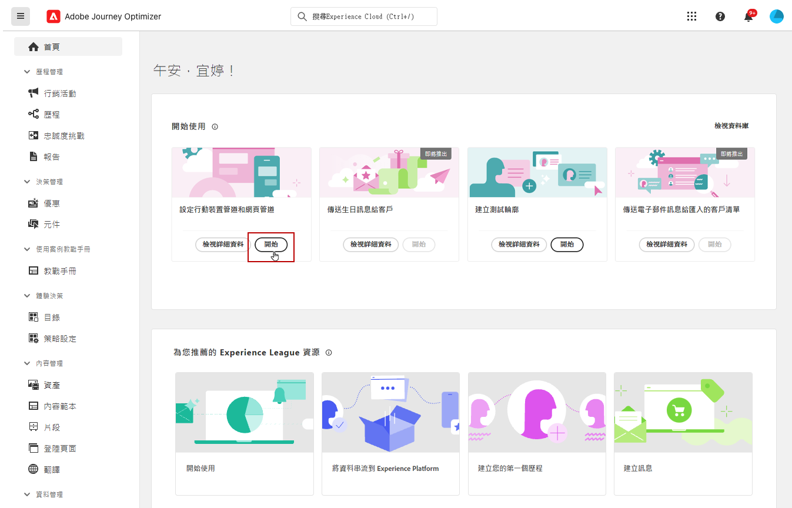
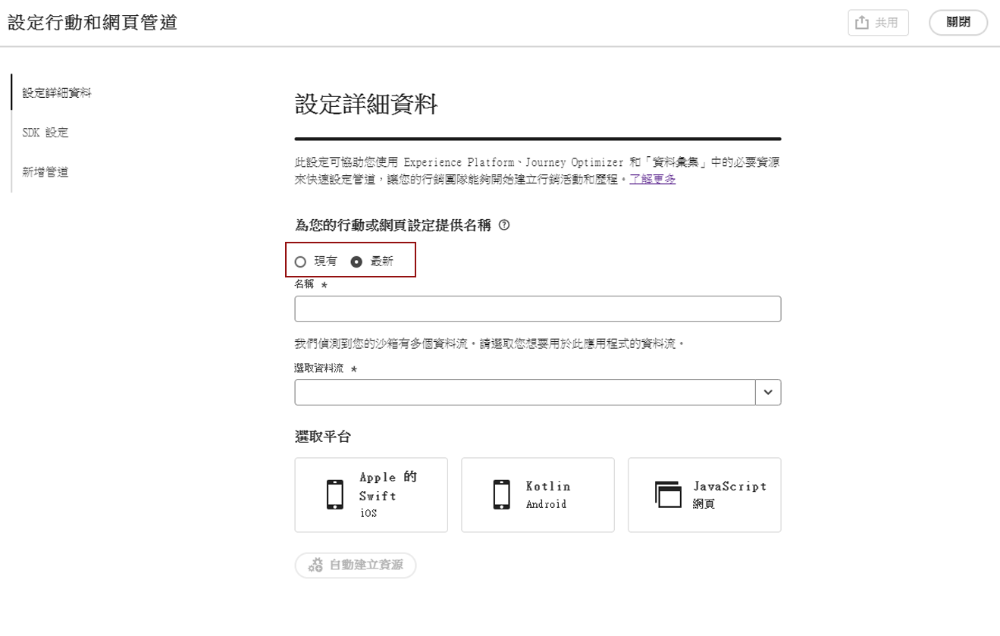
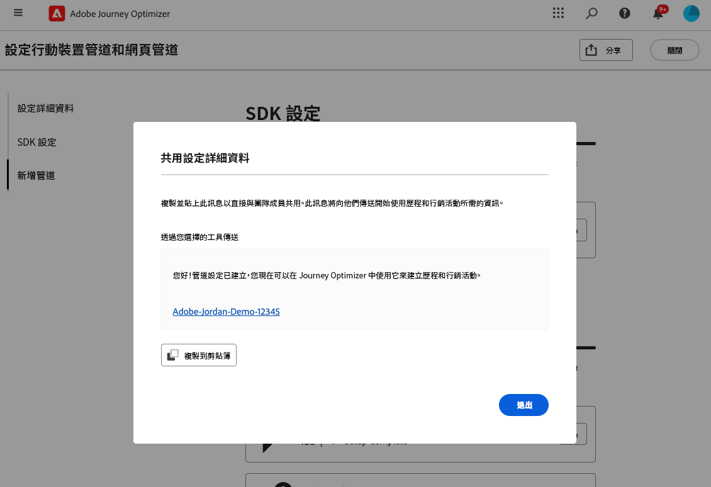
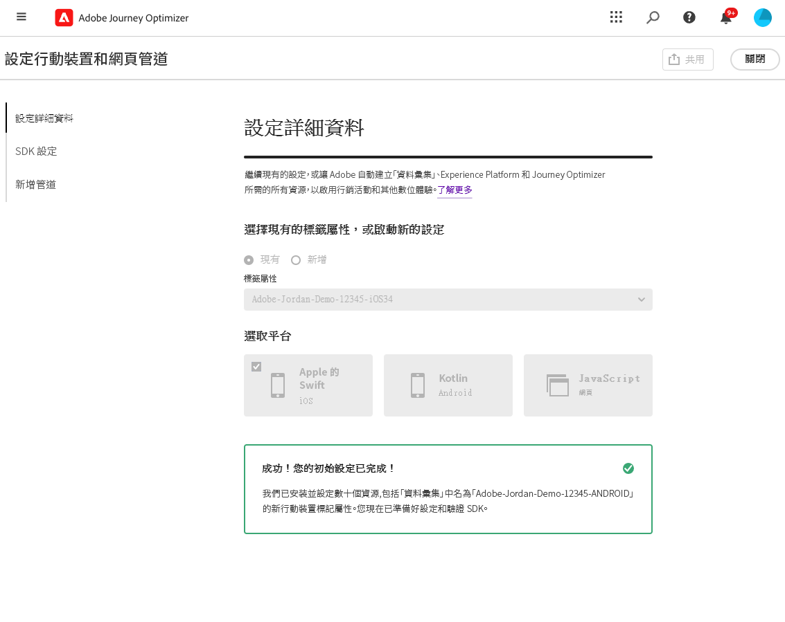
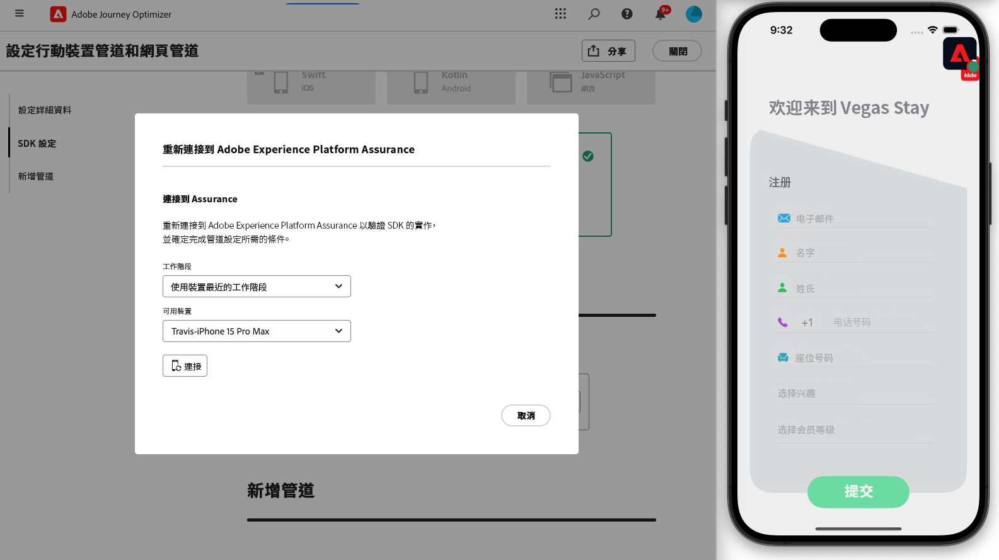

# 建立管道設定 {#set-mobile-ios}

>[!CONTEXTUALHELP]
>id="ajo_mobile_web_setup_javascript_code"
>title="Javascript 程式碼"
>abstract="此標頭標記包含在網頁主要內容之前載入的重要中繼資料和資源。將程式碼放置在此區段中可確保其正確初始化並儘早執行，使您的網頁以有效率的方式載入和運作。透過在標頭區段新增程式碼，您可以協助提升網站的結構、效能和整體使用者體驗。"

>[!CONTEXTUALHELP]
>id="ajo_mobile_web_setup_push_token"
>title="獲取裝置語彙基元"
>abstract="為了確保裝置的推播權杖與您的 Adobe Experience Platform 設定檔正確同步，您必須將以下程式碼整合到應用程式中。為了保持最新的通訊功能和確保順暢的使用者體驗，此整合相當重要。"

>[!CONTEXTUALHELP]
>id="ajo_mobile_web_setup_push_xcode"
>title="從 Xcode 啟動應用程式"
>abstract="若要取得推播權杖，請先使用 Xcode 啟動您的應用程式。應用程式啟動後，請將其重新啟動以確保驗證程序完成。Adobe 隨後將提供您的推播權杖作為驗證結果的一部分。此權杖對於啟用推播通知相當重要，而且將在設定成功驗證之後顯示。"

>[!CONTEXTUALHELP]
>id="ajo_mobile_web_push_certificate_fcm"
>title="提供推播憑證"
>abstract="拖放您的 .json private 私密金鑰檔案。此檔案包含應用程式和伺服器之間的安全整合與通訊所需的驗證資訊。"

>[!CONTEXTUALHELP]
>id="ajo_mobile_web_setup_push_certificate"
>title="提供推播憑證"
>abstract=".p8 金鑰檔案包含一個私密金鑰，用來透過 Apple 伺服器對您的應用程式進行驗證，以實現安全的推播通知。您可以從您開發人員帳戶中的「憑證、識別碼和設定檔」頁面獲得此金鑰。"

>[!CONTEXTUALHELP]
>id="ajo_mobile_web_setup_push_key_id"
>title="金鑰 ID"
>abstract="金鑰 ID 是在建立 p8 驗證金鑰期間指派的 10 字元字串，可在您開發人員帳戶中的「憑證、識別碼和設定檔」頁面的「**金鑰**」標籤下方找到。"

>[!CONTEXTUALHELP]
>id="ajo_mobile_web_setup_push_team_id"
>title="團隊 ID"
>abstract="團隊 ID 是用來識別您的團隊的字串值，位於您開發人員帳戶中的「**會籍**」索引標籤下方。"

此設定簡化快速設定行銷頻道，隨時都能在 Experience Platform、Journey Optimizer 及資料彙集應用程式取得所有必要資源。這可讓行銷團隊快速開始建立行銷活動與歷程。

1. 從 Journey Optimizer 首頁的&#x200B;**[!UICONTROL 設定行動和網路管道]**&#x200B;卡片中，按一下&#x200B;**[!UICONTROL 開始]**。

   

1. 建立&#x200B;**[!UICONTROL 新的]**&#x200B;設定。

   如果您已有現有的設定，您可以選擇選取一個設定，或建立新的設定。

   

1. 輸入新設定的&#x200B;**[!UICONTROL 名稱]**，然後選取或建立&#x200B;**[!UICONTROL 資料流]**。此&#x200B;**[!UICONTROL 名稱]**&#x200B;將用於每個自動建立的資源。

1. 如果您的組織有多個資料流，請從現有選項中選取一個資料流。如果您沒有資料流，系統會自動為您建立一個資料流。

1. 選取您的平台，然後按一下&#x200B;**[!UICONTROL 自動建立資源]**。

1. 為了簡化設定程式，系統會自動建立必要資源來協助您開始使用。這包括建立新的&#x200B;**[!UICONTROL 行動標記屬性]**&#x200B;以及安裝擴充功能。

[了解更多有關自動產生的資源](set-mobile-config.md#auto-create-resources)

1. 完成資源產生後，請依照使用者介面中的指示，設定和驗證 SDK 與管道。

1. 完成設定後，請將自動產生的&#x200B;**[!UICONTROL 管道設定]**&#x200B;與負責建立歷程與行銷活動的團隊成員共用。

   {zoomable="yes"}

1. 您現在可於「行銷活動」或「歷程」介面中參考&#x200B;**[!UICONTROL 管道設定]**，以讓您的設定與為對象執行的目標歷程和行銷活動之間順暢連線。

## 修改行動裝置現有設定 {#reconnect}

建立設定後，您可以隨時輕鬆重新造訪，以新增其他管道或進一步調整以符合您的需求

1. 從 Journey Optimizer 首頁的&#x200B;**[!UICONTROL 設定行動和網路管道]**&#x200B;卡片中，按一下&#x200B;**[!UICONTROL 開始]**。

   

1. 選取&#x200B;**[!UICONTROL 現有]**，然後從下拉式清單中選擇現有的&#x200B;**[!UICONTROL 標記屬性]**。

   

1. 存取現有設定時，您需要與 Adobe Assurance 重新連線。在「SDK 設定」功能表，按一下&#x200B;**[!UICONTROL 重新連線]**。

   

1. 從&#x200B;**[!UICONTROL 可用的裝置]**&#x200B;下拉式清單中選取您的裝置，然後按一下&#x200B;**[!UICONTROL 連線]**。

   {zoomable="yes"}

1. 您現在可以根據需要更新設定。
