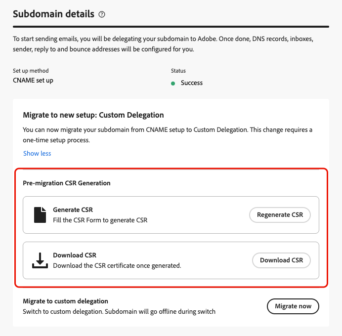
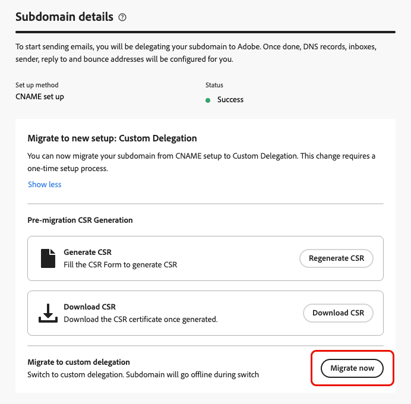
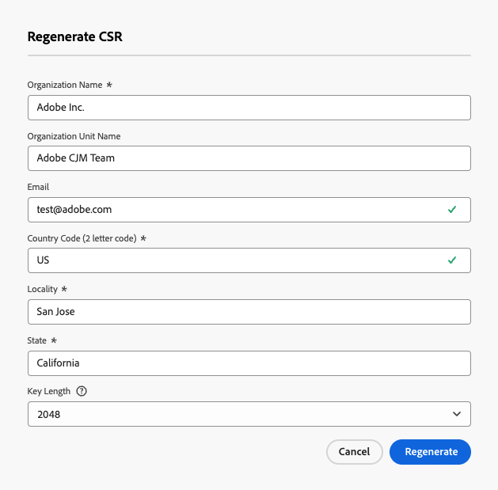
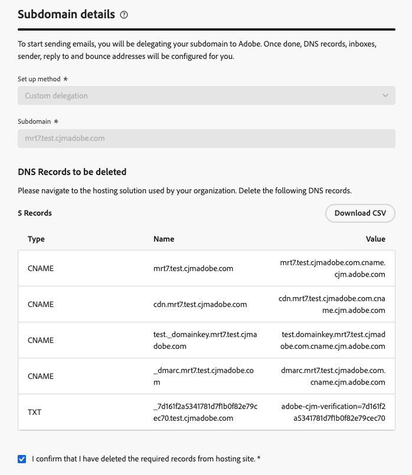
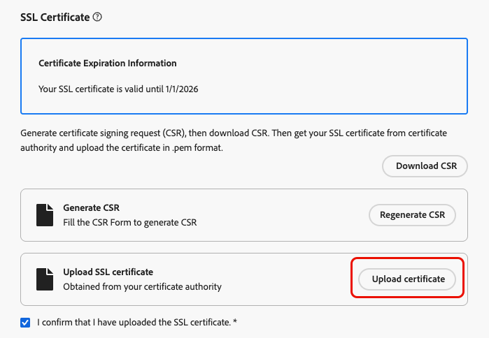
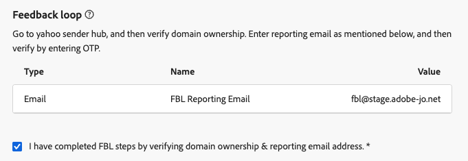

# 將電子郵件子網域從CNAME移轉至自訂委派 {#migrate-cname-to-custom}

>[!AVAILABILITY]
>
>此功能為有限可用性。請聯絡您的 Adobe 代表以取得存取權。

如果您的子網域目前設定了[CNAME](about-subdomain-delegation.md#cname-subdomain-setup)，您可以將其移轉至&#x200B;**[!UICONTROL 自訂委派]**&#x200B;方法，以符合貴公司的安全性原則。 這可讓您完全擁有並控制[!DNL Journey Optimizer]中的子網域和憑證。 [進一步瞭解自訂子網域](delegate-custom-subdomain.md)

在此程式中，您需要：

* [從您的代管解決方案刪除現有的DNS記錄](#delete-dns)
* [上傳從憑證授權單位取得的SSL憑證](#upload-ssl-certificate)
* 驗證網域擁有權並報告電子郵件地址，以完成[回饋回圈步驟](#feedback-loop)
* [將Adobe產生的SSL CDN URL驗證記錄](#copy-ssl-cdn-url-record)複製到您的代管平台

若要移轉子網域，請遵循下列步驟。

## 開始之前 {#before-you-begin}

開始移轉程式前，請檢閱下列重要資訊。

>[!IMPORTANT]
>
>您只能移轉使用[CNAME方法](delegate-subdomain.md#cname-subdomain-setup)設定的子網域。

* 請確定貴組織已啟用&#x200B;**自訂委派方法** (此功能目前處於「有限可用性」 — 請聯絡您的Adobe代表以取得存取權)。 [了解更多](delegate-custom-subdomain.md)
* 請確認沒有任何使用中的管道設定使用此子網域。 移轉程式將會中斷其功能。
* 請確認沒有任何作用中的行銷活動或歷程使用連結至此子網域的管道設定，因為這可能會造成傳送中斷。
* 請注意，當您進入移轉流程時，停機時間就會開始。 子網域在程式進行期間會移至&#x200B;**[!UICONTROL 草稿]**，並在安裝完成前無法使用。
* 因此，建議在開始移轉程式之前&#x200B;**執行移轉前步驟**，以準備好SSL憑證並減少停機時間。 [了解更多](#start-migration)

## 開始移轉 {#start-migration}

請依照下列步驟，開始移轉指定的子網域。

1. 移至&#x200B;**[!UICONTROL 管理]** > **[!UICONTROL 管道]** > **[!UICONTROL 電子郵件設定]** > **[!UICONTROL 子網域]**。

1. 選取使用CNAME設定的子網域並開啟它。

1. 您可以使用&#x200B;**[!UICONTROL 移轉前CSR產生]**&#x200B;區段來產生CSR，以將其傳送給憑證授權單位，並在移轉程式開始時備妥SSL憑證。 [了解作法](#send-csr-to-ca)

   >[!IMPORTANT]
   >
   >此階段的移轉前步驟為選用，但強烈建議使用。 在&#x200B;**開始移轉前**&#x200B;完成這些作業可縮短停機時間，並有助於確保順利轉換。

   {width="70%"}

1. 在專用區段中選取&#x200B;**[!UICONTROL 立即移轉]**。

   <!--{width=90%}-->

1. 檢閱顯示的[資訊](#before-you-begin)。

   >[!WARNING]
   >
   >當您進入移轉流程時，停機就會開始，因此請確定這不會影響您使用中的行銷活動和歷程。

1. 按一下&#x200B;**[!UICONTROL 是]**。 子網域會移至&#x200B;**[!UICONTROL 草稿]**&#x200B;狀態，並在安裝完成前無法使用。

## 產生CSR並傳送給憑證授權單位 {#send-csr-to-ca}

若要完成移轉，您需要由憑證授權單位(CA)核發的SSL憑證。 若要接收此SSL憑證，您必須先產生憑證申請檔(CSR)並將其傳送給CA。

無論您是否已開始移轉程式，請依照下列步驟產生並傳送新的CSR。

1. 按一下&#x200B;**[!UICONTROL 重新產生CSR]**。

1. 填寫顯示並重新產生憑證申請檔(CSR)的表單。

   {width="60%"}

   >[!NOTE]
   >
   >金鑰長度只能是 2048 位元或 4096 位元。子網域提交後便無法變更金鑰長度。

1. 按一下&#x200B;**[!UICONTROL 下載CSR]**&#x200B;並將表單儲存到您的本機電腦。

1. 將它傳送給憑證授權單位(CA)以取得您的SSL憑證。 在將此CSR提交給CA進行簽署之前，請注意以下幾個重要事項：

   * 從步驟3下載的CSR僅適用於data.subdomain.com。

   * 不過，憑證應同時涵蓋data.subdomain.com和cdn.subdomain.com ，做為單一憑證中的主體替代名稱(SAN)專案。 例如，如果您委派example.adobe.com，則data.subdomain.com會對應至data.example.adobe.com，而cdn.subdomain.com會對應至cdn.example.adobe.com。

   * 資料(data.example.adobe.com)和CDN (cdn.example.adobe.com)子網域都需要新增為相同憑證中的對等專案。

   * 大部分的CA都允許您在簽署過程中新增其他SAN （例如CDN子網域）

      * 透過CA入口網站（建議使用，如果有的話），或
      * 如果入口網站選項無法使用，請手動向他們的支援團隊請求。

   * 簽署後，CA將會核發單一憑證，涵蓋Data網域和CDN子網域。

## 刪除現有的DNS記錄 {#delete-dns}

開始移轉程式後，您需要從託管解決方案中刪除現有的DNS記錄。 請遵循下列步驟。

1. 目前在DNS伺服器中設定的記錄清單隨即顯示。

1. 導覽至您的網域託管解決方案，並從您的DNS託管中刪除現有的CNAME專案。

1. 請確定所有DNS記錄都已刪除。 完成後，勾選「我確認我已從代管網站刪除所需記錄」方塊。

   {width="75%"}

## 上傳SSL憑證 {#upload-ssl-certificate}

在&#x200B;**[!UICONTROL SSL憑證]**&#x200B;區段中，您需要將新的SSL憑證上傳至[!DNL Journey Optimizer]。

在此之前，請確認下列事項：

* 如果您已經將您的CSR作為[移轉前步驟](#start-migration)的一部分傳送給憑證授權單位，請確定您已收到SSL憑證。

* 如果您尚未這樣做，請依照步驟[產生、下載及傳送CSR](#send-csr-to-ca)。

<!--
    * Click **[!UICONTROL Regenerate CSR]** and fill the form to generate the Certificate Signing Request.

    * Click **[!UICONTROL Download CSR]** to save the form to your local computer.

    * Send the CSR to the Certificate Authority to get your SSL certificate.-->

1. 當您擷取SSL憑證時，請按一下&#x200B;**[!UICONTROL 上傳憑證]**。

   {width="75%"}

1. 使用完整的憑證鏈將SSL憑證上傳至.pem格式的[!DNL Journey Optimizer]。 以下是.pem檔案格式的範例：

   ```
   -----BEGIN CERTIFICATE-----
   MIIDXTCCAkWgAwIBAgIJALc3... (base64 encoded data)
   -----END CERTIFICATE-----
   ```

1. 勾選「我確認我已上傳SSL憑證」方塊。

## 完整的回饋迴路 {#feedback-loop}

然後，完成回饋回圈步驟以驗證網域所有權並報告電子郵件地址。

{width="75%"}

此程式與設定新的自訂子網域時的程式相同。 請依照[設定自訂子網域](delegate-custom-subdomain.md#feedback-loop-steps)頁面上詳述的步驟操作。

## 複製SSL CDN URL驗證記錄 {#copy-ssl-cdn-url-record}

若要完成移轉程式，請將Adobe產生的SSL CDN URL驗證記錄複製到您的代管平台。 此程式與設定新的自訂子網域時的程式相同。 請依照[設定自訂子網域](delegate-custom-subdomain.md#copy-ssl-cdn-url-record)頁面上詳述的步驟操作。

提交後，您必須等待Adobe執行所需檢查，最多可能需要3小時。 [了解更多](delegate-subdomain.md#submit-subdomain)

一旦子網域再次啟用，使用它的現有管道設定就不需要變更，而是能繼續如前運作。

**另請參閱**

* [設定自訂子網域](delegate-custom-subdomain.md)
* [子網域委派方法](about-subdomain-delegation.md#subdomain-delegation-methods)
