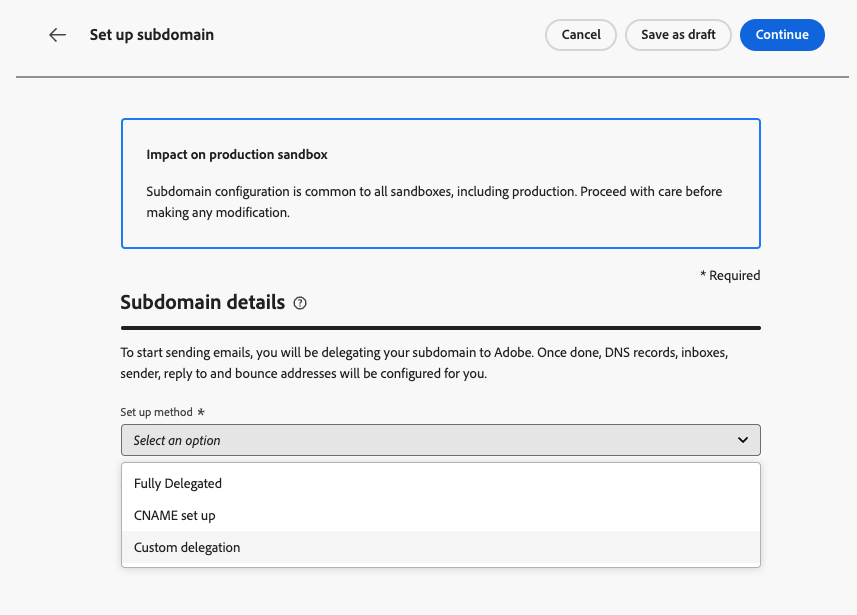
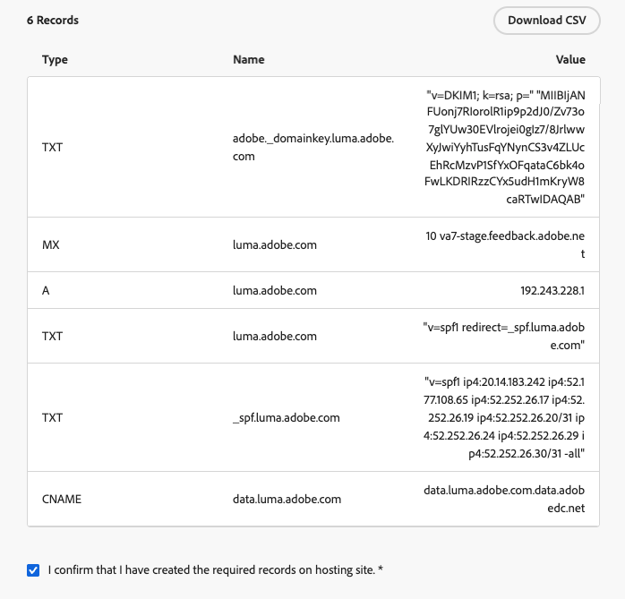
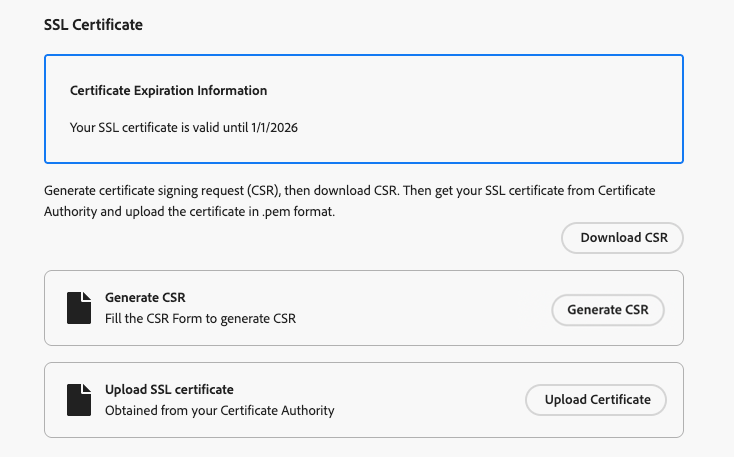
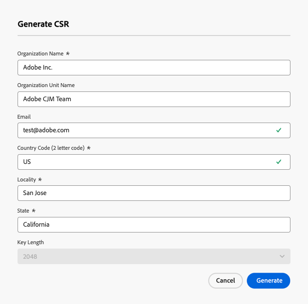
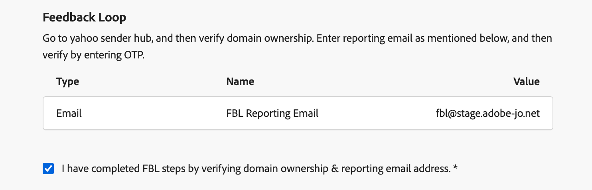

# 設定自訂子網域 {#delegate-custom-subdomain}

>[!AVAILABILITY]
>
>此功能為「有限可用性」的狀態。請聯絡您的 Adobe 代表以取得存取權。

作為[完全委派](about-subdomain-delegation.md#full-subdomain-delegation)和[CNAME設定](about-subdomain-delegation.md#cname-subdomain-delegation)方法的替代方法，**自訂委派**&#x200B;方法可讓您取得Journey Optimizer執行個體的子網域所有權，以完全控制產生的憑證。

在此程式中，Adobe需要確定您的DNS已正確設定，可用於傳遞、轉譯和追蹤訊息。 這就是為什麼您將需要[上傳從憑證授權單位取得的SSL憑證](#upload-ssl-certificate)，並透過驗證網域擁有權及報告電子郵件地址來完成[回圈步驟](#feedback-loop-steps)。

若要設定自訂子網域，請遵循下列步驟。

1. 存取&#x200B;**[!UICONTROL 管理]** > **[!UICONTROL 管道]** > **[!UICONTROL 電子郵件設定]** > **[!UICONTROL 子網域]**&#x200B;功能表。

1. 按一下&#x200B;**[!UICONTROL 設定子網域]**。

1. 從&#x200B;**[!UICONTROL 設定方法]**&#x200B;區段中，選取&#x200B;**[!UICONTROL 自訂委派]**。

   {width=90%}

1. 指定要委派的子網域名稱。

   >[!CAUTION]
   >
   >您無法使用相同的傳送網域從[!DNL Adobe Journey Optimizer]和其他產品（例如[!DNL Adobe Campaign]或[!DNL Adobe Marketo Engage]）傳送訊息。

## 建立 DNS 記錄 {#create-dns-records}

>[!CONTEXTUALHELP]
>id="ajo_admin_subdomain_custom_dns"
>title="產生相符的 DNS 記錄"
>abstract="若要將自訂子網域委派給 Adobe，您必須將 Journey Optimizer 介面中顯示的名稱伺服器資訊複製並貼上到您的網域託管解決方案中，以產生相符的 DNS 記錄。"

1. 要放置在 DNS 伺服器顯示中的記錄清單。 逐一複製這些記錄，或下載CSV檔案。

1. 導覽至您的網域託管解決方案，以產生相符的DNS記錄。

1. 請確定所有DNS記錄都已產生至您的網域託管解決方案。

1. 如果所有專案都已正確設定，請勾選「我確認……」方塊。

   {width="75%"}

## 上傳 SSL 憑證 {#upload-ssl-certificate}

>[!CONTEXTUALHELP]
>id="ajo_admin_subdomain_custom-ssl"
>title="產生憑證申請檔"
>abstract="在設定新的自訂子網域時，您必須產生憑證申請檔 (CSR)，填寫並將其傳送至憑證授權單位，以取得需要上傳至 Journey Optimizer 的 SSL 憑證。"

>[!CONTEXTUALHELP]
>id="ajo_admin_subdomain_key_length"
>title="選取金鑰長度"
>abstract="金鑰長度只能是 2048 位元或 4096 位元。子網域提交後便無法變更金鑰長度。"

1. 在&#x200B;**[!UICONTROL SSL憑證]**&#x200B;區段中，按一下&#x200B;**[!UICONTROL 產生CSR]**。

   {width="85%"}

   >[!NOTE]
   >
   >畫面會顯示您的SSL憑證到期日。 到達日期後，您需要上傳新憑證。

1. 填寫顯示和產生憑證申請檔(CSR)的表單。

   {width="70%"}

   >[!NOTE]
   >
   >金鑰長度只能是 2048 位元或 4096 位元。子網域提交後便無法變更金鑰長度。

1. 按一下&#x200B;**[!UICONTROL 下載CSR]**&#x200B;並將表單儲存到您的本機電腦。

1. 將它傳送給憑證授權單位(CA)以取得您的SSL憑證。 在將此CSR提交給CA進行簽署之前，請注意以下幾個重要事項：

   * 從步驟3下載的CSR僅適用於data.subdomain.com。

   * 不過，憑證應同時涵蓋data.subdomain.com和cdn.subdomain.com ，做為單一憑證中的主體替代名稱(SAN)專案。 例如，如果您委派example.adobe.com，則data.subdomain.com會對應至data.example.adobe.com，而cdn.subdomain.com會對應至cdn.example.adobe.com。

   * 資料(data.example.adobe.com)和CDN (cdn.example.adobe.com)子網域都需要新增為相同憑證中的對等專案。

   * 大部分的CA都允許您在簽署過程中新增其他SAN （例如CDN子網域）

      * 透過CA入口網站（建議使用，如果有的話），或
      * 如果入口網站選項無法使用，請手動向他們的支援團隊請求。

   * 簽署後，CA將會核發單一憑證，涵蓋Data網域和CDN子網域。

1. 擷取之後，按一下&#x200B;**[!UICONTROL 上傳SSL憑證]**&#x200B;並將憑證上傳到.pem格式的[!DNL Journey Optimizer]，並附上完整的憑證鏈結。 以下是.pem檔案格式的範例：

   ```
   -----BEGIN CERTIFICATE-----
   MIIDXTCCAkWgAwIBAgIJALc3... (base64 encoded data)
   -----END CERTIFICATE-----
   ```

<!--
>[!CAUTION]
>
>Both Data and CDN subdomains must be included in the same certificate.
-->

## 完成回饋迴路步驟 {#feedback-loop-steps}

>[!CONTEXTUALHELP]
>id="ajo_admin_subdomain_feedback-loop"
>title="完成回饋迴路步驟"
>abstract="前往 Yahoo! Sender Hub，並填寫表單以驗證網域所有權。輸入下方列出的 FBL 報告電子郵件地址，並使用將收到的 OTP 來驗證 Yahoo! Sender Hub 的所有權。"

1. 前往[Yahoo！ 寄件者中心](https://senders.yahooinc.com/)網站並填寫驗證您網域擁有權的必要表單。

1. 若要驗證網域擁有權，Yahoo！ 寄件者中心會要求您提供電子郵件地址。 輸入列在&#x200B;**[!UICONTROL 值]**&#x200B;下的FBL報表電子郵件地址。 這是Adobe擁有的電子郵件地址。

1. 當Yahoo！ 寄件者中心會產生一次性密碼(OTP)，該密碼將傳送至此Adobe位址。

1. 請洽詢將為您提供此OTP的Adobe傳遞團隊。<!--Specify how to reach out + any information that customer should share in the request to deliverability team to get access to the right OTP-->

   >[!CAUTION]
   >
   >OTP的有效期間僅為24小時，因此請務必在OTP產生後立即聯絡Adobe。<!--TBC?-->
   >
   >OTP要求只能在工作日提出。 週末不支援。<!--Add times + timezone-->

1. 在Yahoo！上輸入OTP Sender Hub 的所有權。

1. 請確定您已完成所有回饋回圈步驟。

1. 如果所有專案皆已正確設定，請勾選「我已完成……」方塊。

   {width="85%"}

1. 按一下[繼續]&#x200B;**&#x200B;**，然後等到Adobe驗證記錄是否已在您的代管解決方案上產生且沒有錯誤。 此程式最多可能需要2分鐘。

   >[!NOTE]
   >
   >在繼續之前，請確定所有記錄都已正確建立。

1. Adobe會產生SSL CDN URL驗證記錄。 將此驗證記錄複製到您的代管平台。 如果您已在託管解決方案上正確建立此記錄，請勾選「我確認……」方塊。

1. 按一下&#x200B;**[!UICONTROL 提交]**，讓Adobe執行必要的檢查。 [了解更多](delegate-subdomain.md#submit-subdomain)

## 疑難排解檢查清單 {#check-list}

如果在嘗試提交自訂子網域時發生錯誤，請執行以下疑難排解動作。

* 檢查所有DNS記錄是否已使用DNS查詢工具正確傳播。

* 在上傳之前，請確認您的憑證符合所有技術要求。

* 請確定您的憑證是以正確格式上傳。
