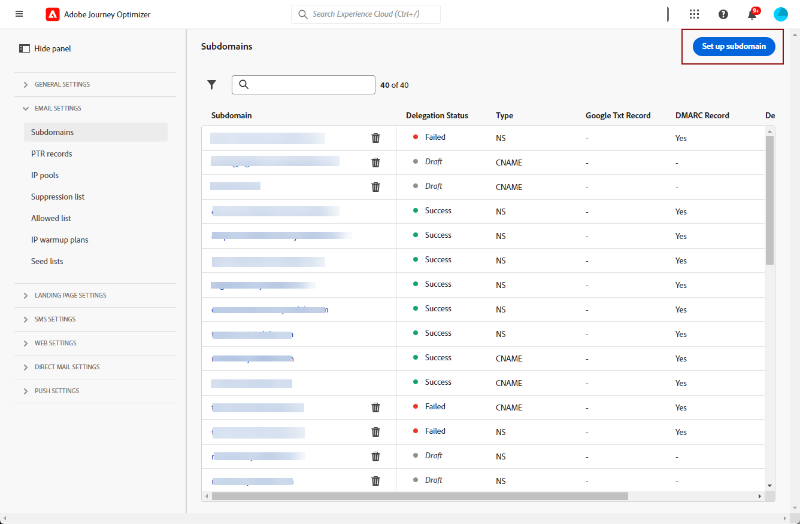
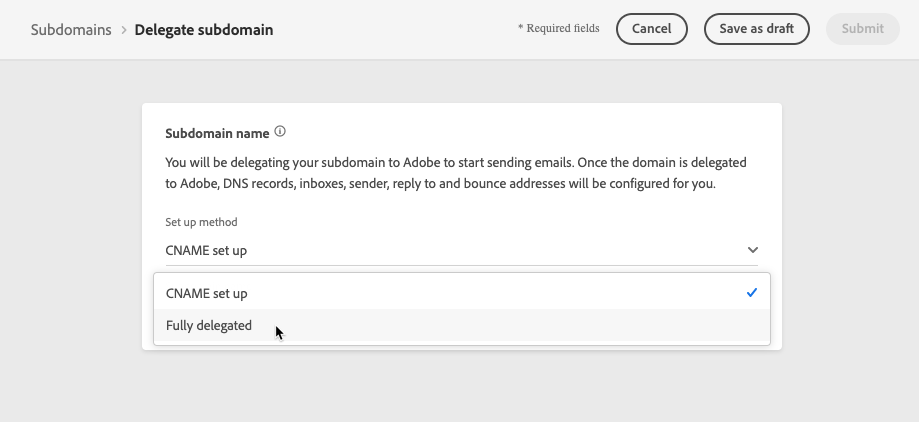
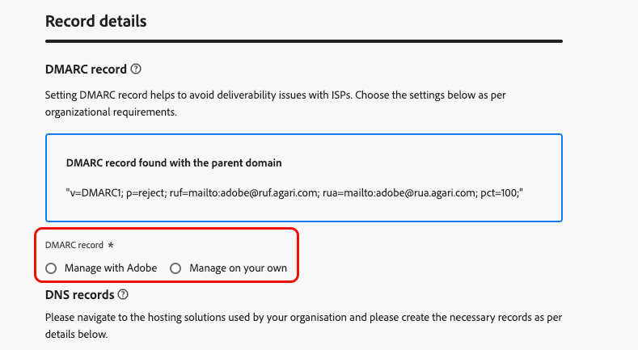

# 委派子網域 {#delegate-subdomain}

>[!CONTEXTUALHELP]
>id="ajo_admin_subdomainname"
>title="子網域委派"
>abstract="Journey Optimizer 可讓您將子網域委派給 Adobe。您可以將子網域完全委派給 Adobe，這是建議的方法。 您還可以使用 CNAME 建立子網域以指向 Adobe 的特定記錄，但這種方法需要您自行維護和管理 DNS 記錄。"
>additional-url="https://experienceleague.adobe.com/zh-hant/docs/journey-optimizer/using/configuration/delegate-subdomains/about-subdomain-delegation#subdomain-delegation-methods" text="子網域設定方法"

>[!CONTEXTUALHELP]
>id="ajo_admin_subdomainname_header"
>title="子網域委派"
>abstract="若要開始傳送電子郵件，您需要將您的子網域委派給 Adobe。完成後，將為您設定 DNS 記錄、收件匣、寄件者、回覆地址和退回地址。"

網域名稱委派是一種方法，可讓網域名稱的所有者（技術上稱為DNS區域）將其細分（技術上稱為DNS區域下的細分）委派給另一個實體。 基本上，身為客戶，如果您處理&quot;example.com&quot;區域，您可以將子網區&quot;marketing.example.com&quot;委派給Adobe。

>[!NOTE]
>
>在[!DNL Journey Optimizer]本節[中進一步瞭解子網域委派以及](about-subdomain-delegation.md)可用的不同方法。

您可以：

* 完全委派子網域 — [瞭解如何進行](#set-up-subdomain)
* 使用CNAME建立子網域以指向Adobe特定記錄 — [瞭解如何進行](#set-up-subdomain)

建議使用&#x200B;**完整子網域委派**&#x200B;方法。 在[本節](about-subdomain-delegation.md#subdomain-delegation-methods)中進一步瞭解不同子網域設定方法之間的差異。

## 護欄 {#guardrails}

在[!DNL Journey Optimizer]中設定子網域時，請遵循下列護欄和建議。

* 依預設，[!DNL Journey Optimizer]可讓您委派&#x200B;**最多10個子網域**。 然而，根據您的授權合約，您最多可委派 100 個子網域。 請聯絡您的 Adobe 聯絡人，了解更多您有權使用的子網域數量。

* [!DNL Journey Optimizer]不支援同時提交子網域。 如果您嘗試在其他子網域處於&#x200B;**[!UICONTROL 處理]**&#x200B;狀態時提交子網域以進行委派，您會收到錯誤訊息。

* 不允許將無效的子網域委派給Adobe。 請務必輸入貴組織所擁有的有效子網域，例如marketing.yourcompany.com。

* 您無法使用相同的傳送網域從[!DNL Adobe Journey Optimizer]和其他產品（例如[!DNL Adobe Campaign]或[!DNL Adobe Marketo Engage]）傳送訊息。

* 不支援委派上層網域和子網域。 例如，如果您委派subdomain.domain.com，則無法委派email.subdomain.domain.com。 同樣地，如果您委派email.subdomain.domain.com，便無法委派subdomain.domain.com。

## 存取委派的子網域 {#access-delegated-subdomains}

所有委派的子網域會顯示在&#x200B;**[!UICONTROL 管理]** > **[!UICONTROL 管道]** > **[!UICONTROL 子網域]**&#x200B;功能表中。 篩選器可協助您調整清單（委派日期、使用者或狀態）。

<!---->

**[!UICONTROL 狀態]**&#x200B;欄提供子網域委派程式的資訊：

* **[!UICONTROL 草稿]**：子網域委派已儲存為草稿。 按一下子網域名稱以繼續委派程式，
* **[!UICONTROL 正在處理]**：子網域正在執行數個組態檢查，然後才能使用，
* **[!UICONTROL 成功]**：子網域已成功通過檢查，且可用於傳遞訊息，
* **[!UICONTROL 失敗]**：提交子網域委派後，一或多個檢查失敗。

若要存取狀態為&#x200B;**[!UICONTROL 成功]**&#x200B;之子網域的詳細資訊，請從清單中開啟該子網域。

您可以：

* 擷取委派過程中設定的子網域名稱（唯讀），以及產生的URL （資源、映象頁面、追蹤URL），

* 將Google網站驗證TXT記錄新增至您的子網域，以確保其已驗證(請參閱[將Google TXT記錄新增至子網域](google-txt.md))。

>[!CAUTION]
>
>子網域設定是&#x200B;**所有環境通用的設定**。 因此，對子網域所做的任何修改也會影響生產沙箱。

## 在 Journey Optimizer 中設定子網域 {#set-up-subdomain}

>[!CONTEXTUALHELP]
>id="ajo_admin_subdomain_dns"
>title="產生相符的 DNS 記錄"
>abstract="若要將新的子網域完全委派給 Adobe，您需要將 Journey Optimizer 介面中顯示的 Adobe 名稱伺服器資訊複製貼上您的網域託管解決方案中，以產生相符的 DNS 記錄。若要使用 CNAME 委派子網域，您還需要複製貼上 SSL CDN URL 驗證記錄。一旦檢查成功，子網域就準備好可用於傳遞訊息了。"

若要在[!DNL Journey Optimizer]中設定新的子網域，請遵循下列步驟。
<!--
>[!NOTE]
>
>This section describes how to set up a subdomain using the full delegation. The custom delegation method is detailed in [this section](#setup-custom-subdomain).-->

1. 存取&#x200B;**[!UICONTROL 管理]** > **[!UICONTROL 管道]** > **[!UICONTROL 電子郵件設定]** > **[!UICONTROL 子網域]**&#x200B;功能表，然後按一下&#x200B;**[!UICONTROL 設定子網域]**。

   <!---->

1. 從&#x200B;**[!UICONTROL 設定方法]**&#x200B;區段中，選取：

   * 已完全委派 — [深入瞭解](about-subdomain-delegation.md#full-subdomain-delegation)
   * CNAME設定 — [深入瞭解](about-subdomain-delegation.md#cname-subdomain-setup)

     在此[專屬區段](#cname-subdomain-setup)中瞭解如何使用CNAME設定子網域

   * 自訂委派 — [深入瞭解](about-subdomain-delegation.md#custom-subdomain-delegation)

     在此[專屬區段](delegate-custom-subdomain.md)中瞭解如何設定自訂子網域

   <!---->

1. 指定要委派的子網域名稱。

   
<!--
    >[!CAUTION]
    >
    >Delegating an invalid subdomain to Adobe is not allowed. Make sure you enter a valid subdomain which is owned by your organization, such as marketing.yourcompany.com.
    >
    >You cannot use the same sending domain to send out messages from [!DNL Adobe Journey Optimizer] and from another product, such as [!DNL Adobe Campaign] or [!DNL Adobe Marketo Engage].

    Capital letters are not allowed in subdomains. TBC by PM-->

1. 在專用區段中設定&#x200B;**[!UICONTROL DMARC記錄]**。 如果子網域有現有的[DMARC記錄](dmarc-record.md)，而且[!DNL Journey Optimizer]已擷取該記錄，則您可以視需要使用相同的值或加以變更。 如果您未新增任何值，則會使用預設值。 [瞭解如何管理DMARC記錄](dmarc-record.md#set-up-dmarc)

   

1. 在&#x200B;**[!UICONTROL DNS記錄]**&#x200B;區段中，會顯示要放置在DNS伺服器中的記錄清單。 逐一複製這些記錄，或下載 CSV 檔案，然後導覽至您的網域託管解決方案，以產生相符的 DNS 記錄。

1. 請確定所有DNS記錄都已產生至您的網域託管解決方案。 如果所有專案都已正確設定，請勾選「我確認……」方塊。

   

1. 如果您正在設定包含&#x200B;**CNAME**&#x200B;的子網域，請移至[此區段](#cname-subdomain-setup)。

1. 按一下&#x200B;**[!UICONTROL 提交]**，讓Adobe執行必要的檢查。 [了解更多](#submit-subdomain)

## 使用 CNAME 設定子網域 {#cname-subdomain-setup}

>[!CONTEXTUALHELP]
>id="ajo_admin_subdomain_dns_cname"
>title="產生相符的 DNS 和驗證記錄"
>abstract="若要使用 CNAME 委派子網域，您需要將 Journey Optimizer 介面中顯示的 Adobe 名稱伺服器資訊和 SSL CDN URL 驗證記錄複製貼上您的託管平台。一旦檢查成功，子網域就準備好可用於傳遞訊息了。"

>[!CONTEXTUALHELP]
>id="ajo_admin_subdomain_cdn_cname"
>title="複製驗證記錄"
>abstract="Adobe 會產生驗證記錄。您需要在您的託管平台上建立相對應的記錄，以進行 CDN URL 驗證。"

設定子網域時，您可以使用CNAME指向Adobe特定記錄。 使用此設定，您和Adobe都有責任維護DNS。

>[!CAUTION]
>
>如果貴組織的原則限制完整的子網域委派方法，則建議使用CNAME方法。 此方法需要您自行維護和管理DNS記錄。
>
>Adobe將無法協助變更、維護或管理透過CNAME方法設定的子網域的DNS。

若要使用CNAME設定子網域，請遵循下列步驟。

1. 執行[本節](#set-up-subdomain)中說明的所有步驟。

1. 在提交您的子網域設定前，您還需要完成一個步驟 — 按一下[繼續]&#x200B;**&#x200B;**。 等候Adobe驗證在您的託管解決方案上產生記錄時沒有發生錯誤。 此程式最多可能需要2分鐘。

   >[!NOTE]
   >
   >在繼續之前，請確定所有記錄都已正確建立。

1. Adobe會產生SSL CDN URL驗證記錄。 將此驗證記錄複製到您的代管平台。 如果您已在託管解決方案上正確建立此記錄，請勾選「我確認……」方塊。

1. 按一下&#x200B;**[!UICONTROL 提交]**，讓Adobe執行必要的檢查。 [了解更多](#submit-subdomain)

➡️ [在此影片中瞭解如何使用CNAME建立子網域以指向Adobe特定記錄](#video)

## 提交您的子網域設定 {#submit-subdomain}

若要完成您的子網域委派，請遵循下列步驟。

1. 按一下&#x200B;**[!UICONTROL 提交]**。
<!--
    >[!NOTE]
    >
    >If an error occurs while trying to submit a custom subdomain, refer to [this section](delegate-custom-subdomain.md#check-list).-->

1. 您可以使用&#x200B;**[!UICONTROL 另存為草稿]**&#x200B;按鈕來建立記錄並稍後提交子網域設定。

   >[!NOTE]
   >
   >然後，您就可以從子網域清單中開啟子網域委派，以繼續子網域委派。

1. 子網域會顯示在狀態為&#x200B;**[!UICONTROL 處理中]**&#x200B;的清單中。 如需子網域狀態的詳細資訊，請參閱[本區段](#access-delegated-subdomains)。

   <!---->

1. 您必須等待Adobe執行所需檢查（最多可能需要3小時），才能使用該子網域傳送訊息。 [了解更多](#subdomain-validation)。

   >[!NOTE]
   >
   >在繼續之前，請確定所有記錄都已正確建立。

### 子網域驗證 {#subdomain-validation}

以下的檢查和動作會一直執行，直到子網域通過驗證為止，且可用於傳送訊息。

這些步驟由Adobe執行，最多可能需要&#x200B;**3小時**。

1. **預先驗證**： Adobe會檢查子網域是否已委派給Adobe DNS （NS記錄、SOA記錄、區域設定、所有權記錄）。 如果預先驗證步驟失敗，則會傳回錯誤及相應原因，否則Adobe會進行下一個步驟。

1. **設定網域**&#x200B;的DNS：

   * **MX記錄**： Mail eXchange記錄 — 處理傳送到子網域之傳入電子郵件的郵件伺服器記錄。
   * **SPF記錄**：寄件者原則架構記錄 — 列出可從子網域傳送電子郵件的郵件伺服器IP。
   * **DKIM記錄**： DomainKeys Identified Mail標準記錄 — 使用公開私密金鑰加密來驗證郵件以避免詐騙。
   * **A**：預設IP對應。
   * **CNAME**： Canonical Name或CNAME記錄是將別名對應到true或canonical網域名稱的DNS記錄型別。

1. **建立追蹤與映象URL**：如果網域是email.example.com，追蹤/映象網域將會是data.email.example.com。 安裝SSL憑證即可確保安全性。

1. **布建CDN CloudFront**：如果尚未設定CDN，則Adobe會為您組織的ID布建。

1. **建立CDN網域**：如果網域為email.example.com，則CDN網域將為cdn.email.example.com。

1. **建立並附加CDN SSL憑證**： Adobe會為CDN網域建立CDN憑證，並將憑證附加至CDN網域。

1. **建立轉送DNS**：如果這是您委派的第一個子網域，Adobe將建立建立PTR記錄所需的轉送DNS — 每個IP各一個。

1. **建立PTR記錄**： ISP需要PTR記錄（也稱為反向DNS記錄），以免將電子郵件標示為垃圾郵件。 Gmail也建議每個IP都有PTR記錄。 Adobe只會在您第一次委派子網域時建立PTR記錄，每個IP各一個，所有IP都指向該子網域。 例如，如果IP是&#x200B;*192.1.2.1*&#x200B;且子網域是&#x200B;*email.example.com*，則PTR記錄將是： *192.1.2.1PTR r1.email.example.com*。 您之後可以更新PTR記錄，以指向新的委派網域。 [進一步了解 PTR 記錄](ptr-records.md)

檢查成功後，子網域會取得&#x200B;**[!UICONTROL Success]**&#x200B;狀態。 已準備好用於傳遞訊息。

如果您無法在您的代管解決方案上建立驗證記錄，子網域將會標示為&#x200B;**[!UICONTROL 失敗]**。

在驗證記錄後，Adobe會自動為子網域建立PTR記錄。 [了解更多](ptr-records.md)

## 取消委派子網域 {#undelegate-subdomain}

如果您想要取消委派子網域，請聯絡您的Adobe代表。

不過，在聯絡Adobe之前，您需要在使用者介面中執行數個步驟。

>[!NOTE]
>
>您只能取消委派狀態為&#x200B;**[!UICONTROL 成功]**&#x200B;的子網域。 可以從使用者介面中刪除具有&#x200B;**[!UICONTROL 草稿]**&#x200B;和&#x200B;**[!UICONTROL 失敗]**&#x200B;狀態的子網域。

首先，在[!DNL Journey Optimizer]中執行下列步驟：

1. 停用與子網域相關聯的所有管道設定。 [了解作法](../configuration/channel-surfaces.md#deactivate-a-surface)

1. 取消委派與此子網域關聯的任何登陸頁面子網域、SMS子網域和Web子網域。

   您必須針對每個[登陸頁面](../landing-pages/lp-subdomains.md#undelegate-subdomain)、[簡訊](../sms/sms-subdomains.md#undelegate-subdomain)或[網頁子網域](../web/web-delegated-subdomains.md#undelegate-subdomain)提出專屬要求。

1. 停止與子網域相關聯的作用中行銷活動。 [了解作法](../campaigns/modify-stop-campaign.md#stop)

1. 停止與子網域相關聯的使用中歷程。 [了解作法](../building-journeys/end-journey.md#stop-journey)

1. 將連結至子網域的[PTR記錄](ptr-records.md#edit-ptr-record)指向另一個子網域。

   如果這是唯一委派的子網域，您可以略過此步驟。

完成後，請聯絡您的Adobe代表，提供您要取消委派的子網域。

Adobe處理您的請求後，未委派網域不再顯示在子網域詳細目錄頁面上。

>[!CAUTION]
>
>取消委派子網域後，將套用以下內容：
>
>* 您無法重新啟用使用該子網域的管道設定。
>* 您無法透過使用者介面再次委派相同的子網域。 如果您想要這樣做，請聯絡您的Adobe代表。

## 作法影片{#video}

瞭解如何使用 CNAME 建立子網域以指向 Adobe 特定記錄。

>[!VIDEO](https://video.tv.adobe.com/v/339484?quality=12)
