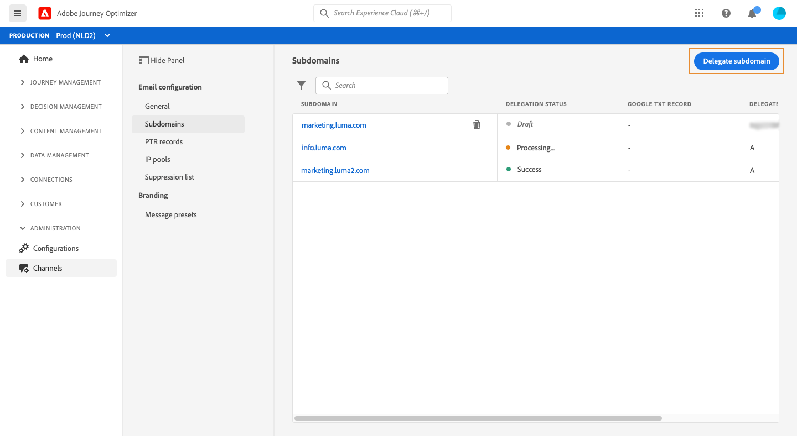

# 委派子網域

域名委派是一種允許域名所有者的方法(技術上：DNS區域)，以委派DNS的細分(技術上：其下的DNS區域，可稱為子區域)，傳至其他實體。 基本上，如果客戶處理區域「example.com」，他可以委派子區域「marketing.example.com」給Adobe。

透過委派子網域以與[!DNL Journey Optimizer]搭配使用，用戶端可以仰賴Adobe來維護必要的DNS基礎架構，以符合其電子郵件行銷傳送網域的業界標準傳遞能力需求，同時持續維護和控制其內部電子郵件網域的DNS。

[!DNL Journey Optimizer] 可讓您直接從產品介面完全委派子網域以Adobe。如此一來，Adobe便能控制並維護傳送、呈現及追蹤電子郵件行銷活動所需的DNS的所有層面，以托管服務的形式傳送訊息。

>[!NOTE]
>
>依預設，[!DNL Journey Optimizer]授權合約可讓您委派最多10個子網域。 如果您想要增加此限制，請聯絡您的Adobe連絡人。
>
>Journey Optimizer目前不支援使用CNAME進行子網域委派。

若要委派新子網域，請遵循下列步驟：

1. 訪問&#x200B;**[!UICONTROL Channels]** / **[!UICONTROL Subdomains]**&#x200B;菜單，然後按一下&#x200B;**[!UICONTROL Delegate subdomain]**。

   

1. 指定要委派的子網域名稱。

   

   >[!CAUTION]
   >
   >請確定您輸入了有效的子網域，例如marketing.company.com。 不允許將無效的子網域委派至Adobe。

1. 要放置在 DNS 伺服器顯示中的記錄清單。 逐一複製這些記錄，或下載 CSV 檔案，然後導覽至您的網域託管解決方案，以產生相符的 DNS 記錄。

   請確定所有DNS記錄都已產生至您的網域托管解決方案。 如果所有項都配置正確，請選中「I confirm...」框，然後按一下&#x200B;**[!UICONTROL Submit]**。

   

   >[!NOTE]
   >
   >您稍後可以使用&#x200B;**[!UICONTROL Save as draft]**&#x200B;按鈕，建立記錄並提交子網域配置。 然後，您就可以從子網域清單中開啟子網域委派，以繼續進行子網域委派。

1. 提交子網域委派後，子網域會顯示在清單中，且狀態為&#x200B;**[!UICONTROL Processing]**。 如需子網域狀態的詳細資訊，請參閱[此區段](access-subdomains.md)。

   將執行下列檢查和動作，直到子網域經過驗證，且可用於傳送訊息為止。

   此步驟由Adobe執行，最多需要3小時。

   1. 檢查子域是否已委派給AdobeDNS（NS記錄、SOA記錄、區域設定、所有權記錄）,
   1. 配置域的DNS,
   1. 建立追蹤和鏡像URL,
   1. 布建CDN雲端、
   1. 建立、驗證及附加CDN SSL憑證
   1. 建立轉發DNS,
   1. 建立PTR記錄。

   

1. 檢查成功後，子網域會取得&#x200B;**[!UICONTROL Success]**&#x200B;狀態。 它已準備好用於傳送訊息。

   <!-- later on, users will be notified in Pulse -->

   

