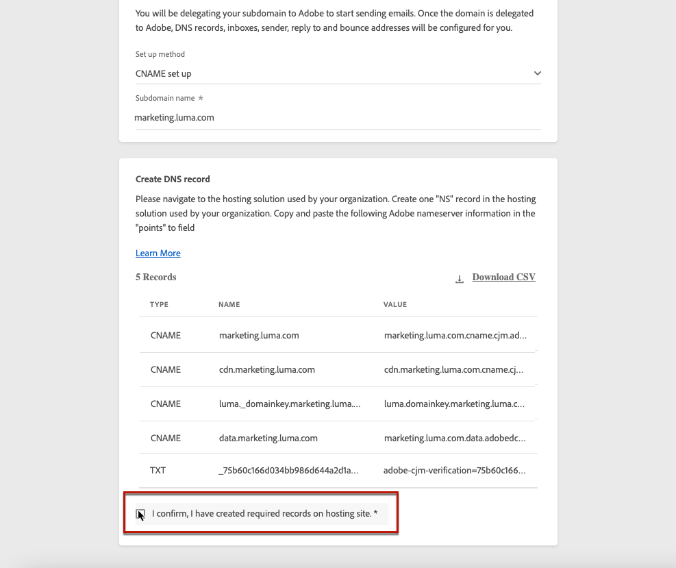
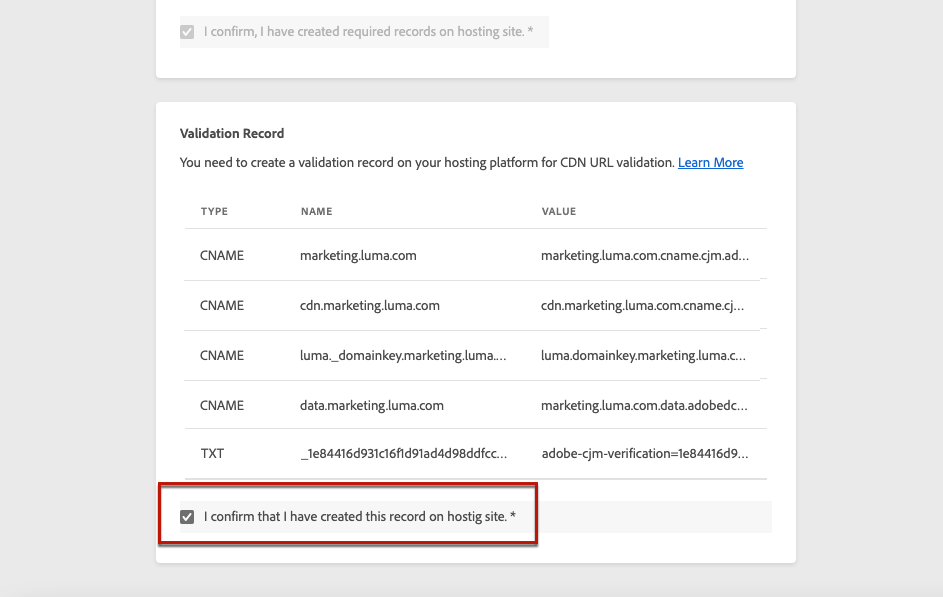

# 委派子網域

>[!CONTEXTUALHELP]
>id="ajo_admin_subdomainname"
>title="關於子域委派"
>abstract="Journey Optimizer允許您將子域完全委託給Adobe。 Adobe將能夠通過控制和維護DNS的所有方面來將消息作為托管服務進行傳遞。"

域名委派是一種允許域名所有者的方法(技術上為：DNS區域)，以委派其細分(技術上：DNS區域，可稱為子區域)。 基本上，作為客戶，如果您正在處理「example.com」區域，則可以將子區域「marketing.example.com」委託給Adobe。

通過委託子域來使用 [!DNL Journey Optimizer]，客戶可以依靠Adobe來維護所需的DNS基礎架構，以滿足其電子郵件營銷發送域的行業標準可交付性要求，同時繼續維護和控制其內部電子郵件域的DNS。

## 完全子網域委派 {#full-subdomain-delegation}

[!DNL Journey Optimizer] 允許您完全委託子域直接從產品介面Adobe。 通過這樣做，Adobe將能夠通過控制和維護DNS的所有方面來將郵件作為托管服務傳遞，這些方面是傳遞、呈現和跟蹤電子郵件活動所需的。

>[!NOTE]
>
>預設情況下， [!DNL Journey Optimizer] 許可證合同允許您委託最多10個子域。 如果要增加此限制，請聯繫Adobe聯繫人。

要委派新子域，請執行以下步驟：

1. 訪問 **[!UICONTROL Administration]** > **[!UICONTROL Channels]** > **[!UICONTROL Subdomains]** 菜單，然後按一下 **[!UICONTROL Set up subdomain]**。

   

1. 選擇 **[!UICONTROL Fully delegated]** 從 **[!UICONTROL Set up method]** 的子菜單。

   

1. 指定要委託的子域的名稱。

   

   >[!CAUTION]
   >
   >不允許將無效的子域委託給Adobe。 確保輸入組織擁有的有效子域，如marketing.yourcompany.com。
   >
   >請注意，當前不支援電子郵件.marketing.yourcompany.com等多級子域。

1. 要放置在 DNS 伺服器顯示中的記錄清單。 逐一複製這些記錄，或下載 CSV 檔案，然後導覽至您的網域託管解決方案，以產生相符的 DNS 記錄。

1. 確保所有DNS記錄都已生成到您的域托管解決方案中。 如果所有內容都配置正確，請選中「I confirm...（我確認……）」框，然後按一下 **[!UICONTROL Submit]**。

   

   >[!NOTE]
   >
   >您可以稍後使用 **[!UICONTROL Save as draft]** 按鈕 然後，您將能夠通過從子域清單中開啟子域委派來恢復子域委派。

1. 提交完整子域委派後，子域將顯示在清單中， **[!UICONTROL Processing]** 狀態。 有關子域狀態的詳細資訊，請參閱 [此部分](access-subdomains.md)。

   

   在能夠使用該子域發送消息之前，您需要等待Adobe執行所需的檢查，這可能需要3個小時。 瞭解詳情 [此部分](#subdomain-validation)。

   >[!NOTE]
   >
   >任何丟失的記錄（即尚未在您的托管解決方案上建立的記錄）都將列出。

1. 檢查成功後，子域將 **[!UICONTROL Success]** 狀態。 它已準備好用於傳遞消息。

   >[!NOTE]
   >
   >子域將標籤為 **[!UICONTROL Failed]** 如果您未能在托管解決方案上建立驗證記錄。

   <!-- later on, users will be notified in Pulse -->

將子域委派到中的Adobe [!DNL Journey Optimizer]，將自動建立PTR記錄並與此子域關聯。 [進一步了解](ptr-records.md)

>[!CAUTION]
>
>中當前不支援並行執行子域 [!DNL Journey Optimizer]。 如果嘗試在另一個域具有 **[!UICONTROL Processing]** 狀態，您將收到錯誤消息。

## CNAME 子網域委派 {#cname-subdomain-delegation}

如果您具有特定於域的限制策略並且希望Adobe只對DNS進行部分控制，則可以選擇在您的一方執行所有與DNS相關的活動。

CNAME 子網域委派可讓您建立子網域，並使用 CNAME 指向 Adobe 特定記錄。 使用此設定，您和 Adobe 都有責任維護 DNS，針對電子郵件的傳送、轉譯和追蹤設定環境。

>[!CAUTION]
>
>如果貴司的原則限制完整的子網域委派法，則建議使用此方法。此方法要求您自行維護和管理DNS記錄。 Adobe將無法幫助更改、維護或管理通過CNAME方法配置的子域的DNS。

要使用CNAME委託子域，請執行以下步驟：

1. 訪問 **[!UICONTROL Administration]** > **[!UICONTROL Channels]** > **[!UICONTROL Subdomains]** 菜單，然後按一下 **[!UICONTROL Set up subdomain]**。

1. 選擇 **[!UICONTROL CNAME set up]** 的雙曲餘切值。

   

   <!--The steps to specify the name of the subdomain to delegate and to generate the DNS records into your domain hosting solution are the same as for full subdomain delegation. See **steps 3 to 5** of the [Full subdomain delegation](#full-subdomain-delegation) section.)-->

1. 指定要委託的子域的名稱。

   >[!CAUTION]
   >
   >不允許將無效的子域委託給Adobe。 確保輸入組織擁有的有效子域，如marketing.yourcompany.com。
   >
   >請注意，當前不支援電子郵件.marketing.yourcompany.com等多級子域。

1. 要放置在 DNS 伺服器顯示中的記錄清單。 逐一複製這些記錄，或下載 CSV 檔案，然後導覽至您的網域託管解決方案，以產生相符的 DNS 記錄。

1. 確保所有DNS記錄都已生成到您的域托管解決方案中。 如果所有內容都配置正確，請選中「I confirm...」（我確認……）框。

   

   >[!NOTE]
   >
   >以後可以使用 **[!UICONTROL Save as draft]** 按鈕 然後，您將能夠在此階段通過從子域清單中開啟子域委派來恢復子域委派。

1. 等待Adobe驗證這些記錄是否在您的托管解決方案上沒有錯誤生成。 此過程最多需要2分鐘。

   >[!NOTE]
   >
   >任何丟失的記錄（即尚未在您的托管解決方案上建立的記錄）都將列出。

1. Adobe生成SSL CDN URL驗證記錄。 將此驗證記錄複製到托管平台。 如果已在托管解決方案上正確建立了此記錄，請選中「I confirm...」（我確認……）框，然後按一下 **[!UICONTROL Submit]**。

   

   >[!NOTE]
   >
   >您還可以在以後使用 **[!UICONTROL Save as draft]** 按鈕 然後，您將能夠通過從子域清單中開啟子域委派來恢復子域委派。

1. 提交CNAME子域委派後，子域將顯示在清單中， **[!UICONTROL Processing]** 狀態。 有關子域狀態的詳細資訊，請參閱 [此部分](access-subdomains.md)。

   在能夠使用該子域發送消息之前，您需要等待Adobe執行所需的檢查，這通常需要2到3個小時。 瞭解詳情 [此部分](#subdomain-validation)。

1. 檢查成功後<!--i.e Adobe validates the record you created and installs it-->，子域獲取 **[!UICONTROL Success]** 狀態。 它已準備好用於傳遞消息。

   >[!NOTE]
   >
   >子域將標籤為 **[!UICONTROL Failed]** 如果您未能在托管解決方案上建立驗證記錄。

在驗證記錄並安裝證書後，Adobe會自動為CNAME子域建立PTR記錄。 [進一步了解](ptr-records.md)

>[!CAUTION]
>
>中當前不支援並行執行子域 [!DNL Journey Optimizer]。 如果嘗試在另一個域具有 **[!UICONTROL Processing]** 狀態，您將收到錯誤消息。

## 子域驗證 {#subdomain-validation}

在子域被驗證並可用於發送消息之前，將執行以下檢查和操作。

>[!NOTE]
>
>這些步驟由Adobe執行，最長需要3小時。

1. **預驗證**:Adobe檢查子域是否已委託給AdobeDNS（NS記錄、SOA記錄、區域設定、所有權記錄）。 如果預驗證步驟失敗，則返回錯誤以及相應原因，否則Adobe將繼續執行下一步。

1. **配置域的DNS**:

   * **MX記錄**:Mail eXchange記錄 — 處理髮送到子域的入站電子郵件的郵件伺服器記錄。
   * **SPF記錄**:發件人策略框架記錄 — 列出可從子域發送電子郵件的郵件伺服器的IP。
   * **DKIM記錄**:DomainKeys Identified Mail標準記錄 — 使用公共私鑰加密來驗證郵件以避免欺騙。
   * **A**:預設IP映射。
   * **名稱**:規範名稱或CNAME記錄是將別名映射到真或規範域名的DNS記錄類型。

1. **建立跟蹤和鏡像URL**:如果域是email.example.com ，則tracking/mirror域將是data.email.example.com。 通過安裝SSL證書來保護它。

1. **預配CDN CloudFront**:如果尚未設定CDN，則Adobe會為導入設定CDN。

1. **建立CDN域**:如果域為email.example.com，則CDN域將為cdn.email.example.com。

1. **建立並附加CDN SSL證書**:Adobe為CDN域建立CDN證書，並將證書附加到CDN域。

1. **建立轉發DNS**:如果這是您委託的第一個子域，則Adobe將建立建立PTR記錄所需的轉發DNS — 每個IP都需要一個。

1. **建立PTR記錄**:ISP需要PTR記錄（也稱為反向DNS記錄），以便它們不會將電子郵件標籤為垃圾郵件。 Gmail還建議為每個IP提供PTR記錄。 Adobe僅在首次委託子域時建立PTR記錄，每個IP都為一個，所有IP都指向該子域。 例如，如果IP是 *192.1.2.1* 子域為 *email.example.com*,PTR記錄為： *192.1.2.1 PTR r1.email.example.com*。 您可以隨後更新PTR記錄以指向新的委派域。 [瞭解有關PTR記錄的詳細資訊](ptr-records.md)
