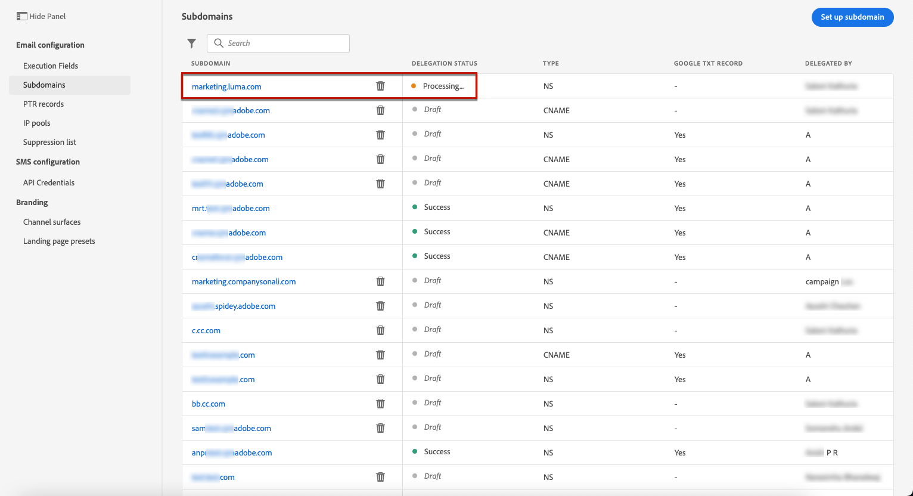

# 委派子網域 {#delegate-subdomain}

>[!CONTEXTUALHELP]
>id="ajo_admin_subdomainname"
>title="子網域委派"
>abstract="Journey Optimizer可讓您將子網域委派給Adobe。 您可以將子網域完全委派給Adobe，這是建議的方法。 您也可以使用CNAME建立子網域以指向Adobe專屬記錄，但此方法需要您自行維護和管理DNS記錄。"
>additional-url="https://experienceleague.adobe.com/docs/journey-optimizer/using/configuration/delegate-subdomains/about-subdomain-delegation.html#subdomain-delegation-methods" text="子網域設定方法"

>[!CONTEXTUALHELP]
>id="ajo_admin_subdomainname_header"
>title="子網域委派"
>abstract="若要開始傳送電子郵件，您會將子網域委派給Adobe。 完成後，系統會為您設定DNS記錄、收件匣、寄件者、回覆和退信地址。"

域名委派是一種允許域名所有者的方法(技術上：DNS區域)，以委派DNS區域(技術上：其下的DNS區域，可稱為子區域)，傳至其他實體。 基本上，身為客戶，如果您處理的是「example.com」區域，您可以將子區域「marketing.example.com」委派給Adobe。 深入了解 [子網域委派](about-subdomain-delegation.md)

>[!NOTE]
>
>依預設， [!DNL Journey Optimizer] 授權合約可讓您委派最多10個子網域。 如果您想要提高此限制，請聯絡您的Adobe聯絡人。

您可以完全委派子網域，或使用CNAME建立子網域以指向Adobe專屬記錄。

>[!CAUTION]
>
>建議使用完全子網域委派。 深入了解兩者的差異 [子網域配置方法](about-subdomain-delegation.md#subdomain-delegation-methods).
>
>子網域設定是所有環境的共同設定。 因此，對子網域的任何修改也會影響生產沙箱。

## 完全子網域委派 {#full-subdomain-delegation}

>[!CONTEXTUALHELP]
>id="ajo_admin_subdomain_dns"
>title="生成匹配的DNS記錄"
>abstract="若要將新子網域完全委派給Adobe，您必須將Journey Optimizer介面中顯示的Adobe名稱伺服器資訊複製並貼到您的網域托管解決方案中，以產生相符的DNS記錄。 若要使用CNAME委派子網域，您也需要複製並貼上SSL CDN URL驗證記錄。 檢查成功後，子網域即可供用來傳送訊息。"
>additional-url="https://experienceleague.adobe.com/docs/journey-optimizer/using/configuration/delegate-subdomains/delegate-subdomain.html#cname-subdomain-delegation" text="CNAME子網域委派"

[!DNL Journey Optimizer] 可讓您直接從產品介面將子網域完全委派給Adobe。 如此一來，Adobe就能控制並維護傳送、轉譯及追蹤電子郵件行銷活動所需的DNS的所有層面，以受管理的服務形式傳送訊息。

您可以仰賴Adobe維護必要的DNS基礎架構，以符合電子郵件行銷傳送網域的業界標準傳遞需求，同時持續維護和控制內部電子郵件網域的DNS。

若要將新子網域完全委派給Adobe，請遵循下列步驟：

1. 存取 **[!UICONTROL Administration]** > **[!UICONTROL Channels]** > **[!UICONTROL Subdomains]** ，然後按一下 **[!UICONTROL Set up subdomain]**.

   

1. 選擇 **[!UICONTROL Fully delegated]** 從 **[!UICONTROL Set up method]** 區段。

   

1. 指定要委派的子網域名稱。

   

   >[!CAUTION]
   >
   >不允許將無效子網域委派至Adobe。 請務必輸入貴組織擁有的有效子網域，例如marketing.yourcompany.com。
   >
   >請注意，目前不支援多層級子網域，例如email.marketing.yourcompany.com。

   <!--Capital letters are not allowed in subdomains. TBC by PM-->

1. 將顯示要放置在DNS伺服器中的記錄清單。 逐一複製這些記錄，或下載CSV檔案，然後導覽至您的網域托管解決方案，以產生相符的DNS記錄。

1. 請確定所有DNS記錄都已產生至您的網域托管解決方案。 如果所有項目皆已正確設定，請核取「I confirm...」方塊，然後按一下 **[!UICONTROL Submit]**.

   

   >[!NOTE]
   >
   >您稍後可以使用 **[!UICONTROL Save as draft]** 按鈕。 然後，您就可以從子網域清單中開啟子網域委派，以繼續進行子網域委派。

1. 提交完整的子網域委派後，子網域會顯示在清單中，並搭配 **[!UICONTROL Processing]** 狀態。 如需子網域狀態的詳細資訊，請參閱 [本節](about-subdomain-delegation.md#access-delegated-subdomains).

   

   您必須等到Adobe執行所需的檢查後，才能使用該子網域來傳送訊息，最多需要3小時。 深入了解 [本節](#subdomain-validation).

   >[!NOTE]
   >
   >任何遺失的記錄（亦即尚未在您的托管解決方案上建立的記錄）都會列出。

1. 檢查成功後，子網域會取得 **[!UICONTROL Success]** 狀態。 它已準備好用於傳送訊息。

   >[!NOTE]
   >
   >子網域將標示為 **[!UICONTROL Failed]** 如果您未在托管解決方案上建立驗證記錄。

將子網域委派給Adobe後， [!DNL Journey Optimizer]，則會自動建立PTR記錄並與此子域關聯。 [深入了解](ptr-records.md)

>[!CAUTION]
>
>中目前不支援並行執行子網域 [!DNL Journey Optimizer]. 如果您嘗試在另一個子網域具有 **[!UICONTROL Processing]** 狀態，您會收到錯誤訊息。

## CNAME子網域委派 {#cname-subdomain-delegation}

>[!CONTEXTUALHELP]
>id="ajo_admin_subdomain_dns_cname"
>title="生成匹配的DNS和驗證記錄"
>abstract="若要使用CNAME委派子網域，您必須將Adobe名稱伺服器資訊以及Journey Optimizer介面中顯示的SSL CDN URL驗證記錄複製貼到您的托管平台。 檢查成功後，子網域即可供用來傳送訊息。"

如果您有網域特定限制原則，而且您希望Adobe只對DNS有部分控制，您可以選擇在您這邊執行所有與DNS相關的活動。

CNAME子網域委派可讓您建立子網域，並使用CNAME指向Adobe專屬記錄。 使用此設定，您和Adobe都有責任維護DNS，以便設定傳送、轉譯和追蹤電子郵件的環境。

>[!CAUTION]
>
>如果貴組織的原則限制完整的子網域委派方法，則建議使用CNAME方法。 此方法需要您自行維護和管理DNS記錄。 Adobe將無法協助變更、維護或管理透過CNAME方法設定之子網域的DNS。

➡️ [了解如何使用CNAME建立子網域，以指向此影片中的Adobe專屬記錄](#video)

若要使用CNAME委派子網域，請遵循下列步驟：

1. 存取 **[!UICONTROL Administration]** > **[!UICONTROL Channels]** > **[!UICONTROL Subdomains]** ，然後按一下 **[!UICONTROL Set up subdomain]**.

1. 選取 **[!UICONTROL CNAME set up]** 方法。

   

1. 指定要委派的子網域名稱。

   >[!CAUTION]
   >
   >不允許將無效子網域委派至Adobe。 請務必輸入貴組織擁有的有效子網域，例如marketing.yourcompany.com。
   >
   >請注意，目前不支援多層級子網域，例如email.marketing.yourcompany.com。

   <!--Capital letters are not allowed in subdomains. TBC by PM-->

1. 將顯示要放置在DNS伺服器中的記錄清單。 逐一複製這些記錄，或下載CSV檔案，然後導覽至您的網域托管解決方案，以產生相符的DNS記錄。

1. 請確定所有DNS記錄都已產生至您的網域托管解決方案。 如果所有項目皆已正確設定，請核取「I confirm...」方塊。

   

   >[!NOTE]
   >
   >您稍後可以使用 **[!UICONTROL Save as draft]** 按鈕。 然後，您就可以從子網域清單開啟子網域委派，借此繼續此階段。

1. 請等到Adobe驗證這些記錄是否已產生，且托管解決方案未發生錯誤。 此程式最多需要2分鐘。

   >[!NOTE]
   >
   >任何遺失的記錄（亦即尚未在您的托管解決方案上建立的記錄）都會列出。

1. Adobe會產生SSL CDN URL驗證記錄。 將此驗證記錄複製到您的托管平台。 如果您已在托管解決方案上正確建立此記錄，請核取方塊「I confirm...」，然後按一下 **[!UICONTROL Submit]**.

   

   >[!NOTE]
   >
   >您也可以建立驗證記錄，並稍後使用 **[!UICONTROL Save as draft]** 按鈕。 然後，您就可以從子網域清單中開啟子網域委派，以繼續進行子網域委派。

1. 提交CNAME子網域委派後，子網域會顯示在清單中，並搭配 **[!UICONTROL Processing]** 狀態。 如需子網域狀態的詳細資訊，請參閱 [本節](about-subdomain-delegation.md#access-delegated-subdomains).

   您必須等到Adobe執行必要的檢查（通常需要2到3小時），才能使用該子網域來傳送訊息。 深入了解 [本節](#subdomain-validation).

1. 檢查成功後<!--i.e Adobe validates the record you created and installs it-->，子網域會取得 **[!UICONTROL Success]** 狀態。 它已準備好用於傳送訊息。

   >[!NOTE]
   >
   >子網域將標示為 **[!UICONTROL Failed]** 如果您未在托管解決方案上建立驗證記錄。

在驗證記錄並安裝憑證時，Adobe會自動為CNAME子網域建立PTR記錄。 [深入了解](ptr-records.md)

>[!CAUTION]
>
>中目前不支援並行執行子網域 [!DNL Journey Optimizer]. 如果您嘗試在另一個子網域具有 **[!UICONTROL Processing]** 狀態，您會收到錯誤訊息。

## 子網域驗證 {#subdomain-validation}

將執行下列檢查和動作，直到子網域經過驗證，且可用於傳送訊息為止。

>[!NOTE]
>
>這些步驟由Adobe執行，最多需要3小時。

1. **預先驗證**:Adobe會檢查子網域是否已委派給Adobe DNS（NS記錄、SOA記錄、區域設定、所有權記錄）。 如果預先驗證步驟失敗，會傳回錯誤並出現對應原因，否則Adobe會繼續執行下一個步驟。

1. **配置域的DNS**:

   * **MX記錄**:Mail eXchange記錄 — 處理髮送到子網域的傳入電子郵件的郵件伺服器記錄。
   * **SPF記錄**:發件人策略框架記錄 — 列出可從子域發送電子郵件的郵件伺服器的IP。
   * **DKIM記錄**:DomainKeys Indified Mail標準記錄 — 使用公私密鑰加密來驗證郵件以避免欺騙。
   * **A**:預設IP對應。
   * **CNAME**:規範名稱或CNAME記錄是一種DNS記錄，可將別名映射為真或規範網域名稱。

1. **建立追蹤和鏡像URL**:如果網域為email.example.com，則tracking/mirror網域為data.email.example.com。 安裝SSL憑證即可保護SSL。

1. **布建CDN CloudFront**:如果尚未設定CDN,Adobe會將其設定為貴組織的ID。

1. **建立CDN網域**:如果網域為email.example.com，則CDN網域為cdn.email.example.com。

1. **建立並附加CDN SSL憑證**:Adobe會為CDN網域建立CDN憑證，並將憑證附加至CDN網域。

1. **建立轉發DNS**:如果這是您要委派的第一個子網域，Adobe將建立建立PTR記錄所需的轉送DNS — 每個IP各一個。

1. **建立PTR記錄**:ISP需要PTR記錄（也稱為反向DNS記錄），以便它們不會將電子郵件標籤為垃圾郵件。 Gmail還建議為每個IP包含PTR記錄。 Adobe僅會在您首次委派子網域時建立PTR記錄，每個IP各一個，所有指向該子網域的IP。 例如，如果 *192.1.2.1* 而子網域為 *email.example.com*,PTR記錄將是： *192.1.2.1 PTR r1.email.example.com*. 之後，您可以更新PTR記錄以指向新的委派域。 [了解有關PTR記錄的更多資訊](ptr-records.md)

## 作法影片{#video}

了解如何使用CNAME建立子網域以指向Adobe專屬記錄。

>[!VIDEO](https://video.tv.adobe.com/v/339484?quality=12)
