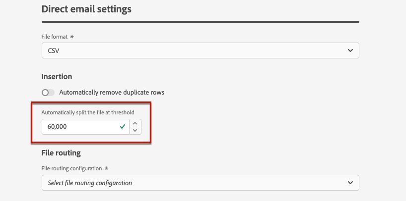
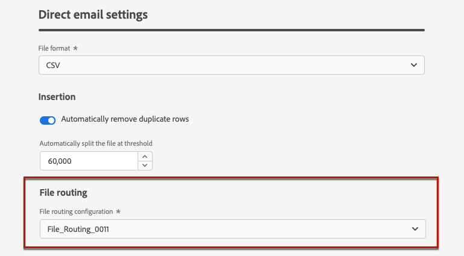

# 直接郵件配置 {#direct-mail-configuration}

[!DNL Journey Optimizer] 可讓您個人化並產生直接郵件提供者傳送郵件給客戶所需的檔案。

準備直接郵件時， [!DNL Journey Optimizer] 產生包含所有目標設定檔和所選聯絡資訊（例如，郵遞區號）的檔案。 然後，您就可以將此檔案傳送給直接郵件提供者，由他們負責實際傳送。

若要傳送直接郵件訊息，您需要建立檔案並上傳至伺服器。 您必須先建立 [檔案路由配置](#file-routing-configuration) 和 [直接郵件表面](#direct-mail-surface) 將引用檔案路由配置。

## 配置檔案路由 {#file-routing-configuration}

>[!CONTEXTUALHELP]
>id="ajo_dm_file_routing_details"
>title="定義檔案路由配置的設定"
>abstract="您需要定義要匯出和上傳檔案的位置，以供直接郵件提供者使用。"

>[!CONTEXTUALHELP]
>id="ajo_dm_file_routing_details_header"
>title="定義檔案路由配置的設定"
>abstract="建立直接郵件訊息時，您將產生包含所有必要設定檔資訊的檔案。 需要將此檔案導出並上傳到伺服器上，以便您的直接郵件提供程式可以訪問並使用該檔案來發送直接郵件。"

>[!CONTEXTUALHELP]
>id="ajo_dm_select_file_routing"
>title="檔案路由配置"
>abstract="選取您選擇的檔案路由設定，定義將匯出和上傳檔案的位置，供直接郵件提供者使用。"

>[!CONTEXTUALHELP]
>id="ajo_dm_file_routing_type"
>title="為檔案路由選擇伺服器類型"
>abstract="選擇要用於上傳和儲存直接郵件檔案的伺服器。"

>[!CONTEXTUALHELP]
>id="ajo_dm_file_routing_aws_region"
>title="選擇AWS地區"
>abstract="選擇要用於上傳和儲存直接郵件檔案的伺服器。 目前僅支援Amazon S3和SFTP。"

1. 存取 **[!UICONTROL 管理]** > **[!UICONTROL 管道]** > **[!UICONTROL 檔案路由配置]** > **[!UICONTROL 檔案路由]** ，然後按一下 **[!UICONTROL 建立路由配置]**.

   

1. 設定配置的名稱。

1. 選取設定 **[!UICONTROL 類型]**，即要用於上傳和儲存直接郵件檔案的伺服器。<!--why is it Type and not Server or Server type? asked to PM-->

   

   >[!NOTE]
   >
   >目前僅Amazon S3和SFTP可供使用。

   建立直接郵件訊息時，您將產生包含所有必要設定檔資訊的檔案。 需要將此檔案導出並上傳到伺服器上，以便您的直接郵件提供程式可以訪問並使用該檔案來發送直接郵件。

1. 填寫選定配置類型的特定詳細資訊和憑據，如伺服器地址、訪問密鑰等。 <!--need to detail more?-->

   <!---->

   

1. 如果您選取 **[!UICONTROL Amazon S3]**，您可以選擇要匯出和上傳直接郵件檔案的AWS地區。

   

   >[!NOTE]
   >
   >AWS地區是分散於全球各地的不同地理區域，AWS用來容納其基礎設施。 為獲得最佳使用率，建議選擇托管雲基礎架構的最近區域。

1. 選擇 **[!UICONTROL 提交]**. 檔案路由配置是使用 **[!UICONTROL 作用中]** 狀態。 現在，它已準備好用於直接郵件表面，以便從 [!DNL Journey Optimizer].

   >[!NOTE]
   >
   >您也可以選取 **[!UICONTROL 另存為草稿]** 要建立檔案路由配置，但在曲面中選取它之前，您將無法 **[!UICONTROL 作用中]**.

## 建立直接郵件表面 {#direct-mail-surface}

>[!CONTEXTUALHELP]
>id="ajo_dm_surface_settings"
>title="定義直接郵件設定"
>abstract="直接郵件表面包含與包含直接郵件的配置檔案資料的檔案格式相關的設定。 您可以（定義排序配置）、刪除重複行、將記錄拆分為多個檔案並選擇檔案路由配置。"

>[!CONTEXTUALHELP]
>id="ajo_dm_surface_sort"
>title="定義排序順序"
>abstract="如果您選取此選項，則會依設定檔ID（遞增或遞減）排序。 如果您取消選取，則會在歷程或行銷活動中建立直接郵件訊息時定義的排序設定。"

>[!CONTEXTUALHELP]
>id="ajo_dm_surface_split"
>title="定義檔案分割臨界值"
>abstract="您必須為每個包含設定檔資料的檔案設定記錄數上限。 達到指定的臨界值後，將為剩餘記錄建立另一個檔案。"

配置檔案路由後，您需要建立一個通道表，以便能夠從 [!DNL Journey Optimizer]. 在每個曲面中，需要選取檔案路由配置。

1. 建立通道曲面。 [了解更多](channel-surfaces.md)

1. 選取 **[!UICONTROL 直接郵件]** 頻道。

   

1. 在通道表面設定的專用區段中定義直接郵件設定。

   

1. 選取檔案格式： **[!UICONTROL CSV]** 或 **[!UICONTROL 文字分隔]**.

1. 在 **[!UICONTROL 插入]** 區段中，您可以選擇自動移除重複列。

1. 為每個包含設定檔資料的檔案定義記錄數上限（即列）。 達到指定的臨界值後，將為剩餘記錄建立另一個檔案。

   

   例如，如果檔案中有100,000條記錄，且臨界值限制設為60,000，則記錄將分割為兩個檔案。 第一個檔案將包含60,000列，第二個檔案將包含其餘40,000列。

   >[!NOTE]
   >
   >您可以設定介於1到200,000條記錄之間的任何數字，這表示每個檔案至少必須包含1列，且不得超過200,000列。

1. 最後，選取 [檔案路由配置](#file-routing-configuration) 在您建立的群體中。 這會定義檔案匯出和上傳的位置，供直接郵件提供者使用。

   >[!CAUTION]
   >
   >如果尚未配置任何檔案路由選項，則將無法建立直接郵件表面。 [了解更多](#file-routing-configuration)

   