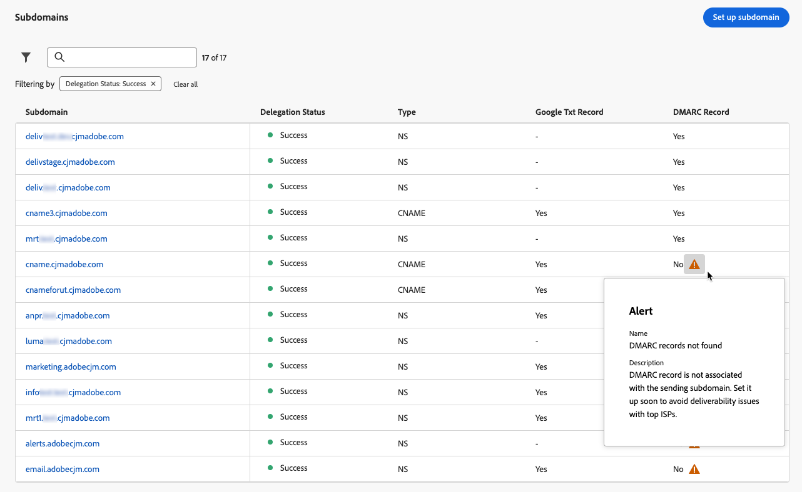
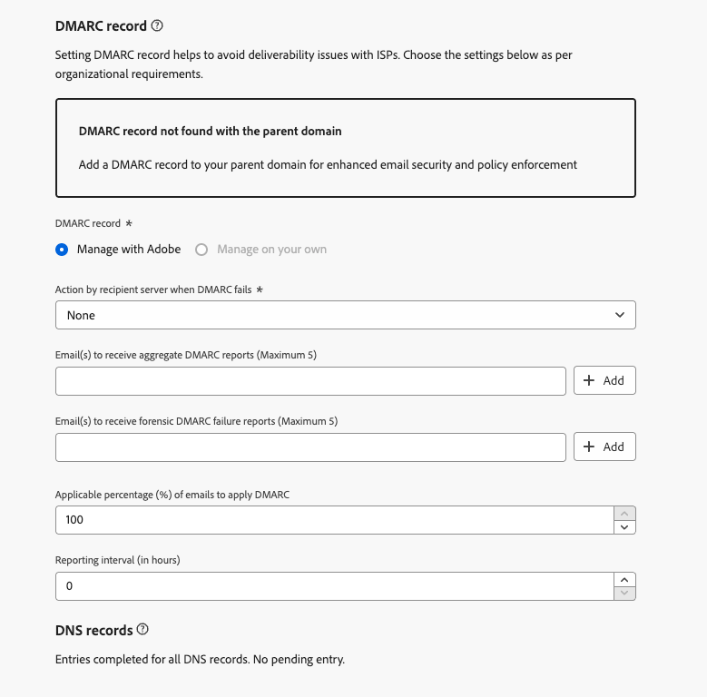
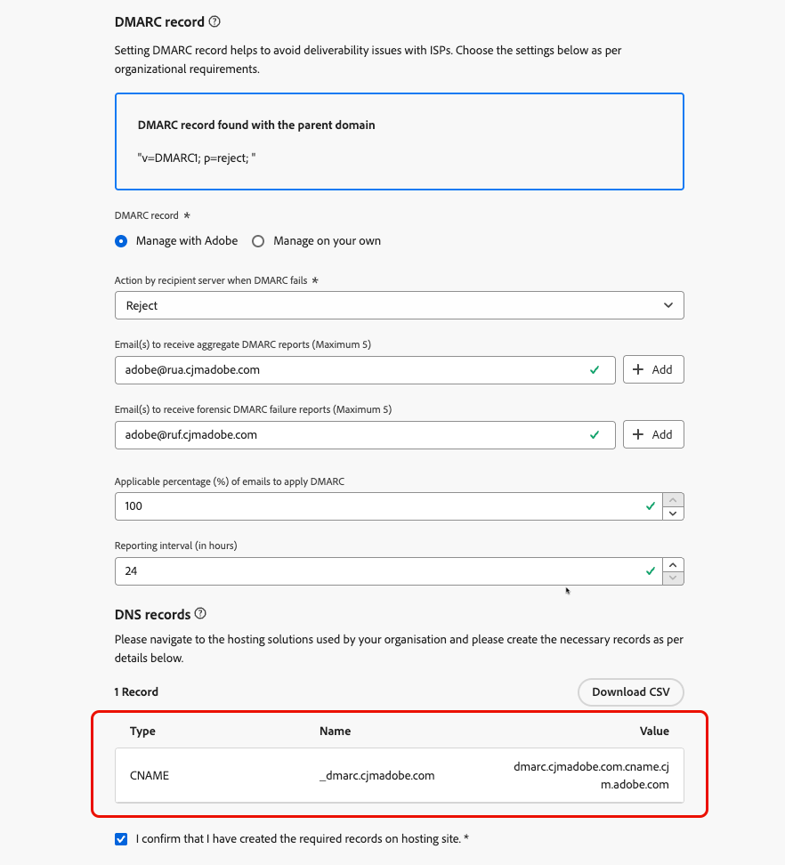
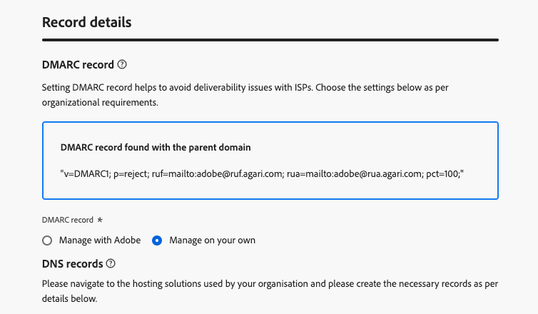
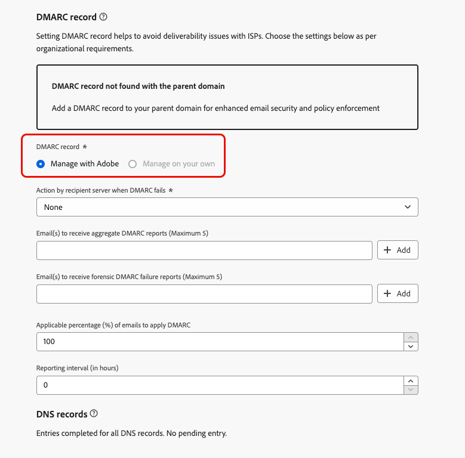
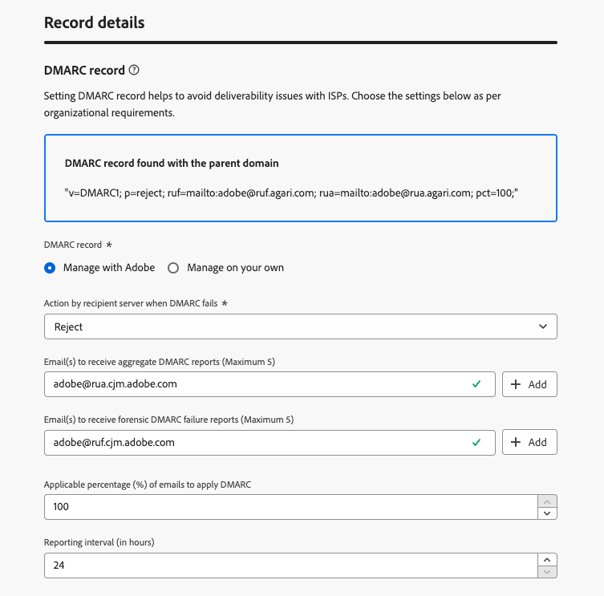

# DMARC 記錄 {#dmarc-record}

>[!CONTEXTUALHELP]
>id="ajo_admin_dmarc_record"
>title="設定 DMARC 記錄"
>abstract="DMARC 是一種電子郵件驗證方法，可讓網域擁有者保護其網域免遭未經授權的使用，並避免信箱提供者的傳遞問題。 為了執行產業最佳做法，Google 和 Yahoo! 都要求您對傳送電子郵件所使用的任何網域留有 DMARC 記錄。"

## 什麼是DMARC？ {#what-is-dmarc}

網域型訊息驗證、報告和符合性 (DMARC) 是一種電子郵件驗證方法，可讓網域擁有者保護其網域免受未經授權的使用。透過向電子郵件提供者和網際網路服務提供者(ISP)提供明確的原則，這有助於防止惡意行為者傳送聲稱來自您網域的電子郵件。 實作 DMARC 可降低合法電子郵件遭標示為垃圾郵件或遭拒絕的風險，並改善電子郵件傳遞能力。

DMARC也提供未通過驗證訊息的報告，以及控制未通過DMARC驗證的電子郵件處理。 根據實作的[DMARC原則](#dmarc-policies)，這些電子郵件可能會被監視、隔離或拒絕。 這些功能可讓您採取動作來減少和解決潛在的錯誤。

為了協助您避免傳遞問題，同時控制無法通過驗證的郵件，[!DNL Journey Optimizer]現在直接在其管理介面中支援DMARC技術。 [了解更多](#implement-dmarc)

### DMARC如何運作？ {#how-dmarc-works}

SPF和DKIM都可用來關聯電子郵件與網域，並共同驗證電子郵件。 DMARC更進一步，並透過比對DKIM和SPF檢查的網域，協助防止詐騙。

>[!NOTE]
>
>在Journey Optimizer中，已為您設定SPF和DKIM。

若要傳遞DMARC，訊息必須傳遞SPF或DKIM：

* SPF (Sender Policy Framework)會根據網域的授權IP位址清單，檢查傳送伺服器的IP位址，以協助確認電子郵件訊息是否來自授權來源。
* DKIM (DomainKeys Identified Mail)為電子郵件新增數位簽名，讓收件者可驗證郵件的完整性和真實性。

如果兩者或其中一個驗證失敗，DMARC就會失敗，系統會根據您選取的DMARC原則傳送電子郵件。

<!--DMARC requires alignment between the 'From" and 'Return-Path' address.-->

### DMARC原則 {#dmarc-policies}

如果電子郵件的DMARC驗證失敗，您可以決定要對該郵件套用哪個動作。 DMARC有三個原則選項：

* 監視(p=none)：指示信箱提供者/ISP執行通常對郵件執行的動作。
* 隔離（p=隔離）：指示信箱提供者/ISP傳送未傳遞DMARC的郵件至收件者的垃圾郵件或垃圾郵件資料夾。
* 拒絕(p=reject)：指示信箱提供者/ISP封鎖未通過DMARC的郵件，進而導致退信。

>[!NOTE]
>
>在[!DNL Journey Optimizer]本節[中瞭解如何使用](#set-up-dmarc)設定DMARC原則。

## DMARC需求更新 {#dmarc-update}

作為強制執行業界最佳實務的一部分，Google 和 Yahoo! 都要求您擁有&#x200B;**DMARC記錄**，才能使用任何網域來傳送電子郵件給他們。 這項新要求於 **2024 年 2 月 1 日**&#x200B;起生效。

>[!CAUTION]
>
>未能遵循 Gmail 和 Yahoo! 的這項新要求可能導致電子郵件進入垃圾郵件資料夾或遭到封鎖。

因此，Adobe強烈建議您採取下列動作：

* 確定已在&#x200B;**中為**&#x200B;您已委派&#x200B;**至DMARC的所有子網域設定** Adobe記錄[!DNL Journey Optimizer]。 [了解作法](#check-subdomains-for-dmarc)

* 將&#x200B;**任何新子網域**&#x200B;委派給Adobe時，您可以在&#x200B;**管理介面**&#x200B;中直接&#x200B;**設定DMARC[!DNL Journey Optimizer]**。 [了解作法](#implement-dmarc)

## 在[!DNL Journey Optimizer]中實作DMARC {#implement-dmarc}

[!DNL Journey Optimizer]管理介面可讓您針對您已委派或正在委派給DMARC的所有子網域設定Adobe記錄。 詳細步驟如下所述。

### 檢查DMARC的現有子網域 {#check-subdomains-for-dmarc}

若要確保您已在[!DNL Journey Optimizer]中委派的所有子網域設定DMARC記錄，請遵循下列步驟。

1. 存取&#x200B;**[!UICONTROL 管理]** > **[!UICONTROL 管道]** > **[!UICONTROL 電子郵件設定]** > **[!UICONTROL 子網域]**&#x200B;功能表，然後按一下&#x200B;**[!UICONTROL 設定子網域]**。

1. 對於每個委派的子網域，請檢查&#x200B;**[!UICONTROL DMARC記錄]**&#x200B;欄。 如果指定的子網域找不到記錄，則會顯示警示。

   

   >[!CAUTION]
   >
   >為符合Gmail和Yahoo！的新要求，並避免頂級ISP出現傳遞問題，建議為所有委派的子網域設定DMARC記錄。 [了解更多](dmarc-record-update.md)

1. 選取沒有DMARC記錄關聯的子網域，並根據您組織的需求填寫&#x200B;**[!UICONTROL DMARC記錄]**&#x200B;區段。 在[本節](#implement-dmarc)中詳細說明填入DMARC記錄欄位的步驟。

   <!---->

   >[!NOTE]
   >
   >根據是否在父項網域中找到DMARC記錄，您可以選擇使用父項網域的值，或讓Adobe管理DMARC記錄。 [了解更多](#implement-dmarc)

1. 如果您正在編輯子網域：

   * [已完全委派](delegate-subdomain.md#full-subdomain-delegation)給Adobe，不需要進一步的動作。

   * 使用[CNAME](delegate-subdomain.md#cname-subdomain-setup)進行設定，您必須將DMARC的DNS記錄複製到您的代管解決方案中，以產生相符的DNS記錄。

     

     請確定DNS記錄已產生至您的網域託管解決方案，並勾選「我確認……」方塊。

1. 儲存您的變更。

### 為新子網域設定DMARC {#set-up-dmarc}

在[!DNL Journey Optimizer]中將新子網域委派給Adobe時，將會為您的網域在DNS中建立DMARC記錄。 請依照下列步驟實作DMARC。

>[!CAUTION]
>
>為符合Gmail和Yahoo！的新要求，並避免頂級ISP出現傳遞問題，建議為所有委派的子網域設定DMARC記錄。 [了解更多](dmarc-record-update.md)

<!--If you fail to comply with the new requirement from Gmail and Yahoo! to have DMARC record for all sending domains, your emails are expected to land into the spam folder or to get blocked.-->

1. 設定新的子網域。 [了解作法](delegate-subdomain.md)

1. 移至&#x200B;**[!UICONTROL DMARC記錄]**&#x200B;區段。

1. 如果在與子網域相關聯的父網域上有DMARC記錄可用，便會顯示兩個選項：

   

   * **[!UICONTROL 使用Adobe管理]**：您可以讓Adobe管理子網域的DMARC記錄。 請依照[本節](#manage-dmarc-with-adobe)中詳述的步驟操作。

   * **[!UICONTROL 自行管理]**： <!--This option is selected by default.-->此選項可讓您使用父網域的值，在[!DNL Journey Optimizer]之外管理DMARC記錄。 這些值會顯示在介面中，但您無法加以編輯。

     {width="80%"}

1. 如果在父網域上找不到DMARC記錄，則只有&#x200B;**[!UICONTROL 使用Adobe管理]**&#x200B;選項可用。 請依照下列[步驟](#manage-dmarc-with-adobe)為您的子網域設定DMARC記錄。

   {width="80%"}

### 使用Adobe管理DMARC記錄 {#manage-dmarc-with-adobe}

若要讓Adobe為您管理DMARC記錄，請選取&#x200B;**[!UICONTROL 使用Adobe管理]**&#x200B;選項，然後遵循下列步驟。

>[!NOTE]
>
>如果[!DNL Journey Optimizer]擷取，您可以使用介面中反白顯示的相同值，或視需要加以變更。

{width="80%"}

>[!NOTE]
>
>如果您未新增任何值，則會使用預先填入的預設值。

1. 定義當DMARC失敗時，收件者伺服器將執行的動作。 根據您要套用的[DMARC原則](#dmarc-policies)，選取下列三個選項之一：

   * **[!UICONTROL 無]** （預設值）：告知接收者不要對未通過DMARC驗證的郵件執行任何動作，但仍會傳送電子郵件報告給寄件者。
   * **[!UICONTROL 隔離]**：通知接收電子郵件伺服器隔離未通過DMARC驗證的電子郵件 — 這通常表示將這些郵件放入收件者的垃圾郵件或垃圾郵件資料夾。
   * **[!UICONTROL 拒絕]**：告知接收者完全拒絕（退回）驗證失敗之網域的任何電子郵件。 啟用此原則後，只有經過網域驗證為100%驗證的電子郵件才有機會放置收件匣。

   >[!NOTE]
   >
   >為了瞭解DMARC的潛在影響，建議您將DMARC原則從&#x200B;**無**&#x200B;提升至&#x200B;**隔離**，再提升至&#x200B;**拒絕**，藉此建議逐步推出DMARC實作，以符合最佳作法。

1. 您可以選擇新增一或多個您選擇的電子郵件地址，以指出電子郵件中&#x200B;**驗證失敗**&#x200B;的[DMARC報告](#how-dmarc-works)應該位於貴組織內的哪個位置。 您最多可以為每個報表新增5個地址。

   >[!NOTE]
   >
   >請確定您的控制中有正版收件匣(而非Adobe)可接收這些報表。

   ISP會產生兩種不同的報表，讓傳送者可透過其DMARC原則中的RUA/RUF標籤接收：

   * **彙總報表** (RUA)：不包含任何可能區分大小寫GDPR的PII （個人識別資訊）。
   * **鑑證失敗報告** (RUF)：這些報告包含GDPR敏感的電子郵件地址。 在使用之前，請在內部檢查如何處理需要符合GDPR的資訊。

   >[!NOTE]
   >
   >這些高度技術性的報告提供企圖詐騙的電子郵件概觀。 最好透過協力廠商工具加以消化。

1. 選取DMARC的&#x200B;**適用百分比**&#x200B;電子郵件。

   此百分比取決於您對電子郵件基礎結構的信心以及對誤判（標籤為欺詐的合法電子郵件）的容忍度。 組織通常會從DMARC原則設定為&#x200B;**無**&#x200B;開始，逐漸增加DMARC原則百分比，並密切監視對合法電子郵件傳遞的影響。

   >[!NOTE]
   >
   >隨著您對電子郵件驗證實務更有信心，請與您的電子郵件管理員和IT團隊合作，逐步提高此百分比。

   最佳實務是以DMARC高合規率為目標，最好接近100%，以便在最大限度提高安全性的同時，將誤報風險降至最低。

1. 選取24到168小時之間的&#x200B;**報告間隔**。 它可讓網域擁有者定期接收電子郵件驗證結果的更新，並採取必要動作來改善電子郵件安全性。

<!--The DMARC reporting interval is specified in the DMARC policy published in the DNS (Domain Name System) records for a domain. The reporting interval can be set to daily, weekly, or another specified frequency, depending on the domain owner's preferences.

The default value (24 hours) is generally the email providers' expectation.

**********

Setting up a DMARC record involves adding a DNS TXT record to your domain's DNS settings. This record specifies your DMARC policy, such as whether to quarantine or reject messages that fail authentication. Implementing DMARC is a proactive step towards enhancing email security and protecting both your organization and your recipients from email-based threats.

DMARC helps prevent malicious actors from sending emails that appear to come from your domain. By setting up DMARC, you can specify how email providers should handle messages that fail authentication checks, reducing the likelihood that phishing emails will reach recipients.

DMARC helps improve email deliverability by providing a clear policy for email providers to follow when encountering messages claiming to be from your domain. This can reduce the chances of legitimate emails being marked as spam or rejected.

DMARC helps protect against email spoofing, phishing, and other fraudulent activities.

It allows you to decide how a mailbox provider should handle emails that fail SPF and DKIM checks, providing a way to authenticate the sender's domain and prevent unauthorized use of the domain for malicious purposes.

## What are the benefits of DMARC? {#dmarc-benefits}

The key benefits or DMARC are as folllows:

* DMARC allows email receivers to easily identify the authentication of emails, which could potentially improve delivery.

* It offers reporting on which messages fail SPF and/or DKIM, enabling senders to gain visibility.

* This increased visibility allows for steps to be taken to mitigate further errors. It gives senders a degree of control over what happens with mail that does not pass either of these authentication methods.

-->
