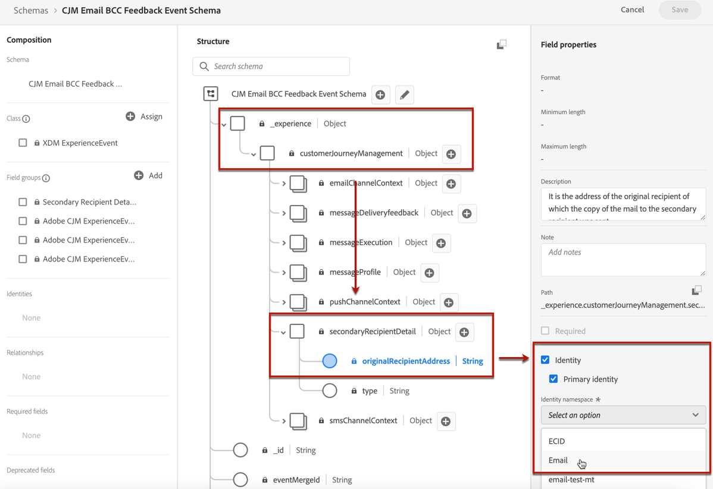

# 配置電子郵件設定 {#email-settings}

在郵件預設配置的專用部分定義電子郵件設定。 瞭解如何在中建立消息預設 [此部分](message-presets.md)。


## 電子郵件類型 {#email-type}

>[!CONTEXTUALHELP]
>id="ajo_admin_presets_emailtype"
>title="定義電子郵件類別"
>abstract="選擇使用此預設時將發送的消息類型：需要用戶同意的促銷消息的市場營銷，或非商業消息的事務性，這些消息也可以在特定上下文中發送到未訂閱的配置檔案。"

在 **電子郵件類型** 部分，選擇將使用預設發送的消息類型： **營銷** 或 **事務性**。

* 選擇 **營銷** 對於促銷消息：這些消息需要用戶同意。

* 選擇 **事務性** 非商業消息（例如，訂單確認、密碼重置通知或傳遞資訊）。

>[!CAUTION]
>
>**事務性** 消息可以發送到從營銷通信中取消訂閱的配置檔案。 這些消息只能在特定上下文中發送。

當 [建立消息](../messages/get-started-content.md#create-new-message)，必須選擇與您為消息選擇的類別匹配的有效消息預設。

## 子域和IP池 {#subdomains-and-ip-pools}

在 **子域和IP池詳細資訊** ，您必須：

1. 選擇要用於發送電子郵件的子域。 [了解更多](about-subdomain-delegation.md)

1. 選擇要與預設關聯的IP池。 [了解更多](ip-pools.md)


當所選IP池位於以下位置時，無法繼續建立預設 [版本](ip-pools.md#edit-ip-pool) (**[!UICONTROL Processing]** 狀態)，且從未與所選子域關聯。 否則，仍將使用IP池/子域關聯的最舊版本。 如果是這種情況，請將預設另存為草稿，並在IP池具有 **[!UICONTROL Success]** 狀態。

>[!NOTE]
>
>對於非生產環境，Adobe不建立現成的test子域，也不授予對共用發送IP池的訪問權限。 你需要 [委派自己的子域](delegate-subdomain.md) 並使用分配給您組織的池中的IP。

## 清單 — 取消訂閱 {#list-unsubscribe}

在 [選擇子域](#subdomains-and-ip-pools) 清單中， **[!UICONTROL Enable List-Unsubscribe]** 按鈕。


依預設，會啟用此選項。

如果保持啟用狀態，則取消訂閱連結將自動包含在電子郵件標題中，例如：


如果禁用此選項，則電子郵件標題中不會顯示取消訂閱連結。

取消訂閱連結包含兩個元素：

* 安 **取消訂閱電子郵件地址**，所有取消訂閱請求都發送到。

   在 [!DNL Journey Optimizer]，取消訂閱電子郵件地址是 **[!UICONTROL Mailto (unsubscribe)]** 在消息預設中顯示的地址，基於 [選定子域](#subdomains-and-ip-pools)。

   

* 的 **取消訂閱URL**，即登錄頁的URL，在取消訂閱後將重定向用戶。

   如果添加 [按一下選擇退出連結](../messages/consent.md#one-click-opt-out) 對於使用此預設建立的消息，取消訂閱URL將是為一次按一下選擇退出連結定義的URL。

   

   >[!NOTE]
   >
   >如果您不在消息內容中添加一鍵退出選項連結，則不會向用戶顯示登錄頁。

瞭解有關將標題取消訂閱連結添加到郵件的詳細資訊 [此部分](../messages/consent.md#unsubscribe-header)。

<!--Select the **[!UICONTROL Custom List-Unsubscribe]** option to enter your own Unsubscribe URL and/or your own Unsubscribe email address.(to add later)-->

## 標題參數{#email-header}

在 **[!UICONTROL HEADER PARAMETERS]** 部分，輸入與使用該預設發送的郵件類型關聯的發件人姓名和電子郵件地址。

>[!CAUTION]
>
>電子郵件地址必須使用當前選定的 [委託子域](about-subdomain-delegation.md)。

* **[!UICONTROL Sender name]**:發件人的名稱，如您的品牌名稱。

* **[!UICONTROL Sender email]**:要用於通信的電子郵件地址。 例如，如果委派的子域是 *營銷.luma.com*，您可以使用 *contact@marketing.luma.com*。

* **[!UICONTROL Reply to (name)]**:收件人按一下 **答復** 按鈕。

* **[!UICONTROL Reply to (email)]**:收件人按一下 **答復** 按鈕。 必須使用在委派子域上定義的地址(例如， *reply@marketing.luma.com*)，否則將刪除電子郵件。

* **[!UICONTROL Error email]**:ISP在發送數天郵件（非同步綁定）後生成的所有錯誤都會在此地址上接收。


>[!NOTE]
>
>地址必須以字母(A-Z)開頭，並且只能包含字母數字字元。 您還可以使用下划線 `_`，點`.` 連字元 `-` 字元。

### 轉發電子郵件 {#forward-email}

如果要轉發到特定電子郵件地址，則所有收到的電子郵件 [!DNL Journey Optimizer] 對於委派的子域，請與Adobe客戶服務部門聯繫。 您需要提供：

* 您選擇的轉發電子郵件地址。 請注意，轉發電子郵件地址域與委託給Adobe的任何子域不匹配。
* 沙盒名稱。
* 使用轉發電子郵件地址的預設名稱。
* 當前 **[!UICONTROL Reply to (email)]** 地址設定在預設級別。

>[!NOTE]
>
>每個子域只能有一個轉發電子郵件地址。 因此，如果多個預設使用相同的子域，則所有預設都必須使用相同的轉發電子郵件地址。

轉發電子郵件地址將通過Adobe設定。 這可能需要3到4天。

<!--
## BCC email {#bcc-email}

>[!CONTEXTUALHELP]
>id="ajo_admin_preset_bcc"
>title="Define a BCC email address"
>abstract="You can keep a copy of sent emails by sending them to a BCC inbox. Enter the email address of your choice so that every email sent is blind-copied to this BCC address. This feature is optional."

You can send an identical copy (or blind carbon copy) of an email sent by [!DNL Journey Optimizer] to a BCC inbox. This optional feature allows you to retain copies of email communications you send to your users for compliance and/or archival purposes. This will be invisible to the delivery recipients.

>[!CAUTION]
>
>This capability will be available starting **May, 31**.

### Enable BCC email {#enable-bcc}

To enable the **[!UICONTROL BCC email]** option, enter the email address of your choice in the dedicated field. You can specify any external address in correct format, except an email address defined on the delegated subdomain. For example, if the delegated subdomain is *marketing.luma.com*, any address like *abc@marketing.luma.com* is prohibited.

>[!NOTE]
>
>You can only define one BCC email address. Make sure the BCC address has enough reception capacity to store all the emails that are sent using the current preset.
>
>More recommendations are listed in [this section](#bcc-recommendations-limitations).


All email messages using this preset will be blind-copied to the BCC email address you entered. From there, they can be processed and archived using an external system.

>[!CAUTION]
>
>Your BCC feature usage will be counted against the number of messages you are licensed for. Hence, only enable it in the presets used for critical communications that you wish to archive. Check your contract for licensed volumes.

The BCC email address setting is immediately saved and processed at the preset level. When you [create a new message](../messages/get-started-content.md#create-new-message) using this preset, the BCC email address is automatically displayed.


However, the BCC address gets picked up for sending communications following the logic below:

* For batch and burst journeys, it does not apply to batch or burst execution that had already started before the BCC setting is made. The change will be picked up at the next recurrence or new execution.

* For transactional messages, the change is picked up immediately for the next communication (up to one minute delay).

>[!NOTE]
>
>You do not need to republish a message or journey for the BCC setting to be picked up.

### Recommendations and limitations {#bcc-recommendations-limitations}

* To ensure your privacy compliance, BCC emails must be processed by an archiving system capable of storing securely personally identifiable information (PII).

* As messages can contain sensitive or private data, such as personally identifiable information (PII), make sure the BCC address is correct, and secure the access to messages.

* Your inbox used for BCC should be properly managed for space and delivery. If the inbox returns bounces, some emails may not be received and therefore will fail to get archived.

* Messages may be delivered to the BCC email address before the target recipients. BCC messages can also been sent even though the original messages may have [bounced](../reports/suppression-list.md#delivery-failures).

    //////OR: Only successfully sent emails are taken in account. [Bounces](../reports/suppression-list.md#delivery-failures) are not. TO CHECK /////////

* Do not open or click through the emails sent to the BCC address as it is taken into account in the total opens and clicks from the send analysis, which could cause some miscalculations in [reports](../reports/message-monitoring.md). 

* Do not mark messages as spam in the BCC inbox, as it will impact all the other emails sent to this address.


>[!CAUTION]
>
>Do not click the unsubscribe link in the emails sent to the BCC address as you will immediately unsubscribe the corresponding recipients.

### GDPR compliance {#gdpr-compliance}

Regulations such as GDPR state that Data Subjects should be able to modify their consent at any time. Because the BCC emails you are sending with Journey Optimizer include securely personally identifiable information (PII), you must edit the **[!UICONTROL CJM Email BCC Feedback Event Schema]** to be able to manage these PII in compliance with GDPR and similar regulations.

To do this, follow the steps below.

1. Go to **[!UICONTROL Data management]** > **[!UICONTROL Schemas]** > **[!UICONTROL Browse]** and select **[!UICONTROL CJM Email BCC Feedback Event Schema]**.

    

1. Click to expand **[!UICONTROL _experience]**, **[!UICONTROL customerJourneyManagment]** then **[!UICONTROL secondaryRecipientDetail]**.

1. Select **[!UICONTROL originalRecipientAddress]**.

1. In the **[!UICONTROL Field properties]** on the right, scroll down to the **[!UICONTROL Identity]** checkbox.

1. Select it and also select **[!UICONTROL Primary identity]**.

1. Select a namespace from the drop-down list.

    

1. Click **[!UICONTROL Apply]**.

>[!NOTE]
>
>Learn more on managing Privacy and the applicable regulations in the [Experience Platform documentation](https://experienceleague.adobe.com/docs/experience-platform/privacy/home.html){target="_blank"}.

### BCC reporting data {#bcc-reporting}

Reporting as such on BCC is not available in the journey and message reports. However, information is stored on a system dataset called **[!UICONTROL AJO BCC Feedback Event Dataset]**. You can run queries against this dataset to find useful information for debugging purpose for example.

You can access this dataset through the user interface. Select **[!UICONTROL Data management]** > **[!UICONTROL Datasets]** > **[!UICONTROL Browse]** and enable the **[!UICONTROL Show system datasets]** toggle from the filter to display the system-generated datasets. Learn more on how to access datasets in [this section](../start/get-started-datasets.md#access-datasets).


To run queries against this dataset, you can use the Query Editor provided by the [Adobe Experience Platform Query Service](https://experienceleague.adobe.com/docs/experience-platform/query/api/getting-started.html){target="_blank"}. To access it, select **[!UICONTROL Data management]** > **[!UICONTROL Queries]** and click **[!UICONTROL Create query]**. [Learn more](../start/get-started-queries.md)


Depending on what information you are looking for, you can run the following queries.

1. For all the other queries below, you will need the journey action ID. Run this query to fetch all action IDs associated with a particular journey version ID within the last 2 days:

        ```
        SELECT
        DISTINCT
        CAST(TIMESTAMP AS DATE) AS EventTime,
        _experience.journeyOrchestration.stepEvents.journeyVersionID,
        _experience.journeyOrchestration.stepEvents.actionName, 
        _experience.journeyOrchestration.stepEvents.actionID 
        FROM journey_step_events 
        WHERE 
        _experience.journeyOrchestration.stepEvents.journeyVersionID = '<journey version id>' AND 
        _experience.journeyOrchestration.stepEvents.actionID is not NULL AND 
        TIMESTAMP > NOW() - INTERVAL '2' DAY 
        ORDER BY EventTime DESC;
        ```

    >[!NOTE]
    >
    >To get the `<journey version id>`parameter, select the corresponding [journey version](../building-journeys/journey-versions.md) from the **[!UICONTROL Journey management]** > **[!UICONTROL Journeys]** menu. The journey version ID is displayed at the end of the URL displayed in your web browser.
    >
    >

1. Run this query to fetch all message feedback events (especially feedback status) generated for a particular message targeted to a specific user within the last 2 days:

        ```
        SELECT  
        _experience.customerJourneyManagement.messageExecution.journeyVersionID AS JourneyVersionID, 
        _experience.customerJourneyManagement.messageExecution.journeyActionID AS JourneyActionID, 
        timestamp AS EventTime, 
        _experience.customerJourneyManagement.emailChannelContext.address AS RecipientAddress, 
        _experience.customerjourneymanagement.messagedeliveryfeedback.feedbackStatus AS FeedbackStatus,
        CASE _experience.customerjourneymanagement.messagedeliveryfeedback.feedbackStatus
            WHEN 'sent' THEN 'Sent'
            WHEN 'delay' THEN 'Retry'
            WHEN 'out_of_band' THEN 'Bounce' 
            WHEN 'bounce' THEN 'Bounce'
        END AS FeedbackStatusCategory
        FROM cjm_message_feedback_event_dataset 
        WHERE  
            timestamp > now() - INTERVAL '2' day  AND
            _experience.customerJourneyManagement.messageExecution.journeyVersionID = '<journey version id>' AND 
            _experience.customerJourneyManagement.messageExecution.journeyActionID = '<journey action id>' AND  
            _experience.customerJourneyManagement.emailChannelContext.address = '<recipient email address>'
            ORDER BY EventTime DESC;
        ```

    >[!NOTE]
    >
    >To get the `<journey action id>` parameter, run the first query described above using the journey version id. The `<recipient email address>` parameter is the targeted or actual recipient's email address.

1. Run this query to fetch all BCC message feedback events generated for a particular message targeted to a specific user within the last 2 days:

    ```
    SELECT   
    _experience.customerJourneyManagement.messageExecution.journeyVersionID AS JourneyVersionID, 
    _experience.customerJourneyManagement.messageExecution.journeyActionID AS JourneyActionID, 
    _experience.customerJourneyManagement.emailChannelContext.address AS BccEmailAddress,
    timestamp AS EventTime, 
    _experience.customerJourneyManagement.secondaryRecipientDetail.originalRecipientAddress AS RecipientAddress, 
    _experience.customerjourneymanagement.messagedeliveryfeedback.feedbackStatus AS FeedbackStatus,
    CASE _experience.customerjourneymanagement.messagedeliveryfeedback.feedbackStatus
                WHEN 'sent' THEN 'Sent'
                WHEN 'delay' THEN 'Retry'
                WHEN 'out_of_band' THEN 'Bounce' 
                WHEN 'bounce' THEN 'Bounce'
            END AS FeedbackStatusCategory 
    FROM ajo_bcc_feedback_event_dataset  
    WHERE  
    timestamp > now() - INTERVAL '2' day  AND
    _experience.customerJourneyManagement.messageExecution.journeyVersionID = '<journey version id>' AND 
    _experience.customerJourneyManagement.messageExecution.journeyActionID = '<journeyaction id>' AND 
    _experience.customerJourneyManagement.secondaryRecipientDetail.originalRecipientAddress = '<recipient email address>'
    ORDER BY EventTime DESC;
    ```

1. Run this query to fetch all recipient addresses who have not received the message whereas its BCC entry exists within the last 30 days:

    ```
    SELECT
        DISTINCT 
    bcc._experience.customerJourneyManagement.secondaryRecipientDetail.originalRecipientAddress AS RecipientAddressesNotRecievedMessage
    FROM ajo_bcc_feedback_event_dataset bcc
    LEFT JOIN cjm_message_feedback_event_dataset mfe
    ON 
   bcc._experience.customerJourneyManagement.messageExecution.journeyVersionID =
            mfe._experience.customerJourneyManagement.messageExecution.journeyVersionID AND    bcc._experience.customerJourneyManagement.messageExecution.journeyActionID = mfe._experience.customerJourneyManagement.messageExecution.journeyActionID AND 
   bcc._experience.customerJourneyManagement.secondaryRecipientDetail.originalRecipientAddress = mfe._experience.customerJourneyManagement.emailChannelContext.address AND
   mfe._experience.customerJourneyManagement.messageExecution.journeyVersionID = '<journey version id>' AND 
   mfe._experience.customerJourneyManagement.messageExecution.journeyActionID = '<journey action id>' AND
   mfe.timestamp > now() - INTERVAL '30' DAY AND
   mfe._experience.customerjourneymanagement.messagedeliveryfeedback.feedbackstatus IN ('bounce', 'out_of_band') 
    WHERE bcc.timestamp > now() - INTERVAL '30' DAY;
    ```
-->

## 電子郵件重試參數 {#email-retry}

>[!CONTEXTUALHELP]
>id="ajo_admin_presets_retryperiod"
>title="調整重試時間段"
>abstract="當電子郵件由於臨時軟彈回錯誤而失敗時，將執行3.5天（84小時）的重試。 您可以調整此預設重試時間段，以更好地滿足您的需要。"
>additional-url="https://experienceleague.adobe.com/docs/journey-optimizer/using/configuration/configuration-message/email-configuration/monitor-reputation/retries.html" text="關於重試"

您可以配置 **電子郵件重試參數**。


預設情況下， [重試時間](retries.md#retry-duration) 設定為84小時，但您可以調整此設定以更好地滿足您的需要。

必須在以下範圍內輸入整數值（以小時或分鐘為單位）:

* 對於市場營銷電子郵件，最短重試時間為6小時。
* 對於事務性電子郵件，最短重試時間為10分鐘。
* 對於這兩種電子郵件類型，最大重試時間為84小時（或5040分鐘）。

在中重試時瞭解更多資訊 [此部分](retries.md)。

## URL跟蹤 {#url-tracking}

>[!CONTEXTUALHELP]
>id="ajo_admin_preset_utm"
>title="URL跟蹤參數"
>abstract="使用此部分可自動將跟蹤參數附加到電子郵件內容中存在的市場活動URL。"

您可以使用 **[!UICONTROL URL Tracking Parameters]** 以衡量您跨渠道的營銷工作的成效。 此功能是選取性的。

本節中定義的參數將附加到電子郵件內容中包含的URL的末尾。 然後，您可以在Web分析工具(如Adobe Analytics或Google Analytics)中捕獲這些參數，並建立各種效能報告。


建立消息預設時，會自動填充三個URL跟蹤參數。 您可以使用 **[!UICONTROL Add new parameter]** 按鈕

要配置URL跟蹤參數，可以直接在 **[!UICONTROL Name]** 和 **[!UICONTROL Value]** ，或導航到以下對象從預定義值清單中進行選擇：

* 行程屬性： **源ID**。 **源名稱**。 **源版本ID**
* 操作屬性： **操作ID**。 **操作名稱**
* Offer decisioning屬性： **服務ID**。 **優惠名稱**


>[!CAUTION]
>
>不選擇資料夾：確保瀏覽到必要的資料夾，並選擇一個配置檔案屬性作為跟蹤參數值。

以下是與Adobe Analytics和Google Analytics相容的URL的示例。

* Adobe Analytics相容URL: `www.YourLandingURL.com?cid=email_AJO_{{context.system.source.id}}_image_{{context.system.source.name}}`

* Google Analytics相容URL: `www.YourLandingURL.com?utm_medium=email&utm_source=AJO&utm_campaign={{context.system.source.id}}&utm_content=image`

>[!NOTE]
>
>可以將鍵入的文本值與選擇預定義的值合併。 每個 **[!UICONTROL Value]** 欄位總共最多可包含255個字元。
