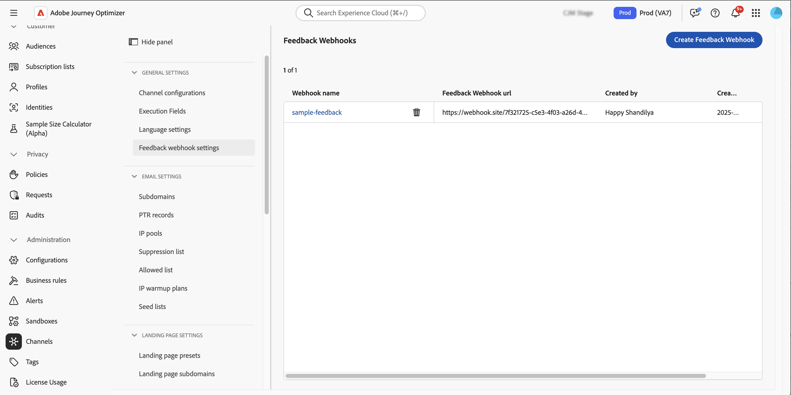
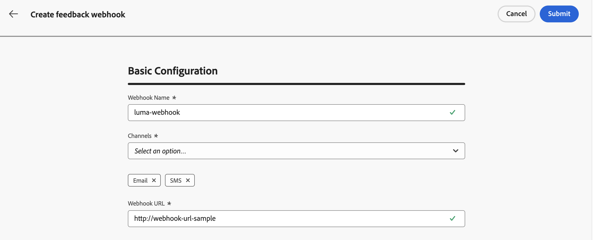
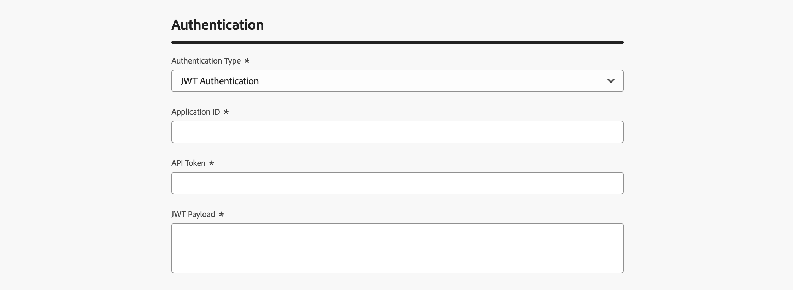
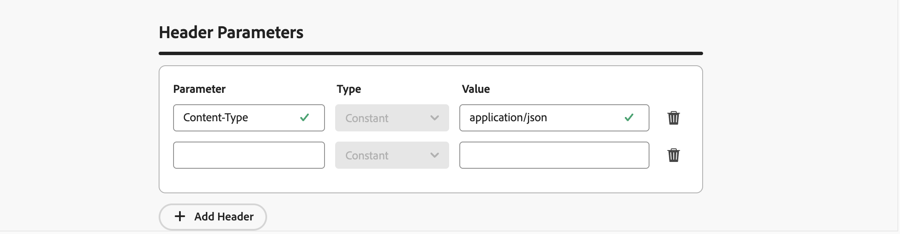

# 為API觸發的行銷活動建立意見回饋Webhook {#webhooks}

意見回饋Webhook可讓您接收透過異動API觸發的行銷活動傳送之訊息的即時狀態更新。 透過設定webhook，您可以自動將傳遞結果直接接收至您的系統，以啟用監視、記錄和自動化處理。

您可以從&#x200B;**[!UICONTROL 管理]** / **[!UICONTROL 管道]** / **[!UICONTROL 意見回饋webhook設定]**&#x200B;功能表管理webhook設定。



>[!NOTE]
>每個&#x200B;**組織+沙箱**&#x200B;組合只允許一個webhook設定。

## 建立意見回饋webhook

若要建立webhook，請執行下列步驟：

1. 瀏覽至&#x200B;**[!UICONTROL 管理]** / **[!UICONTROL 管道]** / **[!UICONTROL 意見回饋Webhook設定]**。

1. 按一下&#x200B;**建立意見回饋Webhook**。

1. 在&#x200B;**[!UICONTROL 基本組態]**&#x200B;區段中，提供下列詳細資料：

   

   * **Webhook名稱** — 輸入描述性名稱以識別webhook。
   * **管道** — 選取此Webhook應該接收其意見回饋（電子郵件和/或簡訊）的管道。
   * **Webhook URL** — 提供必須傳送意見事件的HTTPS端點。

1. 在&#x200B;**[!UICONTROL 驗證]**&#x200B;區段中，選取驗證方法：

   

   * **沒有驗證** — 沒有新增驗證標頭。
   * **JWT驗證** — 如果您的端點需要JWT驗證，請提供必要的詳細資料。

1. 在&#x200B;**[!UICONTROL 標頭引數]**&#x200B;區段中，設定要隨每個webhook請求傳送的其他自訂標頭。

   

1. 按一下&#x200B;**[!UICONTROL 提交]**&#x200B;以儲存組態。

>[!NOTE]
>
>您可以隨時編輯webhook。 若要這麼做，請從詳細目錄開啟它，然後按一下&#x200B;**[!UICONTROL 編輯]**&#x200B;按鈕。

## Webhook裝載結構

訊息執行後，**[!DNL Journey Optimizer]**&#x200B;會傳送下列裝載到設定的端點。

```
{
  "requestId": "8NoByJneShCdCGRnrGS1t1m3CdA73dhR",
  "imsOrg": "myImsOrg",
  "sandbox": {
    "id": "068abf40-575e-11ea-8512-9b1bfdb82603",
    "name": "prod"
  },
  "channel": "email",
  "eventType": "message.feedback",
  "messageExecution": {
    "messageExecutionID": "HUMA-26362805",
    "messageType": "transactional",
    "campaignID": "16f24a15-7e21-477c-848a-d5695ca7f137",
    "campaignVersionID": "2ca10c10-56dd-4505-87cd-fa5da84e7a5d"
  },
  "messageDeliveryFeedback": {
    "feedbackStatus": {
      "value": "bounce"
    },
    "offers": null,
    "messageExclusion": null,
    "messageFailure": {
      "category": "sync",
      "type": "Ignored",
      "code": "25",
      "reason": "Admin Failure"
    },
    "retryCount": 0
  },
  "identityMap": {
    "email": [
      {
        "id": "john.doe@luma.com",
        "primary": true
      }
    ]
  }
}
```

webhook可擷取下列事件：

* 已傳送
* 已傳遞
* 跳出（請參閱上述範例）
* 錯誤

每個傳入請求也包含傳回webhook的唯一requestId。

## 後續步驟 {#next}

建立意見回饋webhook後，您可以在設定&#x200B;**交易式API觸發的行銷活動**&#x200B;對象時啟用它。 在本節瞭解更多資訊： [啟用Webhook](../campaigns/api-triggered-campaign-audience.md#webhook)
