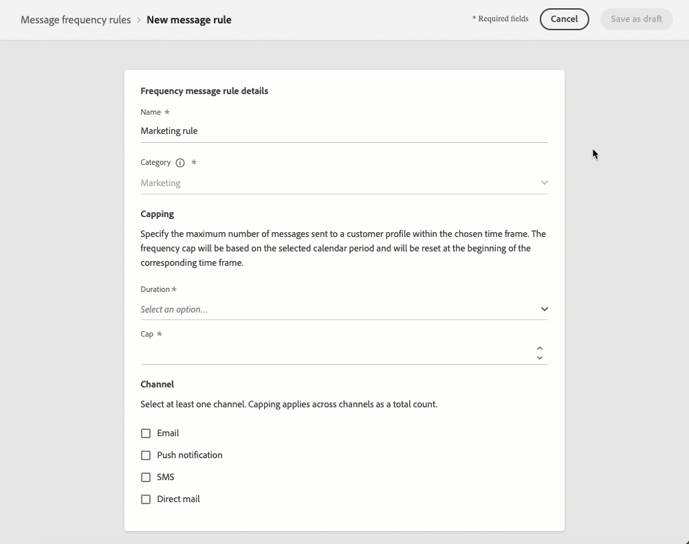
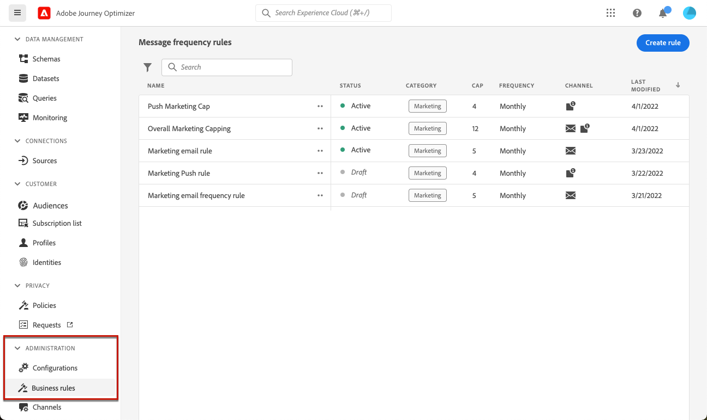
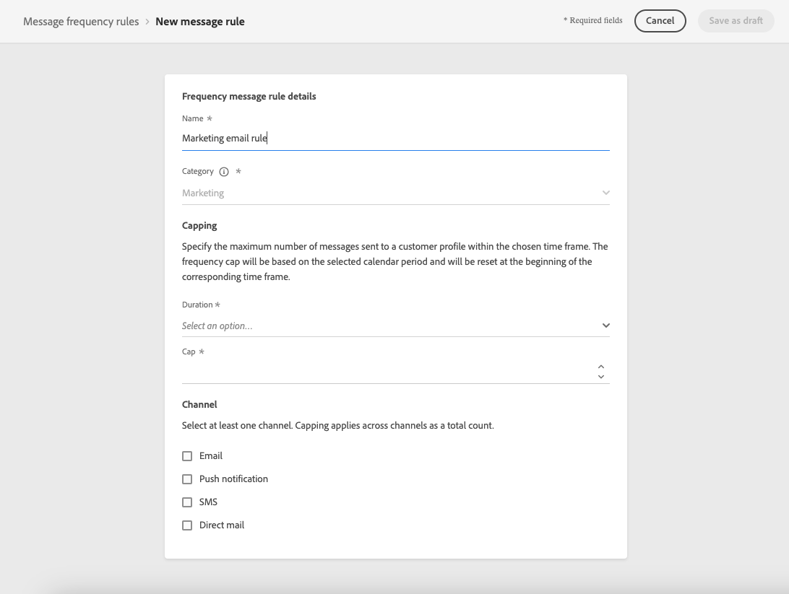
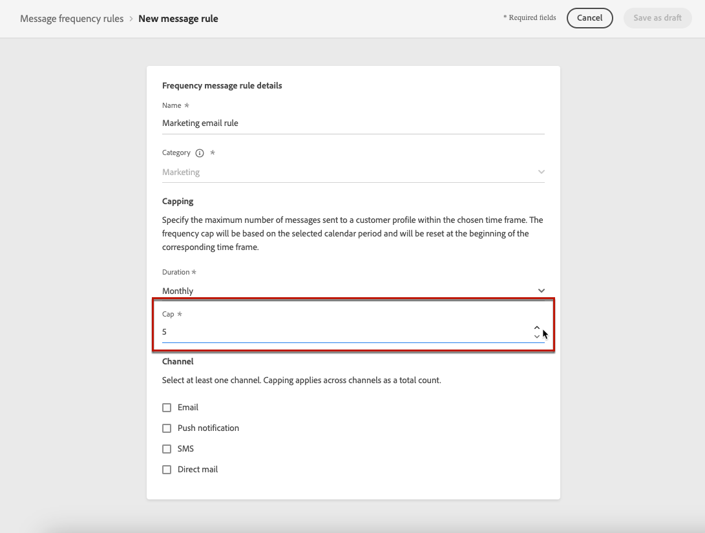
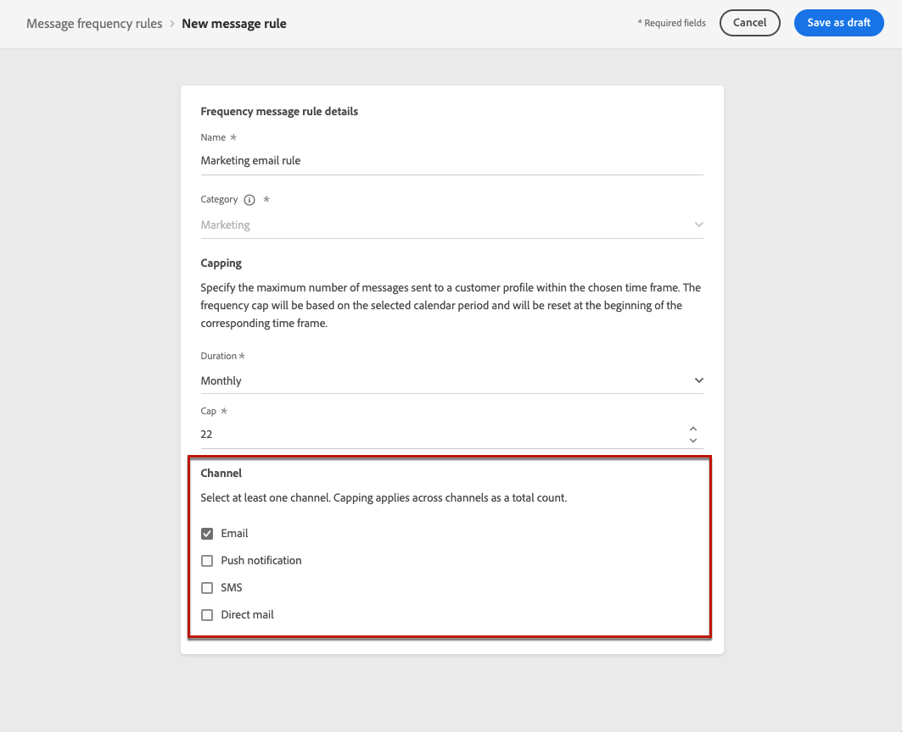
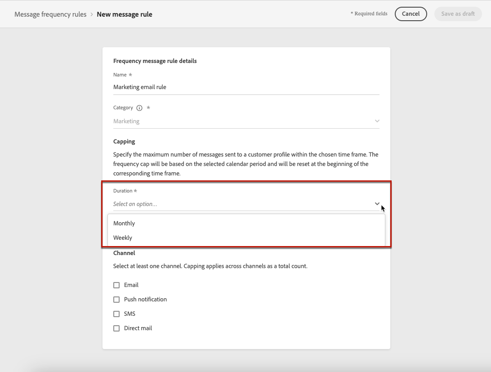
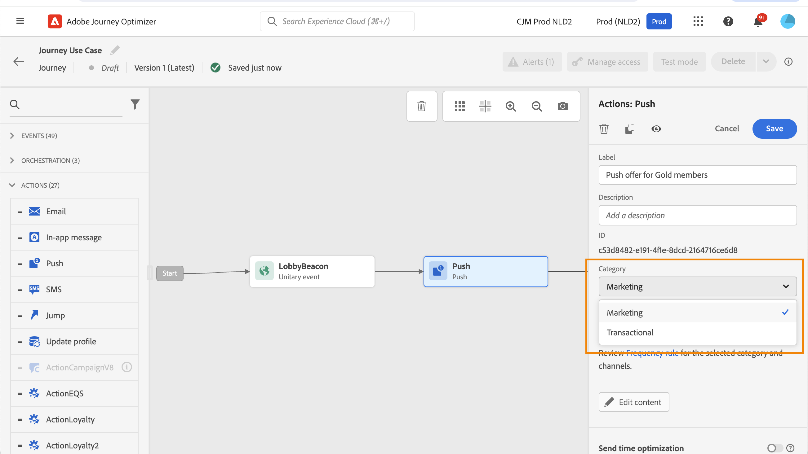
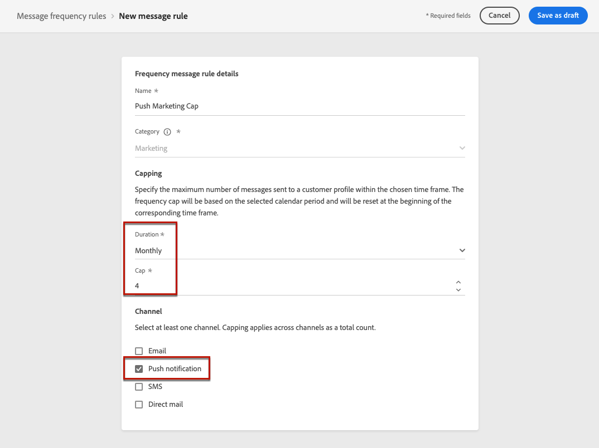

# 設定業務規則 {#frequency-rules}

>[!CONTEXTUALHELP]
>id="ajo_business_rules_message_frequency_rules"
>title="業務規則"
>abstract="訊息頻率規則是一種業務規則，用於限制使用者跨一個或多個管道接收訊息或進入歷程的次數。這些跨管道規則會自動從訊息和動作中排除過度請求的設定檔。"

[!DNL Journey Optimizer]可讓您控制使用者經由一或多個頻道接收訊息或進入歷程的頻率。 訊息頻率規則，可自動從訊息和動作中排除過度請求的設定檔。

例如，針對品牌，規則每個月不得傳送超過4則行銷訊息給客戶。 若要這麼做，您可以使用商業規則，在每月日曆期間，根據一或多個管道傳送的訊息數量會受到限制。

>[!NOTE]
>
>商業規則與選擇退出管理不同，後者允許使用者取消訂閱以停止接收來自品牌的通訊。 [了解更多](../privacy/opt-out.md#opt-out-management)

➡️ [在影片中探索此功能](#video)

## 存取商業規則 {#access-rules}

可從&#x200B;**[!UICONTROL 管理]** > **[!UICONTROL 商業規則]**&#x200B;功能表取得商業規則。 所有規則都會列出，並依修改日期排序。 使用篩選器圖示來篩選類別、狀態和/或頻道。 您也可以搜尋訊息標籤。

### 權限{#permissions-frequency-rules}

若要存取、建立、編輯或刪除商業規則，您必須擁有&#x200B;**[!UICONTROL 管理頻率規則]**&#x200B;許可權。

具有&#x200B;**[!UICONTROL 檢影片率規則]**&#x200B;許可權的使用者可以檢視規則，但不能修改或刪除規則。

若要了解更多關於權限的資訊，請參閱[此區段](../administration/high-low-permissions.md)。

## 建立業務規則 {#create-new-rule}

>[!CONTEXTUALHELP]
>id="ajo_rules_category"
>title="選取訊息規則類別"
>abstract="啟動並套用至訊息時，和所選類別相符的所有業務規則會自動套用至該訊息。目前只有行銷類別可用。"

>[!CONTEXTUALHELP]
>id="ajo_rules_capping"
>title="設定業務規則的上限"
>abstract="指定在所選時間範圍內傳送至客戶設定檔的最大訊息數量。頻率上限會以所選的行事曆期間為基礎，並會在對應的時間段開始時重設。 "

>[!CONTEXTUALHELP]
>id="ajo_rules_channel"
>title="定義套用業務規則的管道"
>abstract="選取至少一個管道。上限會以總計數套用在所有管道上。"

若要建立新的商業規則，請遵循下列步驟。

1. 存取&#x200B;**[!UICONTROL 商業規則]**&#x200B;清單，然後按一下&#x200B;**[!UICONTROL 建立規則]**。

   

1. 定義規則名稱並選取訊息規則類別。

   >[!NOTE]
   >
   >只有&#x200B;**[!UICONTROL 行銷]**&#x200B;類別可用。

   

1. 從&#x200B;**[!UICONTROL 持續時間]**&#x200B;下拉式清單中，選取要套用上限的時間範圍。 [了解更多](#frequency-cap)

1. 設定規則的上限，代表根據您上述選擇，每個月或第<!--or day-->周可傳送至個別使用者設定檔的最大訊息數量。

   <!---->

1. 選取您要用於此規則的頻道： **[!UICONTROL 電子郵件]**、**[!UICONTROL 推播通知]**、**[!UICONTROL 簡訊]**&#x200B;或&#x200B;**[!UICONTROL 直接郵件]**。

   

   >[!NOTE]
   >
   >您必須至少選取一個管道才能建立規則。

1. 如果您要將上限套用至所有選取的色版總數，請選取數個色版。

   例如，將上限設為15，然後選取電子郵件和推播通道。 如果設定檔在選定期間內已收到10封行銷電子郵件和5個行銷推播通知，則會在下次傳送行銷電子郵件或推播通知時排除此設定檔。

1. 按一下&#x200B;**[!UICONTROL 另存為草稿]**&#x200B;以確認建立規則。 您的訊息已新增至規則清單，狀態為&#x200B;**[!UICONTROL 草稿]**。

   

### 頻率上限 {#frequency-cap}

從&#x200B;**[!UICONTROL 持續時間]**&#x200B;下拉式清單中，選取您要每月或每週套用上限。

>[!NOTE]
>
>每日頻率上限也可隨選提供。 [了解更多](#daily-frequency-cap)

頻率上限是根據所選的日曆期間。 它會在對應的時間範圍開始時重設。

每個期間的計數器到期日如下：

* **[!UICONTROL 每月]**：頻率上限在每月最後一天23:59:59 UTC之前有效。 例如，1月的每月到期日為01-31 23:59:59 UTC。

* **[!UICONTROL 每週]**：當行事曆周從星期日開始時，頻率上限將持續到星期六23:59:59 UTC。 無論規則建立與否，有效期都相同。 例如，如果規則是在星期四建立，則此規則的有效期直到星期六的23:59:59。

### 每日頻率上限 {#daily-frequency-cap}

除了每月和每週外，每日頻率上限也可依需求提供。 如需詳細資訊，請聯絡您的Adobe代表。

每日頻率上限在23:59:59 UTC之前的該日有效，並在隔天的開頭重設為0。

>[!NOTE]
>
>為確保每日頻率上限規則的正確性，建議使用[串流分段](https://experienceleague.adobe.com/docs/experience-platform/segmentation/ui/streaming-segmentation.html){target="_blank"}。 在[本節](../audience/about-audiences.md#evaluation-method-in-journey-optimizer)中進一步瞭解對象評估方法。

## 啟用商業規則 {#activate-rule}

建立後，商業規則具有&#x200B;**[!UICONTROL 草稿]**&#x200B;狀態，尚未影響任何訊息。 若要啟用，請按一下規則旁邊的省略符號，然後選取&#x200B;**[!UICONTROL 啟用]**。

啟用規則會影響規則在下次執行時套用的任何訊息。 瞭解如何[將商業規則](#apply-frequency-rule)套用至訊息。

>[!NOTE]
>
>規則完整啟用最多可能需要10分鐘。 您不需要修改訊息或重新發佈歷程，規則就能生效。

若要停用商業規則，請按一下規則旁邊的省略符號，然後選取&#x200B;**[!UICONTROL 停用]**。

規則的狀態將變更為&#x200B;**[!UICONTROL 非使用中]**，而且規則將不會套用至未來的訊息執行。 目前執行中的任何訊息都不會受到影響。

>[!NOTE]
>
>停用規則不會影響或重設個別設定檔的任何計數。

## 將商業規則套用至訊息 {#apply-frequency-rule}

若要將商業規則套用至訊息，請遵循下列步驟。

1. 建立[歷程](../building-journeys/journey-gs.md)時，選取您為規則定義的其中一個管道，以新增訊息。

1. 選取您為建立的[規則](#create-new-rule)定義的類別。

   

   >[!NOTE]
   >
   >目前僅&#x200B;**[!UICONTROL 行銷]**&#x200B;類別適用於商業規則。

1. 您可以按一下&#x200B;**[!UICONTROL 頻率規則]**&#x200B;連結，在新的索引標籤中檢影片率規則畫面。 [了解更多](#access-rules)

   符合所選類別和管道的所有規則都會自動套用至此訊息。

   >[!NOTE]
   >
   >選取的類別為&#x200B;**[!UICONTROL 異動]**&#x200B;的訊息將不會根據頻率規則進行評估。

1. 您可以在[Customer Journey Analytics報告](../reports/report-gs-cja.md)和[即時報告](../reports/live-report.md)中檢視從傳送中排除的設定檔數目，其中商業規則會列為使用者從傳送中排除的可能原因。

>[!NOTE]
>
>數個規則可套用至相同的管道，但一旦達到較低上限，設定檔將從下一次傳送中排除。

## 範例：合併數個規則 {#frequency-rule-example}

您可以結合數個商業規則，如下列範例所述。

1. [建立名為](#create-new-rule)整體行銷上限&#x200B;*的商業規則*：

   * 選取所有色版。
   * 將上限設定為每月12個。

   

1. 若要進一步限制傳送給使用者的行銷型推播通知數目，請建立名為&#x200B;*推播行銷上限*&#x200B;的第二個規則：

   * 選取推播頻道。
   * 將上限設定為每月4個。

   

1. 儲存並[啟動](#activate-rule)規則。

1. [為您要通訊的每個頻道建立訊息](../building-journeys/journeys-message.md)，並為每個訊息選取&#x200B;**[!UICONTROL 行銷]**&#x200B;類別。 [瞭解如何套用商業規則](#apply-frequency-rule)

   

<!--
Learn how to create a message for the different channels in the following sections:
* [Create an email](../email/create-email.md)
* [Create a push notification](../push/create-push.md)
* [Create an SMS](../sms/create-sms.md)
* [Create a direct mail](../direct-mail/create-direct-mail.md)

Create an email and select the **[!UICONTROL Marketing]** category for that message. [Learn more](../email/create-email.md)

Create a push notification and select the **[!UICONTROL Marketing]** category for that message. [Learn more](../push/create-push.md)

Create an SMS and select the **[!UICONTROL Marketing]** category for that message. [Learn more](../sms/create-sms.md)

Create a direct mail and select the **[!UICONTROL Marketing]** category for that message. [Learn more](../direct-mail/create-direct-mail.md)
-->

在此案例中，個別設定檔：
* 每月最多可接收12則行銷訊息；
* 但是在收到4個推播通知後，便會從行銷推播通知中排除。

>[!NOTE]
>
>測試商業規則時，建議使用新建立的[測試設定檔](../audience/creating-test-profiles.md)，因為一旦達到設定檔的頻率上限，就無法在下個月之前重設計數器。 停用規則將允許限定設定檔接收訊息，但不會移除或刪除任何計數器增量。

## 作法影片 {#video}

瞭解如何建立、啟用、測試及報告商業規則。

>[!VIDEO](https://video.tv.adobe.com/v/344451?quality=12)
