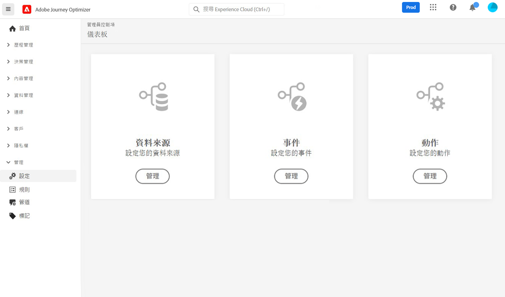

# 開始使用[!DNL Journey Optimizer]設定 {#start-optimizer-configuration}

首次存取 [!DNL Journey Optimizer] 系統時，會佈建生產沙箱，並根據您的合約分配特定數量的 IP。

若要建立歷程並傳送訊息，您必須完成下列設定步驟。

## 設定訊息與通道

1. 若要建立並傳送訊息，您需根據通道執行特定設定。

   * 對於&#x200B;**電子郵件**&#x200B;通道，您需要將子網域委派給 Adobe 並建立 IP 集區以將 IP 位址組合在一起。[了解更多](../email/get-started-email-config.md)

   * 對於&#x200B;**推播**&#x200B;通道，您需要在 [!DNL Adobe Experience Platform] 與 [!DNL Adobe Experience Platform Launch] 中定義推播通知設定。[了解更多](../push/push-configuration.md)

   * 對於&#x200B;**簡訊**&#x200B;通道，您需要設定執行個體以傳送簡訊，包括整合提供者設定與 [!DNL Journey Optimizer]。[了解更多](../sms/sms-configuration.md)

1. 完成後，您必須建立&#x200B;**管道表面**，設定傳送訊息所需的所有技術參數。[了解更多](channel-surfaces.md)

1. 您也可以：

   * 管理將電子郵件地址傳送至禁止名單前執行重試的天數。[了解更多](manage-suppression-list.md)

   * 啟用 **BBC電子郵件選項**，保留傳送給個人的訊息副本。 [了解更多](archiving-support.md#enable-bcc)

   * 設定&#x200B;**商業規則**&#x200B;以避免過度向收件者請求。 [了解更多](frequency-rules.md)

   * 當 Adobe Experience Platform 有多個位址/號碼可用時，請確定收件者優先使用哪個電子郵件位址和/或電話號碼。[了解更多](primary-email-addresses.md)

<!--* Understand the push notification flow. [Learn more](../push/push-gs.md)-->

>[!NOTE]
>
>這些步驟必須由 [Adobe Journey Optimizer 系統管理員](../start/path/administrator.md)執行。

## 設定歷程

若要建立歷程，您需要設定&#x200B;**[!UICONTROL 資料來源]**、**[!UICONTROL 事件]**&#x200B;及&#x200B;**[!UICONTROL 動作]**。[了解更多](about-data-sources-events-actions.md)

* **資料來源**&#x200B;設定可讓您定義系統連線，以擷取將用於歷程的其他資訊。[了解更多](../datasource/about-data-sources.md)

* **事件**&#x200B;可讓您一直觸發歷程，以即時傳送訊息給流入歷程的個人。 在事件設定中，您會設定歷程中預期的事件。 會依照 Adobe Experience Data Model (XDM)，對傳入事件的資料進行標準化。事件來自串流擷取 API，適用於驗證和未驗證的事件 (例如 Adobe Mobile SDK 事件)。[了解更多](../event/about-events.md)

* [!DNL Journey Optimizer] 隨附內建的訊息功能，可讓您設計並傳送內容。 如果您使用協力廠商系統來傳送訊息，請建立&#x200B;**自訂動作**。[了解更多](../action/action.md)