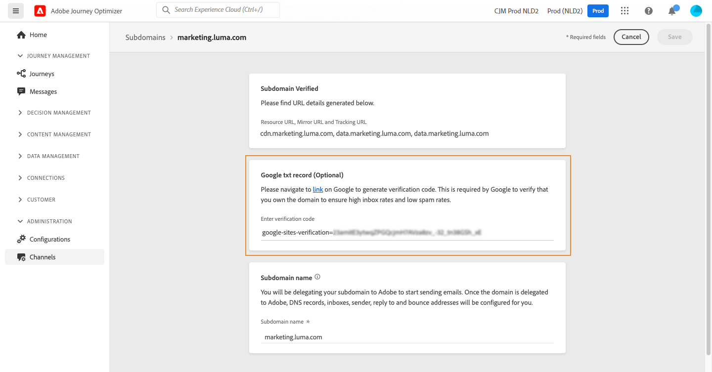

# 將 Google TXT 記錄新增至子網域 {#google-txt-record}

>[!BEGINSHADEBOX]

**在此頁面上：**&#x200B;瞭解如何在您的子網域上新增和更新Google網站驗證TXT記錄，以確保將電子郵件成功傳送至Gmail地址。

>[!ENDSHADEBOX]

>[!CONTEXTUALHELP]
>id="ajo_admin_subdomain_google"
>title="Google TXT 記錄"
>abstract="若要確保電子郵件成功傳遞到 Gmail 地址，您可以將特殊的 Google 網站驗證 TXT 記錄新增到您的子網域以確保它已通過驗證。"

TXT記錄是一種DNS記錄，用於提供關於網域的文字資訊，可以由外部來源讀取。

為了確保最佳傳遞能力並成功傳遞電子郵件至Gmail地址，[!DNL Journey Optimizer]可讓您新增特殊的Google網站驗證TXT記錄至您的子網域，以確保其經過驗證。

>[!CAUTION]
>
> 只有在子網域具有&#x200B;**[!UICONTROL Success]**&#x200B;狀態時，才能執行此作業。 如需子網域狀態的詳細資訊，請參閱[本區段](delegate-subdomain.md#access-delegated-subdomains)。

## 新增 Google TXT 記錄 {#add-google-txt-record}

若要將Google TXT記錄新增至子網域，請執行下列步驟：

1. 從&#x200B;**[!UICONTROL 管道]** > **[!UICONTROL 電子郵件設定]** > **[!UICONTROL 子網域]**&#x200B;功能表開啟子網域。

1. 在&#x200B;**[!UICONTROL Google txt記錄]**&#x200B;區段中，輸入從[Google Workspace](https://support.google.com/a/answer/183895){target="_blank"}<!--G Suite Admin tools-->產生的驗證碼，然後按一下&#x200B;**[!UICONTROL 儲存]**。

   

1. 新增 TXT 記錄後，該記錄必須獲得 Google 驗證。 若要這麼做，請導覽至[Google Workspace](https://support.google.com/a/answer/183895){target="_blank"}<!--G Suite Admin tools-->，然後啟動驗證步驟。

## 更新Google TXT記錄 {#update-google-txt-record}

若要更新現有的Google TXT記錄，請遵循下列步驟：

1. 從&#x200B;**[!UICONTROL 子網域]**&#x200B;功能表開啟子網域。

1. 清除&#x200B;**[!UICONTROL Google txt記錄]**&#x200B;欄位中的現有值，然後按一下&#x200B;**[!UICONTROL 儲存]**。 此步驟會以空字串取代先前的Google TXT記錄值。

1. 現在，請重新開啟相同的子網域，並輸入新的驗證代碼。

1. 再按一下&#x200B;**[!UICONTROL 儲存]**。

1. 透過[Google Workspace](https://support.google.com/a/answer/183895){target="_blank"}驗證更新的記錄。
