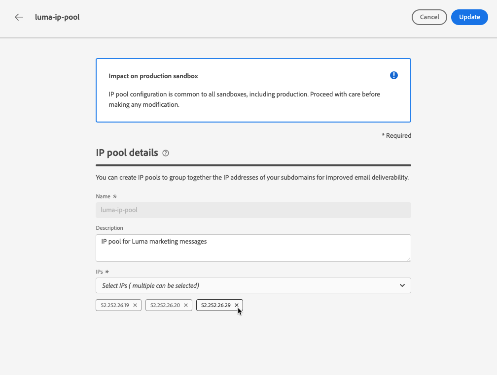

# 建立 IP 池 {#create-ip-pools}

>[!CONTEXTUALHELP]
>id="ajo_admin_ip_pool_header"
>title="設定 IP 池"
>abstract="IP 池會收集您的子網域的 IP 位址以提高電子郵件的可遞送性。"

>[!CONTEXTUALHELP]
>id="ajo_admin_ip_pool"
>title="設定 IP 池"
>abstract="使用 Journey Optimizer，您可以建立 IP 池以將子網域的 IP 位址聚集在一起。這可能會大幅提高您的電子郵件可遞送性，因為這樣做可以防止某個子網域的聲譽影響您的其他子網域。"

## 關於IP池 {#about-ip-pools}

使用 [!DNL Journey Optimizer]，您可以建立IP池，將子網域的IP位址分組。

強烈建議建立IP池以實現電子郵件傳遞。 如此一來，您就能防止子網域的信譽影響其他子網域。

例如，一個最佳實務是為行銷訊息建立一個IP池，為交易式訊息另一個IP池。 這樣，如果您的其中一個行銷訊息執行不良，且被客戶宣告為垃圾訊息，則不會影響傳送給同一位客戶的交易式訊息，該客戶仍會收到交易式訊息（購買確認、密碼復原訊息等）。

>[!CAUTION]
>
>IP池配置對所有環境都是通用的。 因此，任何IP池的建立或版本都將影響生產沙箱。

## 建立IP池 {#create-ip-pool}

要建立IP池，請執行以下步驟：

1. 存取 **[!UICONTROL 管理]** > **[!UICONTROL 管道]** > **[!UICONTROL IP池]** ，然後按一下 **[!UICONTROL 建立IP池]**.

   

1. 提供IP池的名稱和說明（可選）。

   >[!NOTE]
   >
   >名稱必須以字母(A-Z)開頭，且僅包含英數字元或特殊字元(_、.、-)。

1. 從下拉清單中選擇要包含在池中的IP地址，然後按一下 **[!UICONTROL 提交]**.

   

   >[!NOTE]
   >
   >清單中會提供與您執行個體布建的所有IP位址。

選擇IP時，可以從清單中看到與IP關聯的PTR記錄。 這允許您在建立IP池時驗證每個IP的品牌資訊，並選擇具有相同品牌資訊的IP。 [了解有關PTR記錄的更多資訊](ptr-records.md)

>[!NOTE]
>
>如果未為IP配置PTR記錄，則無法選擇該IP。 請洽詢您的Adobe代表以設定該IP的PTR記錄。

建立IP池後，將游標暫留在IP池下拉清單下顯示的IP地址上時，PTR資訊將可見。

IP池現在已建立並顯示在清單中。 您可以選取它以存取其屬性並顯示相關的通道表面（即訊息預設集）。 有關如何將通道表面與IP池關聯的詳細資訊，請參閱 [本節](channel-surfaces.md).

## 編輯IP池 {#edit-ip-pool}

要編輯IP池，請執行以下步驟。

1. 從清單中，按一下IP池名稱以開啟它。

   

1. 視需要編輯其屬性。 您可以修改說明，以及新增或移除IP位址。

   >[!NOTE]
   >
   >IP池名稱不可編輯。 如果要修改它，則需要刪除IP池，並使用您選擇的名稱建立另一個池。

   

   >[!CAUTION]
   >
   >考慮刪除IP時請格外小心，因為這會對其他IP造成額外負載，且可能對您的傳送能力造成嚴重影響。 如有疑問，請聯絡傳遞能力專家。

1. 儲存您的變更。

更新會立即或非同步生效，具體取決於與 [通道表面](channel-surfaces.md) 或否：

* 如果IP池為 **not** 與任何通道表面相關聯，更新為瞬時(**[!UICONTROL 成功]** 狀態)。
* 如果IP池 **is** 與通道曲面相關聯，更新最多需要3小時(**[!UICONTROL 處理]** 狀態)。

>[!NOTE]
>
>當 [建立通道曲面](channel-surfaces.md#create-channel-surface)，如果選擇的IP池在版本(**[!UICONTROL 處理]** 狀態)，並且從未與為該曲面選擇的子域相關聯，則無法繼續建立曲面。 [了解更多](channel-surfaces.md#subdomains-and-ip-pools)

要檢查IP池更新狀態，請按一下 **[!UICONTROL 更多動作]** 按鈕並選取 **[!UICONTROL 最近更新]**.

>[!NOTE]
>
>成功更新IP池後，您可能需要等待：
>* 在被統一消息使用前幾分鐘，
>* 直到IP池的下一批處理在批處理消息中生效。

您也可以使用 **[!UICONTROL 刪除]** 按鈕刪除IP池。 請注意，您無法刪除已與通道表關聯的IP池。

