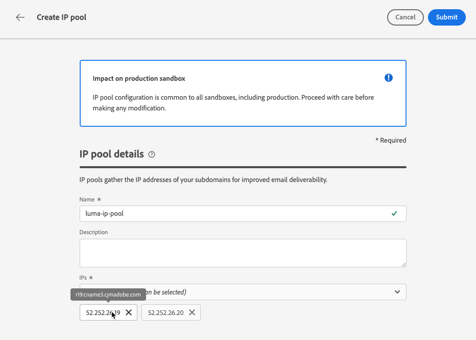

# 建立 IP 集區 {#create-ip-pools}

>[!CONTEXTUALHELP]
>id="ajo_admin_ip_pool_header"
>title="設定 IP 池"
>abstract="IP 池會收集您的子網域的 IP 位址以提高電子郵件的可遞送性。"

>[!CONTEXTUALHELP]
>id="ajo_admin_ip_pool"
>title="設定 IP 池"
>abstract="使用 Journey Optimizer，您可以建立 IP 池以將子網域的 IP 位址聚集在一起。這可能會大幅提高您的電子郵件可遞送性，因為這樣做可以防止某個子網域的聲譽影響您的其他子網域。"

## 關於IP集區 {#about-ip-pools}

透過[!DNL Journey Optimizer]，您可以建立IP集區，將子網域的IP位址群組在一起。

強烈建議您建立IP集區，以傳遞電子郵件。 如此一來，您便可防止子網域的信譽影響其他子網域。

例如，一個最佳實務是讓一個IP集區用於行銷訊息，另一個集區用於交易式訊息。 這樣的話，如果您的行銷訊息中有一則訊息執行不佳且被客戶宣告為垃圾訊息，則不會影響傳送給這位客戶的交易式訊息，該客戶仍會收到交易式訊息（購買確認、密碼復原訊息等）。

>[!CAUTION]
>
>IP集區設定對所有環境都是通用的。 因此，任何IP集區的建立或編輯也將影響生產沙箱。

## 建立 IP 集區 {#create-ip-pool}

若要建立IP集區，請執行下列步驟：

1. 存取&#x200B;**[!UICONTROL 管理]** > **[!UICONTROL 管道]** > **[!UICONTROL 電子郵件設定]** > **[!UICONTROL IP集區]**&#x200B;功能表，然後按一下&#x200B;**[!UICONTROL 建立IP集區]**。

   

1. 提供IP集區的名稱和說明（選擇性）。

   >[!NOTE]
   >
   >名稱必須以字母(A-Z)開頭，且僅包含英數字元或特殊字元( _、.、- )。

1. 從下拉式清單中選取要包含在集區中的IP位址，然後按一下&#x200B;**[!UICONTROL 提交]**。

   

   >[!NOTE]
   >
   >清單中提供您執行個體布建的所有IP位址。

選取IP時，您可以從清單中看到與IP相關聯的PTR記錄。 這可讓您在建立IP集區時驗證每個IP的品牌資訊，並選取具有相同品牌資訊的IP。 [進一步了解 PTR 記錄](ptr-records.md)

>[!NOTE]
>
>如果沒有為IP設定PTR記錄，則無法選取該IP。 請聯絡您的Adobe代表以設定該IP的PTR記錄。<!--Now this only happens when first subdomain delegated to Adobe is with CNAME method.-->

建立IP集區後，當游標停留在IP集區下拉式清單下方顯示的IP位址上時，會顯示PTR資訊。

IP集區現在已建立並顯示在清單中。 您可以選取它以存取其屬性並顯示相關頻道設定（即訊息預設集）。 有關如何將通道設定與IP集區關聯的詳細資訊，請參閱[本節](channel-surfaces.md)。

## 編輯IP集區 {#edit-ip-pool}

若要編輯IP集區，請遵循下列步驟。

1. 從清單中，按一下IP集區名稱以開啟。

1. 視需要編輯其屬性。 您可以修改說明，以及新增或移除IP位址。

   >[!NOTE]
   >
   >IP集區名稱無法編輯。 如果您要修改它，您需要刪除IP集區，並以您選擇的名稱建立另一個集區。

   

   >[!CAUTION]
   >
   >在考慮刪除IP時請格外小心，因為這將對其他IP造成額外負載，並可能嚴重影響您的傳遞能力。 如有疑問，請聯絡傳遞能力專家。

1. 儲存您的變更。

根據與[通道設定](channel-surfaces.md)關聯的IP集區，更新會立即或非同步生效：

* 如果IP集區是&#x200B;**不是與任何通道設定相關聯的**，則更新是即時的（**[!UICONTROL 成功]**&#x200B;狀態）。
* 如果IP集區&#x200B;**與通道設定關聯**，則更新最多可能需要3小時的時間（**[!UICONTROL 處理]**&#x200B;狀態）。

>[!NOTE]
>
>當[建立通道設定](channel-surfaces.md#create-channel-surface)時，如果您選取正在編輯中的IP集區（**[!UICONTROL 正在處理]**&#x200B;狀態），而且從未與為該設定選取的子網域建立關聯，則無法繼續建立設定。 [了解更多](channel-surfaces.md#subdomains-and-ip-pools)

若要檢查IP集區更新狀態，請按一下&#x200B;**[!UICONTROL 其他動作]**&#x200B;按鈕，然後選取&#x200B;**[!UICONTROL 最近更新]**。

>[!NOTE]
>
>成功更新IP集區後，您可能必須等待：
>
>* 幾分鐘後，單一訊息便會使用，
>* 直到IP集區的下一個批次在批次訊息中生效。

您也可以使用&#x200B;**[!UICONTROL 刪除]**&#x200B;按鈕來刪除IP集區。 請注意，您無法刪除已關聯至通道設定的IP集區。

