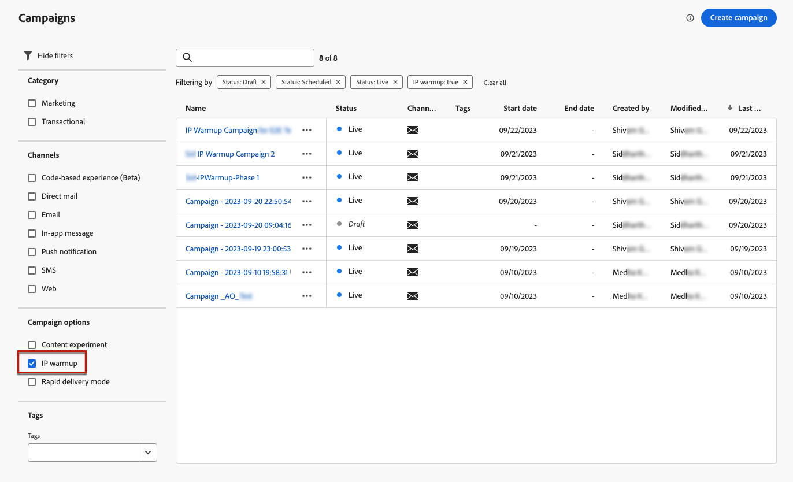

# 建立 IP 暖身行銷活動 {#create-ip-warmup-campaign}

>[!CONTEXTUALHELP]
>id="ajo_campaign_ip_warmup"
>title="啟用 IP 暖身計劃選項"
>abstract="當您選取此選項時，可以在 IP 暖身計劃中使用行銷活動。然後，活動排程將由與其關聯的 IP 暖身計劃驅動。"

在[!DNL Journey Optimizer]中建立IP熱身計畫本身之前，您必須先建立一或多個專門設計用於IP熱身計畫<!--through a dedicated option-->的行銷活動。

若要建立IP熱身行銷活動，請遵循下列步驟。

1. 針對您為熱身計畫識別的網域和IP，建立[電子郵件](../email/email-settings.md)管道[設定](channel-surfaces.md)。

   >[!NOTE]
   >
   >在[本節](../email/email-settings.md#subdomains-and-ip-pools)中瞭解如何選取要用於電子郵件設定的網域和IP。
   >
   >* 請與您的傳遞顧問合作，識別要用於IP熱身計畫的網域和IP。<!--TBC-->

1. 建立排程的行銷[行銷活動](../campaigns/create-campaign.md)並選取[電子郵件](../email/create-email.md#create-email-journey-campaign)動作。

   <!--Select the Marketing category. The IP warmup plan activation option is only available for  marketing-type campaigns.-->

1. 選取您為IP熱身建立的設定。

   

   <!--You must use the same configuration as the one that will be used for the asociated IP warmup plan. [Learn how to create an IP warmup plan](#create-ip-warmup-plan)-->

1. 按一下&#x200B;**[!UICONTROL 建立]**。

1. 從&#x200B;**[!UICONTROL 排程]**&#x200B;區段中，選取&#x200B;**[!UICONTROL IP熱身計畫啟用]**。

   

   行銷活動[排程](../campaigns/create-campaign.md#schedule)將由其將相關聯的IP熱身計畫驅動，這表示行銷活動本身不再定義排程。

1. 完成步驟以建立電子郵件行銷活動，例如定義行銷活動屬性、[對象](../audience/about-audiences.md)<!--best practices for IP warmup in terms of audience?-->和[內容](../email/get-started-email-design.md#key-steps)。

   請注意，您需要為IP熱身行銷活動選取規則型對象。 [了解更多](../audience/creating-a-segment-definition.md)

   如需如何設定行銷活動的詳細資訊，請參閱[此頁面](../campaigns/get-started-with-campaigns.md)。

1. [啟動](../campaigns/review-activate-campaign.md)行銷活動。 其狀態變更為&#x200B;**[!UICONTROL 即時]**。

   請注意，商業規則不應用於IP熱身計畫。 套用這些規則可能會阻礙達到行銷活動所需目標設定檔數。

   對於已啟用IP熱身計畫的即時行銷活動，**[!UICONTROL 刪除]**&#x200B;按鈕將一直可用，直到它與IP熱身計畫相關聯為止。 行銷活動在計畫中使用後，即無法再刪除。

1. 行銷活動會顯示在&#x200B;**[!UICONTROL 行銷活動]**&#x200B;清單中。 若要輕鬆擷取在目前沙箱上建立的所有IP熱身行銷活動，您可以篩選&#x200B;**[!UICONTROL IP熱身]**&#x200B;行銷活動選項。

   

行銷活動上線後，即準備好用於IP熱身計畫。 [了解更多](ip-warmup-plan.md)

IP熱身行銷活動只能用於一個IP熱身計畫。 不過，同一IP熱身計畫的一個或多個階段中可以使用相同的行銷活動。 [了解更多](ip-warmup-plan.md#define-phases)

>[!NOTE]
>
>在IP熱身計畫中使用即時行銷活動時，當計畫為[標籤為已完成](ip-warmup-execution.md#mark-as-completed)後，該行銷活動的狀態會變更為&#x200B;**[!UICONTROL 已停止]**。

