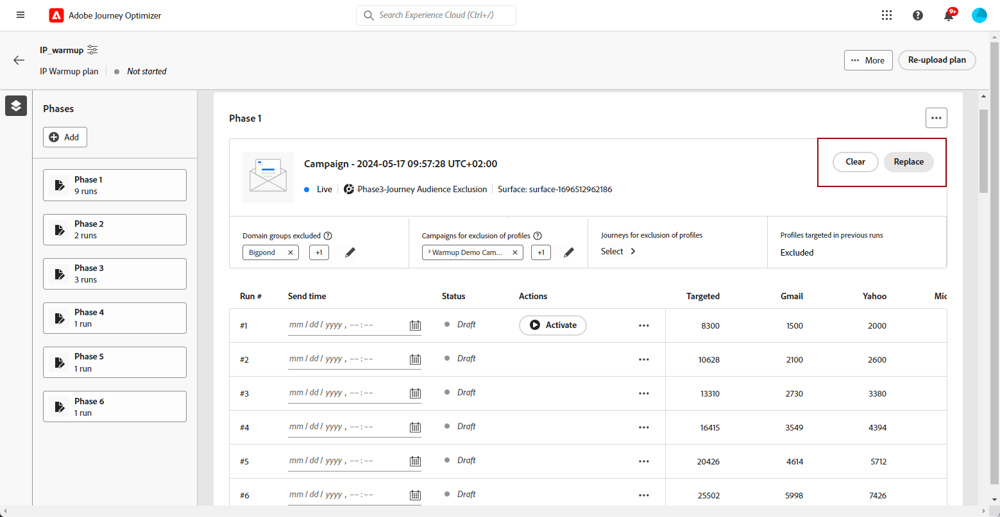
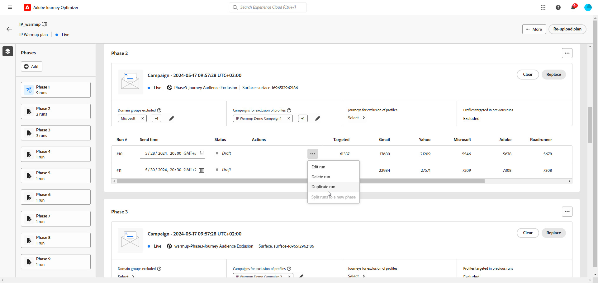
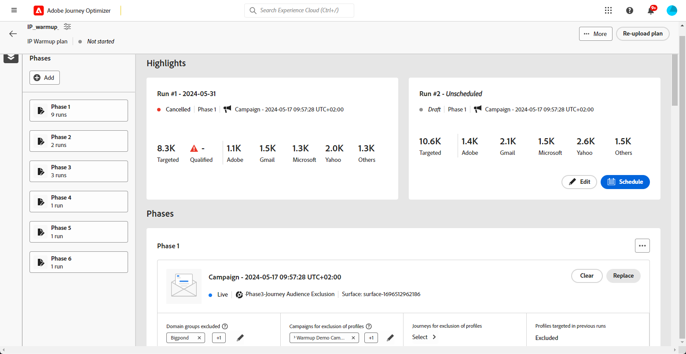

# 執行 IP 暖身計劃 {#ip-warmup-running}

>[!BEGINSHADEBOX]

本文件指南會提供以下內容：

* [開始使用 IP 暖身計劃](ip-warmup-gs.md)
* [建立 IP 暖身行銷活動](ip-warmup-campaign.md)
* [建立 IP 暖身計劃](ip-warmup-plan.md)
* **[執行IP熱身計畫](ip-warmup-execution.md)**

>[!ENDSHADEBOX]

一旦您擁有 [已建立IP熱身計畫](ip-warmup-plan.md) 並上傳與傳遞顧問準備的檔案，您可在計畫中定義階段與執行。

每個階段都由多次執行組成，您可以為其指派單一行銷活動。

## 定義階段 {#define-phases}

>[!CONTEXTUALHELP]
>id="ajo_admin_ip_warmup_campaigns_excluded"
>title="排除行銷活動對象"
>abstract="選取行銷活動以將其對象排除在目前階段外。這可以防止先前聯絡過的設定檔再次成為目標；只有透過歷程收到通訊的人才會被排除在外。"

>[!CONTEXTUALHELP]
>id="ajo_admin_ip_warmup_domains_excluded"
>title="排除網域群組"
>abstract="選取要從目前階段排除的網域。網域排除需要非執行階段，因此您可能必須分割執行中階段才能新增排除。"
>additional-url="https://experienceleague.adobe.com/docs/journey-optimizer/using/configuration/implement-ip-warmup-plan/ip-warmup-execution.html?lang=zh-Hant#split-phase" text="分割階段"

>[!CONTEXTUALHELP]
>id="ajo_admin_ip_warmup_phases"
>title="定義計劃的階段"
>abstract="每個階段都由多次執行組成，您可以為其指派單一行銷活動。"

<!--You need to associate the campaign and audience at phase level and turns on some settings as needed for all runs associated with a single creative/campaign

At phase level, system ensures that previously targeted + new profiles are picked up AND at iteration level, system ensures that each run is having unique profiles and the count matches what is stated in plan-->

<!---->

1. 選取您要與IP熱身計畫第一階段關聯的行銷活動。

   >[!NOTE]
   >
   >您無法選取其他IP熱身計畫中已在使用的行銷活動。 不過，同一IP熱身計畫的一個或多個階段中可以使用相同的行銷活動。

   

   >[!IMPORTANT]
   >
   >* 僅限具有下列專案的行銷活動： **[!UICONTROL IP熱身計畫啟用]** 啟用的選項可供選取。 [了解更多](#create-ip-warmup-campaign)
   >
   >* 只有使用與所選IP熱身計畫相同表面的行銷活動才可供選擇。

1. 為目前階段選取行銷活動後，會顯示要排除設定檔、行銷活動對象和網域群組的區段。

   >[!NOTE]
   >
   >執行啟動後，排除專案就無法再修改，除非您 [分割回合](#split-phase) 進入新階段。

   1. 從 **[!UICONTROL 網域群組已排除]** 區段中，選取要從該階段排除的網域。

      >[!NOTE]
      >
      >網域排除需要未執行的階段，因此您可能需要 [分割執行中的階段](#split-phase) 以新增排除專案。

      

      例如，執行IP熱身幾天後，您意識到網域(例如Adobe)的ISP信譽不佳，您想要在不停止IP熱身計畫的情況下解決它。 在這種情況下，您可以排除Adobe網域群組。

      >[!NOTE]
      >
      >您只能排除已新增到的自訂網域群組 [IP熱身計畫範本](ip-warmup-plan.md#prepare-file). 如果不是這種情況，請以要排除的自訂網域群組更新範本，並 [重新上傳計畫](#re-upload-plan).

   1. 從 **[!UICONTROL 排除設定檔的行銷活動]** 區段，選取您要從目前階段排除哪些對象的行銷活動。

      

      例如，在執行階段1時，您必須 [分割它](#split-phase) 因為任何原因。 因此，您可以排除階段1中使用的行銷活動，如此一來，階段1中先前聯絡的設定檔就不會包含在階段2中。 您也可以從其他IP熱身計畫中排除行銷活動。

   1. 從 **[!UICONTROL 排除設定檔的歷程]** 區段，選取包含您要從目前階段排除之對象的歷程。

+++ 若要使用歷程來排除設定檔選項，您需要在AJO訊息回饋事件與AJO實體記錄結構描述之間建立關係。

      1. 建立自訂 **名稱空間** ，可作為下列步驟的身分型別。

      1. 存取Adobe Experience Platform，從 **方案** 功能表，選取 **AJO實體記錄結構描述** 並設定 **_id** 欄位作為主要身分，並選取先前建立的名稱空間作為 **身分名稱空間**.

      1. 從 **方案** 功能表，選取 **AJO訊息回饋事件結構描述**，並導覽至 **_messageID** 欄位。 選取 **新增關係** 並選擇 **AJO實體記錄結構描述** 作為 **參考結構描述** 以及您先前建立的名稱空間 **參考身分名稱空間**.
+++

   1. 在 **[!UICONTROL 先前執行中定位的設定檔]** 區段，您可以看到該階段先前執行的設定檔一律被排除。 例如，如果在Run #1中，前4800位目標人物中涵蓋某個設定檔，系統會自動確保相同的設定檔不會在Run #2中收到電子郵件。

      >[!NOTE]
      >
      >此區段無法編輯。

1. 如有需要，您可以使用取代行銷活動 **[!UICONTROL 取代]** 按鈕。 您也可以 **[!UICONTROL 清除]** 使用的所選行銷活動 **[!UICONTROL 清除]** 按鈕。 此動作不僅會清除行銷活動，還會清除其他階段層級屬性，例如網域群組排除、行銷活動、歷程排除等。 清除後，您可以立即或稍後選擇新的行銷活動。

   

   >[!NOTE]
   >
   >只有在啟動階段的首次執行之前，才能執行此動作。 一旦啟動執行，便無法取代行銷活動，除非您 [分割回合](#split-phase) 進入新階段。

1. 您可以視需要新增階段。 它將在最後一個階段後新增。

   

1. 使用 **[!UICONTROL 刪除階段]** 按鈕來移除任何不想要的階段。 只有在階段中未執行任何執行時，才能使用此動作。 <!--Once a run is executed, deletion is not allowed.-->

   >[!CAUTION]
   >
   >您無法復原 **[!UICONTROL 刪除階段]** 動作。

   

   >[!NOTE]
   >
   >如果您從IP熱身計畫中刪除所有階段，建議重新上傳計畫。 [了解更多](#re-upload-plan)

## 定義執行 {#define-runs}

>[!CONTEXTUALHELP]
>id="ajo_admin_ip_warmup_run"
>title="定義每個執行"
>abstract="定義並啟動所有階段的每個執行。"

>[!CONTEXTUALHELP]
>id="ajo_admin_ip_warmup_last_engagement"
>title="篩選參與"
>abstract="例如，此資料欄是篩選器，僅針對過去 20 天內與您品牌互動的使用者。您也可以透過&#x200B;**編輯執行**&#x200B;選項變更此設定。"

>[!CONTEXTUALHELP]
>id="ajo_admin_ip_warmup_retry"
>title="設定時間範圍"
>abstract="您可以定義一個時間範圍，在此期間可以執行 IP 暖身計劃的行銷活動，以防分段作業有任何延遲。"

>[!CONTEXTUALHELP]
>id="ajo_admin_ip_warmup_pause"
>title="取消出現對象錯誤的執行"
>abstract="當針對執行評估對象，如果合格設定檔少於目標設定檔，選取此選項以取消該執行。"

>[!CONTEXTUALHELP]
>id="ajo_admin_ip_warmup_qualified"
>title="檢視合格設定檔"
>abstract="此資料欄顯示合格設定檔的數量。評估執行的對象後，如果目標設定檔多於合格設定檔，則執行仍會進行，除非「**發生錯誤時取消已啟動之執行**」選項已啟用。在此情況下，會取消此執行。"

1. 選取每次執行的排程，以確保在指定的時間執行。

   

1. 或者，您可以定義一個時間範圍，萬一出現任何延遲，IP熱身促銷活動可以在此期間執行。 [對象評估](https://experienceleague.adobe.com/docs/experience-platform/segmentation/home.html#how-segmentation-works){target="_blank"}. 若要這麼做，請按一下計畫名稱旁的左上方屬性圖示，然後使用 **[!UICONTROL 重試執行時間]** 下拉式清單以選取持續時間 — 最多240分鐘（4小時）。

   >[!NOTE]
   >
   >每隔30分鐘重試一次，直到定義的時間範圍結束。

   

   例如，如果您將傳送時間設定在指定的上午9點，並選取120分鐘作為重試執行時間，則允許針對對象評估中任何未預期的延遲執行機會2小時（上午9點至上午11點）的時段。

   >[!NOTE]
   >
   >如果未指定時間視窗，則在傳送時嘗試執行，如果未完成對象評估，則執行將失敗。

1. 如有需要，請選取 **[!UICONTROL 編輯執行]** 從「更多動作」圖示。 您可以在此處更新每欄中的地址數。 您也可以更新 **[!UICONTROL 上次參與]** 欄位，以僅鎖定過去20天內與您品牌互動的使用者。

   >[!NOTE]
   >
   >建議您諮詢傳遞能力專家，修改這些數字。

   

   >[!NOTE]
   >
   >如果您不想將任何參與期間套用至執行，請在 **[!UICONTROL 上次參與]** 欄位。

1. 選取 **[!UICONTROL 發生錯誤時取消已啟用的執行]** 在評估該回合的對象後，如果合格的設定檔少於目標的設定檔，則用來取消回合的選項。 在這種情況下，執行會採用 **[!UICONTROL 已失敗]** 狀態。

   

1. **[!UICONTROL 啟動]** 回合。 [了解更多](#activate-run)

1. 此回合的狀態將變更為 **[!UICONTROL 即時]**，表示系統已接受排程執行的請求。

   >[!NOTE]
   >
   >不同的執行狀態會列在 [本節](#monitor-plan).

1. 如果行銷活動尚未開始，您可以取消即時執行。 此動作實際上會取消執行排程，但不會停止傳送。

   

1. 若要複製任何草稿、即時或完成的執行，請選取 **[!UICONTROL 重複執行]**. 複製時，會出現「編輯執行」選單，讓使用者能夠調整 **[!UICONTROL 目標設定檔總數]** 和 **[!UICONTROL 傳送時間]** 視需要。

   

## 啟動回合 {#activate-run}

若要啟動回合，請選取 **[!UICONTROL 啟動]** 按鈕。 然後，您就可以每天啟動下一個執行。

同時執行多個IP熱身計畫時，如果所有計畫的目標都是相同的IP集區和網域，預測可能造成的影響至關重要。 例如，如果ISP執行每日100封電子郵件的限制，則針對相同網域執行數個計畫可能會超過此臨界值。

請確定您已排程足夠的時間，以允許 [對象評估](https://experienceleague.adobe.com/docs/experience-platform/segmentation/home.html#how-segmentation-works){target="_blank"} 將執行。

>[!CAUTION]
>
>每次執行必須在實際傳送時間前至少12小時啟動。 否則，可能無法完成對象評估。

當您啟動回合時，會自動建立數個對象。

* 如果啟動階段的第一次執行：

   * 一個 [對象](https://experienceleague.adobe.com/docs/experience-platform/segmentation/ui/segment-builder.html){target="_blank"} 會針對已排除的行銷活動對象建立（如果有的話），且具有下列命名慣例： `<warmupName>-Phase<phaseNo>-Audience Exclusion `.

   * 系統會使用下列命名慣例，為已排除的網域群組（如果有的話）建立對象： `<warmupName>-Phase<phaseNo>-Domain Exclusion`.

   * 系統會使用下列命名慣例，為已排除的歷程對象（如果有的話）建立另一個對象： `<warmupName>-Phase<phaseNo>-Journey Audience Exclusion`.

  >[!NOTE]
  >
  >將預熱計畫標籤為完成之後，會清理對象。
  >
  >在排除的行銷活動對象、排除的歷程對象或後續階段的網域群組中沒有變更時，系統不會建立新對象。

* 啟用任何回合時：

   * 系統會使用下列命名慣例，為最後一個參與篩選器建立另一個對象： `<warmupName>-Phase<phaseNo>_Run<runNo>-Engagement Filter`.

     >[!NOTE]
     >
     >將熱身計畫標示為完成之後，就會清除對象。
     >
     >在後續階段的最後一個參與篩選器沒有變更時，系統不會建立新的對象。

   * 一個 [對象構成](https://experienceleague.adobe.com/docs/experience-platform/segmentation/ui/audience-composition.html?lang=zh-Hant){target="_blank"} 會使用下列命名慣例來建立與行銷活動將傳送至之對象相對應的對象： `<warmupName>-Phase<phaseNo>-Run<runNo>`.

     >[!NOTE]
     >
     >每次執行都會建立新的對象構成。 由於限製為10個，同時使用已發佈對象構成來執行多個行銷活動、歷程和IP熱身計畫的使用者必須提前計畫，以保持在此限制內進行平行操作。
     >
     >當啟動下一個疊代時，會清除對象構成（以及因此產生的輸出對象）。

   * 輸出對象是以下列命名慣例建立的： `IP Warmup Audience-<warmupName>-Phase<phaseNo>-Run<runNo>`.

<!--How do you know when segmentation is complete? Is there a way to prevent user from scheduling less than 12 hours before the segmentation job?-->

<!--Sart to execute on every day basis by simply clicking the play button > for each run? do you have to come back every day to activate each run? or can you schedule them one after the other?)-->

<!--Upon activation, when the segment evaluation happens, more segments will be created by the IP warmup service and will be leveraged in an audience composition and a new audience will be created for each run splitted into the different selected domains.-->

## 監視計畫 {#monitor-plan}

若要成功執行IP熱身計畫，您必須每天監控報告、啟動執行並檢查其狀態。

### 使用「醒目提示」區段 {#highlights}

為階段啟動第一次執行後， **[!UICONTROL 反白顯示]** 區段隨即顯示。

它提供目前回合和即將回合的快速概觀。 您也可以從此區段編輯及啟動下次執行。

### 檢查執行狀態 {#run-statuses}

IP熱身計畫本身可在單一位置作為整合報表。 您可以檢查元素，例如 **[!UICONTROL 即時]** 或 **[!UICONTROL 已完成]** 會針對每個階段執行，並檢視您的IP熱身計畫的進度。

>[!NOTE]
>
>建議您每天監控IP熱身計畫，此為最佳作法。

回合可以有下列狀態：

* **[!UICONTROL 草稿]** ：每當建立執行時，無論是何時 [建立新計畫](ip-warmup-plan.md) 或 [新增回合](#define-runs) 從使用者介面，它需要 **[!UICONTROL 草稿]** 狀態。
* **[!UICONTROL 即時]**：每當您啟動回合時，它需要 **[!UICONTROL 即時]** 狀態。 這表示系統已接受排程執行的要求，而非傳送已開始。 在此階段，您可以按一下 **[!UICONTROL 檢視狀態]** 表格中的按鈕。 這可讓您追蹤有多少目標設定檔實際符合資格。
* **[!UICONTROL 已完成]**：此回合的行銷活動執行已完成。 您可以按一下 **[!UICONTROL 檢視報告]** 表格中的按鈕。 此選項可讓您追蹤執行的電子郵件傳送狀態，包括網域群組的特定劃分，以提升監控能力。 請注意，與其關聯的行銷活動將設定為「已停止」。[了解更多](#reports)
* **[!UICONTROL 已取消]**：a **[!UICONTROL 即時]** 已使用「 」取消執行 **[!UICONTROL 取消]** 按鈕。[了解更多](#define-runs)
* **[!UICONTROL 已失敗]**：系統發生錯誤，或用於目前階段的行銷活動已停止，或您已啟用 **[!UICONTROL 發生錯誤時取消已啟用的執行]** 選項且發生錯誤。 如果執行失敗，您可以排程第二天再次執行。

### 使用報表 {#reports}

一般而言，若要衡量計畫的影響，您可以使用 [!DNL Journey Optimizer] 行銷活動報表。 若要這麼做，您可以針對每個已完成的執行，按一下 **[!UICONTROL 檢視報表]** 按鈕。 進一步瞭解行銷活動電子郵件 [即時報告](../reports/campaign-live-report.md#email-live) 和 [全域報告](../reports/campaign-global-report.md#email-global).

您也可以從以下存取報告： [行銷活動功能表](../campaigns/modify-stop-campaign.md#access) 因為您的計畫可能會使用不同的行銷活動。

## 管理您的計畫 {#manage-plan}

在任何時候，如果您的IP熱身計畫未如預期執行，您可以採取下列動作。

### 分割階段 {#split-phase}

如果要從特定執行開始新增階段，請選取 **[!UICONTROL 分割執行到新階段]** 「更多動作」圖示中的選項。

系統會為目前階段的剩餘執行建立一個新階段。

例如，如果您為「執行#4段」選取此選項，則#8要執行的執行#4段將移至目前階段之後的新階段。

請依照步驟操作 [以上](#define-phases) 以定義新階段。

* 您可以使用 **[!UICONTROL 取代]** 或 **[!UICONTROL 清除]** 新階段的選項。

* 您也可以排除先前的行銷活動，或排除執行不佳的網域。 瞭解如何 [本節](#define-phases).

<!--
You don't have to decide the campaign upfront. You can do a split later. It's a work in progress plan: you activate one run at a time with a campaign and you always have the flexibility to modify it while working on it.

But need to explain in which case you want to modify campaigns, provide examples
-->

### 重新上傳IP熱身計畫 {#re-upload-plan}

如果您的IP熱身計畫未如預期執行（例如，如果您發現某些ISP將您的訊息標籤為垃圾訊息），您可以要求傳遞專家設定另一個IP熱身計畫檔案，並使用對應的按鈕重新上傳。

先前執行的所有回合都是唯讀的。 新計畫會顯示在第一個計畫下。

請依照步驟操作 [以上](#define-phases) 以從新計畫定義階段。

>[!NOTE]
>
>IP熱身計畫的詳細資訊會根據新上傳的檔案而變更。 先前執行的執行(無論其 [狀態](#monitor-plan))不受影響。

以為例：

* 在初始IP熱身計畫中，階段2有9個執行。

* 已執行4個回合（無論是否失敗、完成或取消）<!--as long as a run has been attempted, it is an executed run-->)。

* 如果您重新上傳新計畫，前4個已執行執行的階段2將進入唯讀模式。

* 其餘5個執行（處於草稿狀態）會移至新階段（階段3），並根據新上傳的計畫顯示。

### 將計畫標示為已完成 {#mark-as-completed}

如果您的IP已使用想要的磁碟區進行熱處理，或者您的計畫執行不充分，或者您想要卸除它以建立另一個磁碟區，您可以將它標示為已完成。

若要這麼做，請按一下 **[!UICONTROL 更多]** IP熱身計畫右上角的按鈕並選取 **[!UICONTROL 標籤為已完成]**.

只有在計畫中的所有執行都位於時，才能使用此選項 **[!UICONTROL 已完成]** 或 **[!UICONTROL 草稿]** 狀態。 如果執行是 **[!UICONTROL 即時]**，選項會呈現灰色。

不同的執行狀態會列在 [本節](#monitor-plan).

