# 執行IP熱身計畫 {#ip-warmup-running}

>[!BEGINSHADEBOX]

本文件指南會提供以下內容：

* [開始使用IP熱身](ip-warmup-gs.md)
* [建立 IP 暖身行銷活動](ip-warmup-campaign.md)
* [建立IP熱身計畫](ip-warmup-plan.md)
* **[執行IP熱身計畫](ip-warmup-execution.md)**

>[!ENDSHADEBOX]

一旦您擁有 [已建立IP熱身計畫](ip-warmup-plan.md) 並上傳與傳遞顧問準備的檔案，您可在計畫中定義階段與執行。

每個階段都包含數個回合，您會指派單一行銷活動給這些回合。

## 定義階段 {#define-phases}

>[!CONTEXTUALHELP]
>id="ajo_admin_ip_warmup_campaigns_excluded"
>title="排除行銷活動對象"
>abstract="選取要從目前階段排除的其他行銷活動的對象。這是為了避免先前從其他階段或其他IP熱身計畫中聯絡的設定檔再次成為目標。"

>[!CONTEXTUALHELP]
>id="ajo_admin_ip_warmup_domains_excluded"
>title="排除網域群組"
>abstract="選擇要從目前階段排除的網域。網域排除需要非執行階段，因此您可能必須分割執行階段才能新增排除專案。"
>additional-url="https://experienceleague.adobe.com/docs/journey-optimizer/using/configuration/implement-ip-warmup-plan/ip-warmup-execution.html#split-phase" text="分割階段"

>[!CONTEXTUALHELP]
>id="ajo_admin_ip_warmup_phases"
>title="定義計畫的階段"
>abstract="每個階段都包含數個回合，您會指派單一行銷活動給這些回合。"

<!--You need to associate the campaign and audience at phase level and turns on some settings as needed for all runs associated with a single creative/campaign

At phase level, system ensures that previously targeted + new profiles are picked up AND at iteration level, system ensures that each run is having unique profiles and the count matches what is stated in plan-->

<!---->

1. 針對每個階段，選取您要與IP熱身計畫的此階段關聯的促銷活動。

   

   請注意下列事項：

   * 僅限具有下列專案的行銷活動： **[!UICONTROL IP熱身計畫啟用]** 選項已啟用 <!--and live?--> 可供選取。 [了解更多](#create-ip-warmup-campaign)

   * 您必須選取與為目前IP熱身計畫選取之表面相同的行銷活動。

   * 您無法選取其他IP熱身行銷活動中已使用的行銷活動。

1. 在 **[!UICONTROL 設定檔排除]** 區段，您可以看到該階段先前執行的設定檔一律被排除。 例如，如果在Run #1中，前4800位目標人物中涵蓋某個設定檔，系統會自動確保相同的設定檔不會在Run #2中收到電子郵件。

1. 從 **[!UICONTROL 已排除行銷活動對象]** 區段，從其他區段選取對象 <!--executed/live?-->您要從目前階段排除的行銷活動。

   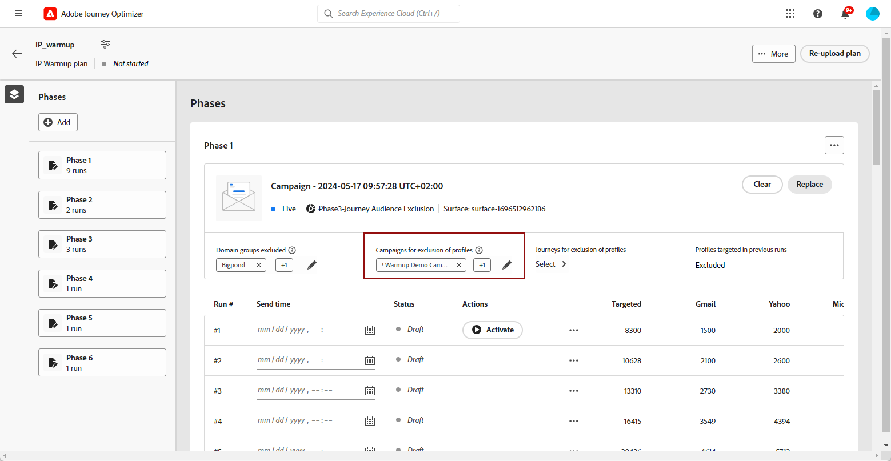

   例如，在執行階段1時，您必須 [分割它](#split-phase) 因為任何原因。 因此，您可以排除階段1中使用的行銷活動，如此一來，階段1中先前聯絡的設定檔就不會包含在階段2中。 您也可以從其他IP熱身計畫中排除行銷活動。

1. 從 **[!UICONTROL 網域群組已排除]** 區段中，選取要從該階段排除的網域。

   >[!NOTE]
   >
   >網域排除需要非執行階段，因此您可能必須 [分割執行中的階段](#split-phase) 以新增排除專案。

   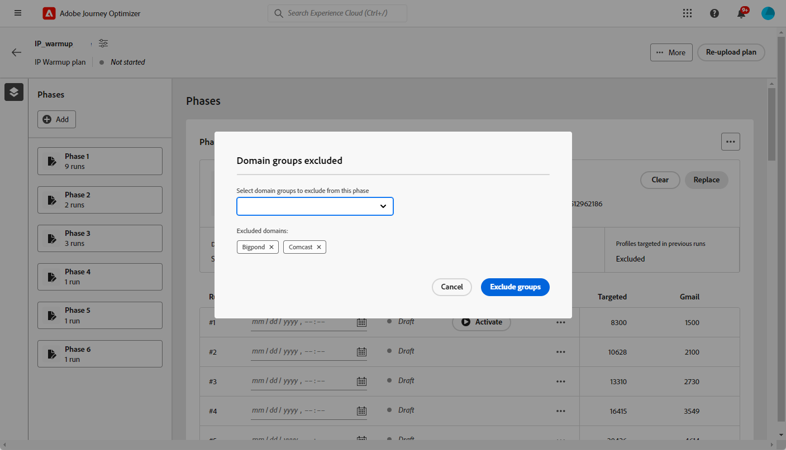

   例如，執行IP熱身幾天後，您意識到網域(例如Adobe)的ISP信譽不佳，您想要在不停止IP熱身計畫的情況下解決它。 在這種情況下，您可以排除Adobe網域群組。

   >[!NOTE]
   >
   >如果網域不是現成可用的網域群組，您需要與傳遞顧問合作，將此網域新增至 [IP熱身計畫檔案](ip-warmup-plan.md#prepare-file) 和 [重新上傳](#re-upload-plan) 以便能夠排除該網域。

1. 您可以視需要新增階段。 它將在目前的最後一個階段之後新增。

   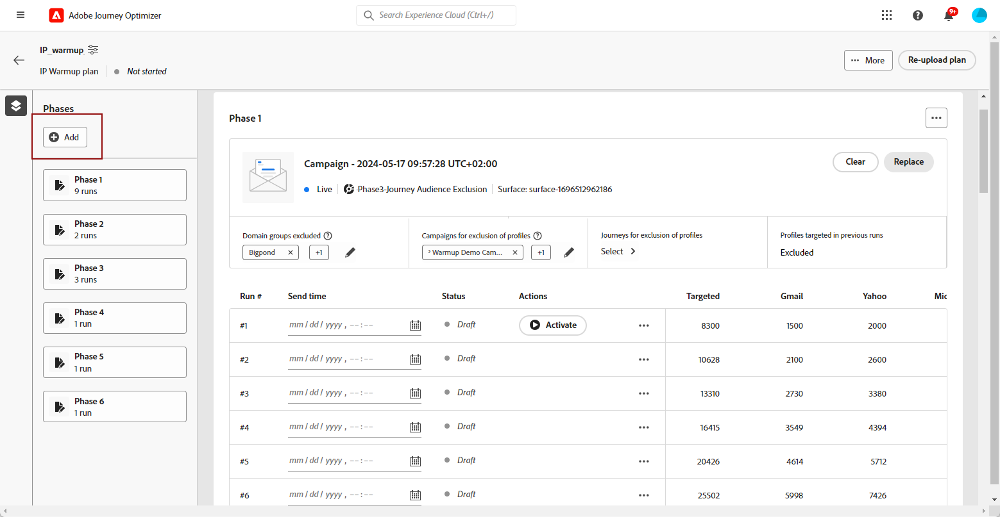

1. 使用 **[!UICONTROL 刪除階段]** 按鈕來移除任何不想要的階段。

   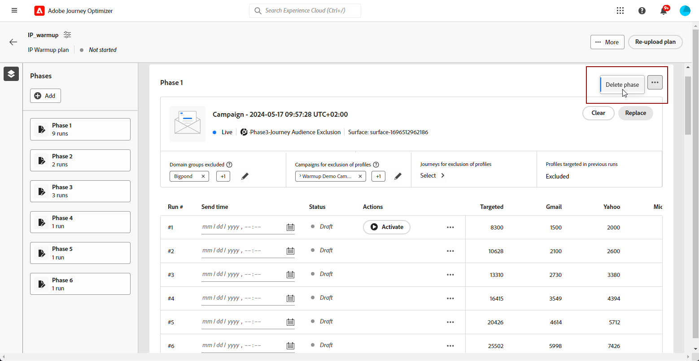

   >[!CAUTION]
   >
   >您無法復原 **[!UICONTROL 刪除]** 動作。
   >
   >如果您從IP熱身計畫中刪除所有階段，建議重新上傳計畫。 [了解更多](#re-upload-plan)

## 定義回合 {#define-runs}

>[!CONTEXTUALHELP]
>id="ajo_admin_ip_warmup_run"
>title="定義每個回合"
>abstract="定義並啟動所有階段的每個執行。"

>[!CONTEXTUALHELP]
>id="ajo_admin_ip_warmup_last_engagement"
>title="在參與上篩選"
>abstract="例如，此欄是僅針對過去20天內與您的品牌互動的使用者的篩選器。 您也可以透過變更此設定 **編輯執行** 選項。"

>[!CONTEXTUALHELP]
>id="ajo_admin_ip_warmup_retry"
>title="設定時間視窗"
>abstract="您可以定義一個時段，在細分作業發生任何延遲時，在此時段內可執行IP熱身行銷活動。"

>[!CONTEXTUALHELP]
>id="ajo_admin_ip_warmup_pause"
>title="取消有對象錯誤的執行"
>abstract="在評估該回合的對象後，如果合格的設定檔少於目標的設定檔，選取此選項可取消回合。"

>[!CONTEXTUALHELP]
>id="ajo_admin_ip_warmup_qualified"
>title="檢視合格的設定檔"
>abstract="此欄顯示合格的設定檔數目。 評估對象的執行後，如果目標設定檔超過合格的設定檔，則仍會執行執行，除非 **暫停錯誤** 選項已啟用。 在此情況下，執行會被取消。"

1. 選取每次執行的排程。

   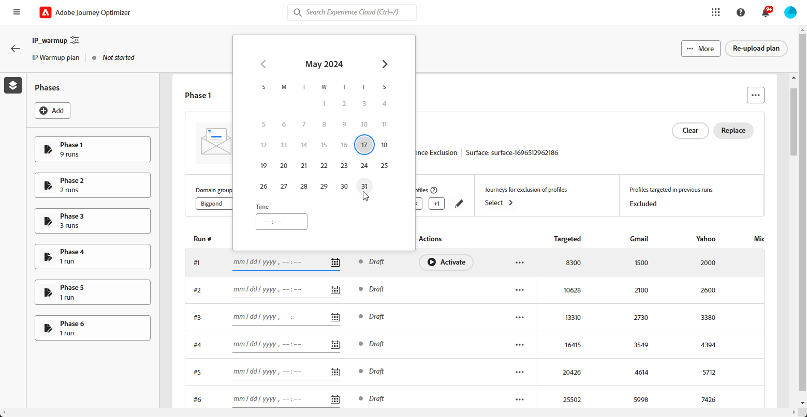

1. 或者，您可以定義一個時段，在細分工作發生任何延遲時，可以執行IP熱身行銷活動。 若要這麼做，請按一下計畫名稱旁的左上方屬性圖示，然後使用 **[!UICONTROL 重試執行時間]** 下拉式清單以選取持續時間 — 最多240分鐘（4小時）。

   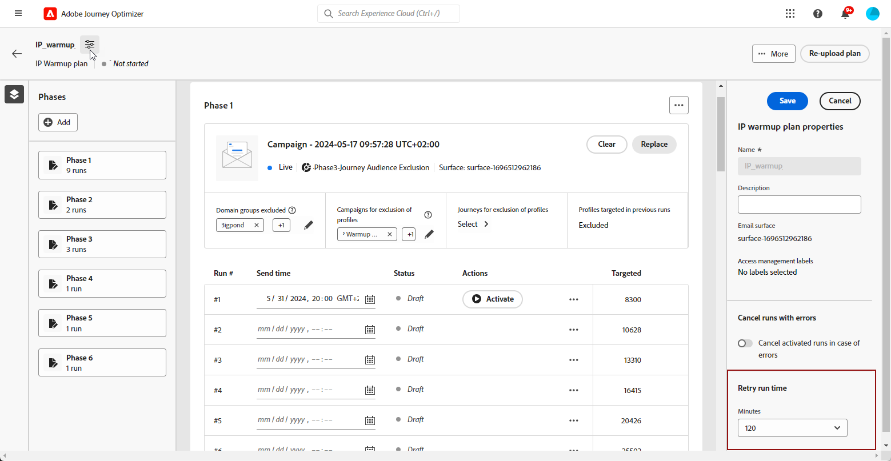

   例如，如果您將指定日的傳送時間設定為晚上9點，並選取120分鐘作為重試執行時間，則細分工作將允許以2小時的機會時段執行。

   >[!NOTE]
   >
   >如果未指定時間視窗，則在傳送時嘗試執行，如果未完成分段工作，則執行將失敗。

1. 如有需要，請選取 **[!UICONTROL 編輯執行]** 從「更多動作」圖示。 您可以在此處更新每欄中的地址數。 您也可以更新 **[!UICONTROL 上次參與]** 欄位，以僅鎖定過去20天內與您品牌互動的使用者。

   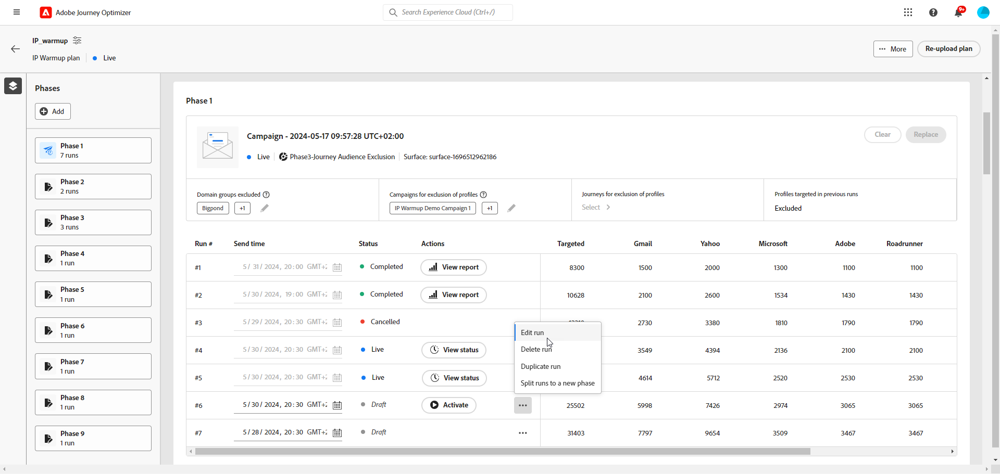

1. 選取 **[!UICONTROL 暫停錯誤]** 在評估該回合的對象後，如果合格的設定檔少於目標的設定檔，則用來取消回合的選項。

   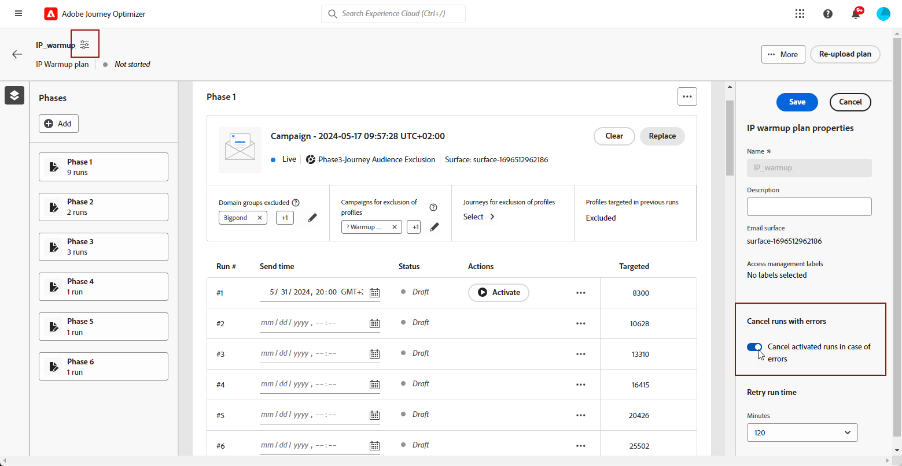

1. **[!UICONTROL 啟動]** 回合。 [了解更多](#activate-run)

1. 此回合的狀態將變更為 **[!UICONTROL 即時]**. 不同的執行狀態會列在 [本節](#monitor-plan). 如果行銷活動尚未開始，您可以停止即時執行。<!--why?-->

   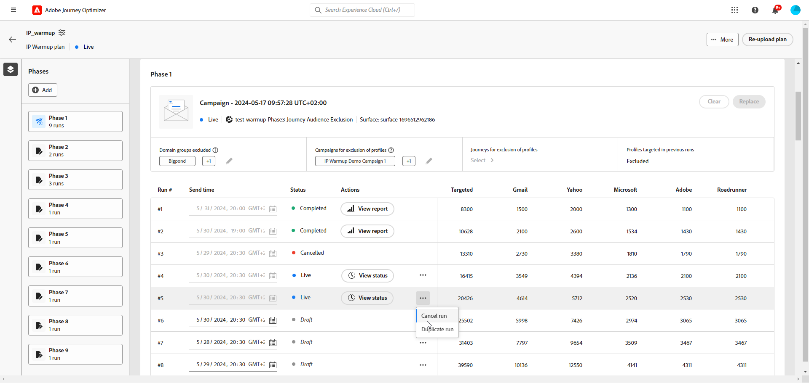

   >[!NOTE]
   >
   >行銷活動開始執行後， **[!UICONTROL 停止]** 按鈕變為無法使用。

1. 若要新增回合，請選取 **[!UICONTROL 在下方新增回合]** 從三個點的圖示。

   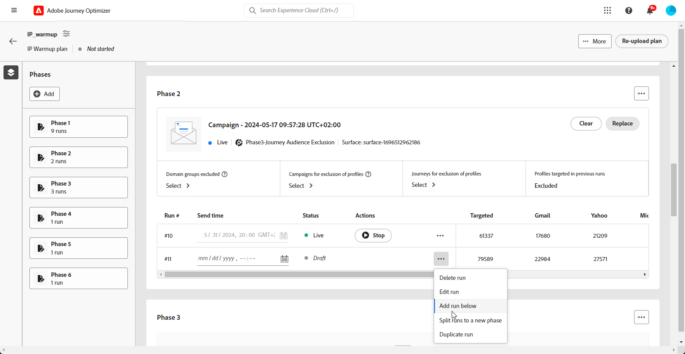

## 啟動回合 {#activate-run}

若要啟動回合，請選取 **[!UICONTROL 啟動]** 按鈕。

請確定您已排程足夠的時間來執行分段工作。

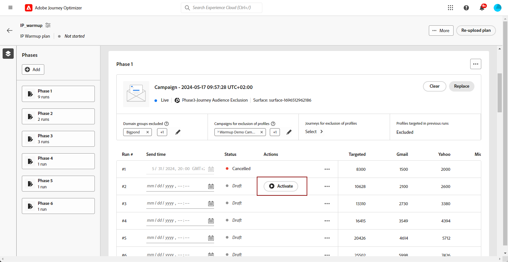

>[!CAUTION]
>
>每次執行必須在實際傳送時間前至少12小時啟動。 否則，可能無法完成分段。

當您啟動執行時，會自動建立數個區段：

* 如果啟動階段的第一次執行：

   * 系統會為已排除的行銷活動對象建立區段（如果有的話）。
   * 系統會為已排除的網域群組（如果有的話）建立另一個區段。

* 啟用任何回合時：

   * 系統會為最後一個參與篩選器建立另一個區段。
   * 對象構成會建立為對應至行銷活動將傳送對象的對象。

<!--How do you know when segmentation is complete? Is there a way to prevent user from scheduling less than 12 hours before the segmentation job?-->

<!--Sart to execute on every day basis by simply clicking the play button > for each run? do you have to come back every day to activate each run? or can you schedule them one after the other?)-->

<!--Upon activation, when the segment evaluation happens, more segments will be created by the IP warmup service and will be leveraged in an audience composition and a new audience will be created for each run splitted into the different selected domains.-->

## 管理您的計畫 {#manage-plan}

在任何時候，如果您的IP熱身計畫未如預期執行，您可以採取下列動作。

### 分割階段 {#split-phase}

如果要從特定執行開始新增階段，請選取 **[!UICONTROL 分割至新階段選項]** 從三個點的圖示。

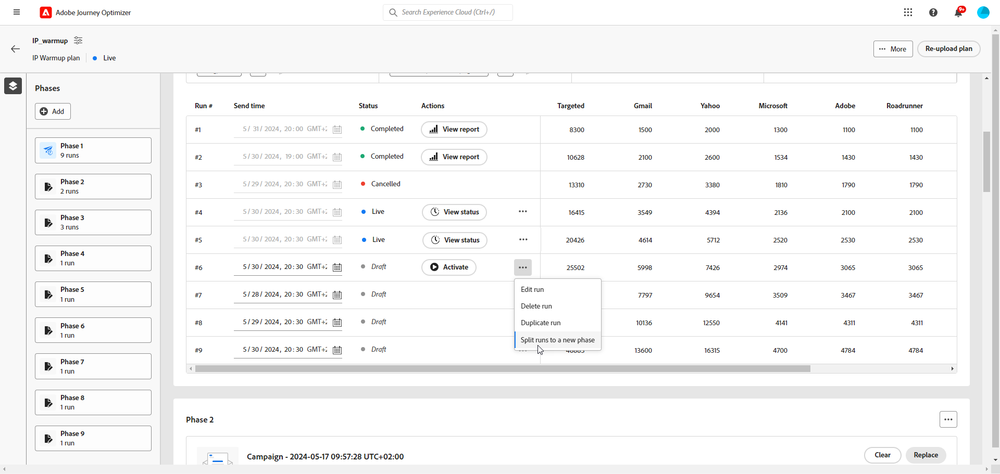

系統會為目前階段的剩餘執行建立一個新階段。

例如，如果您為「執行#4段」選取此選項，則#8要執行的執行#4段將移至目前階段之後的新階段。

請依照步驟操作 [以上](#define-phases) 以定義新階段。

* 您可以使用 **[!UICONTROL 取代行銷活動]** 新階段的選項。

* 您也可以排除先前的行銷活動，或排除執行不佳的網域。 瞭解如何 [本節](#define-phases).

<!--
You don't have to decide the campaign upfront. You can do a split later. It's a work in progress plan: you activate one run at a time with a campaign and you always have the flexibility to modify it while working on it.

But need to explain in which case you want to modify campaigns, provide examples
-->

### 將計畫標示為已完成 {#mark-as-completed}

如果您的計畫執行得不夠好，或您想要將其刪除以建立另一個計畫，您可以將其標示為已完成。

若要這麼做，請按一下 **[!UICONTROL 更多]** IP熱身計畫右上角的按鈕並選取 **[!UICONTROL 標籤為已完成]**.

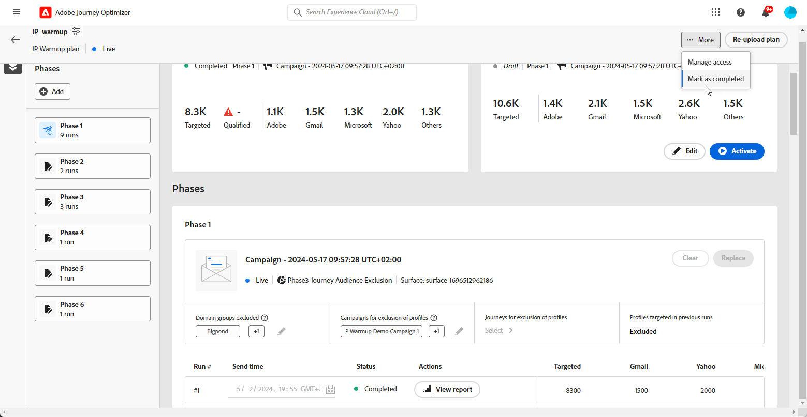

只有在計畫中的所有執行都位於時，才能使用此選項 **[!UICONTROL 已完成]** 或 **[!UICONTROL 草稿]** 狀態。 如果執行是 **[!UICONTROL 即時]**，選項會呈現灰色。

不同的執行狀態會列在 [本節](#monitor-plan).

### 重新上傳IP熱身計畫 {#re-upload-plan}

如果您的IP熱身計畫未如預期執行（例如，如果您發現某些ISP將您的訊息標籤為垃圾訊息），您可以要求傳遞專家設定另一個IP熱身計畫檔案，並使用對應的按鈕重新上傳。

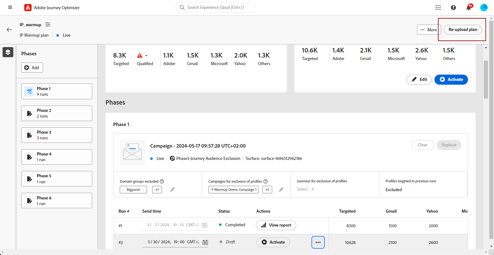

先前執行的所有回合都是唯讀的。 新計畫會顯示在第一個計畫下。

請依照步驟操作 [以上](#define-phases) 以從新計畫定義階段。

>[!NOTE]
>
>IP熱身計畫的詳細資訊會根據新上傳的檔案而變更。 先前執行的執行(無論其 [狀態](#monitor-plan))不受影響。

以為例：

* 在初始IP熱身計畫中，階段2有9個執行。

* 已執行4個執行（無論是否失敗、完成或取消 — 只要已嘗試執行，就是已執行的執行）。

* 如果您重新上傳新計畫，前4個已執行執行的階段2將進入唯讀模式。

* 其餘5個執行（處於草稿狀態）會移至新階段（階段3），並根據新上傳的計畫顯示。

## 監視計畫 {#monitor-plan}

若要衡量計畫的影響，您可以使用 [!DNL Journey Optimizer] 行銷活動報表。 若要這麼做，您可以針對每個已完成的執行，按一下 **[!UICONTROL 檢視報表]** 按鈕。 進一步瞭解行銷活動電子郵件 [即時報告](../reports/campaign-live-report.md#email-live) 和 [全域報告](../reports/campaign-global-report.md##email-global).

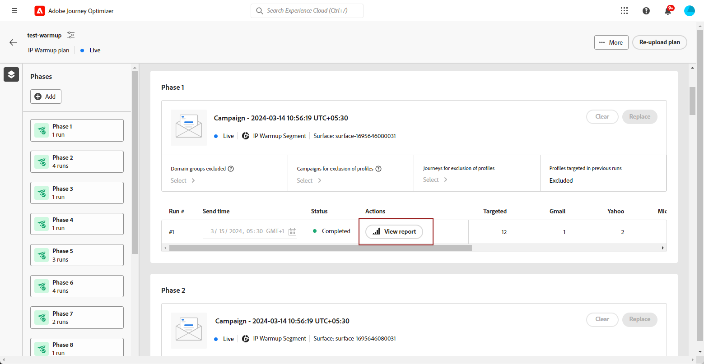

IP熱身計畫本身也可作為單一地點的整合報表。 您可以檢查元素，例如 **[!UICONTROL 即時]** 或 **[!UICONTROL 已完成]** 會針對每個階段執行，並檢視您的IP熱身計畫的進度。

回合可以有下列狀態：

* **[!UICONTROL 草稿]** ：每當建立執行時，無論是何時 [建立新計畫](ip-warmup-plan.md) 或 [新增回合](#define-runs) 從使用者介面，它需要 **[!UICONTROL 草稿]** 狀態。
* **[!UICONTROL 即時]**：每當您啟動回合時，它需要 **[!UICONTROL 即時]** 狀態。
* **[!UICONTROL 已完成]**：此回合的行銷活動執行已完成。 <!--i.e. campaign execution has started, no error happened and emails have reached users? to check with Sid-->
* **[!UICONTROL 已取消]**：a **[!UICONTROL 即時]** 已使用「 」取消執行 **[!UICONTROL 停止]** 按鈕。 此按鈕僅在行銷活動執行尚未開始時可用。 [了解更多](#define-runs)
* **[!UICONTROL 已失敗]**：系統發生錯誤，或用於目前階段的行銷活動已停止。 如果執行失敗，您可以排程第二天再次執行。
