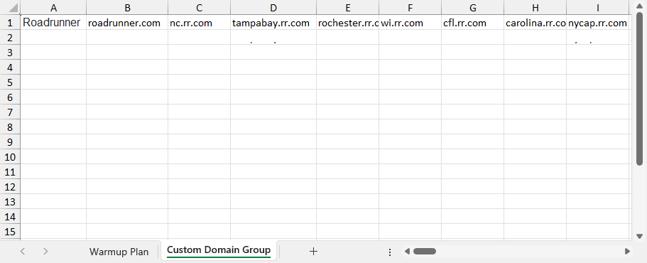
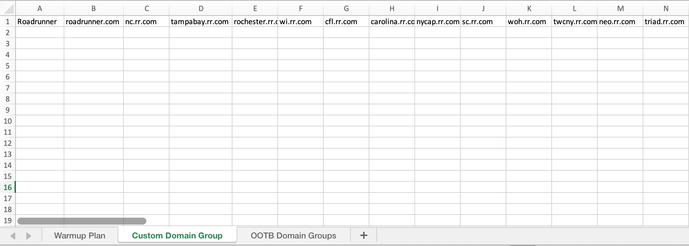
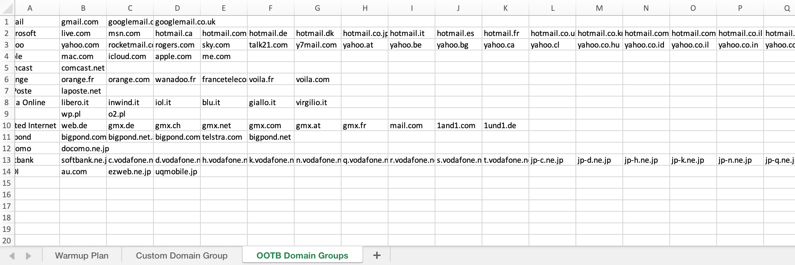
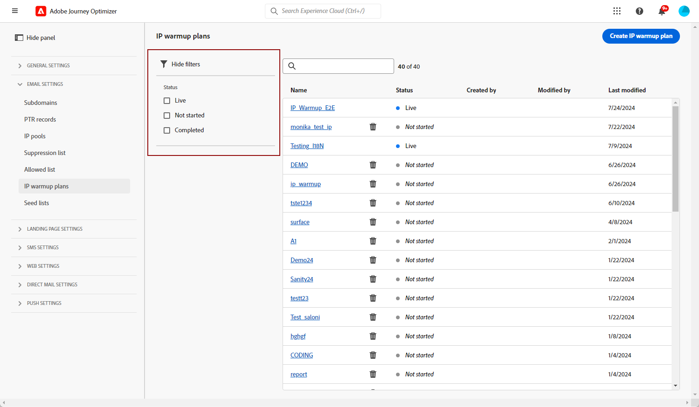
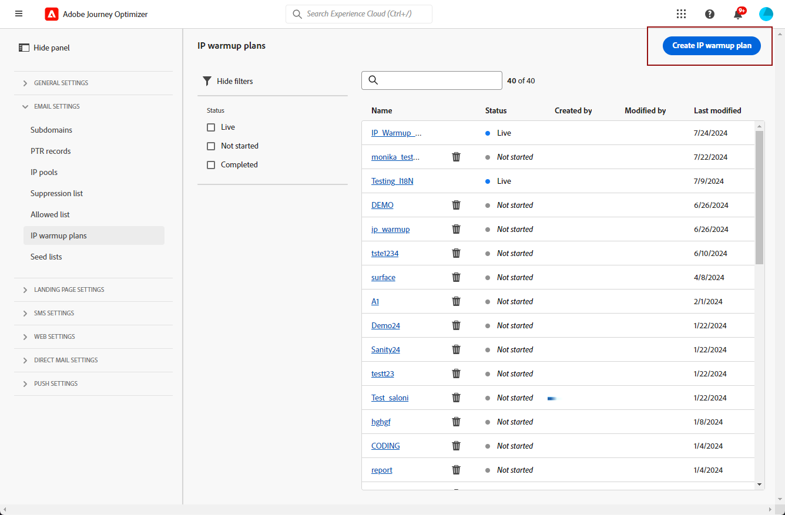

# 建立 IP 暖身計劃 {#ip-warmup}

一旦您建立一或多個[IP熱身行銷活動](ip-warmup-campaign.md)，並啟用專屬設定和對應的選項後，您就可以開始建立IP熱身計畫。

若要存取、建立、編輯及刪除IP熱身計畫，您必須擁有&#x200B;**[!UICONTROL 傳遞顧問]**&#x200B;角色或IP熱身計畫相關許可權。

+++瞭解如何指派「傳遞能力顧問」角色或IP熱身計畫相關許可權

物件層級存取控制可讓您保護資料，並授與特定存取權來檢視和管理您的計畫。 如果未將任何標籤指派給您的IP熱身計畫，則會開啟該標籤以供所有使用者檢視和編輯。

授予&#x200B;**[!UICONTROL 檢視IP熱身計畫]**&#x200B;許可權會限制僅能檢視和發佈的存取權，而指派&#x200B;**[!UICONTROL 管理IP熱身計畫]**&#x200B;許可權可讓使用者檢視和編輯計畫。

若要將對應許可權指派給特定&#x200B;**[!UICONTROL 角色]**：

1. 從[!DNL Permissions]產品，瀏覽至&#x200B;**[!UICONTROL 角色]**&#x200B;功能表，並選取您要以新&#x200B;**[!UICONTROL IP熱身設定]**&#x200B;許可權更新的角色。

1. 從您的&#x200B;**[!UICONTROL 角色]**&#x200B;儀表板，按一下&#x200B;**[!UICONTROL 編輯]**。

   

1. 拖放&#x200B;**[!UICONTROL IP熱身設定]**&#x200B;資源以指派許可權。

1. 從&#x200B;**[!UICONTROL IP熱身設定]**&#x200B;資源下拉式清單中，選取您的使用者需要哪些許可權： **[!UICONTROL 檢視IP熱身計畫]**、**[!UICONTROL 管理IP熱身計畫]**&#x200B;和/或&#x200B;**[!UICONTROL 檢視IP熱身報告]**。 您可以視需要一次選取所有專案。

   

1. 按一下&#x200B;**[!UICONTROL 儲存]**。

若要將對應角色指派給&#x200B;**[!UICONTROL 使用者]**：

1. 從[!DNL Permissions]產品，導覽至&#x200B;**[!UICONTROL 角色]**&#x200B;功能表，並選取&#x200B;**[!UICONTROL 傳遞顧問]**&#x200B;內建角色。

1. 從您的&#x200B;**[!UICONTROL 角色]**&#x200B;儀表板，存取&#x200B;**[!UICONTROL 使用者]**&#x200B;標籤。

   

1. 按一下&#x200B;**[!UICONTROL 新增使用者]**，指派&#x200B;**[!UICONTROL 傳遞能力顧問]**&#x200B;內建角色。

   

1. 選取您的&#x200B;**[!UICONTROL 使用者]**&#x200B;並按一下&#x200B;**[!UICONTROL 儲存]**。

   

+++

## 準備 IP 暖身計畫檔案 {#prepare-file}

IP熱身是一項活動，包括逐漸增加從您的IP和網域傳送到主要網際網路服務提供者(ISP)的電子郵件數量，以建立您作為合法傳送者的聲譽。

此活動通常在傳遞能力專家的協助下執行，該專家會根據產業網域、使用案例、地區、ISP和各種其他因素，協助您準備完善的計畫。

<!--When working with the [!DNL Journey Optimizer] IP warmup feature, this plan takes the form of an Excel file that must contain a number of predefined columns.-->

在[!DNL Journey Optimizer]介面中建立IP熱身計畫之前，您必須先在Excel範本中填入將供給您計畫的所有資料。

* 您可以從使用者介面下載空白Excel [IP熱身計畫範本](assets/IPWarmupPlan-Template.xlsx)以填寫。

* 您也可以下載已填入部分資料的[範例IP熱身計畫](assets/IPWarmupPlan-Sample.xlsx)，以作為範例。

<!--
* From the user interface you can download the blank Excel IP warmup plan template to fill in.

* You can also download a sample IP warmup plan already filled in with some data you can use as an example.
-->

>[!CAUTION]
>
>請與您的傳遞顧問合作，確認您的IP熱身計畫檔案設定正確。
>
>請務必使用範本中提供的格式。

以下是包含IP熱身計畫的檔案範例。

### 熱身計畫標籤 {#ip-warmup-plan-tab}

若要建立IP熱身計畫，請在第一個索引標籤中填入提供計畫所需的資料。

* 在上述範例中，已準備超過17天的計畫（稱為&#39;**執行**&#39;），以達到超過一百萬個設定檔的目標磁碟區。

* 此計畫透過六個&#x200B;**階段**&#x200B;執行，每個階段都包含至少一個回合。

* 您最多可以有6欄（網域群組為4欄，其他為&#x200B;**個**&#x200B;欄，其他為&#x200B;**參與天數**&#x200B;欄）。 在此範例中，計劃分為六個欄：

   * 其中三個對應至要在您的計畫(Gmail、Yahoo和Microsoft)中使用的&#x200B;**現成可用的網域群組**。 現成可用的網域群組全部列在[OOTB網域群組](#ootb-domain-groups-tab)索引標籤中。
   * 一個資料行對應到自訂網域群組（您需要使用[自訂網域群組](#custom-domain-group-tab)索引標籤來新增）。
   * 第五欄&#x200B;**其他**&#x200B;包含計畫未明確涵蓋之其他網域的所有剩餘位址。 此欄是選用的：如果省略，電子郵件將只傳送到指定的網域。
   * 最後一欄&#x200B;**參與天數**&#x200B;可讓您指定應追蹤或評估參與的天數。

我們的想法是逐步增加每個執行中的目標位址數量，同時減少每個階段的執行數量。

### 自訂網域群組標籤 {#custom-domain-group-tab}

您也可以包含自訂網域群組，以新增更多欄到計畫中。

使用&#x200B;**[!UICONTROL 自訂網域群組]**&#x200B;索引標籤來定義新的網域群組。 您可以為每個網域新增其涵蓋的所有子網域。

>[!IMPORTANT]
>
>確定每個網域都是其網域群組的唯一網域，且不會與其他網域群組或[現成可用的網域群組](#ootb-domain-groups-tab)重疊。

例如，如果您新增自訂網域Roadrunner，您希望納入下列子網域 — 例如在下列範例中：roadrunner.com、nc.rr.com、tampabay.rr.com、rochester.rr.com等。

>[!NOTE]
>
>如果您不需要自訂網域，請將&#x200B;**[!UICONTROL 自訂網域群組]**&#x200B;索引標籤留空。

### OOTB網域群組索引標籤 {#ootb-domain-groups-tab}

IP熱身計畫範本的&#x200B;**OOTB網域群組**&#x200B;索引標籤包含您可以新增到計畫的所有現成主要網域群組。

>[!NOTE]
>
>如果此索引標籤中未列出網域群組，則您需要在對應的索引標籤中建立自訂網域群組。 [了解更多](#custom-domain-group-tab)

現成可用的主要網域群組也列於下方：

+++ Gmail
gmail.com；google.com；googlemail.com；googlemail.co.uk
+++

+++Microsoft
A hotmail.com.tr；live.de；live.ru；live.nl；windowslive.com；live.jp；mts.net；xbox.com；hotmail.fr；hotmail.cl；hotmail.jp；live.cl；live.at；live.com.au；hotmail.co.th；live.hk；hotmail.com.au；hotmail.com；live.com.my hotmail.co.kr outlook.com.br hotmail.co.il live.co.kr live.co.uk live.com.mx hotmail.co.uk live.com.sg msn.com hotmail.co.jp live.co.za live.com.pt outlook.com live.com live.com.ar hotmail.com.br hotmail.com.ar；live.ie；；hotmail.dk；live.fr；live.no；live.dk；hotmail.it；live.se；live.in；hotmail.se；hotmail.se；hotmail.ch；
+++

+++Yahoo
A aol.fi；games.com cs.com；yahoo.com.in；y7mail.com；yahoo.co.uk；yahoo.hu；yahoo.co.hu；yahoo.cn；yahoogroups.com.sg；yahoogroups.com.au；aol.es；yahoo.com.au yahoo.com.vn aol.co.nz yahoo.com.br yahoo.ne.jp ymail.com netscape.com yahoo.com.pe yahoo.co.id citlink.net wmconnect.com yahoo.com.jp yahoo.com.hk aol.com.br yahoo.co.kr yahoo.com.ar ygm.com yahoo.co.nz aol.com goowy.com rocketmail.com frontiernet.net aim.com yahoogroups.co.in netscape.net luckymail.com yahoo.co.jp yahoo.com.kr yahoo.co.za verizon.net aol.com.ve aol.com.ar aol.com.co wild4music.com yahoogroups.com.cn yahoo.com.co wow.com yahoo.com yahooxtra.co.nz yahoo.com.mx yahoo.com.ph sky.com aol.com.mx aol.com.au aolchina.com yahoo.com.net yahoo.com.tw talk21.com compuserve.com yahoo.com.sg yahoogroups.com.tw frontier.com yahoo.co.in yahoo.co.il verizon.net.in yahoo.com.tr yahoogroups.com.hk yahoogroups.co.uk yahoo.com.biz yahoo.com.hr aol.co.uk ybb.ne.jp yahoogroups.co.kr yahoo.com.my rogers.com gte.net yahoogroups.com yahoo.co.th yahoo.com.cn love.com bellatlantic.net yahoo.com.ve yahoo.com.ua；yahoo.ca；aol.hk；；aolpolan.pl；aolnorge.no；yahoo.fi；；aol.cz；yahoo.ee；aol.be；aolcom.tr；yahoo.si；aol.it；ahoo.dk；yahoo組.ca；ca；aol.kr；yahoo.ie；aol.jp；yahoo.pt；；yahoogrupper.dk； yahoo.fr；；aol.pl；；aol.ch； yahoo.it；；aolpolcka.pl；；ahogruppi.it；；yahoo.cl；；；yahoo.be；；；aol.tw；；；；；；aol.ru；；；yahoo.lv；aolpolska.pl；aol.at；yahoo.pl
+++

+++Apple
mac.com；icloud.com；apple.com；me.com
+++

+++Comcast
comcast.net
+++

+++橙色
voila.com；francetelecom.com；orange.com；orange.fr；wanadoo.fr；voila.fr
+++

+++拉波斯特
laposte.net
+++

+++義大利線上
inwind.it；blu.it；virgilio.it；giallo.it；iol.it；libero.it
+++

+++WP
wp.pl；o2.pl
+++

+++United Internet
gmx.de；1and1.com；gmx.fr；mail.com；1und1.de；gmx.com；gmx.net；gmx.at；web.de；gmx.ch
+++

+++Bigpond
bigpond.com；bigpond.com.au；bigpond.net；telstra.com；bigpond.net.au
+++

+++Docomo
docomo.ne.jp
+++

+++軟銀
c.vodafone.ne.jp；jp-h.ne.jp；k.vodafone.ne.jp；jp-d.ne.jp；jp-c.ne.jp；t.vodafone.ne.jp；h.vodafone.ne.jp；r.vodafone.ne.jp；q.vodafone.ne.jp jp-t.ne.jp jp-q.ne.jp s.vodafone.ne.jp jp-s.ne.jp jp-r.ne.jp jp-k.ne.jp n.vodafone.ne.jp d.vodafone.ne.jp softbank.ne.jp jp-n.ne.jp；；；；；；；；；
+++

+++KDDI
au.com；ezweb.ne.jp；uqmobile.jp
+++

### 範例 {#example}

假設您想要有兩個自訂網域群組：

* 一個僅適用於Hotmail網域。
* 一個用於網域群組Microsoft中的所有其他網域（因此排除所有Hotmail網域）。

Hotmail外部的網域和來自網域群組Microsoft的網域將收集到&#x200B;**[!UICONTROL 其他]**&#x200B;欄。

1. 在&#x200B;**[!UICONTROL 自訂網域群組]**&#x200B;索引標籤中，建立&#x200B;**Hotmail**&#x200B;網域群組。

1. 在同一列新增所有Hotmail網域。

   您可以[複製並貼上](#copy-paste) [OOTB網域群組標籤](#ootb-domain-groups-tab)區段中列出的所有Hotmail網域。

1. 新增另一列。

1. 建立&#x200B;**Microsoft_X**&#x200B;網域群組。

1. 將非Hotmail的所有Microsoft網域新增至相同列。 同樣地，您也可以[從上方清單複製並貼上](#copy-paste)。

1. 返回&#x200B;**[!UICONTROL IP熱身計畫]**&#x200B;標籤。

1. 建立三欄：一個用於&#x200B;**Hotmail**，一個用於&#x200B;**Microsoft_X**，一個用於&#x200B;**其他**。

1. 根據您的需求填寫欄。

<!--Only the domain groups listed in the **[!UICONTROL IP Warmup Plan]** tab will be taken into account.-->

### 複製並貼上預設網域 {#copy-paste}

舉例來說，如果您想建立包含所有Hotmail網域的自訂網域群組，您可以從&#x200B;**IP熱身計畫範本**&#x200B;的[OOTB網域群組](assets/IPWarmupPlan-Template.xlsx)索引標籤，或從[上方提供的](#ip-warmup-plan-tab)清單複製並貼上網域。

然後使用Excel轉換工具將文字轉換為欄：

1. 選取&#x200B;**[!UICONTROL 資料]** > **[!UICONTROL 資料行文字……]**，選擇&#x200B;**[!UICONTROL 分隔]**，然後選取&#x200B;**[!UICONTROL 下一步]**。

1. 選取&#x200B;**[!UICONTROL 分號]**，按一下&#x200B;**[!UICONTROL 下一步]**&#x200B;和&#x200B;**[!UICONTROL 完成]**。

現在，每個網域都會顯示在相同列的不同欄中。

## 存取和管理IP熱身計畫 {#manage-ip-warmup-plans}

1. 存取&#x200B;**[!UICONTROL 管理]** > **[!UICONTROL 管道]** > **[!UICONTROL 電子郵件設定]** > **[!UICONTROL IP熱身計畫]**&#x200B;功能表。 目前所建立的所有IP熱身計畫都會顯示出來。

   

1. 您可以依狀態篩選。 不同的狀態包括：

   * **未啟動**：尚未啟動任何執行。 [了解更多](ip-warmup-execution.md#define-runs)
   * **即時**：在第一階段中的第一次執行成功啟動後，計畫就會變更為此狀態。 [了解更多](ip-warmup-execution.md#define-runs)
   * **已完成**：計畫已標示為已完成。<!--This option is only available if all the runs in the plan are in **[!UICONTROL Completed]** or **[!UICONTROL Draft]** status (no run can be **[!UICONTROL Live]**).--> [了解更多](ip-warmup-execution.md#mark-as-completed)
     <!--* **Paused**: to check (user action)-->

1. 若要刪除IP熱身計畫，請選取計畫名稱旁的&#x200B;**[!UICONTROL 刪除]**&#x200B;圖示並確認刪除。

   >[!NOTE]
   >
   >只能刪除狀態為&#x200B;**未啟動**&#x200B;的計畫。

   

   >[!CAUTION]
   >
   >將會永久刪除選取的IP熱身計畫。

## 建立 IP 暖身計劃 {#create-ip-warmup-plan}

>[!CONTEXTUALHELP]
>id="ajo_admin_ip_warmup_upload"
>title="指定您的 IP 暖身計劃"
>abstract="在 Excel 範本中填入將成為計劃內容的所有資料，例如 IP 暖身階段以及設定檔的目標數量，然後在此處上傳。"
>additional-url="https://experienceleague.adobe.com/docs/journey-optimizer/using/configuration/implement-ip-warmup-plan/ip-warmup-plan.html?lang=zh-Hant#prepare-file" text="準備 IP 暖身計畫檔案"

>[!CONTEXTUALHELP]
>id="ajo_admin_ip_warmup_surface"
>title="選取行銷設定"
>abstract="您選取的設定，必須是您想要與 IP 暖身計畫建立關聯之行銷活動中選取的相同設定。"
>additional-url="https://experienceleague.adobe.com/docs/journey-optimizer/using/configuration/channel-surfaces.html?lang=zh-Hant" text="設定管道設定"
>additional-url="https://experienceleague.adobe.com/docs/journey-optimizer/using/configuration/channel-surfaces.html?lang=zh-Hant" text="建立 IP 暖身行銷活動"

若要建立IP熱身計畫，請遵循下列步驟。

1. 存取&#x200B;**[!UICONTROL 管理]** > **[!UICONTROL 管道]** > **[!UICONTROL 電子郵件設定]**> **[!UICONTROL IP熱身計畫]**&#x200B;功能表，然後按一下&#x200B;**[!UICONTROL 建立IP熱身計畫]**。

   

1. 填寫IP熱身計畫詳細資訊：提供名稱和說明。

   

1. 選取您要預熱的[組態](channel-surfaces.md)。 只有行銷設定可供選擇。 [進一步瞭解電子郵件型別](../email/email-settings.md#email-type)

   >[!NOTE]
   >
   >您要與IP熱身計畫關聯的行銷活動必須使用相同的設定。 [瞭解如何建立IP熱身行銷活動](ip-warmup-campaign.md)

1. 上傳包含IP熱身計畫的Excel檔案。 [了解更多](#prepare-file)

   <!--
    You can also download the Excel template from the [!DNL Journey Optimizer] user interface and upload it after filling it with the IP warmup details.-->

   

   >[!NOTE]
   >
   >如果上傳失敗，請確定您使用正確的格式和檔案格式(.xls或.xlsx)。 使用Adobe提供的[範本](assets/IPWarmupPlan-Template.xlsx)。

1. 按一下 **[!UICONTROL 建立]**。在您上傳的檔案中定義的所有階段、執行、欄及其內容會自動顯示在[!DNL Journey Optimizer]介面中。

   

   >[!NOTE]
   >
   >**[!UICONTROL 已鎖定目標]**&#x200B;欄顯示每次執行的所有設定檔目標總和，這表示您所定義的每個網域群組中的所有設定檔，包括&#x200B;**其他**&#x200B;欄（如果有的話）。

您現在已準備好執行IP熱身計畫。 [了解更多](ip-warmup-execution.md)
