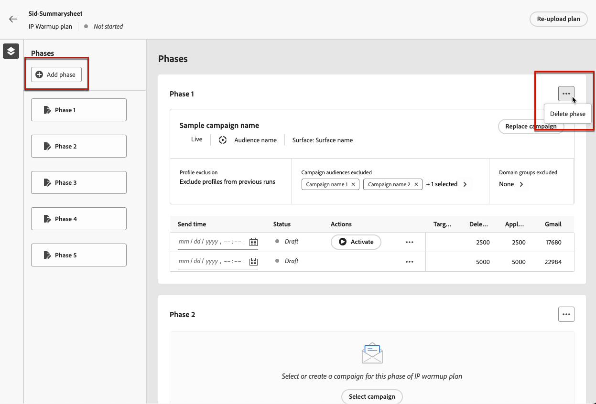

# 執行IP熱身計畫 {#ip-warmup-running}

>[!BEGINSHADEBOX]

本文件指南會提供以下內容：

* [開始使用IP熱身](ip-warmup-gs.md)
* [建立IP熱身行銷活動](ip-warmup-campaign.md)
* [建立IP熱身計畫](ip-warmup-plan.md)
* **[執行IP熱身計畫](ip-warmup-running.md)**

>[!ENDSHADEBOX]

## 定義階段 {#define-phases}

>[!CONTEXTUALHELP]
>id="ajo_admin_ip_warmup_campaigns_excluded"
>title="選取要排除的行銷活動對象"
>abstract="從其他行銷活動中選取您想要從目前階段排除的對象。"

>[!CONTEXTUALHELP]
>id="ajo_admin_ip_warmup_domains_excluded"
>title="選取要排除的網域群組"
>abstract="選取要從目前階段排除的網域。"

您需要將階段層級的行銷活動和對象相關聯，並根據需要為與單一創意/行銷活動關聯的所有執行開啟某些設定

在階段層級，系統會確保擷取先前目標設定檔+新設定檔，而在反複專案層級，系統會確保每次執行都具有唯一的設定檔，且計數符合計畫中所列的專案

1. 針對每個階段，選取您要與IP熱身計畫的此階段關聯的促銷活動。

   

   請注意下列事項：

   * 僅限具有下列專案的行銷活動： **[!UICONTROL IP熱身計畫啟用]** 選項已啟用 <!--and live?--> 可供選取。 [了解更多](#create-ip-warmup-campaign)

   * 您必須選取與為目前IP熱身計畫選取之表面相同的行銷活動。

   * 您無法選取其他IP熱身行銷活動中已使用的行銷活動。

1. 適用於每個階段：

   * **[!UICONTROL 設定檔排除]**  — 一律會排除該階段先前執行的設定檔。 例如，如果在執行#1，Leo被納入目標前6300人，則系統將自動確保Leo在執行中不會收到郵件#2

   * **[!UICONTROL 已排除行銷活動對象]**  — 從其他對象中選取對象 <!--executed/live?-->您要從目前階段排除的行銷活動。

     例如，您可能正在執行一個階段，並且由於任何原因必須分割它。 在這種情況下，在階段2中，您要將階段1中使用的行銷活動包含在此部分中，以便在階段2中，不包含先前來自階段1的聯絡人。 不只可以在相同IP熱身計畫中使用的行銷活動，也可以從其他IP熱身計畫完成此操作。

   * **[!UICONTROL 網域群組已排除]**  — 選取您要從該階段排除的網域，例如Gmail。 <!--??-->

     執行IP熱身幾天後，您發現某個網域的ISP信譽指出了Hotmail不好，而您想要透過ISP解決這個問題，但不想停止IP熱身計畫。 在這種情況下，您可以將網域群組hotmail放在排除的類別中。

     >[!NOTE]
     >
     >網域排除需要非執行的階段，因此您可能必須分割執行中的階段才能新增排除。 同樣地，如果網域群組不是OOTB網域群組，則您可能必須在Excel中建立網域群組，並上傳然後排除相同的群組。

   

1. 您可以視需要新增階段 — 它會在目前的最後一個階段之後新增。 使用 **[!UICONTROL 刪除階段]** 按鈕來移除任何不想要的階段。

   

   >[!CAUTION]
   >
   >您無法復原 **[!UICONTROL 刪除]** 動作。
   >
   >如果您從IP熱身計畫刪除所有階段，我們建議您重新上傳計畫。

## 定義回合 {#define-runs}

1. 選取每次執行的排程。 <!--which is actually a window of opportunity. meaning? how many hours? shall we specify that to clarify?-->

   

1. 選取結束時間，這基本上代表我們可以執行預熱行銷活動的視窗，以防對象工作有任何延遲。 如果未指定，我們會在開始時間嘗試但會失敗。 如果有提供結束時間，我們將會在該視窗之間執行執行。

1. 啟動每次執行。 請確定您排程的時間夠早，以允許執行細分工作。 <!--explain how you can evaluate a proper time-->

   >[!CAUTION]
   >
   >每次執行必須在實際傳送時間前至少12小時啟動。 否則，可能無法完成分段。 <!--How do you know when segmentation is complete? Is there a way to prevent user from scheduling less than 12 hours before the segmentation job?-->

<!--Sart to execute on every day basis by simply clicking the play button > for each run? do you have to come back every day to activate each run? or can you schedule them one after the other?)-->

1. 如果行銷活動尚未開始，您可以停止執行。<!--why?-->

   行銷活動開始執行後， **[!UICONTROL 停止]** 按鈕變為無法使用。 <!--TBC in UI-->

   

1. 若要新增回合，請選取 **[!UICONTROL 在下方新增回合]** 從三個點的圖示。

   

1. 在任何時候，如果您想要使用從特定執行開始的不同行銷活動，請選取 **[!UICONTROL 分割至新階段選項]** 從三個點的圖示。 系統會為目前階段的剩餘執行建立一個新階段。 請依照步驟操作 [以上](#define-phases) 以定義新階段。

   例如，如果您為執行#4選取此選項，則#8執行的執#4將移至新階段。

<!--
You don't have to decide the campaign upfront. You can do a split later. It's a work in progress plan: you activate one run at a time with a campaign and you always have the flexibility to modify it while working on it.

But need to explain in which case you want to modify campaigns, provide examples
-->

## 監視計畫

回合可以有下列狀態<!--TBC with Medha-->：

* **[!UICONTROL 完成]**:
* **[!UICONTROL 已失敗]**:
* **[!UICONTROL 已取消]**：您已在行銷活動執行開始之前停止執行。

優點 :

* 報表將繼續顯示在具有類似今天功能的行銷活動層級。 但IP熱身計畫也可當作一個彙總報表，顯示已執行的數量等等。

* 管理並檢視IP熱度進展的單一位置。

* 當所有專案都在一個階段執行時，整合創意/行銷活動層級的報表