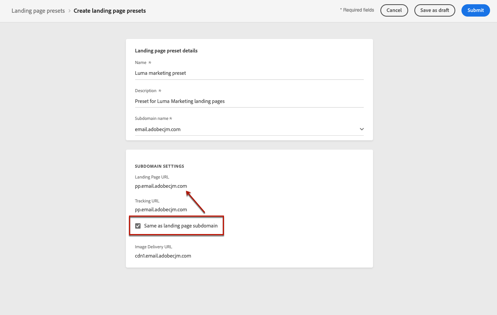

# 定義登錄頁預設 {#lp-presets}

當 [建立登錄頁](../landing-pages/create-lp.md#create-a-lp)，必須選擇登錄頁預設才能生成登錄頁並利用它 **[!DNL Journey Optimizer]**。

## 訪問登錄頁預設 {#access-lp-presets}

要訪問登錄頁預設，請執行以下步驟。

1. 訪問 **[!UICONTROL Administration]** > **[!UICONTROL Channels]** 的子菜單。

1. 選擇 **[!UICONTROL Branding]** > **[!UICONTROL Landing page presets]**.

   

1. 按一下任何預設標籤以訪問登錄頁預設詳細資訊。

   

## 建立登錄頁預設 {#lp-create-preset}

要建立登錄頁預設，請執行以下步驟。

>[!NOTE]
>
>要能夠建立預設，請確保以前至少配置了一個登錄頁子域。 [瞭解如何](lp-subdomains.md)

1. 訪問 **[!UICONTROL Administration]** > **[!UICONTROL Channels]** ，然後選擇 **[!UICONTROL Branding]** > **[!UICONTROL Landing page presets]**。

1. 選擇「**[!UICONTROL Create landing page preset]**」。

   

1. 輸入預設的名稱和說明。

   >[!NOTE]
   >
   > 名稱必須以字母(A-Z)開頭。 它只能包含字母數字字元。 您還可以使用下划線 `_`，點`.` 連字元 `-` 字元。

1. 從下拉清單中選擇登錄頁子域。

   

   >[!NOTE]
   >
   >要能夠選擇子域，請確保您以前至少配置了一個登錄頁子域。 [瞭解如何](#lp-subdomains)

   與所選子域對應的設定顯示。

1. 如果要選擇登錄頁子域作為跟蹤URL，請檢查 **[!UICONTROL Same as landing page subdomain]** 的雙曲餘切值。 [瞭解有關跟蹤的更多資訊](../design/message-tracking.md)

   

   例如，如果登錄頁URL為「pages.mail.luma.com」，而跟蹤URL為「data.mail.luma.com」，則可以選擇「pages.mail.luma.com」作為跟蹤子域。

1. 按一下 **[!UICONTROL Submit]** 確認登錄頁預設建立。 您也可以將預設另存為草稿，並稍後恢復其配置。

   

1. 一旦建立了登錄頁預設，它就會顯示在清單中 **[!UICONTROL Active]** 狀態。 它已準備好用於您的登錄頁。

   

您現在已準備好 [建立登錄頁](../landing-pages/create-lp.md) 在 [!DNL Journey Optimizer]。

>[!NOTE]
>
>瞭解如何為中的推送通知和電子郵件建立郵件預設 [此部分](message-presets.md)。

**相關主題**：

* [開始使用登陸頁面](../landing-pages/get-started-lp.md)
* [建立登陸頁面](../landing-pages/create-lp.md#create-a-lp)
