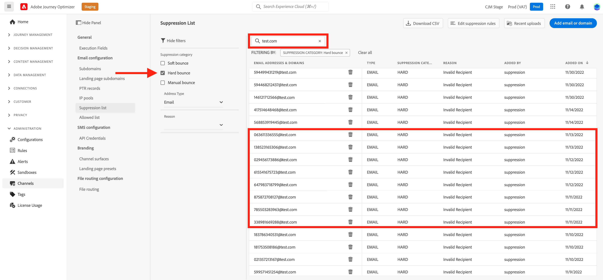

# 管理隱藏清單 {#manage-suppression-list}

使用 [!DNL Journey Optimizer]，您可以監控自動排除而無法傳送歷程或行銷活動的所有電子郵件地址，例如硬退信、軟退信和垃圾郵件投訴。

這些電子郵件地址會自動收集到Journey Optimizer **隱藏清單**. 隱藏清單包含要從對象中排除的位址和網域。 它會收集會在單一用戶端環境中隱藏於所有郵件的電子郵件地址和網域，這表示是專屬於與沙箱ID相關聯的組織ID。

進一步了解隱藏清單概念和在 [本節](../reports/suppression-list.md).

>[!NOTE]
>
>Adobe會保留已知錯誤地址的更新清單，這些地址已被證明對參與和郵件信譽有害，並確保不會向他們發送電子郵件。 此清單在所有 Adobe 客戶通用的全球禁止名單中進行管理。 全球禁止名單中包含的地址和網域名稱都會隱藏起來。 傳遞報告中僅顯示排除的收件者人數。

## 訪問隱藏清單 {#access-suppression-list}

若要存取排除的電子郵件地址和網域的詳細清單，請瀏覽至 **[!UICONTROL 管理]** > **[!UICONTROL 管道]** > **[!UICONTROL 電子郵件設定]**，然後選取 **[!UICONTROL 隱藏清單]**.


>[!CAUTION]
>
>查看、導出和管理隱藏清單的權限限制為 [歷程管理員](../administration/ootb-product-profiles.md#journey-administrator). 深入了解管理 [!DNL Journey Optimizer] 中的使用者存取權限 [本節](../administration/permissions-overview.md).


篩選器可幫助您瀏覽清單。


您可以篩選 **[!UICONTROL 隱藏類別]**, **[!UICONTROL 地址類型]**，或 **[!UICONTROL 原因]**. 為每個條件選擇一個或多個選項。 選取後，您就可以清除每個篩選器，或清單頂端顯示的所有篩選器。


## 了解失敗原因 {#suppression-categories-and-reasons}

當郵件無法傳遞至電子郵件地址時， [!DNL Journey Optimizer] 判斷傳送失敗的原因，並將其與 **[!UICONTROL 隱藏類別]**.

隱藏類別如下：

* **硬**:硬退信表示電子郵件地址無效（即不存在的電子郵件地址）。 這包括從接收電子郵件伺服器傳回的退信，明確指出地址無效。 會立即將電子郵件地址發送到隱藏清單。

   當錯誤是垃圾郵件投訴的結果時，它也會落入 **硬** 類別。 發出投訴的收件人的電子郵件地址會立即發送到壓制清單。

* **軟**:軟退信是針對有效電子郵件地址而發生的臨時電子郵件退信。 多次重試後，電子郵件地址會新增至隱藏清單。 一旦錯誤計數器達到限制臨界值，軟錯誤就會將地址發送到隱藏清單。 [深入了解重試次數](retries.md)

* **手動**:手動將錯誤添加到隱藏清單。 [了解更多](#add-addresses-and-domains)

對於所列的每個電子郵件地址，您也可以檢查 **[!UICONTROL 類型]** （電子郵件或網域）, **[!UICONTROL 原因]** 排除、新增者，以及新增至隱藏清單的日期/時間。


傳送失敗的可能原因包括：

| 原因 | 說明 | 類別 |
| --- | --- | --- |
| **[!UICONTROL 收件者無效]** | 收件者無效或不存在。 | 硬 |
| **[!UICONTROL 軟跳出]** | 消息軟退信的原因不是此表中列出的軟錯誤，例如當發送超過ISP建議的允許速率時。 | 軟 |
| **[!UICONTROL DNS失敗]** | 由於DNS失敗而退信。 | 軟 |
| **[!UICONTROL 郵箱已滿]** | 由於收件者的信箱已滿而無法接受更多訊息，訊息已退信。 | 軟 |
| **[!UICONTROL 拒絕中繼]** | 由於不允許中繼，因此接收器阻止了該消息。 | 軟 |
| **[!UICONTROL 挑戰 — 響應]** | 該消息是挑戰 — 響應探測。 | 軟 |
| **[!UICONTROL 垃圾郵件投訴]** | 由於收件者將郵件標示為垃圾訊息，因此已封鎖訊息。 | 硬 |

>[!NOTE]
>
>取消訂閱的使用者不會收到來自 [!DNL Journey Optimizer]，因此其電子郵件地址無法傳送至隱藏清單。 其選項會在Experience Platform層級處理。 [進一步了解選擇退出](../privacy/opt-out.md)


### 隱藏規則  {#suppression-rules}

從 **[!UICONTROL 隱藏清單]** 視圖中，您也可以編輯與隱藏規則關聯的重試參數，該參數來自 **[!UICONTROL 編輯隱藏規則]** 按鈕。 使用此選項可更新當前沙箱的重試閾值。 [深入了解重試次數](retries.md).


## 將地址和域添加到隱藏清單{#add-addresses-and-domains}

>[!CONTEXTUALHELP]
>id="ajo_admin_suppression_list_header"
>title="將電子郵件或網域新增到禁止名單"
>abstract="您可以手動填入 Journey Optimizer 禁止名單，以便從您的傳送中排除特定的電子郵件地址和/或網域。"

>[!CONTEXTUALHELP]
>id="ajo_admin_suppression_list"
>title="將電子郵件或網域新增到禁止名單"
>abstract="若要填入禁止名單，您可以手動新增電子郵件地址或網域：一次一個，或在大量模式中透過 CSV 檔案上傳。這些特定的電子郵件地址和/或網域將被排除在您的傳送之外。"

當郵件無法傳遞至電子郵件地址時，系統會根據定義的隱藏規則或退信計數，自動將此地址新增至隱藏清單。

不過，您也可以手動填入 [!DNL Journey Optimizer] 隱藏清單，從您的傳送中排除特定的電子郵件地址和/或網域。

>[!NOTE]
>
>最多需要60分鐘 [!DNL Journey Optimizer] 考慮傳出電子郵件中隱藏的地址。

您可以[一次新增一個](#add-one-address-or-domain)電子郵件地址或網域，或[在大量模式中](#upload-csv-file)透過 CSV 檔案上傳的方式新增。

### 新增一個地址或網域 {#add-one-address-or-domain}

>[!CONTEXTUALHELP]
>id="ajo_admin_suppression_list_address"
>title="將一個項目新增到禁止名單"
>abstract="您可以透過逐一新增電子郵件地址和/或網域來填入禁止名單。"

要將電子郵件地址或域添加到隱藏清單，請執行以下步驟：

1. 選取 **[!UICONTROL 新增電子郵件或網域]** 按鈕。

   

1. 選擇 **[!UICONTROL 逐一]** 選項。

   

1. 選擇地址類型： **[!UICONTROL 電子郵件]** 或 **[!UICONTROL 網域]**.

1. 輸入您要從傳送中排除的電子郵件地址或網域。

   >[!NOTE]
   >
   >確定輸入有效的電子郵件地址 (例如 abc@company.com) 或網域 (例如 abc.company.com)。

1. （可選）輸入原因。 此欄位允許包含 32 到 126 個字元之間組成的所有 ASCII 可列印字元。 

1. 使用 **[!UICONTROL 提交]** 按鈕進行確認。

### 上傳 CSV 檔案 {#upload-csv-file}

>[!CONTEXTUALHELP]
>id="ajo_admin_suppression_list_csv"
>title="上傳 CSV 以將項目新增到禁止名單"
>abstract="您可以透過上傳填滿您要排除的電子郵件地址/網域的 CSV 檔案來填入禁止名單。"

若要將一組電子郵件地址或網域新增至隱藏清單，請遵循下列步驟：

1. 選取 **[!UICONTROL 新增電子郵件或網域]** 按鈕。
1. 選擇 **[!UICONTROL 上傳CSV]** 選項。

   

1. 下載要使用的 CSV 範本，其中包括以下欄和格式：

   ```
   TYPE,VALUE,COMMENT
   EMAIL,abc@somedomain.com,Comment
   DOMAIN,somedomain.com,Comment
   ```

1. 在CSV範本中填入要新增至隱藏清單的電子郵件地址和/或網域。 在 **註解** 欄。

   >[!CAUTION]
   >
   >請勿變更CSV範本中的欄名稱。
   >
   >檔案大小不應超過 1 MB。

1. 完成後，拖放CSV檔案，然後使用 **[!UICONTROL 提交]** 按鈕進行確認。

   

上傳完成後，您可以從 [最近上載](#recent-uploads) 按鈕，如下所述。

### 檢查上載狀態 {#recent-uploads}

使用 **[!UICONTROL 最近上載]** 按鈕，以檢查最新上傳的CSV檔案的狀態。


可能的狀態有：

* **[!UICONTROL 擱置中]**：檔案上傳正在處理中。
* **[!UICONTROL 錯誤]**：由於技術問題或檔案格式錯誤，文件上傳過程失敗。
* **[!UICONTROL 完成]**：檔案上傳過程已成功完成。

在上傳期間，如果某些位址的格式不正確，則不會將其新增至 [!DNL Journey Optimizer] 隱藏清單。

在這種情況下，上傳完成後，即會與報告相關聯。 您可以下載它以檢查遇到的錯誤<!-- and understand why they were not added to the suppression list-->.


以下是可在錯誤報表中找到的項目類型範例：

```
type,value,comments,failureReason
Email,examplemail.com,MANUAL,Invalid format for value: examplemail.com
Email,examplemail,MANUAL,Invalid format for value: examplemail
Email,example@mail,MANUAL,Invalid format for value: example@mail
Domain,example,MANUAL,Invalid format for value: example
Domain,example.!com,MANUAL,Invalid format for value: example.!com
Domain,!examplecom,MANUAL,Invalid format for value: !examplecom
```

## 從隱藏清單中刪除地址{#remove-from-suppression-list}

可以手動更新隱藏清單。 從隔離區中移除電子郵件地址是一項敏感操作，可能會影響您的IP信譽和傳遞率。 請務必小心處理。

從隱藏清單刪除電子郵件地址或網域時，Adobe Journey Optimizer可以重新開始傳送至此地址或網域。  深入了解傳遞能力，位於 [本節](../reports/deliverability.md).

要從隱藏清單中刪除地址，請使用 **[!UICONTROL 刪除]** 按鈕。


>[!NOTE]
>
>考慮刪除任何電子郵件地址或網域時，請格外小心。 如有疑問，請聯絡傳遞能力專家。

例如，在網際網路服務提供者(ISP)中斷時，電子郵件會錯誤標示為硬退信，因為無法成功傳送給收件者。 必須從隱藏清單中移除這些電子郵件地址。

若要擷取這些位址，請根據中斷情境，使用自訂參數執行特定查詢。 [在本範例進一步了解](../data/datasets-query-examples.md#isp-outage-query).

識別受影響的電子郵件地址後，篩選隱藏清單以顯示這些地址。 例如，2022年11月11日至2022年11月13日， **test.com** 域，篩選在該時間範圍內新增至隱藏清單的地址，如下所示：



然後，您可以使用 **[!UICONTROL 刪除]** 按鈕。

## 下載隱藏清單 {#download-suppression-list}

<!--
>[!CONTEXTUALHELP]
>id="ajo_admin_suppression_list_download"
>title="Export the list as a CSV file"
>abstract="To download the suppression list, Qou can either export the current list by generating a new file, or download the file that was previously generated."
-->

要將隱藏清單導出為CSV檔案，請執行以下步驟：

1. 選取 **[!UICONTROL 下載CSV]** 按鈕。

   

1. 等待檔案產生。

   

   >[!NOTE]
   >
   >下載時間取決於檔案大小，即隱藏清單上的地址數。
   >
   >給定沙箱一次可處理一個下載請求。

1. 產生檔案後，您會收到通知。 按一下畫面右上方的鈴聲圖示以顯示。

1. 按一下通知本身即可下載檔案。

   

   >[!NOTE]
   >
   >該連結有效期為24小時。

<!--When downloading the CSV file, you can choose to either:

* Download the file that was previously generated by another user or yourself.

* Generate a new file in order to export the current suppression list.-->