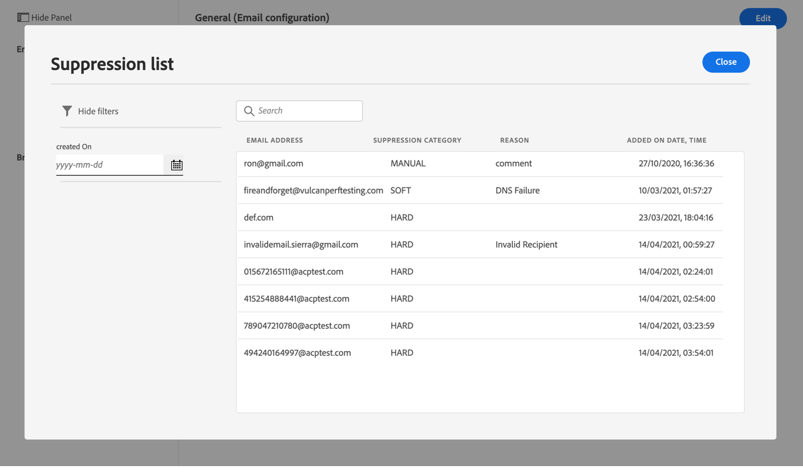
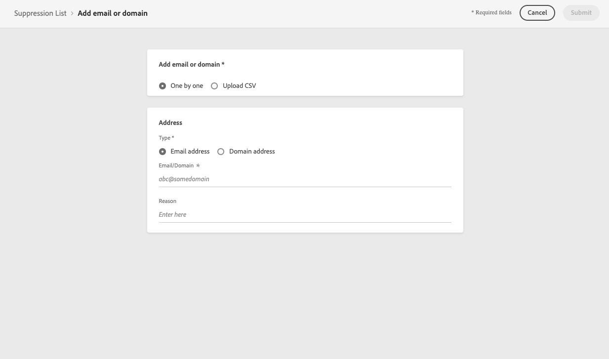

# 管理隱藏清單 {#manage-suppression-list}

透過[!DNL Journey Optimizer]，您可以監控自動排除而無法在歷程中傳送的所有電子郵件地址，例如：

* 無效的地址（硬跳出）。
* 持續軟跳出的位址，如果您繼續將其納入傳送中，可能會對您的電子郵件信譽造成負面影響。
* 對您的其中一封電子郵件發出某種垃圾郵件投訴的收件人。

此類電子郵件地址會自動收集到Journey Optimizer **隱藏清單**&#x200B;中。 進一步了解[本節](../suppression-list.md)。

## 訪問隱藏清單 {#access-suppression-list}

若要存取排除的電子郵件地址的詳細清單，請開啟「**[!UICONTROL Channels]** > **[!UICONTROL Email configuration]** > **[!UICONTROL General]**」功能表，然後按一下「**[!UICONTROL View suppression lists]**」連結。


<!--To access the detailed list of excluded email addresses, go to **[!UICONTROL Administration]** > **[!UICONTROL Channels]** > **[!UICONTROL Email configuration]**, and select **[!UICONTROL Suppression list]**.
You can also display the suppression list content using the **[!UICONTROL View suppression list]** link through the **[!UICONTROL Channels]** > **[!UICONTROL Email configuration]** > **[!UICONTROL General]** menu, but this view does not allow you to edit the list.

-->

篩選器可協助您瀏覽清單。



<!--

You can filter on the **[!UICONTROL Suppression category]**, **[!UICONTROL Address type]**, or **[!UICONTROL Reason]**. Select the option(s) of your choice for each criterion.


Once selected, you can clear each filter or all filters displayed on top of the list.-->

## 隱藏類別和原因 {#suppression-categories-and-reasons}

當郵件無法傳遞至電子郵件地址時，[!DNL Journey Optimizer]會確定傳送失敗的原因，並將其與&#x200B;**[!UICONTROL Suppression category]**&#x200B;關聯。

隱藏類別如下：

* **硬**:會立即將電子郵件地址發送到隱藏清單。

   >[!NOTE]
   >
   >當錯誤是垃圾郵件投訴的結果時，它也屬於&#x200B;**Hard**&#x200B;類別。 發出投訴的收件人的電子郵件地址會立即發送到壓制清單。

* **軟**:一旦錯誤計數器達到限制臨界值，軟錯誤就會將地址發送到隱藏清單。[重試時了解更多](retries.md)

   <!--
    **Ignored**:
    * When the error occurred for a valid email address but is known to be temporary, such as a failed connection attempt or a temporary technical issue, the email address is added to the suppression list once the error counter reaches the limit threshold. [Learn more on retries](retries.md).
    * When the error is the result of a spam complaint, the email address of the recipient who issued the complaint is immediately sent to the suppression list.
    -->

* **手動**:您也可以手動將電子郵件地址或網域新增至隱藏清單。[了解更多](#add-addresses-and-domains)

>[!NOTE]
>
>在[傳送失敗類型](../suppression-list.md#delivery-failures)區段中，深入了解軟退信和硬退信。

對於列出的每個電子郵件地址，您還可以檢查&#x200B;**[!UICONTROL Type]**（電子郵件或域）、**[!UICONTROL Reason]**&#x200B;是否排除它、添加者以及添加到隱藏清單的日期/時間。

<!---->

傳送失敗的可能原因有：

| 原因 | 說明 | 隱藏類別 |
| --- | --- | --- |
| **[!UICONTROL Invalid Recipient]** | 收件者無效或不存在。 | 硬 |
| **[!UICONTROL Soft Bounce]** | 消息軟退信的原因不是此表中列出的軟錯誤，例如當發送超出ISP建議的允許速率時。 | 軟 |
| **[!UICONTROL DNS Failure]** | 由於DNS失敗而退信。 | 軟 |
| **[!UICONTROL Mailbox Full]** | 由於收件者的信箱已滿而無法接受更多訊息，訊息已退信。 | 軟 |
| **[!UICONTROL Relaying Denied]** | 由於不允許中繼，因此接收器阻止了該消息。 | 軟 |
| **[!UICONTROL Challenge-Response]** | 該消息是挑戰 — 響應探測。 | 軟 |

>[!NOTE]
>
>未訂閱的使用者沒有收到來自[!DNL Journey Optimizer]的電子郵件，因此其電子郵件地址無法傳送至隱藏清單。 其選項會在Experience Platform層級處理。 深入了解[選擇退出](../consent.md)。

<!--
Removed from the table provided by SparkPost/Momentum:
| **[!UICONTROL Undetermined]** | The bounce reason received from the recipient domain Message Transfer Agent (MTA) could not be identified. | Ignored |
| **[!UICONTROL Too Large]** | The message bounced because it was too large for the recipient. [Retries](retries.md) will be performed: you can edit the message size and re-inject it for delivery. | Ignored |
| **[!UICONTROL Timeout]** | The message timed out, meaning it soft bounced and reached the message retry limit (3.5 days). | Ignored |
| **[!UICONTROL Admin Failure]** | The message was failed according to the policies configured by the sending system administrator. ///For example, if emails are blackholed at the global, domain or binding level using the "blackhole" directive, this bounce code is used. | Ignored |
| **[!UICONTROL Generic Bounce: No RCPT]** | No recipient could be determined for the message. | Ignored |
| **[!UICONTROL Generic Bounce]** | The message failed for unspecified reasons. | Ignored |
| **[!UICONTROL Mail Block]** | The message was blocked by the receiver (i.e. recipient MTA). | Ignored |
| **[!UICONTROL Spam Block]** | The message was blocked by the receiver as coming from a known spam source. It could be a sending IP block for example. | Ignored |
| **[!UICONTROL Spam Content]** | The message content was blocked by the receiver (recipient MTA) as spam. | Ignored |
| **[!UICONTROL Prohibited Attachment]** | The message was blocked by the receiver because it contained an attachment. | Ignored |
| **[!UICONTROL Auto-Reply]** | The message is an auto-reply/vacation mail. | Ignored |
| **[!UICONTROL Transient Failure]** | Message transmission has been temporarily delayed. | Ignored |
| **[!UICONTROL Subscribe]** | The message is a subscribe request. | Ignored |
| **[!UICONTROL Unsubscribe]** | The message is an unsubscribe request. | Hard |
-->

<!--Note to add eventually: If a user is subscribed and [!DNL Journey Optimizer] fails to send emails to their subscribed email address, they will get added to the suppression list. (not sure it's possible to subscribe through AJO or need to find reference to Experience Platform doc?)-->

<!--## Manually add addresses and domains {#add-addresses-and-domains}

When a message fails to be delivered to an email address, this address is automatically added to the suppression list based on the defined suppression rule or bounce count.

However, you can also manually populate the [!DNL Journey Optimizer] suppression list to exclude specific email addresses and/or domains from your sending.

You may add email addresses or domains [one at a time](#add-one-address-or-domain), or [in bulk mode](#upload-csv-file) through a CSV file upload.

To do this, select the **[!UICONTROL Add email or domain]** button, then follow one of the methods below.


### Add one address or domain {#add-one-address-or-domain}

1. Select the **[!UICONTROL One by one]** option.

    

1. Choose the address type: **[!UICONTROL Email address]** or **[!UICONTROL Domain address]**.

1. Enter the email address or domain you want to exclude from your sending.

    >[!NOTE]
    >
    >Make sure you enter a valid email address (such as abc@company) or domain (such as abc.company.com).

1. Specify a reason if needed.

1. Click **[!UICONTROL Submit]**.

### Upload a CSV file {#upload-csv-file}

1. Select the **[!UICONTROL Upload CSV]** option.

    

1. Download the CSV template to use, which includes the columns and format below:

    ```
    TYPE,VALUE,COMMENT
    EMAIL,abc@somedomain.com,Comment
    DOMAIN,somedomain.com,Comment
    ```
    You can also download this template from the **[!UICONTROL Suppression list]** main view.

    >[!CAUTION]
    >
    >Do not change the names of the columns in the CSV template.
    >
    >The file size should not exceed 50 MB.

1. Fill in the CSV template with the email addresses and/or domains you want to add to the suppression list.

1. Once completed, drag and drop your CSV file, then click **[!UICONTROL Upload file]**.

    

1. Click **[!UICONTROL Submit]**.

### Check recent uploads status {#recent-uploads}

You can check the list of the latest CSV files you uploaded.

To do this, from the **[!UICONTROL Suppression list]** view, click the **[!UICONTROL Recent uploads]** button.


The latest uploads you submitted and their corresponding statuses are displayed.

If an error report is associated with a file, you can download it to check the errors encountered.


Below is an example of the type of entries you can find in the error report:

```
type,value,comments,failureReason
Email,examplemail.com,MANUAL,Invalid format for value: examplemail.com
Email,examplemail,MANUAL,Invalid format for value: examplemail
Email,example@mail,MANUAL,Invalid format for value: example@mail
Domain,example,MANUAL,Invalid format for value: example
Domain,example.!com,MANUAL,Invalid format for value: example.!com
Domain,!examplecom,MANUAL,Invalid format for value: !examplecom
```

-->


