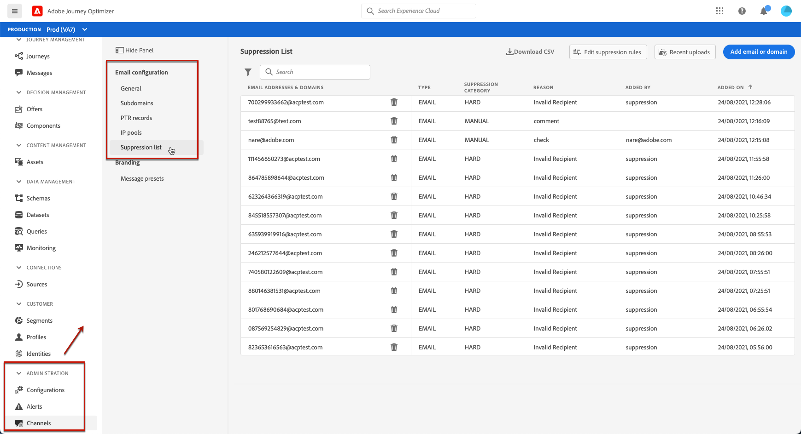

# 管理隱藏清單 {#manage-suppression-list}

使用 [!DNL Journey Optimizer]，您可以監控自動排除而無法傳送歷程的所有電子郵件地址，例如：

* 無效的地址（硬跳出）。
* 持續軟跳出的位址，如果您繼續將其納入傳送中，可能會對您的電子郵件信譽造成負面影響。
* 對您的其中一封電子郵件發出某種垃圾郵件投訴的收件人。

這些電子郵件地址會自動收集到Journey Optimizer **隱藏清單**. 進一步了解隱藏清單概念和在 [本節](../suppression-list.md).

## 訪問隱藏清單 {#access-suppression-list}

若要存取排除的電子郵件地址的詳細清單，請前往 **[!UICONTROL Administration]** > **[!UICONTROL Channels]** > **[!UICONTROL Email configuration]**，然後選取 **[!UICONTROL Suppression list]**.

>[!CAUTION]
>
>查看、導出和管理隱藏清單的權限限制為 [歷程管理員](../administration/ootb-product-profiles.md#journey-administrator). 深入了解管理 [!DNL Journey Optimizer] 中的使用者存取權限 [本節](../administration/permissions-overview.md).

<!--

You can also display the suppression list content using the **[!UICONTROL View suppression list]** link through the **[!UICONTROL Channels]** > **[!UICONTROL Email configuration]** > **[!UICONTROL General]** menu, but this view does not allow you to edit the list.-->



篩選器可協助您瀏覽清單。

<!---->


您可以篩選 **[!UICONTROL Suppression category]**, **[!UICONTROL Address type]**，或 **[!UICONTROL Reason]**. 為每個條件選取您選取的選項。 選取後，您就可以清除每個篩選器，或清單頂端顯示的所有篩選器。


如果您手動錯誤新增電子郵件地址或網域， **[!UICONTROL Delete]** 按鈕可以刪除該條目。

>[!CAUTION]
>
>絕不使用 **[!UICONTROL Delete]** 按鈕，移除隱藏的電子郵件地址或網域。


從隱藏清單中刪除電子郵件地址或網域，表示您將重新開始傳送至此地址或網域。 因此，這可能會對您的傳遞能力和IP信譽造成嚴重影響，最終可能導致您的IP位址或傳送網域遭到封鎖。 進一步了解維護隱藏清單在 [本節](../suppression-list.md).

>[!NOTE]
>
>考慮刪除任何電子郵件地址或網域時，請格外小心。 如有疑問，請聯絡傳遞能力專家。

從 **[!UICONTROL Suppression list]** 視圖中，也可以編輯隱藏規則。 [了解更多](retries.md)

要將隱藏清單導出為CSV檔案，請選擇 **[!UICONTROL Download CSV]** 按鈕。


## 隱藏類別和原因 {#suppression-categories-and-reasons}

當郵件無法傳遞至電子郵件地址時， [!DNL Journey Optimizer] 判斷傳送失敗的原因，並將其與 **[!UICONTROL Suppression category]**.

隱藏類別如下：

* **硬**:會立即將電子郵件地址發送到隱藏清單。

   >[!NOTE]
   >
   >當錯誤是垃圾郵件投訴的結果時，它也會落入 **硬** 類別。 發出投訴的收件人的電子郵件地址會立即發送到壓制清單。

* **軟**:一旦錯誤計數器達到限制臨界值，軟錯誤就會將地址發送到隱藏清單。 [重試時了解更多](retries.md)

   <!--
    **Ignored**:
    * When the error occurred for a valid email address but is known to be temporary, such as a failed connection attempt or a temporary technical issue, the email address is added to the suppression list once the error counter reaches the limit threshold. [Learn more on retries](retries.md).
    * When the error is the result of a spam complaint, the email address of the recipient who issued the complaint is immediately sent to the suppression list.
    -->

* **手動**:您也可以手動將電子郵件地址或網域新增至隱藏清單。 [了解更多](#add-addresses-and-domains)

>[!NOTE]
>
>進一步了解軟退信和硬退信，位於 [傳送失敗類型](../suppression-list.md#delivery-failures) 區段。

對於所列的每個電子郵件地址，您也可以檢查 **[!UICONTROL Type]** （電子郵件或網域）, **[!UICONTROL Reason]** 排除、新增者，以及新增至隱藏清單的日期/時間。


傳送失敗的可能原因有：

| 原因 | 說明 | 隱藏類別 |
| --- | --- | --- |
| **[!UICONTROL Invalid Recipient]** | 收件者無效或不存在。 | 硬 |
| **[!UICONTROL Soft Bounce]** | 消息軟退信的原因不是此表中列出的軟錯誤，例如當發送超過ISP建議的允許速率時。 | 軟 |
| **[!UICONTROL DNS Failure]** | 由於DNS失敗而退信。 | 軟 |
| **[!UICONTROL Mailbox Full]** | 由於收件者的信箱已滿而無法接受更多訊息，訊息已退信。 | 軟 |
| **[!UICONTROL Relaying Denied]** | 由於不允許中繼，因此接收器阻止了該消息。 | 軟 |
| **[!UICONTROL Challenge-Response]** | 該消息是挑戰 — 響應探測。 | 軟 |
| **[!UICONTROL Spam Complaint]** | 由於收件者將郵件標示為垃圾訊息，因此已封鎖訊息。 | 硬 |

>[!NOTE]
>
>取消訂閱的使用者不會收到來自 [!DNL Journey Optimizer]，因此其電子郵件地址無法傳送至隱藏清單。 其選項會在Experience Platform層級處理。 [進一步了解選擇退出](../consent.md)

<!--
Removed from the table provided by SparkPost/Momentum:
| **[!UICONTROL Undetermined]** | The bounce reason received from the recipient domain Message Transfer Agent (MTA) could not be identified. | Ignored |
| **[!UICONTROL Too Large]** | The message bounced because it was too large for the recipient. [Retries](retries.md) will be performed: you can edit the message size and re-inject it for delivery. | Ignored |
| **[!UICONTROL Timeout]** | The message timed out, meaning it soft bounced and reached the message retry limit (3.5 days). | Ignored |
| **[!UICONTROL Admin Failure]** | The message was failed according to the policies configured by the sending system administrator. ///For example, if emails are blackholed at the global, domain or binding level using the "blackhole" directive, this bounce code is used. | Ignored |
| **[!UICONTROL Generic Bounce: No RCPT]** | No recipient could be determined for the message. | Ignored |
| **[!UICONTROL Generic Bounce]** | The message failed for unspecified reasons. | Ignored |
| **[!UICONTROL Mail Block]** | The message was blocked by the receiver (i.e. recipient MTA). | Ignored |
| **[!UICONTROL Spam Block]** | The message was blocked by the receiver as coming from a known spam source. It could be a sending IP block for example. | Ignored |
| **[!UICONTROL Spam Content]** | The message content was blocked by the receiver (recipient MTA) as spam. | Ignored |
| **[!UICONTROL Prohibited Attachment]** | The message was blocked by the receiver because it contained an attachment. | Ignored |
| **[!UICONTROL Auto-Reply]** | The message is an auto-reply/vacation mail. | Ignored |
| **[!UICONTROL Transient Failure]** | Message transmission has been temporarily delayed. | Ignored |
| **[!UICONTROL Subscribe]** | The message is a subscribe request. | Ignored |
| **[!UICONTROL Unsubscribe]** | The message is an unsubscribe request. | Hard |
-->

<!--Note to add eventually: If a user is subscribed and [!DNL Journey Optimizer] fails to send emails to their subscribed email address, they will get added to the suppression list.-->

## 手動新增地址和網域 {#add-addresses-and-domains}

當郵件無法傳遞至電子郵件地址時，系統會根據定義的隱藏規則或退信計數，自動將此地址新增至隱藏清單。

不過，您也可以手動填入 [!DNL Journey Optimizer] 隱藏清單，從您的傳送中排除特定的電子郵件地址和/或網域。

您可以新增電子郵件地址或網域 [一次一個](#add-one-address-or-domain)，或 [在大量模式中](#upload-csv-file) 透過CSV檔案上傳。

若要這麼做，請選取 **[!UICONTROL Add email or domain]** 按鈕，然後遵循以下方法之一。


### 添加一個地址或域 {#add-one-address-or-domain}

1. 選取 **[!UICONTROL One by one]** 選項。

   

1. 選擇地址類型： **[!UICONTROL Email address]** 或 **[!UICONTROL Domain address]**.

1. 輸入要從傳送中排除的電子郵件地址或網域。

   >[!NOTE]
   >
   >請務必輸入有效的電子郵件地址(如abc@company)或網域（如abc.company.com）。

1. 視需要指定原因。

1. 按一下「**[!UICONTROL Submit]**」。

### 上傳CSV檔案 {#upload-csv-file}

1. 選取 **[!UICONTROL Upload CSV]** 選項。

   

1. 下載要使用的CSV範本，其中包含下列欄和格式：

   ```
   TYPE,VALUE,COMMENT
   EMAIL,abc@somedomain.com,Comment
   DOMAIN,somedomain.com,Comment
   ```
   您也可以從 **[!UICONTROL Suppression list]** 主檢視。

   >[!CAUTION]
   >
   >請勿變更CSV範本中的欄名稱。
   >
   >檔案大小不應超過1 MB。

1. 在CSV範本中填入您要新增至隱藏清單的電子郵件地址和/或網域。

1. 完成後，拖放CSV檔案，然後按一下 **[!UICONTROL Upload file]**.

   

1. 按一下「**[!UICONTROL Submit]**」。

### 檢查最近的上載狀態 {#recent-uploads}

您可以檢查您上傳的最新CSV檔案清單。

若要這麼做，請從 **[!UICONTROL Suppression list]** 檢視，按一下 **[!UICONTROL Recent uploads]** 按鈕。


系統會顯示您提交的最新上傳內容及其對應狀態。

如果錯誤報告與檔案相關聯，您可以下載該報告以檢查遇到的錯誤。


以下是可在錯誤報表中找到的項目類型範例：

```
type,value,comments,failureReason
Email,examplemail.com,MANUAL,Invalid format for value: examplemail.com
Email,examplemail,MANUAL,Invalid format for value: examplemail
Email,example@mail,MANUAL,Invalid format for value: example@mail
Domain,example,MANUAL,Invalid format for value: example
Domain,example.!com,MANUAL,Invalid format for value: example.!com
Domain,!examplecom,MANUAL,Invalid format for value: !examplecom
```
