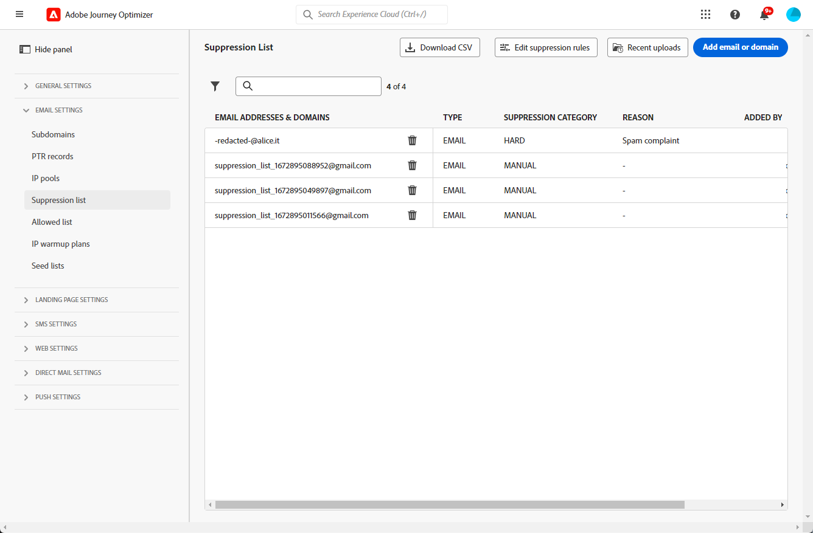
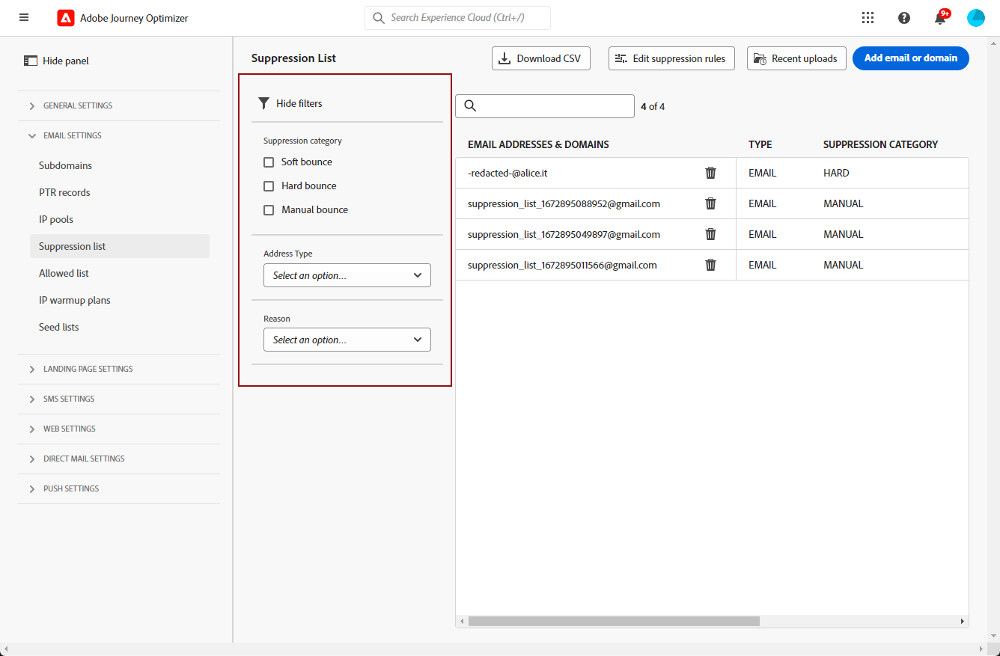
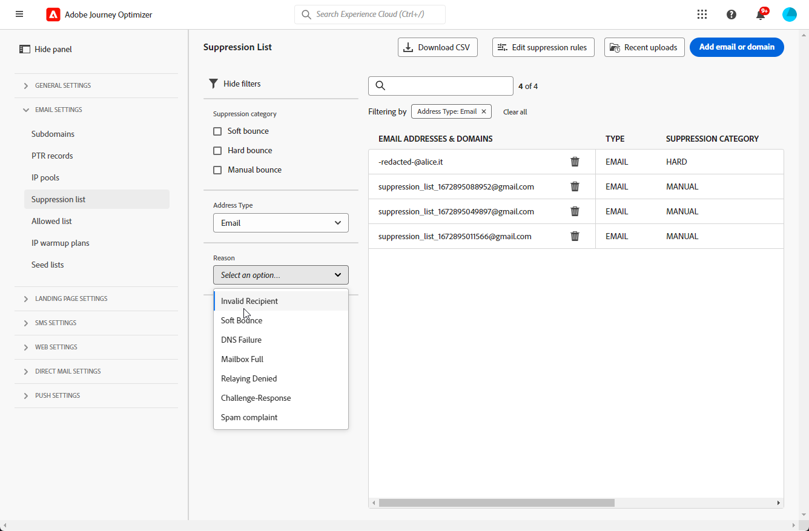
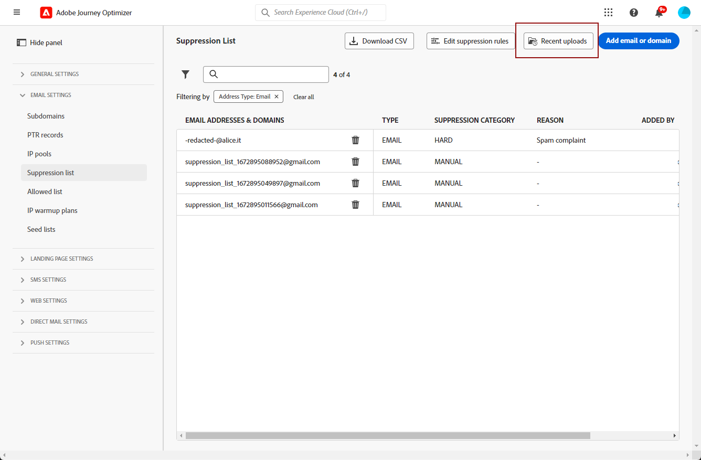
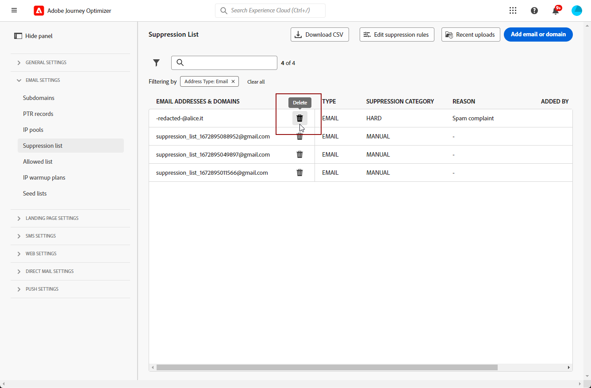
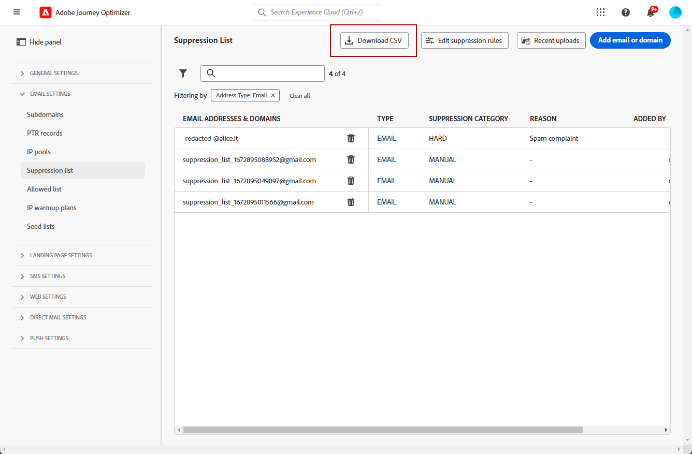

# 管理禁止名單 {#manage-suppression-list}

透過[!DNL Journey Optimizer]，您可以監視自動排除而無法傳送歷程或行銷活動的所有電子郵件地址，例如硬退信、軟退信和垃圾郵件投訴。

這些電子郵件地址會自動收集到Journey Optimizer **隱藏清單**&#x200B;中。 隱藏清單包含要從對象中排除的地址和網域。 它會收集在單一使用者端環境中所有郵件中隱藏的電子郵件地址和網域，這表示會特定於與沙箱ID關聯的組織ID。

在[本節](../reports/suppression-list.md)中進一步瞭解隱藏清單概念及使用方式。

>[!NOTE]
>
>Adobe會保留已知不良地址的更新清單（這些地址已被證明會損害參與和郵寄信譽），並確保不會將電子郵件傳遞給他們。 此清單在所有 Adobe 客戶通用的全球禁止名單中進行管理。 全球禁止名單中包含的地址和網域名稱都會隱藏起來。 傳遞報告中僅顯示排除的收件者人數。

此外，您可以運用Journey Optimizer **隱藏REST API**，使用隱藏和允許清單控制您的傳出訊息。 [了解如何使用 Suppression REST API](https://developer.adobe.com/journey-optimizer-apis/references/suppression/){target="_blank"}

## 存取隱藏清單 {#access-suppression-list}

若要存取排除的電子郵件地址和網域的詳細清單，請瀏覽至&#x200B;**[!UICONTROL 管理]** > **[!UICONTROL 管道]** > **[!UICONTROL 電子郵件設定]**，然後選取&#x200B;**[!UICONTROL 隱藏清單]**。




>[!CAUTION]
>
>檢視、匯出及管理隱藏清單的許可權限製為[歷程管理員](../administration/ootb-product-profiles.md#journey-administrator)。 在[!DNL Journey Optimizer]本節[中進一步瞭解如何管理](../administration/permissions-overview.md)使用者的存取權。


篩選器可幫助您瀏覽清單。



您可以篩選&#x200B;**[!UICONTROL 隱藏類別]**、**[!UICONTROL 位址型別]**&#x200B;或&#x200B;**[!UICONTROL 原因]**。 為每個條件選取一或多個選項。 選取後，您可以清除清單上方顯示的每個篩選器或所有篩選器。




## 瞭解失敗原因 {#suppression-categories-and-reasons}

當郵件無法傳遞至電子郵件地址時，[!DNL Journey Optimizer]會判斷傳遞失敗的原因，並將其與&#x200B;**[!UICONTROL 隱藏類別]**&#x200B;建立關聯。

隱藏類別如下：

* **硬退信**：硬退信表示電子郵件地址無效（即不存在電子郵件地址）。 這涉及來自接收電子郵件伺服器的退回訊息，明確指出地址無效。 電子郵件地址會立即傳送到隱藏清單。

  當錯誤是垃圾郵件投訴的結果時，它也會屬於&#x200B;**Hard**&#x200B;類別。 發出投訴的收件者的電子郵件地址會立即傳送到隱藏清單。

* **軟退信**：軟退信是發生在有效電子郵件地址的暫時電子郵件退信。 在多次重試後，電子郵件地址會新增到隱藏清單中。 軟錯誤會在錯誤計數器達到限制臨界值時，將位址傳送到隱藏清單。 [進一步瞭解重試](retries.md)

* **手動**：手動錯誤已手動新增至隱藏清單。 [了解更多](#add-addresses-and-domains)

對於列出的每個電子郵件地址，您還可以檢查&#x200B;**[!UICONTROL Type]** （電子郵件或網域）、**[!UICONTROL Reason]**&#x200B;是否將其排除、新增者以及將其新增到隱藏清單中的日期/時間。

傳送失敗的可能原因包括：

| 原因 | 說明 | 類別 |
| --- | --- | --- |
| **[!UICONTROL 無效的收件者]** | 收件者的地址無效或不存在。 | 強烈 |
| **[!UICONTROL 軟退信]** | 訊息因本表中列出的軟錯誤以外的其他原因而軟跳出，例如當傳送超過ISP建議的允許速率時。 | 柔光 |
| **[!UICONTROL DNS失敗]** | 由於DNS失敗，郵件已退回。 | 柔光 |
| **[!UICONTROL 郵箱已滿]** | 由於收件者的信箱已滿且無法接受更多郵件，郵件已退回。 | 柔光 |
| **[!UICONTROL 拒絕轉送]** | 因為不允許轉送，接收者已封鎖郵件。 | 柔光 |
| **[!UICONTROL 挑戰 — 回應]** | 此訊息是挑戰 — 回應探查。 | 柔光 |
| **[!UICONTROL 垃圾訊息申訴]** | 郵件已封鎖，因為收件者將其標示為垃圾郵件。 | 強烈 |

>[!NOTE]
>
>取消訂閱的使用者沒有收到來自[!DNL Journey Optimizer]的電子郵件，因此他們的電子郵件地址無法傳送到隱藏清單。 他們的選擇在Experience Platform層級處理。 [進一步瞭解選擇退出](../privacy/opt-out.md)


### 隱藏規則  {#suppression-rules}

從&#x200B;**[!UICONTROL 隱藏清單]**&#x200B;檢視，您也可以從&#x200B;**[!UICONTROL 編輯隱藏規則]**&#x200B;按鈕編輯與隱藏規則關聯的重試引數。 使用此選項可更新目前沙箱的重試臨界值。 [進一步瞭解重試](retries.md)。


## 將地址和網域新增到禁止名單{#add-addresses-and-domains}

>[!CONTEXTUALHELP]
>id="ajo_admin_suppression_list_header"
>title="將電子郵件或網域新增到禁止名單"
>abstract="您可以手動填入 Journey Optimizer 禁止名單，以便從您的傳送中排除特定的電子郵件地址和/或網域。"

>[!CONTEXTUALHELP]
>id="ajo_admin_suppression_list"
>title="將電子郵件或網域新增到禁止名單"
>abstract="若要填入禁止名單，您可以手動新增電子郵件地址或網域：一次一個，或在大量模式中透過 CSV 檔案上傳。這些特定的電子郵件地址和/或網域將被排除在您的傳送之外。"

當訊息無法傳遞至電子郵件地址時，此地址會根據定義的隱藏規則或退信計數自動新增到隱藏清單中。

不過，您也可以手動填入[!DNL Journey Optimizer]隱藏清單，從傳送中排除特定的電子郵件地址和/或網域。

>[!NOTE]
>
>[!DNL Journey Optimizer]最多可能需要60分鐘，才能考慮傳出電子郵件中隱藏的地址。

您可以[一次新增一個](#add-one-address-or-domain)電子郵件地址或網域，或[在大量模式中](#upload-csv-file)透過 CSV 檔案上傳的方式新增。

### 新增一個地址或網域 {#add-one-address-or-domain}

>[!CONTEXTUALHELP]
>id="ajo_admin_suppression_list_address"
>title="將一個項目新增到禁止名單"
>abstract="您可以透過逐一新增電子郵件地址和/或網域來填入禁止名單。"

若要將電子郵件地址或網域新增至隱藏清單，請遵循下列步驟：

1. 選取&#x200B;**[!UICONTROL 新增電子郵件或網域]**&#x200B;按鈕。

   

1. 選擇&#x200B;**[!UICONTROL One x]**&#x200B;選項。

   

1. 選取地址型別： **[!UICONTROL 電子郵件]**&#x200B;或&#x200B;**[!UICONTROL 網域]**。

1. 輸入您要從傳送中排除的電子郵件地址或網域。

   >[!NOTE]
   >
   >確定輸入有效的電子郵件地址 (例如 abc@company.com) 或網域 (例如 abc.company.com)。

1. （選擇性）輸入原因。 此欄位允許包含在32到126之間的所有ASCII可列印字元。

1. 使用&#x200B;**[!UICONTROL Submit]**&#x200B;按鈕確認。

### 上傳 CSV 檔案 {#upload-csv-file}

>[!CONTEXTUALHELP]
>id="ajo_admin_suppression_list_csv"
>title="上傳 CSV 以將項目新增到禁止名單"
>abstract="您可以透過上傳填滿您要排除的電子郵件地址/網域的 CSV 檔案來填入禁止名單。"

若要將電子郵件地址群組或網域新增至隱藏清單，請遵循下列步驟：

1. 選取&#x200B;**[!UICONTROL 新增電子郵件或網域]**&#x200B;按鈕。
1. 選擇&#x200B;**[!UICONTROL 上傳CSV]**&#x200B;選項。

   

1. 下載要使用的 CSV 範本，其中包括以下欄和格式：

   ```
   TYPE,VALUE,COMMENT
   EMAIL,abc@somedomain.com,Comment
   DOMAIN,somedomain.com,Comment
   ```

1. 在CSV範本中填入電子郵件地址和/或網域，以新增到隱藏清單。 在&#x200B;**COMMENT**&#x200B;欄中允許包含32到126之間的所有ASCII可列印字元。

   >[!CAUTION]
   >
   >請勿變更CSV範本中的欄名稱。
   >
   >檔案大小不應超過 1 MB。
   >

1. 完成後，請拖放您的CSV檔案，並使用&#x200B;**[!UICONTROL 提交]**&#x200B;按鈕進行確認。

   

上傳完成後，您可以從[最近上傳](#recent-uploads)按鈕檢查其狀態，如下所述。

### 檢查上傳狀態 {#recent-uploads}

使用&#x200B;**[!UICONTROL 最近上傳]**&#x200B;按鈕來檢查最新上傳CSV檔案的狀態。



可能的狀態有：

* **[!UICONTROL 擱置中]**：檔案上傳正在處理中。
* **[!UICONTROL 錯誤]**：由於技術問題或檔案格式錯誤，文件上傳過程失敗。
* **[!UICONTROL 完成]**：檔案上傳過程已成功完成。

上傳期間，如果部分位址的格式不正確，則不會新增至[!DNL Journey Optimizer]隱藏清單。

在這種情況下，上傳完成後，即會與報告相關聯。 您可以下載它以檢查遇到的錯誤<!-- and understand why they were not added to the suppression list-->。


以下是您可以在錯誤報表中找到的專案型別範例：

```
type,value,comments,failureReason
Email,examplemail.com,MANUAL,Invalid format for value: examplemail.com
Email,examplemail,MANUAL,Invalid format for value: examplemail
Email,example@mail,MANUAL,Invalid format for value: example@mail
Domain,example,MANUAL,Invalid format for value: example
Domain,example.!com,MANUAL,Invalid format for value: example.!com
Domain,!examplecom,MANUAL,Invalid format for value: !examplecom
```

## 從隱藏清單移除位址 {#remove-from-suppression-list}

您可以手動更新隱藏清單。 從隔離區中移除電子郵件地址是一項敏感操作，可能會影響您的IP信譽和傳遞率。 請務必謹慎進行。

從隱藏清單刪除電子郵件地址或網域時，Adobe Journey Optimizer可以再次開始傳遞至此地址或網域。  在[本節](../reports/deliverability.md)中進一步瞭解傳遞能力。

若要從隱藏清單移除位址，請使用&#x200B;**[!UICONTROL 刪除]**&#x200B;按鈕。




>[!NOTE]
>
>在考慮刪除任何電子郵件地址或網域時，請格外謹慎地繼續操作。 如有疑問，請聯絡傳遞能力專家。

例如，在網際網路服務提供者(ISP)中斷的情況下，電子郵件會錯誤標示為硬跳出，因為這些電子郵件無法成功傳遞給收件者。 必須從隱藏清單中移除這些電子郵件地址。

若要擷取這些地址，請根據中斷的內容使用自訂引數執行特定查詢。 [在此範例中進一步瞭解](../data/datasets-query-examples.md#isp-outage-query)。

在識別受影響的電子郵件地址後，請篩選隱藏清單以顯示它們。 例如，如果&#x200B;**test.com**&#x200B;網域上的ISP中斷從2022年11月11日到2022年11月13日發生，請篩選在該時間範圍內新增到隱藏清單的地址，如下所示：

您可以使用&#x200B;**[!UICONTROL 刪除]**&#x200B;按鈕，從隱藏清單中移除隔離的電子郵件地址。

## 下載禁止名單 {#download-suppression-list}

<!--
>[!CONTEXTUALHELP]
>id="ajo_admin_suppression_list_download"
>title="Export the list as a CSV file"
>abstract="To download the suppression list, Qou can either export the current list by generating a new file, or download the file that was previously generated."
-->

若要將隱藏清單匯出為CSV檔案，請遵循下列步驟：

1. 選取&#x200B;**[!UICONTROL 下載CSV]**&#x200B;按鈕。

   

1. 等候檔案產生。

   >[!NOTE]
   >
   >下載時間取決於檔案大小，這表示隱藏清單中的位址數量。
   >
   >對於指定的沙箱，一次可處理一個下載請求。

1. 檔案產生後，您會收到通知。 按一下畫面右上方的鈴鐺圖示即可顯示。

1. 按一下通知本身以下載檔案。

   

   >[!NOTE]
   >
   >連結的有效期限為24小時。

<!--When downloading the CSV file, you can choose to either:

* Download the file that was previously generated by another user or yourself.

* Generate a new file in order to export the current suppression list.-->

