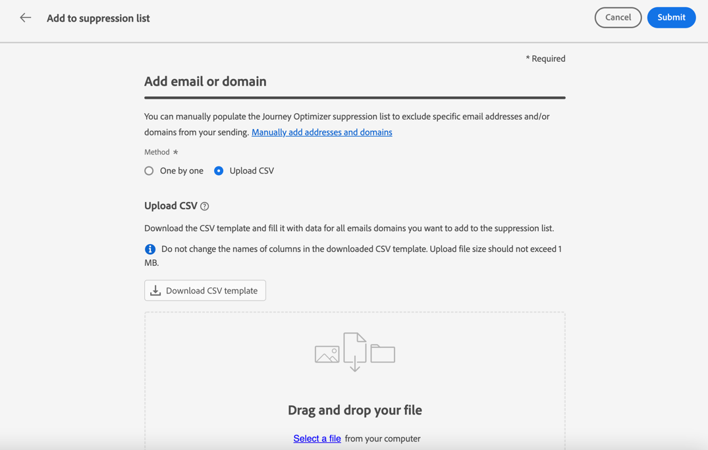

# 管理禁止顯示清單 {#manage-suppression-list}

與 [!DNL Journey Optimizer]，您可以監視在行程或活動中自動被排除在發送之外的所有電子郵件地址，如硬回報、軟回報和垃圾郵件投訴。

這些電子郵件地址自動收集到Journey Optimizer **隱藏清單**。 隱藏清單包含要從受眾中排除的地址和域。 它收集在單個客戶端環境中所有郵件中隱藏的電子郵件地址和域，這意味著特定於與沙盒ID關聯的組織ID。

瞭解有關禁止顯示清單概念和中使用的詳細資訊 [此部分](../reports/suppression-list.md)。

>[!NOTE]
>
>Adobe會保留已知錯誤地址的更新清單，這些地址已被證明有害於參與和郵寄聲譽，並確保不會向他們發送電子郵件。 此清單在所有 Adobe 客戶通用的全球禁止名單中進行管理。 全球禁止名單中包含的地址和網域名稱都會隱藏起來。 傳遞報告中僅顯示排除的收件者人數。

## 訪問禁止顯示清單 {#access-suppression-list}

要訪問排除的電子郵件地址和域的詳細清單，請瀏覽至 **[!UICONTROL 管理]** > **[!UICONTROL 頻道]** > **[!UICONTROL 電子郵件配置]**，然後選擇 **[!UICONTROL 隱藏清單]**。


>[!CAUTION]
>
>查看、導出和管理禁止顯示清單的權限限制為 [旅程管理員](../administration/ootb-product-profiles.md#journey-administrator)。 瞭解有關管理的更多資訊 [!DNL Journey Optimizer] 用戶在 [此部分](../administration/permissions-overview.md)。


篩選器可幫助您瀏覽清單。


可以在 **[!UICONTROL 抑制類別]**。 **[!UICONTROL 地址類型]**&#x200B;或 **[!UICONTROL 原因]**。 為每個條件選擇一個或多個選項。 選中後，可以清除清單頂部顯示的每個篩選器或所有篩選器。


## 瞭解失敗原因 {#suppression-categories-and-reasons}

當郵件無法傳遞到電子郵件地址時， [!DNL Journey Optimizer] 確定交貨失敗的原因，並將其與 **[!UICONTROL 抑制類別]**。

隱藏類別如下：

* **硬**:硬彈出表示電子郵件地址無效（即電子郵件地址不存在）。 這涉及從接收電子郵件伺服器返回的消息，該消息明確地指出地址無效。 電子郵件地址會立即發送到禁止使用清單。

   當錯誤是垃圾郵件投訴的結果時，它也會 **硬** 的子菜單。 發出投訴的收件人的電子郵件地址立即發送到禁止清單。

* **軟**:軟跳轉是對有效電子郵件地址發生的臨時電子郵件跳轉。 在多次重試後，電子郵件地址將添加到禁止顯示清單。 一旦錯誤計數器達到限制閾值，軟錯誤就會向抑制清單發送地址。 [瞭解有關重試的詳細資訊](retries.md)

* **手動**:手動錯誤已手動添加到禁止顯示清單。 [了解更多](#add-addresses-and-domains)

對於列出的每個電子郵件地址，您還可以檢查 **[!UICONTROL 類型]** （電子郵件或域）, **[!UICONTROL 原因]** 用於排除它、添加者以及將其添加到禁止清單的日期/時間。


交貨失敗的可能原因有：

| 原因 | 說明 | 類別 |
| --- | --- | --- |
| **[!UICONTROL 收件人無效]** | 收件人無效或不存在。 | 硬 |
| **[!UICONTROL 軟跳出]** | 消息軟性反彈的原因不是此表中列出的軟錯誤，例如當發送超過ISP建議的允許速率時。 | 軟 |
| **[!UICONTROL DNS失敗]** | 消息因DNS故障而彈回。 | 軟 |
| **[!UICONTROL 郵箱已滿]** | 由於收件人的郵箱已滿，無法接受更多郵件，郵件已彈回。 | 軟 |
| **[!UICONTROL 拒絕中繼]** | 接收方阻止了該消息，因為不允許中繼。 | 軟 |
| **[!UICONTROL 質詢 — 響應]** | 消息是質詢 — 響應探測。 | 軟 |
| **[!UICONTROL 垃圾郵件投訴]** | 郵件被阻止，因為收件人將其標籤為垃圾郵件。 | 硬 |

>[!NOTE]
>
>未訂閱的用戶未接收來自 [!DNL Journey Optimizer]，因此無法將其電子郵件地址發送到禁止顯示清單。 他們的選擇在Experience Platform級別處理。 [瞭解有關退出選擇的更多資訊](../privacy/opt-out.md)


### 禁止規則  {#suppression-rules}

從 **[!UICONTROL 隱藏清單]** 視圖中，您還可以編輯與禁止顯示規則關聯的重試參數 **[!UICONTROL 編輯禁止顯示規則]** 按鈕 使用此選項更新當前沙盒的重試閾值。 [瞭解有關重試的詳細資訊](retries.md)。


## 將地址和域添加到禁止顯示清單{#add-addresses-and-domains}

>[!CONTEXTUALHELP]
>id="ajo_admin_suppression_list_header"
>title="將電子郵件或網域新增到禁止名單"
>abstract="您可以手動填入 Journey Optimizer 禁止名單，以便從您的傳送中排除特定的電子郵件地址和/或網域。"

>[!CONTEXTUALHELP]
>id="ajo_admin_suppression_list"
>title="將電子郵件或網域新增到禁止名單"
>abstract="若要填入禁止名單，您可以手動新增電子郵件地址或網域：一次一個，或在大量模式中透過 CSV 檔案上傳。這些特定的電子郵件地址和/或網域將被排除在您的傳送之外。"

當消息無法傳遞到電子郵件地址時，此地址將根據定義的抑制規則或彈出計數自動添加到抑制清單中。

但是，您也可以手動填充 [!DNL Journey Optimizer] 禁止顯示清單，以將特定電子郵件地址和/或域從您的發送中排除。

>[!NOTE]
>
>最多需要60分鐘 [!DNL Journey Optimizer] 考慮傳出電子郵件中隱藏的地址。

您可以[一次新增一個](#add-one-address-or-domain)電子郵件地址或網域，或[在大量模式中](#upload-csv-file)透過 CSV 檔案上傳的方式新增。

### 新增一個地址或網域 {#add-one-address-or-domain}

>[!CONTEXTUALHELP]
>id="ajo_admin_suppression_list_address"
>title="將一個項目新增到禁止名單"
>abstract="您可以透過逐一新增電子郵件地址和/或網域來填入禁止名單。"

要將電子郵件地址或域添加到禁止顯示清單，請執行以下步驟：

1. 選擇 **[!UICONTROL 添加電子郵件或域]** 按鈕

   

1. 選擇 **[!UICONTROL 一個一個]** 的雙曲餘切值。

   

1. 選擇地址類型： **[!UICONTROL 電子郵件]** 或 **[!UICONTROL 域]**。

1. 輸入您要從傳送中排除的電子郵件地址或網域。

   >[!NOTE]
   >
   >確定輸入有效的電子郵件地址 (例如 abc@company.com) 或網域 (例如 abc.company.com)。

1. （可選）輸入原因。 此欄位允許包含 32 到 126 個字元之間組成的所有 ASCII 可列印字元。 

1. 使用 **[!UICONTROL 提交]** 按鈕確認。

### 上傳 CSV 檔案 {#upload-csv-file}

>[!CONTEXTUALHELP]
>id="ajo_admin_suppression_list_csv"
>title="上傳 CSV 以將項目新增到禁止名單"
>abstract="您可以透過上傳填滿您要排除的電子郵件地址/網域的 CSV 檔案來填入禁止名單。"

要將一組電子郵件地址或域添加到禁止顯示清單，請執行以下步驟：

1. 選擇 **[!UICONTROL 添加電子郵件或域]** 按鈕
1. 選擇 **[!UICONTROL 上載CSV]** 的雙曲餘切值。

   

1. 下載要使用的 CSV 範本，其中包括以下欄和格式：

   ```
   TYPE,VALUE,COMMENT
   EMAIL,abc@somedomain.com,Comment
   DOMAIN,somedomain.com,Comment
   ```

1. 用要添加到禁止顯示清單的電子郵件地址和/或域填充CSV模板。 在中，允許包含32到126之間的所有ASCII可打印字元 **注釋** 的雙曲餘切值。

   >[!CAUTION]
   >
   >不要更改CSV模板中列的名稱。
   >
   >檔案大小不應超過 1 MB。

1. 完成後，拖放CSV檔案，然後使用 **[!UICONTROL 提交]** 按鈕確認。

   

上載完成後，可以從 [最近上載](#recent-uploads) 按鈕，如下所述。

### 檢查上載狀態 {#recent-uploads}

使用 **[!UICONTROL 最近上載]** 按鈕，將選定控制項在Tab鍵次序中下移一個位置。


可能的狀態有：

* **[!UICONTROL 擱置中]**：檔案上傳正在處理中。
* **[!UICONTROL 錯誤]**：由於技術問題或檔案格式錯誤，文件上傳過程失敗。
* **[!UICONTROL 完成]**：檔案上傳過程已成功完成。

在上載過程中，如果某些地址的格式不正確，則不會將其添加到 [!DNL Journey Optimizer] 的子菜單。

在這種情況下，上傳完成後，即會與報告相關聯。 您可以下載它以檢查遇到的錯誤<!-- and understand why they were not added to the suppression list-->。


下面是您可以在錯誤報告中找到的條目類型示例：

```
type,value,comments,failureReason
Email,examplemail.com,MANUAL,Invalid format for value: examplemail.com
Email,examplemail,MANUAL,Invalid format for value: examplemail
Email,example@mail,MANUAL,Invalid format for value: example@mail
Domain,example,MANUAL,Invalid format for value: example
Domain,example.!com,MANUAL,Invalid format for value: example.!com
Domain,!examplecom,MANUAL,Invalid format for value: !examplecom
```

## 從禁止顯示清單中刪除地址{#remove-from-suppression-list}

您可以手動更新隱藏清單。 從隔離中刪除電子郵件地址是一項敏感操作，可能會影響您的IP信譽和傳送率。 請務必小心行事。

當從禁止顯示清單中刪除電子郵件地址或域時，Adobe Journey Optimizer可以重新開始向此地址或域傳送。  瞭解有關中的可交付性的詳細資訊 [此部分](../reports/deliverability.md)。

要從禁止顯示清單中刪除地址，請使用 **[!UICONTROL 刪除]** 按鈕


>[!NOTE]
>
>考慮刪除任何電子郵件地址或域時，請格外小心。 如有任何疑問，請與交付能力專家聯繫。

例如，在Internet服務提供商(ISP)中斷時，電子郵件被錯誤地標籤為硬回報，因為無法將其成功發送給收件人。 必須從禁止使用清單中刪除這些電子郵件地址。

要檢索這些地址，請根據中斷的上下文使用自定義參數運行特定查詢。 [在本範例進一步了解](../data/datasets-query-examples.md#isp-outage-query).

一旦識別了受影響的電子郵件地址，請過濾隱藏清單以顯示它們。 例如，2022年11月11日至2022年11月13日， **test** 域，過濾在該時間範圍內添加到隱藏清單的地址，如下所示：


然後，您可以使用 **[!UICONTROL 刪除]** 按鈕

## 下載禁止顯示清單 {#download-suppression-list}

<!--
>[!CONTEXTUALHELP]
>id="ajo_admin_suppression_list_download"
>title="Export the list as a CSV file"
>abstract="To download the suppression list, Qou can either export the current list by generating a new file, or download the file that was previously generated."
-->

要將取消清單導出為CSV檔案，請執行以下步驟：

1. 選擇 **[!UICONTROL 下載CSV]** 按鈕

   

1. 等待檔案生成。

   

   >[!NOTE]
   >
   >下載時間取決於檔案大小，即隱藏清單上的地址數。
   >
   >一次可以處理一個下載請求，用於給定沙盒。

1. 生成檔案後，您會收到通知。 按一下螢幕右上方的鈴表徵圖以顯示。

1. 按一下通知本身以下載檔案。

   

   >[!NOTE]
   >
   >該連結的有效期為24小時。

<!--When downloading the CSV file, you can choose to either:

* Download the file that was previously generated by another user or yourself.

* Generate a new file in order to export the current suppression list.-->