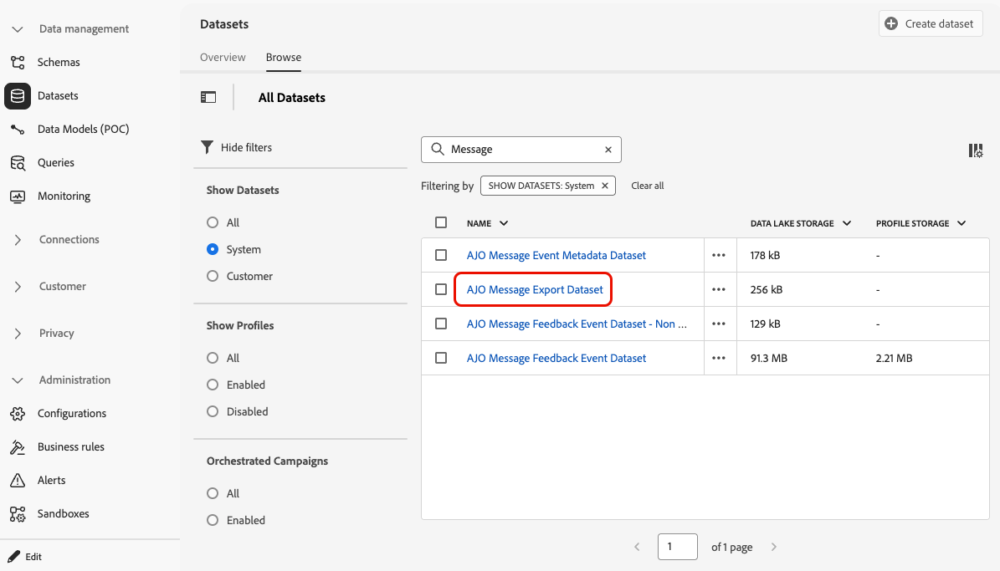
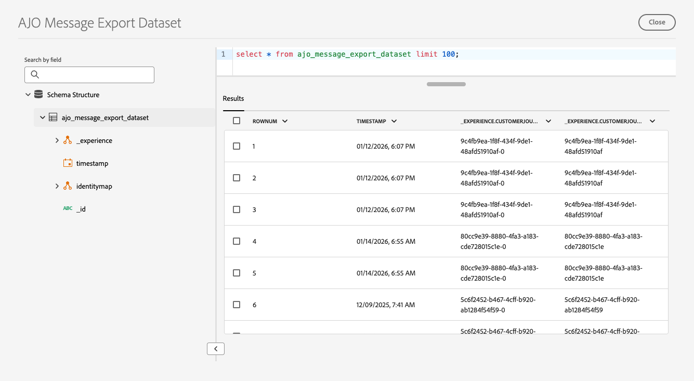

# 匯出訊息內容 {#message-export}

>[!CONTEXTUALHELP]
>id="ajo_admin_msg_export"
>title="保留並匯出您已傳送的內容"
>abstract="選取此選項可讓您使用此設定將已傳送電子郵件或SMS訊息的內容寫入[!DNL Experience Platform]資料集。 記錄會自內嵌後保留7個日曆日，在此期間，您可以將記錄匯出至您自己的儲存空間。"

>[!AVAILABILITY]
>
>此功能僅適用於電子郵件和簡訊頻道，以及已購買訊息匯出附加元件的組織。 如需詳細資訊，請聯絡您的 Adobe 代表。

**訊息匯出**&#x200B;可讓您透過[!DNL Journey Optimizer]目的地，將傳送的電子郵件和簡訊內容從[!DNL Adobe Experience Platform]傳輸到您自己的儲存空間，讓您從[!DNL Experience Platform]將資料傳送到外部端點。 [了解更多](https://experienceleague.adobe.com/zh-hant/docs/experience-platform/destinations/home){target="_blank"}

透過此功能，透過[!DNL Journey Optimizer]傳送且標示為要匯出的電子郵件和簡訊內容會寫入[!DNL Experience Platform] **AJO訊息匯出資料集**。 [進一步瞭解資料集](../data/get-started-datasets.md)

然後，記錄會保留在資料集中的七天日曆天內，期間您可以將記錄匯出至您選擇的外部系統。

## 護欄

* 此功能僅支援&#x200B;**電子郵件**&#x200B;和&#x200B;**簡訊**&#x200B;頻道。
* AJO訊息匯出資料集中的記錄從內嵌&#x200B;**起保留**&#x200B;七天之久。
* 在啟用訊息匯出之前，不支援對已傳送的訊息使用回填，如下所述。

## 啟用訊息匯出 {#enable-message-export}

訊息匯出功能的上線流程包含兩個步驟：

1. [在](#set-up-export-dataflow)中設定匯出資料流[!DNL Experience Platform]；
1. 在[的頻道設定中](#config-message-export)啟用訊息匯出[!DNL Journey Optimizer]。

>[!WARNING]
>
>只有啟用匯出和傳送訊息後才會顯示新記錄。 不支援在設定匯出程式及啟用匯出訊息選項之前回填內容。

### 設定匯出資料流 {#set-up-export-dataflow}

您必須先定義[!DNL Experience Platform]目的地和將要使用的資料集，以設定匯出程式，才能匯出您的資料。 請遵循下列步驟。

>[!NOTE]
>
>必須針對每個沙箱設定此設定。

1. 選擇Experience Platform [目的地型別](https://experienceleague.adobe.com/en/docs/experience-platform/destinations/destination-types){target="_blank"}。 [此頁面](https://experienceleague.adobe.com/en/docs/experience-platform/destinations/catalog/overview){target="_blank"}上有準備好接收資料的可用目的地平台清單。

1. 在[!DNL Experience Platform]中，定義認證、貯體/容器、路徑首碼和安全性選項來設定您的目的地。 [了解作法](https://experienceleague.adobe.com/en/docs/experience-platform/destinations/ui/activate/export-datasets){target="_blank"}

1. 使用下列資料建立資料集匯出流程：

   * Source資料集：選取&#x200B;**AJO訊息匯出資料集**。
   * 檔案格式：選取JSON或Parquet （根據下游工具選擇一個格式）。
   * 排程：確保在7天的保留期間內執行。

### 在通道設定中啟用訊息匯出 {#config-message-export}

若要將訊息匯出套用至您的行銷活動和歷程，您必須在頻道設定層級啟用專用選項。 請遵循下列步驟。

1. 在[!DNL Journey Optimizer]中，編輯或建立所需的電子郵件或簡訊[頻道設定](channel-surfaces.md#create-channel-surface)。

1. 選取&#x200B;**[!UICONTROL 啟用郵件匯出]**&#x200B;選項。

   

1. 儲存您的變更並提交您的頻道設定。

一旦您使用此通道設定透過行銷活動或歷程傳送訊息，電子郵件和簡訊訊息就會寫入&#x200B;**AJO訊息匯出資料集**。 然後，您可以[存取資料集中的記錄](#access-exported-data)，並根據您定義的匯出資料流將其匯出到您選取的儲存目的地。

>[!NOTE]
>
>停用&#x200B;**[!UICONTROL 啟用訊息匯出]**&#x200B;切換會停止將此頻道組態的新記錄擷取到資料集中。 現有記錄會一直保留，直到保留到期為止。

## 存取匯出的訊息資料 {#access-exported-data}

使用啟用「訊息匯出」的管道設定傳送訊息後，您就可以存取及檢閱&#x200B;**AJO訊息匯出資料集**&#x200B;中的匯出資料。

若要檢視匯出的訊息資料，請執行下列動作：

1. 在[!DNL Journey Optimizer]中，在左側導覽中導覽至&#x200B;**[!UICONTROL 資料管理]** > **[!UICONTROL 資料集]**。 [進一步瞭解資料集](../data/get-started-datasets.md)

1. 請務必顯示系統產生的資料集。

1. 從清單中選取&#x200B;**AJO訊息匯出資料集**。

   

1. 在資料集詳細資訊頁面上，按一下&#x200B;**[!UICONTROL 預覽資料集]**&#x200B;以檢視最近的記錄。

   

此資料集包含透過啟用「訊息匯出」的通道設定所傳送之每封訊息的完整資訊，包括：主旨列、訊息本文、收件者電子郵件地址或電話號碼、寄件者地址或電話號碼、傳送的日期和時間、個人化資料等。

資料集中的所有記錄會保留&#x200B;**從內嵌**&#x200B;起的7個行事曆日。 在此保留期間，您可以存取資料以進行合規性稽核、法律查詢，或透過已設定的Experience Platform目的地將其匯出至您自己的儲存系統。

