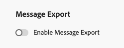

# 匯出訊息內容 {#message-export}

>[!BEGINSHADEBOX]

**在此頁面上：**&#x200B;瞭解如何在電子郵件和簡訊通道設定上啟用訊息匯出，以將已傳送的訊息內容寫入Adobe Experience Platform資料集，並將其傳輸至您自己的儲存空間。

>[!ENDSHADEBOX]

>[!CONTEXTUALHELP]
>id="ajo_admin_msg_export"
>title="保留並匯出您已傳送的內容"
>abstract="您可以透過選取此選項而使用此設定，將已傳送的電子郵件或簡訊訊息內容寫入 [!DNL Experience Platform] 資料集。 記錄會自攝取時起保留 7 個日曆日，在此期間您可以將其匯出至您自己的儲存空間。"

>[!AVAILABILITY]
>
>此功能僅適用於電子郵件和簡訊管道，以及已購買訊息匯出附加產品的組織。 如需詳細資訊，請聯絡您的 Adobe 代表。

**訊息匯出**&#x200B;可讓您透過[[!DNL Adobe Experience Platform] 目的地](https://experienceleague.adobe.com/zh-hant/docs/experience-platform/destinations/home){target="_blank"}，將已傳送的電子郵件和簡訊內容從[!DNL Journey Optimizer]傳輸到您自己的儲存空間，讓您從[!DNL Experience Platform]將資料傳送到外部端點。

透過此功能，透過[!DNL Journey Optimizer]傳送且標示為要匯出的電子郵件和簡訊內容會寫入[!DNL Experience Platform] [AJO訊息匯出資料集](message-export-schema.md)。

然後，記錄會保留在資料集中的七天日曆天內，期間您可以將記錄匯出至您選擇的外部系統。

➡️如需常見問題與解答，請參閱[訊息匯出常見問答集](#message-export-faq)。

## 護欄

* 此功能僅支援&#x200B;**電子郵件**&#x200B;和&#x200B;**簡訊**&#x200B;頻道。
* AJO訊息匯出資料集中的記錄從內嵌保留&#x200B;**七天之久**。
* 在啟用訊息匯出之前，不支援對已傳送的訊息使用回填，如下所述。

## 啟用訊息匯出 {#enable-message-export}

訊息匯出功能的上線流程包含兩個步驟：

1. [在[!DNL Experience Platform]中設定匯出資料流](#set-up-export-dataflow)；
1. 在[!DNL Journey Optimizer]的頻道設定中[啟用訊息匯出](#config-message-export)。

>[!WARNING]
>
>只有啟用匯出和傳送訊息後才會顯示新記錄。 不支援在設定匯出程式及啟用匯出訊息選項之前回填內容。

### 設定匯出資料流 {#set-up-export-dataflow}

在能夠匯出資料之前，請先定義[!DNL Experience Platform]目的地和資料集匯出流程，以設定匯出程式。

如需詳細步驟、支援的雲端目的地、必要許可權和詳細資訊，請參閱[本節](../data/export-datasets.md#export-datasets)。

>[!NOTE]
>
>必須針對每個沙箱設定此設定。

1. 選擇Experience Platform [目的地型別](https://experienceleague.adobe.com/zh-hant/docs/experience-platform/destinations/destination-types){target="_blank"}。 [此頁面](https://experienceleague.adobe.com/zh-hant/docs/experience-platform/destinations/catalog/overview){target="_blank"}上有準備好接收資料的可用目的地平台清單。

1. 在[!DNL Experience Platform]中，定義認證、貯體/容器、路徑首碼和安全性選項來設定您的目的地。 [了解作法](https://experienceleague.adobe.com/zh-hant/docs/experience-platform/destinations/ui/activate/export-datasets){target="_blank"}

1. 使用下列資料建立資料集匯出流程：

   * Source資料集：選取&#x200B;**AJO訊息匯出資料集**。
   * 檔案格式：選取JSON或Parquet （根據下游工具選擇一個格式）。
   * 排程：確保在7天的保留期間內執行。

### 在通道設定中啟用訊息匯出 {#config-message-export}

若要將訊息匯出套用至您的行銷活動和歷程，您必須在頻道設定層級啟用專用選項。 請遵循下列步驟。

1. 在[!DNL Journey Optimizer]中，編輯或建立所需的電子郵件或簡訊[頻道設定](channel-surfaces.md#create-channel-surface)。

1. 選取&#x200B;**[!UICONTROL 啟用郵件匯出]**&#x200B;選項。

   

1. 儲存您的變更並提交您的頻道設定。

一旦您使用此通道設定透過行銷活動或歷程傳送訊息，電子郵件和簡訊訊息就會寫入&#x200B;**AJO訊息匯出資料集**。 然後，您可以[存取資料集中的記錄](#access-exported-data)，並根據您定義的匯出資料流將其匯出到您選取的儲存目的地。

>[!NOTE]
>
>停用&#x200B;**[!UICONTROL 啟用訊息匯出]**&#x200B;切換會停止將此頻道組態的新記錄擷取到資料集中。 現有記錄會一直保留，直到保留到期為止。

## 存取匯出的訊息資料 {#access-exported-data}

使用啟用「訊息匯出」的管道設定傳送訊息後，您就可以存取及檢閱&#x200B;**AJO訊息匯出資料集**&#x200B;中的匯出資料。

若要檢視匯出的訊息資料，請執行下列動作：

1. 在[!DNL Journey Optimizer]中，在左側導覽中導覽至&#x200B;**[!UICONTROL 資料管理]** > **[!UICONTROL 資料集]**。 [進一步瞭解資料集](../data/get-started-datasets.md)

1. 請務必顯示系統產生的資料集。

1. 從清單中選取&#x200B;**AJO訊息匯出資料集**。

   

1. 在資料集詳細資訊頁面上，按一下&#x200B;**[!UICONTROL 預覽資料集]**&#x200B;以檢視最近的記錄。

   

此資料集包含透過啟用「訊息匯出」的通道設定所傳送之每封訊息的完整資訊，包括：主旨列、訊息本文、收件者電子郵件地址或電話號碼、寄件者地址或電話號碼、傳送的日期和時間、個人化資料等。

➡️如需資料集結構和所有可用欄位的完整檢視，請參閱[AJO訊息匯出結構描述](message-export-schema.md)。

資料集中的所有記錄會從擷取中保留&#x200B;**七個行事曆日**。 在此保留期間，您可以存取資料以進行合規性稽核、法律查詢，或透過已設定的Experience Platform目的地將其匯出至您自己的儲存系統。

## 匯出的JSON範例 {#sample-exported-json}

以下範例顯示寫入AJO訊息匯出資料集（用於簡訊和電子郵件）的記錄整體形狀。 識別碼、結構描述參考、時間戳記和內容之類的值會提供說明；您的匯出內容會反映您的沙箱、結構描述和已傳送訊息。

展開每個區段以檢視完整JSON範例。

+++ 簡訊匯出範例

```json
{
  "header": {
    "msgId": "f06d2a6d-65c3-472b-9ca7-cc4224af2df4",
    "xactionId": "9ccd6e76-9ee5-4a12-bff3-fea240228121",
    "msgType": "xdmEntityCreate",
    "imsOrgId": "906E3A095DC834230A495FD6@AdobeOrg",
    "sandboxId": "db3adc95-dcf6-49c3-badc-95dcf639c345",
    "sandboxName": "ajo-e2e",
    "createdAt": 1773591102107,
    "datasetId": "689653509dd3432b92f6323f",
    "schemaRef": {
      "id": "https://ns.adobe.com/aemonacpprodcampaign/schemas/64cb5d9d26c2aae6b08bdc9b7882deb90202439ec53836e7",
      "contentType": "application/vnd.adobe.xed-full+json;version=1"
    },
    "source": {
      "name": "message-execution-service"
    },
    "originalTimestamp": 1773591102107,
    "tags": [
      "ups:segmentation=false"
    ]
  },
  "body": {
    "xdmEntity": {
      "_experience": {
        "customerJourneyManagement": {
          "messageExecution": {
            "messageExecutionID": "CSM-09561055",
            "messageID": "15fe77c8-ab73-49e4-abbb-c25b859162ff-0",
            "messageType": "marketing",
            "campaignID": "5638ce57-5264-4a96-995f-5ae34eddafd7",
            "campaignVersionID": "f9019155-3d6a-44a1-9b6f-5f9cd49e7cf5",
            "campaignActionID": "dfa7f59f-477c-42ec-9db2-831d294b5779",
            "batchInstanceID": "5e23a286fb72411f1cdf1443a81ad2eb",
            "messagePublicationID": "15fe77c8-ab73-49e4-abbb-c25b859162ff",
            "audience": {
              "id": "4c339f63-b66e-4e72-8d56-db624b5277f2",
              "type": "targeted"
            }
          },
          "messageProfile": {
            "channel": {
              "_id": "https://ns.adobe.com/xdm/channels/sms",
              "_type": "https://ns.adobe.com/xdm/channel-types/sms"
            },
            "messageProfileID": "7ff5aefb-7583-38c4-8c32-b63cced94aa7",
            "variant": "5c1092da-5ba2-4bcc-b591-713ee7999f7d"
          },
          "messageRenderedContent": {
            "smsContent": {
              "message": "AJO Campaigns - Prod - E2E Test Text VA7"
            }
          },
          "messageDeliveryMetadata": {
            "smsMetadata": {
              "recipient": {
                "number": "+19256260201"
              },
              "sender": {
                "numbers": [
                  "12345678"
                ]
              }
            }
          }
        }
      },
      "identityMap": {
        "email": [
          {
            "id": "rlyajoqa+messageExport1@adobe.com",
            "primary": true
          }
        ]
      },
      "_id": "b0001846-cafa-379a-be96-1d8ee973e047",
      "timestamp": "2026-03-15T16:11:42.184Z"
    }
  }
}
```

+++

+++ 電子郵件匯出範例

```json
{
  "header": {
    "msgId": "1e64d2c4-7887-4f80-8b28-5c20d3da8baf",
    "xactionId": "5yfSV2Gs7VJM5TKo1uEkbiDd4iuakgzQ",
    "msgType": "xdmEntityCreate",
    "imsOrgId": "745F37C35E4B776E0A49421B@AdobeOrg",
    "sandboxId": "068abf40-575e-11ea-8512-9b1bfdb82603",
    "sandboxName": "prod",
    "createdAt": 1754489661211,
    "datasetId": "68912b8881572a2b267380c1",
    "schemaRef": {
      "id": "https://ns.adobe.com/cjmstage/schemas/1684477c0160376b8bb6975a80b5e5bd384696329faa1c42",
      "contentType": "application/vnd.adobe.xed-full+json;version=1"
    },
    "source": {
      "name": "message-execution-service"
    },
    "originalTimestamp": 1754489659000,
    "tags": [
      "ups:segmentation=false"
    ]
  },
  "body": {
    "xdmEntity": {
      "_experience": {
        "customerJourneyManagement": {
          "messageExecution": {
            "messageExecutionID": "HUMA-62208933",
            "messageID": "d0d02f68-afea-42fc-b898-6819cee643e6-0",
            "messageType": "transactional",
            "campaignID": "ce2331c2-c259-47ff-a1dd-f6d1eae08801",
            "campaignVersionID": "4272bb9f-e154-44e9-89f1-6548c77d1455",
            "batchInstanceID": "03587190-72cf-11f0-938b-31e7c9f96d89",
            "messagePublicationID": "d0d02f68-afea-42fc-b898-6819cee643e6",
            "audience": {
              "type": "all"
            }
          },
          "messageProfile": {
            "channel": {
              "_id": "https://ns.adobe.com/xdm/channels/email",
              "_type": "https://ns.adobe.com/xdm/channel-types/email"
            },
            "messageProfileID": "5yfSV2Gs7VJM5TKo1uEkbiDd4iuakgzQ",
            "variant": "11cc5796-8017-4738-aa66-ca5db967dfcc"
          },
          "messageRenderedContent": {
            "emailContent": {
              "subject": "test",
              "html": "xxx"
            }
          },
          "messageDeliveryMetadata": {
            "emailMetadata": {
              "recipient": {
                "email": "himanshig@adobe.com"
              },
              "sender": {
                "email": "cjm-team@e2e-personalisation.test.cjmadobe.com",
                "name": "CJM team",
                "replyToEmail": "replyto@marketing.adobecjm.com",
                "replyToName": "replyto",
                "errorEmail": "replyto@e2e-personalisation.test.cjmadobe.com"
              }
            }
          }
        }
      },
      "identityMap": {
        "email": [
          {
            "id": "chijain@adobe.com",
            "primary": true
          }
        ]
      },
      "_id": "ea48ce1b-80c9-3c6a-b05f-d1c998989e02",
      "timestamp": "2025-08-06T14:14:22.814Z"
    }
  }
}
```

+++

## 訊息匯出常見問題集 {#message-export-faq}

+++ 什麼是訊息匯出？

訊息匯出可讓客戶匯出傳送給使用者的完整轉譯訊息（電子郵件和簡訊）。 匯出的資料可使用標準[!DNL Adobe Experience Platform] (AEP)匯出功能傳送到外部目的地，並用於封存、合規性稽核、分析或下游整合等用途。

+++

+++ 支援哪些管道？

訊息匯出支援：

* 電子郵件
* 簡訊

+++

+++ 訊息匯出會產生哪些資料？

訊息匯出會在[!DNL Adobe Experience Platform]中建立系統產生的資料集，其中包含訊息在傳送時的快照。 然後，可將此資料集匯出至支援的目的地（例如雲端儲存空間或協力廠商系統）。

「訊息匯出」是專為客戶將訊息資料移出Adobe系統的啟用機制所設計，客戶需自行負責封存或合規解決方案中的資料轉換、儲存和管理。

+++

+++ 訊息匯出是否會擷取完全個人化的訊息？

可以。 訊息匯出會擷取傳送給每個收件者的完整轉譯訊息，包括傳送時轉譯的個人化及動態內容。

+++

+++ 「郵件匯出」是否可用於重現原始郵件？

可以。 匯出的HTML可用於在瀏覽器中重現原本傳送的訊息。

不過，復製作業取決於外部託管資產（例如影像）的可用性。 訊息匯出不會直接在匯出中內嵌媒體檔案。

+++

+++ 匯出中是否包含影像和媒體？

「訊息匯出」包含的HTML內容會提供影像和其他媒體的參考(URL)。 媒體資產未內嵌在匯出中。

如果影像或資產URL在傳送時間後變得無效、受限制或取消發佈，訊息匯出將無法復原該資產。

+++

+++ 在訊息匯出中如何處理連結？

匯出的訊息包含加密的追蹤連結，與傳送時連結的處理方式一致。 這些加密的連結會保留在匯出中，並可由平台設計解析。

+++

+++ 如何處理PII和個人化資料？

資料會完全依照顯示在演算後訊息中的方式儲存：

* 呈現至訊息中的Personalization值（例如名字）會顯示為文字。
* 加密的元素（例如追蹤的連結）仍維持加密狀態。
* 訊息匯出不會自動匿名化或修訂已呈現的訊息內容。

+++

+++ 訊息匯出資料的保留期是多久？

訊息匯出資料遵循[!DNL Adobe Experience Platform]內的7天保留期間。

客戶應在此期間內匯出資料，並在需要更長保留時間時儲存在自己的系統中。

+++

+++ 客戶可以在購買之前測試訊息匯出嗎？

訊息匯出沒有試用或「先試後買」選項。

客戶可使用範例匯出檔案來驗證其下游系統，因為訊息匯出仰賴標準AEP資料集和目的地功能。

+++

+++ 購買之前是否有訊息匯出結構描述可用？

不可以。 訊息匯出資料集和結構描述只有在購買並啟用訊息匯出附加元件後，才能在產品中使用。

+++

+++ Message Export是完整的封存或合規性解決方案嗎？

不可以。 Message Export是啟用程式，不是完整封存或合規性產品。

客戶應該：

* 從Adobe匯出訊息資料
* 視需要轉換或擴充
* 將資料儲存在自己的封存或合規性系統中，並加以管理

+++

+++ 常見的使用案例有哪些？

客戶通常將訊息匯出用於：

* 法規或法規遵循審查
* 訊息封存
* 與協力廠商系統整合
* 內部稽核或支援工作流程
* Adobe應用程式以外的Analytics

+++

+++ 郵件匯出無法執行的動作

郵件匯出不會：

* 內嵌外部影像或媒體資產
* 在Adobe系統中提供無限制或長期的資料保留
* 提供試用環境
* 自動封存Adobe以外的訊息

+++

